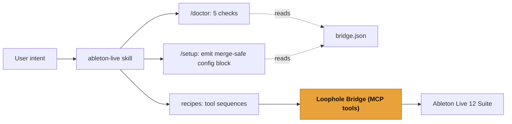

# ableton-live (alias: loophole)

A thin developer-experience layer for the Loophole Bridge, the MCP server that controls Ableton Live 12 over the official Extensions SDK. This skill closes the loop between "the bridge is installed" and "the agent uses it well." It does three things and nothing more.

It never talks to Live directly. It does not embed tool logic, re-implement the bridge, or import any bridge or SDK code. The bridge is the only thing that touches the Live Object Model. Every Live operation in this skill is a call to one of the bridge's MCP tools.

## What this skill does

1. **`/doctor`** runs five prerequisite checks (Live running, extension installed, Node version, bridge port reachable, token present) and prints a PASS or a specific FIX line for each, then one verdict. See `doctor.md`. It never auto-runs `/setup`.
2. **`/setup`** reads the port and bearer token from `bridge.json`, then emits one merge-safe MCP client block for Claude Code, Claude Desktop, or Cursor. It never writes or replaces a config file. See `setup.md`.
3. **Recipes** are reusable snippets for common Live edits, each a named sequence of real bridge tool calls. See `recipes/`: `humanize-midi`, `build-arrangement`, `batch-rename`, `chord-from-prompt`.

## How the pieces connect

The skill reads `bridge.json` (for `/doctor` and `/setup`) and issues MCP tool calls (for recipes). It does not reach past the bridge.

## The bridge tools the recipes use

The recipes reference only these registered MCP tools. No recipe invents a tool.

| Tool                     | Read or write | What it does                                                          |
| ------------------------ | ------------- | --------------------------------------------------------------------- |
| `live_get_song_overview` | read          | tempo, scale, grid, counts, and current opaque track references       |
| `live_find_track`        | read          | resolve a track name or substring to current opaque track references  |
| `live_list_clips`        | read          | list a track's session slots and clips with current opaque references |
| `live_get_notes`         | read          | read all MIDI notes from one clip                                     |
| `live_set_tempo`         | write         | set the Set tempo in BPM                                              |
| `live_set_track_props`   | write         | set a track's name, mute, solo, or arm in one serialized mutation     |
| `live_set_notes`         | write         | replace all MIDI notes in one clip in one serialized mutation         |
| `live_create_track`      | write         | create one empty MIDI or audio track                                  |
| `live_create_midi_clip`  | write         | create an empty MIDI clip in a session clip slot                      |
| `live_set_param`         | write         | set one device parameter using its returned opaque session reference  |
| `live_insert_device`     | write         | insert a built-in Live device on a track                              |
| `live_render_track`      | write         | render a track's pre-FX audio over a beat range to a WAV              |

## Mutation boundaries (read before running any recipe)

Each write tool is a separate mutation. Simple setters are designed to initiate their write inside one transaction, but real Live undo behavior remains an E2E gate. Never call a multi-tool recipe atomic. Creating a clip and then filling it uses two mutations because the SDK must return the clip before notes can be assigned. State the mutation count before writing and tell the user to inspect Live's undo history.

## Beta limits the recipes inherit

These come from the bridge and extensions, not from the skill, and the recipes state them where they apply:

- MIDI notes only. No automation, MIDI CC, clip gain, or routing API in this beta.
- `live_create_midi_clip` targets Session clip slots, not the Arrangement timeline. The Session-to-Song extension preflights, then runs ordered clear, create, and populate mutation phases. Its receipt reports 0 intended undo entries for a no-op, 2 for cue-only, or 3 when it clears, creates, and populates. Partial errors expose the exact `undoStepsToRestore`.

All object references are opaque and session-scoped. Use the value returned by the current list or read call unchanged. Never construct a value such as `lhref_trk_<opaque-token>`, and re-list after structural changes.

- `live_insert_device` is built-in Live devices only (no third-party or VST).
- `live_render_track` is pre-FX and practical for audio tracks.
- Scale and tempo are read from the Set; the recipes do not guess a key. Assume 4/4 unless a scene signature is read.
- User-invoked only.
