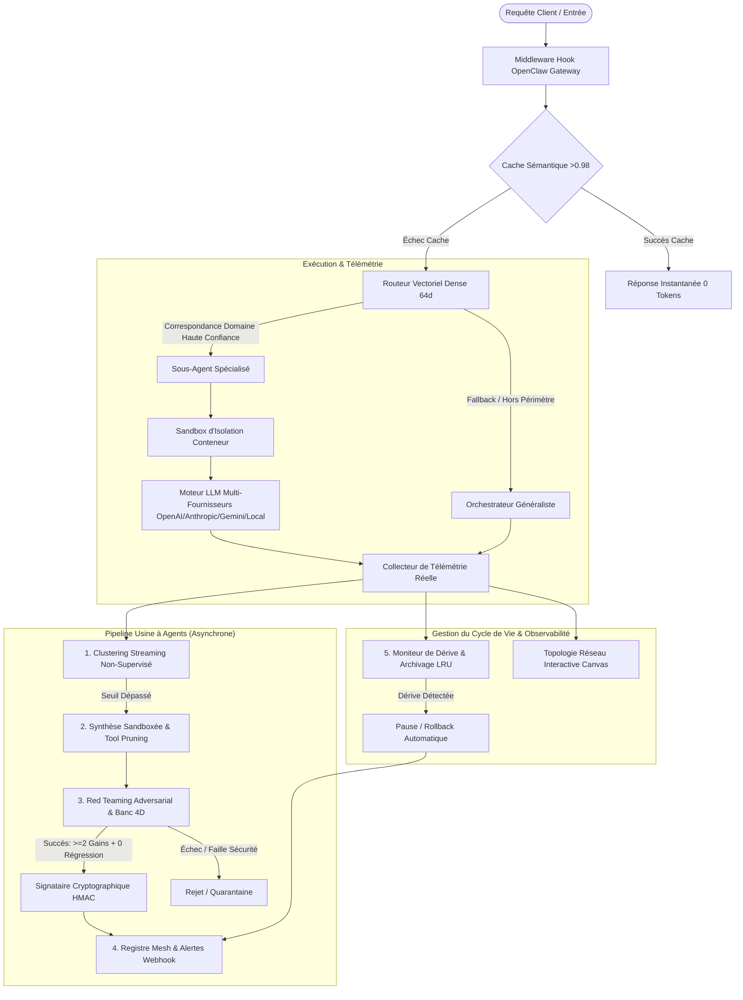

# 🏭 Usine à Sous-Agents pour OpenClaw (Agent Factory)

<p align="center">
  <a href="README.md"><b>English</b></a> •
  <a href="README.fr.md"><b>Français</b></a>
</p>

<p align="center">
  <a href="https://clawhub.ai"></a>
  <a href="LICENSE"></a>
  <a href="https://openclaw.ai"></a>
  <a href="tests"></a>
</p>

Skill officiel **Agent Factory** pour l'écosystème **OpenClaw / ClawHub**. Permet aux orchestrateurs OpenClaw de s'auto-spécialiser en continu : interception transparente des requêtes, détection autonome des charges récurrentes, génération sandboxée en conteneur, banc de test 4D avec Red Teaming adversarial, exécution multi-modèles LLM réelle, cache sémantique à 0 token et cartographie visuelle interactive en temps réel.

---

## 🌟 Architecture & Piliers Fondamentaux



---

## 📁 Structure du Dépôt

```text
.
├── clawhub.json                      # Manifeste racine du registre ClawHub
├── LICENSE                           # Licence open-source MIT
├── README.md                         # Documentation principale (English)
├── README.fr.md                      # Documentation (Français)
├── requirements.txt                  # Dépendances de développement optionnelles
├── .gitignore                        # Exclusion des caches, logs et fuites de clés
├── .github/
│   └── workflows/
│       └── clawhub-publish.yml       # Déploiement automatique sur ClawHub via GitHub Actions
├── tests/
│   └── test_factory_e2e.py           # 8/8 tests unitaires & d'intégration Pytest
└── skills/
    └── agent-factory/
        ├── SKILL.md                  # Spécification OpenClaw & ClawHub (Point d'entrée)
        ├── clawhub.json              # Manifeste du package skill
        ├── references/
        │   └── manifest_schema.json  # Schéma JSON de validation des sous-agents
        ├── dashboard/
        │   ├── app.py                # Serveur Dashboard zéro-dépendance
        │   └── static/               # Topologie Canvas & Interface Dark Glassmorphism
        └── scripts/
            ├── openclaw_hook.py      # Middleware d'interception de la passerelle OpenClaw
            ├── llm_engine.py         # Moteur d'exécution LLM réel multi-fournisseurs
            ├── embedding_engine.py   # Moteur d'embeddings denses 64d & indexeur HNSW
            ├── telemetry.py          # Moteur de télémétrie réelle & scoring de clusters
            ├── clustering_engine.py  # Clustering streaming non-supervisé
            ├── semantic_cache.py     # Cache sémantique 0-token
            ├── synthesizer.py        # Synthétiseur en sandbox & élagage d'outils
            ├── container_sandbox.py  # Sandbox d'isolation de processus & quotas
            ├── red_team_fuzzer.py    # Fuzzer adversarial & sondes d'injection
            ├── evaluator.py          # Banc d'évaluation 4D & signature cryptographique
            ├── crypto_signer.py      # Signature HMAC-SHA256 & intégrité
            ├── security_sandbox.py   # Quotas, limitation de débit & Circuit Breaker
            ├── router.py             # Routeur sémantique vectoriel & Canary
            ├── alerts.py             # Dispatcher d'alertes Webhook (Discord, Slack, HTTP)
            └── lifecycle.py          # Surveillance des dérives de prod & archivage LRU
```

---

## 🖥️ Dashboard & Topologie Réseau Canvas

Lancer le Dashboard temps réel sans dépendance externe :

```bash
python3 skills/agent-factory/dashboard/app.py
```
👉 Accédez à la cartographie interactive sur **`http://localhost:8000`**.

---

## 🧪 Tests Automatisés

```bash
python3 -m pytest -v tests/test_factory_e2e.py
```

---

## 📄 Licence

Distribué sous la licence [MIT](LICENSE).
