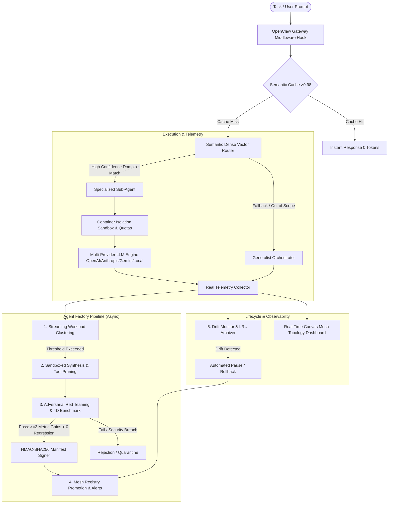

# 🏭 Agent Factory for OpenClaw

<p align="center">
  <a href="README.md"><b>English</b></a> •
  <a href="README.fr.md"><b>Français</b></a>
</p>

<p align="center">
  <a href="https://clawhub.ai"></a>
  <a href="LICENSE"></a>
  <a href="https://openclaw.ai"></a>
  <a href="tests"></a>
</p>

Official **Agent Factory** skill for the **OpenClaw / ClawHub** ecosystem. Enables OpenClaw orchestrators to continuously self-specialize by autonomously detecting recurring workloads, generating sandboxed disposable sub-agents, benchmarking them against generalist baselines, routing tasks dynamically with 0-token semantic caching, streaming LLM outputs, and visualizing the active mesh in real-time.

---

## 🌟 Core Architecture & Pillars



---

## 📁 Repository Structure

```text
.
├── clawhub.json                      # ClawHub registry root manifest
├── LICENSE                           # MIT License
├── README.md                         # Main documentation (English)
├── README.fr.md                      # Documentation (Français)
├── requirements.txt                  # Optional dev dependencies
├── .gitignore                        # Caches, logs and secret exfiltration guards
├── .github/
│   └── workflows/
│       └── clawhub-publish.yml       # Automated ClawHub publication on release tags
├── tests/
│   └── test_factory_e2e.py           # 8/8 comprehensive E2E & unit test suite
└── skills/
    └── agent-factory/
        ├── SKILL.md                  # OpenClaw & ClawHub Skill specification
        ├── clawhub.json              # Skill package manifest
        ├── references/
        │   └── manifest_schema.json  # Sub-agent JSON validation schema
        ├── dashboard/
        │   ├── app.py                # Zero-dependency realtime dashboard server
        │   └── static/               # Interactive Canvas Topology UI (HTML, CSS, JS)
        └── scripts/
            ├── openclaw_hook.py      # Passive OpenClaw gateway middleware hook
            ├── llm_engine.py         # Real Multi-Provider LLM execution engine
            ├── embedding_engine.py   # 64d dense vector embedding & HNSW indexer
            ├── telemetry.py          # Real telemetry logger & threshold scorer
            ├── clustering_engine.py  # Streaming density cluster discoverer
            ├── semantic_cache.py     # 0-token semantic caching engine
            ├── synthesizer.py        # Sandboxed generator & tool pruner
            ├── container_sandbox.py  # Subprocess container isolation runner
            ├── red_team_fuzzer.py    # Adversarial mutation & jailbreak fuzzer
            ├── evaluator.py          # 4D benchmark runner & cryptographic signer
            ├── crypto_signer.py      # HMAC-SHA256 manifest integrity verifier
            ├── security_sandbox.py   # Quotas, rate-limits & circuit breaker
            ├── router.py             # High-speed semantic & canary router
            ├── alerts.py             # Webhook alert dispatcher (Discord, Slack, HTTP)
            └── lifecycle.py          # Production drift supervisor & LRU archiver
```

---

## 🖥️ Interactive Canvas Mesh Dashboard

Launch the zero-dependency real-time Web Dashboard:

```bash
python3 skills/agent-factory/dashboard/app.py
```
Open **`http://localhost:8000`** to interact with the live topological network graph.

---

## 🧪 Local Automated Testing

```bash
python3 -m pytest -v tests/test_factory_e2e.py
```

---

## 📄 License

Distributed under the [MIT License](LICENSE).
