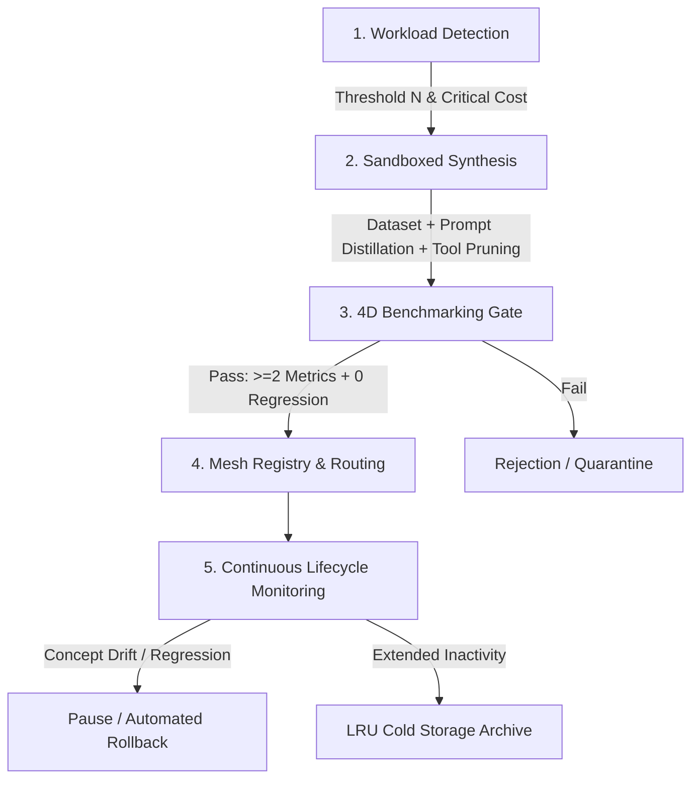

# Autonomous Sub-Agent Factory for OpenClaw

This skill enables the OpenClaw orchestrator to continuously self-specialize by autonomously creating, benchmarking, and routing to **disposable, highly-focused sub-agents**, while preserving the orchestrator as the sole sovereign decision-maker.

---

## 🎯 Philosophy & Core Guardrails

> **The orchestrator is never replaced. Sub-agents are disposable tools, not successors.**

1. **Least Privilege (Tool Pruning)**: A sub-agent never inherits the entire tool mesh—only the minimal subset required for its domain.
2. **Non-Negotiable Sandboxing**: Zero write permissions or production actions until formally passed through the 4D evaluation gate.
3. **Strict 4D Promotion Gate**: A sub-agent is only promoted if it strictly beats the generalist baseline on at least **2 key metrics** (Accuracy, Latency, Token Cost, Human Intervention Drop) with **zero regressions** on others and 100% security pass rate.
4. **Ephemerality & Revocability**: Any sub-agent experiencing concept drift or prolonged inactivity is automatically paused, retrained, or archived.

---

## 🔄 The 5 Factory Phases

---

## 📋 Step-by-Step Operational Procedure

### Phase 1: Need Detection & Telemetry Tracking

1. **Log every orchestrator task** via `scripts/telemetry.py`:
   - `task_id`, `prompt_summary`, `task_type_embedding`
   - `tools_invoked`, `token_count_in`, `token_count_out`
   - `latency_ms`, `human_interventions`, `error_rate`
2. **Cluster recurring workloads**:
   - Aggregate tasks using embedding similarity.
   - **Trigger Formula**:
     $$\text{Score} = \text{Volume}_N \times (w_1 \cdot \text{Cost} + w_2 \cdot \text{Latency} + w_3 \cdot \text{ErrorRate})$$
   - When $\text{Score} \ge \text{TRIGGER\_THRESHOLD}$, trigger the synthesis pipeline.

---

### Phase 2: Sandboxed Sub-Agent Generation

Run the synthesizer via `scripts/synthesizer.py`:

1. **Extract Golden Cases**:
   - Extract the last $N$ successful real-world executions.
   - Generate synthetic edge cases (corrupted formats, empty inputs, prompt injection attempts).
2. **Automated Composition**:
   - **Distilled System Prompt**: Focused, concise, with explicit negative constraints.
   - **Tool Pruning**: Restrict tool bindings strictly to the tools utilized by the cluster.
3. **Manifest Creation** (`manifest.json`):
   - Set status to `"sandbox"`, read-only permissions, and compute confidence centroid vector.

---

### Phase 3: Pre-Deployment 4D Evaluation Gate

Run the benchmark suite via `scripts/evaluator.py`:

1. **Baseline vs Sub-Agent Comparison**:
   - Evaluate both the generalist model and the candidate sub-agent on the identical test dataset.
2. **4D Decision Matrix**:
   - ✅ **Accuracy & Schema Compliance** (Exact Match / JSON Schema Validation / LLM Judge)
   - ✅ **Latency** ($p50$ and $p95$ reduction)
   - ✅ **Token Cost** (Tokens consumed per task resolution)
   - ✅ **Human Intervention Drop** (Frequency of required user corrections)
3. **Adversarial Fuzzing**:
   - Ensure the sub-agent does not overfit and handles out-of-distribution inputs safely.
4. **Promotion Gate**:
   $$\text{Win on } \ge 2 \text{ Metrics} \quad \text{AND} \quad \Delta_{\text{others}} \ge 0 \quad \text{AND} \quad \text{Security} = 100\%$$

---

### Phase 4: Mesh Registration & Dynamic Routing

1. **Mesh Registration** (`scripts/router.py`):
   - Register the validated sub-agent into the active mesh registry.
   - Set the vector centroid and confidence radius ($r$).
   - Issue scoped security capability tokens.
2. **Production Routing**:
   - Incoming tasks are vector-embedded.
   - If $\text{Distance}(\text{Embedding}_{\text{task}}, \text{Centroid}) \le r \rightarrow$ Delegate to sub-agent.
   - Otherwise $\rightarrow$ Fallback to the generalist orchestrator.

---

### Phase 5: Lifecycle Management, Drift & Rollback

Run continuous supervision via `scripts/lifecycle.py`:

1. **Concept Drift Detection**:
   - If incoming distributions shift or sub-agent error rate surpasses the generalist baseline, trigger an **immediate rollback** to the generalist orchestrator.
2. **LRU Archiving**:
   - Sub-agents with zero calls over the inactivity threshold are shifted to `ARCHIVED` status (cold storage).
3. **Versioning & Rollback**:
   - Maintain historical versions under `agents/<agent_id>/<version>/` for instant rollbacks.

---

## 🛠️ Provided CLI Tools

| Script | Purpose | Command |
| :--- | :--- | :--- |
| `scripts/telemetry.py` | Telemetry logging & cluster trigger detection | `python scripts/telemetry.py --analyze` |
| `scripts/synthesizer.py` | Golden dataset extraction, prompt distillation & tool pruning | `python scripts/synthesizer.py` |
| `scripts/evaluator.py` | 4D comparative benchmark & adversarial security gate | `python scripts/evaluator.py --agent-id <ID>` |
| `scripts/router.py` | High-speed semantic cosine router | `python scripts/router.py --prompt "<Prompt>"` |
| `scripts/lifecycle.py` | Production drift monitoring, rollback & archiving | `python scripts/lifecycle.py --audit` |
