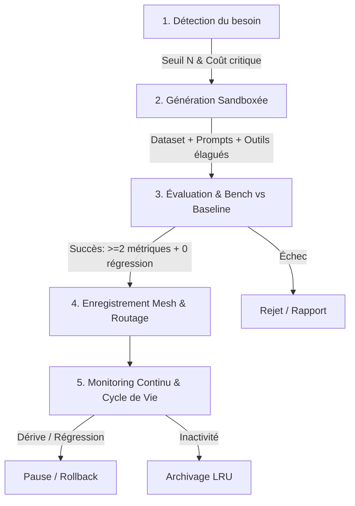

# Usine à Sous-Agents (Agent Factory) pour OpenClaw

Ce skill permet à l'orchestrateur OpenClaw de s'auto-spécialiser en générant, évaluant et déployant dynamiquement des **sous-agents jetables et hautement focalisés**, tout en préservant le rôle central de l'orchestrateur comme unique décideur souverain.

---

## 🎯 Philosophie & Règle d'Or

> **L'orchestrateur n'est jamais remplacé. Les sous-agents sont des outils jetables, pas des successeurs.**

1. **Moindre privilège (*Tool Pruning*)** : Un sous-agent n'hérite jamais de tout le mesh d'outils, uniquement du sous-ensemble strictement nécessaire.
2. **Sandboxing non-négociable** : Zéro droit d'écriture ou d'action réelle avant validation complète par le banc d'essai.
3. **Seuil de passage strict** : Un sous-agent n'est promu en production que s'il surpasse la baseline généraliste sur au moins **2 métriques clés** (précision, latence, coût token, interventions humaines) avec **0 régression** sur les autres.
4. **Éphémérité & Révocabilité** : Tout sous-agent en dérive de performance (*concept drift*) ou sous-utilisé est automatiquement mis en pause, ré-entraîné ou archivé.

---

## 🔄 Les 5 Phases du Pipeline

---

## 📋 Procédure Opérationnelle Étape par Étape

### Phase 1 : Détection du Besoin & Télémétrie

1. **Loguer systématiquement** chaque tâche traitée par l'orchestrateur via `scripts/telemetry.py` :
   - `task_id`, `prompt_summary`, `task_type_embedding`
   - `tools_invoked`, `token_count_in`, `token_count_out`
   - `latency_ms`, `human_interventions`, `error_rate`
2. **Surveiller les clusters de charge** :
   - Regroupement des tâches par similarité d'embedding.
   - **Formule de Déclenchement** :
     $$\text{Score} = \text{Volume}_N \times (w_1 \cdot \text{Cost} + w_2 \cdot \text{Latency} + w_3 \cdot \text{ErrorRate})$$
   - Si $\text{Score} \ge \text{TRIGGER\_THRESHOLD}$, initier le ticket de fabrication.

---

### Phase 2 : Génération du Sous-Agent (Sandboxed)

Exécuter le générateur via `scripts/synthesizer.py` :

1. **Extraction de Golden Cases** :
   - Extraire les $N$ dernières occurrences réelles résolues avec succès.
   - Générer des cas synthétiques de variation (formats corrompus, inputs vides, prompt injection).
2. **Composition Automatique** :
   - **System Prompt Spécialisé** : Focalisé, sans fioritures, avec contraintes négatives strictes.
   - **Tool Pruning** : Filtrer la liste des outils pour n'inclure que les fonctions réellement utilisées par le cluster.
3. **Génération du Manifeste** (`manifest.json`) :
   - Spécifie l'ID, la signature d'embedding, le rayon de routage et les permissions (`sandbox` par défaut).

---

### Phase 3 : Évaluation & Benchmark Pré-Publication

Exécuter la suite de tests via `scripts/evaluator.py` :

1. **Comparaison vs Baseline Généraliste** :
   - Évaluer le sous-agent et le modèle généraliste sur le même jeu de test.
2. **Matrice de Décision 4D** :
   - ✅ **Précision** (Exact Match / JSON Schema Validation / LLM Judge)
   - ✅ **Latence** ($p50$ et $p95$)
   - ✅ **Coût Token** (Tokens consommés par résolution)
   - ✅ **Taux d'intervention humaine**
3. **Tests Adversariaux & Anti-Overfitting** :
   - Injecter des cas limites corrompus, des prompts vides, et des variations contradictoires.
4. **Critère de Passage** :
   $$\text{Victoire sur } \ge 2 \text{ métriques} \quad \text{ET} \quad \Delta_{\text{autres}} \ge 0 \quad \text{ET} \quad \text{Sécurité} = 100\%$$

---

### Phase 4 : Mise en Service & Routage Dynamique

1. **Enregistrement dans le Mesh** (`scripts/router.py`) :
   - Enregistrer le sous-agent dans le registre actif.
   - Définir le centroïde vectoriel et le rayon de confiance ($r$).
   - Assigner les jetons de sécurité scopés (*Scoped Capabilities*).
2. **Routage en Production** :
   - Toute nouvelle tâche entrante est vectorisée.
   - Si $\text{Distance}(\text{Embedding}_{\text{task}}, \text{Agent}_{\text{center}}) \le r \rightarrow$ Délégué au sous-agent.
   - Sinon $\rightarrow$ Fallback automatique vers l'orchestrateur généraliste.

---

### Phase 5 : Cycle de Vie, Monitoring & Rollback

Exécuter le superviseur de cycle de vie via `scripts/lifecycle.py` :

1. **Détection de Concept Drift** :
   - Si la distribution des requêtes change ou si le taux d'erreur du sous-agent dépasse celui de la baseline généraliste, déclencher un **Rollback immédiat** vers le généraliste.
2. **Archivage Automatique (LRU)** :
   - Tout sous-agent non sollicité après une période d'inactivité est placé en état `ARCHIVED` (stockage froid).
3. **Versionning & Audit** :
   - Historisation de chaque version de prompt et manifeste sous `agents/<agent_id>/<version>/`.
