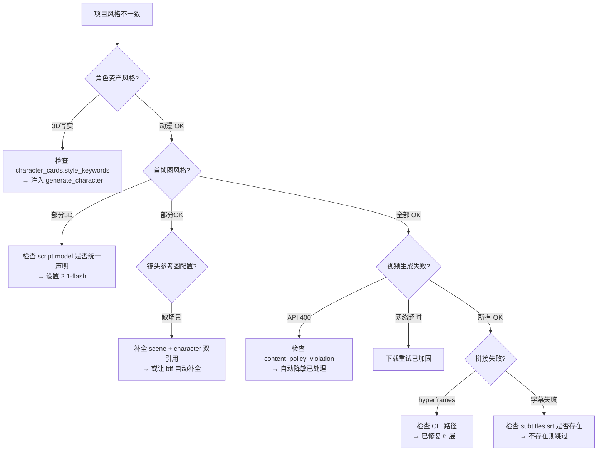

# Pipeline 排错指南

当流水线输出异常时，按以下章节逐级排查。
排查顺序：角色资产 → 首帧图 → 视频生成 → 拼接 → 飞书。

---

## 一、script.json 预检

### 角色外观一致性

- `character_cards[0].style_keywords` 必须包含完整风格描述（如"动漫二次元风格"），缺少会导致角色资产默认输出 3D 写实风。
- `distinctive_mark` 必须包含标志性特征（如"戴一副圆框眼镜"），否则 face 视图可能缺眼镜。
- `color_scheme` 必须包含全部穿搭细节（如"橙色围巾点缀"），否则 prompt 模板自动注入时缺元素。
- 修改后执行 `validate-script`（别名 `vs`）验证。

### 镜头参考图配置

- 每个 shot 的 `generation.reference_images` 应同时包含 scene + character：
  ```json
  "kf1": { "scene": "场景名", "path": "images/scenes/..._中景.png" },
  "kf2": { "character": "角色名_front", "path": "images/characters/..._front.png" }
  ```
- 单角色引用（只有 character 没有 scene）会导致首帧图风格失控。`_build_first_frame()` 会自动补全场景基底，但显式配置更可靠。
- `validate-script` 命令会警告缺少场景引用的 shot。

### 模型一致性

- 在 `script.json` 的 `script` 块声明 `"model": "agnes-image-2.1-flash"`，保证同一项目所有镜头使用相同模型。

### JSON 语法

- 中文文本内混入 ASCII 双引号（如 `"制造"说到你心里去了"的互动感"`）导致 JSON 解析失败。
- 应改为『中文直角引号』或转义。
- 使用 `validate-script` 预检。

---

## 二、角色资产生成

| 症状 | 根因 | 修复代码 |
|------|------|---------|
| 角色是 3D 写实风 | `generate_character()` 未注入 `style_keywords` | `agnes_provider.py` `_clothes` 前缀添加 `style_keywords` |
| face 视图没眼镜 | face prompt 漏了 `_clothes` / `distinctive_mark` | `agnes_provider.py` face prompt 加入 `_clothes` |
| face 是半身照 | face 用了图生图（front 参考图带偏） | `agnes_provider.py` face 去掉 ref_image，改为纯文生图 |
| 角色间服饰不一致 | `image_prompt_cn` 手动维护漏写元素 | `prompt.py` `_generate_prompt_template` 自动注入角色外观锚定 |

**关键变量**：
- `_clothes`：所有标准视图共享，含 `style_keywords` + `distinctive_mark` + 外观字段。
- `_face_clothes`：face 视图专用，只保留脸+风格+标志特征，不含服装。
- `_neg_weapons`：标准视图负面提示词，禁用武器 + 复杂背景。

---

## 三、首帧图一致性

### 参考图类型识别

`_generate_prompt_template()` 通过文件路径判断参考图类型：
```python
is_char = "/characters/" in rp or "/troops/" in rp
is_scene = "/scenes/" in rp
```
单角色引用不再误标为"场景基底"，而是"角色参考图（xx）"。

### 场景基底自动补全

`_build_first_frame()` 在 shot 只有角色引用时，自动从 `scene_cards` 选取首张场景图作为基底。

### 角色外观自动注入

`_generate_prompt_template()` 从 `character_cards[0]` 提取 `style_keywords` + `distinctive_mark` + `color_scheme`，自动追加到 `[目标风格/场景]` 段，避免手动维护 16 个字段。

---

## 四、视频生成

### 播客/口型场景

- 视频 prompt 需包含说话描述：`正在说话嘴巴张合自然，画面与声音同步`。
- Agnes AI 不支持音频驱动的口型同步，只能通过 prompt 工程模拟。
- 字幕由拼接阶段通过 SRT 文件叠加，不在 AI 生成时嵌入。

### API 错误处理

| 错误 | 处理位置 |
|------|---------|
| HTTP 503 | `agnes_provider.py` 重试（max_attempts=5，非无限）；503 按 `transient` 策略原样重提 |
| HTTP 400 content_policy_violation | `error_utils.classify()` 分类 + `error_utils.soften_prompt()` 自动降敏 |
| ConnectionResetError | `agnes_provider.py` 5 次重试（max_attempts=5，非指数退避），按 `transient` 原样重提 |
| HTTP 429 rate limit | `agnes_provider.py` 仅 rate_limit 时固定 sleep 30s 后重提（非指数退避） |

### 自动降敏策略

`error_utils.soften_prompt(prompt)`（配合 `error_utils.classify()` 的错误分类）逐级加大修复力度：

- **L1（attempt 1-2）**：移除高风险动作词，软化激烈描述
- **L2（attempt 3）**：强制静态人像（正则替换动作描述）
- **L3（attempt 4+）**：降级为空场景

---

## 五、拼接

### 工具选择

- 优先使用 hyperframes（Node.js），支持转场/字幕/音频叠加。
- hyperframes CLI 路径：由 `_paths.py resolve_node_modules()` + `node_modules/hyperframes/dist/cli.js` 拼接（vendor → tools.toml → PATH → legacy）
- hyperframes 不可用时自动降级为 ffmpeg concat。

### 浏览器选择（关键坑）
- hyperframes 渲染通过 `resolveHeadlessShellPath` 自动发现 `~/.cache/puppeteer/chrome-headless-shell/*/chrome-headless-shell.exe`（puppeteer 自动化构建，专为 CI 沙箱优化，无需 GUI/COM 注册）。
- **禁止在 `hyperframes_stitch.py` 注入浏览器 env var**：设置 `HYPERFRAMES_BROWSER_PATH` / `PUPPETEER_EXECUTABLE_PATH` 指向系统 Edge 会让 GPU 探测走 Edge → 单实例架构下 Code:0 秒退 → 渲染级联失败回退 ffmpeg。**不要设这两个变量**，让 hyperframes 自动发现 headless shell。
- 系统 Edge 在本机会被自动重开，无法作为可靠渲染浏览器。

### 字幕叠加

- SRT 文件路径：`sounds/subtitles.srt`。
- 字幕内容应基于播客音频逐字稿，而非镜头描述文字。
- 缺少 SRT 文件 → 跳过字幕叠加。

### 字幕分段规则（关键）
- `_split_long_subtitle()` 按**空格分隔的词边界**切分，**绝不按时间或纯字数硬切**——否则会劈开一个完整词/短语，一句话分两段显示。长文本按完整词累积到 `max_chars`(15字/行) 后切段。
- 字幕字体：`force_style='FontName=Microsoft YaHei,FontSize=14,...'`（14px 适配 720 宽视频）；必须 `yuv420p` 兼容播放器。
- 字幕时间轴使用 `actual_durations`（ffprobe 探测真实视频时长），不用 script 计划 `duration_seconds`。
- 成片默认编码 `-crf 18`（高码率）。

### 音频处理

`_build_audio_filter()` 构建 ffmpeg filter graph，包含旁白(TTS) + 环境音效 + BGM + 镜头提示音。BGM 从 `sounds/bgm_*.mp3` 自动匹配。

---

## 六、飞书对接

### Base 写入

- 使用 `lark-cli` 子进程，`feishu.py` 的 `_lark()` 函数。
- Windows 下需 `encoding="utf-8", errors="replace"` 处理中文输出解码。
- 写入失败自动兜底写入本地缓存 `tasks/task_tracker.json`。
- Base 字段名大小写兼容：`镜头id` / `镜头ID` 均能匹配。

### 文档嵌入

视频通过 `lark-cli docs +insert-block` 嵌入飞书文档，超时/编码问题导致首次失败时自动重试。

---

## 七、排查流程


