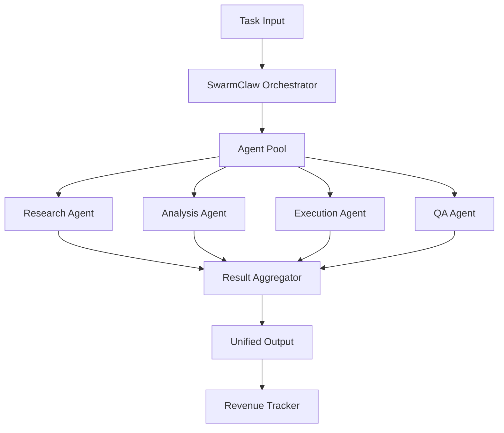

# SwarmClaw — Multi-Agent Orchestration Platform

## 🎯 Purpose
Orchestrate multiple AI agents working in parallel to solve complex business problems. SwarmClaw coordinates agent communication, task distribution, result aggregation, and revenue optimization across your entire agent fleet.

## 🏗️ Architecture

### System Components

### Agent Types
| Agent | Role | Capabilities |
|-------|------|-------------|
| Research | Information gathering | Web search, data collection, trend analysis |
| Analysis | Data processing | Pattern recognition, scoring, recommendations |
| Execution | Task completion | API calls, file operations, deployments |
| QA | Quality assurance | Validation, testing, security scanning |
| Revenue | Monetization | Pricing optimization, upsell detection |

## 📋 Skill Capabilities

### Orchestration
- Task decomposition and agent assignment
- Parallel execution with dependency management
- Result aggregation and conflict resolution
- Automatic retry and failover
- Progress tracking and reporting

### Agent Communication
- Inter-agent message passing
- Shared working memory
- Event-driven triggers
- Broadcast and targeted messaging
- Communication audit logs

### Task Management
- Priority queue with SLA tracking
- Deadline management
- Resource allocation
- Load balancing across agents
- Task templates and reuse

### Revenue Optimization
- Cross-sell detection across agent outputs
- Pricing experiment coordination
- Revenue attribution per agent
- MRR/ARR tracking per skill
- Churn prediction and prevention

## 🔒 Security & Privacy
- Agent isolation (separate contexts) prevents cross-agent data leakage
- PII is never shared between agents without explicit user consent
- Encrypted inter-agent communication (AES-256-GCM)
- Role-based access per agent with full audit logging
- GDPR/CCPA compliant — agents operate on need-to-know basis only
- CVE-2026-25253 compliant

## 💰 Pricing Tiers
| Tier | Price | Includes |
|------|-------|----------|
| Starter | $49/mo | 3 agents + Basic orchestration |
| Professional | $99/mo | 10 agents + Full orchestration |
| Enterprise | $249/mo | Unlimited agents + API |

## 📈 Revenue Pattern
- **Average Revenue**: $2,200/month
- **Success Rate**: 76%
- **Key Buyers**: AI agencies, enterprise teams, automation companies

## 🚀 Quick Start
1. Define your agent pool in `agents/config.yaml`
2. Set up communication channels in `communication/protocols.yaml`
3. Create task templates in `templates/tasks/`
4. Launch orchestrator with `swarmclaw start`
5. Monitor via dashboard

## 📁 References
- `references/agent-config-schema.json` — Agent configuration
- `references/communication-protocol.md` — Inter-agent messaging
- `references/task-templates/` — Pre-built task templates
- `scripts/swarmclaw-init.sh` — Initialization script
