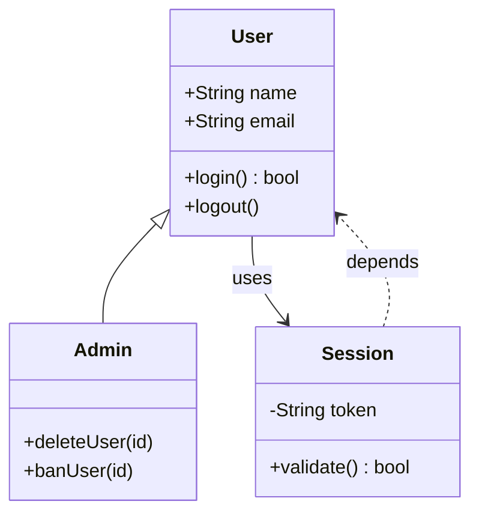
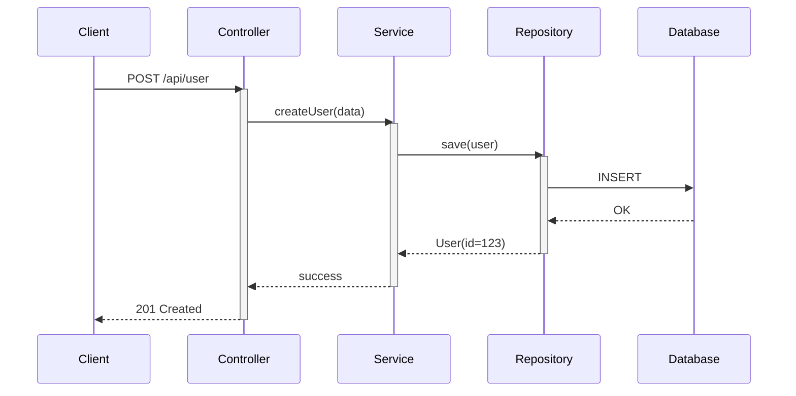
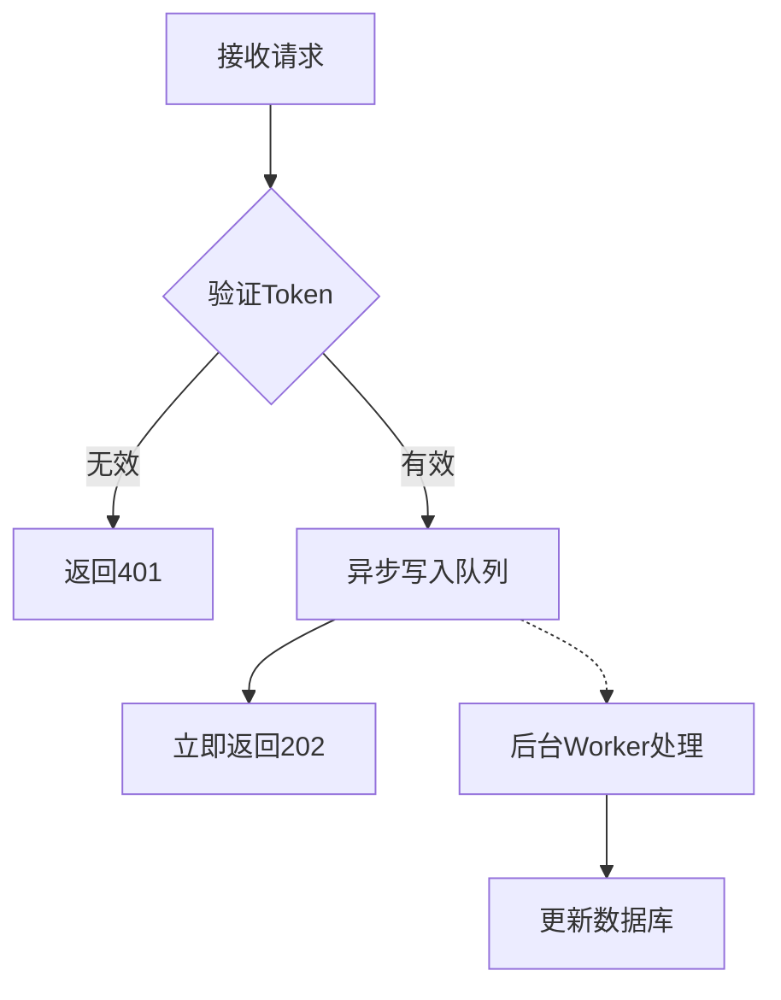
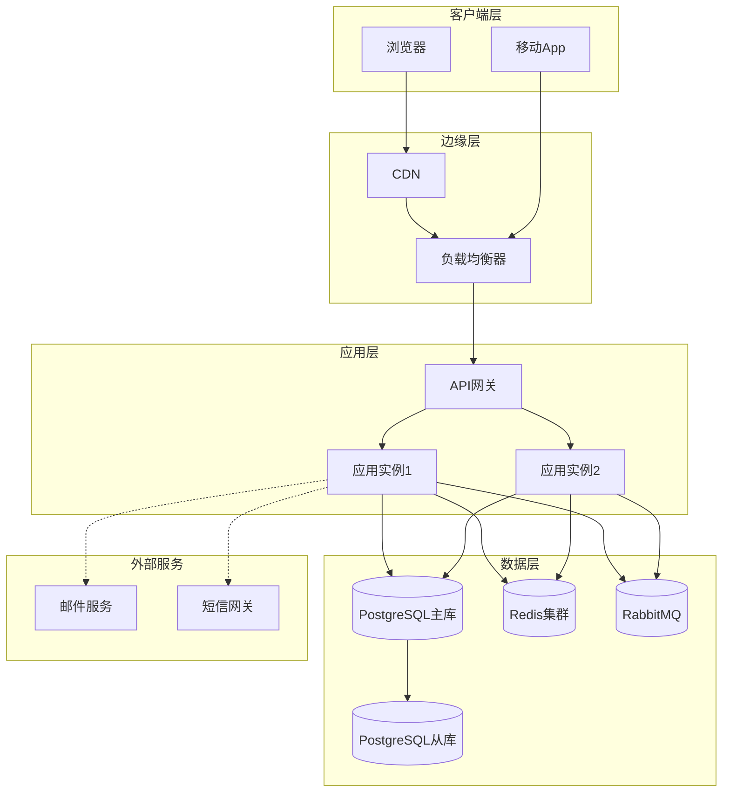
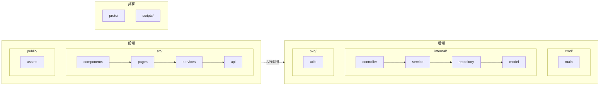
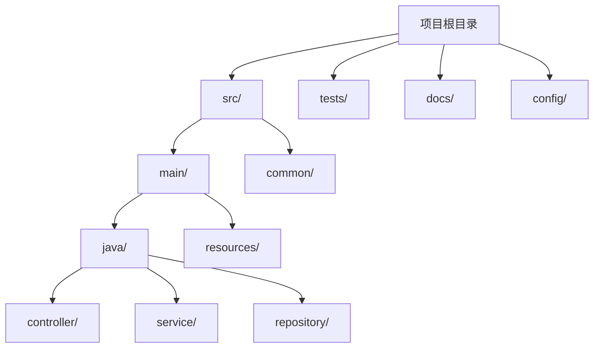
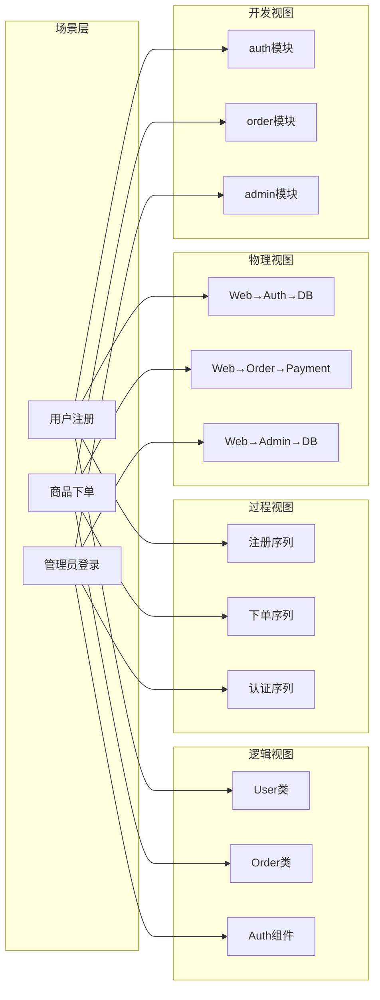
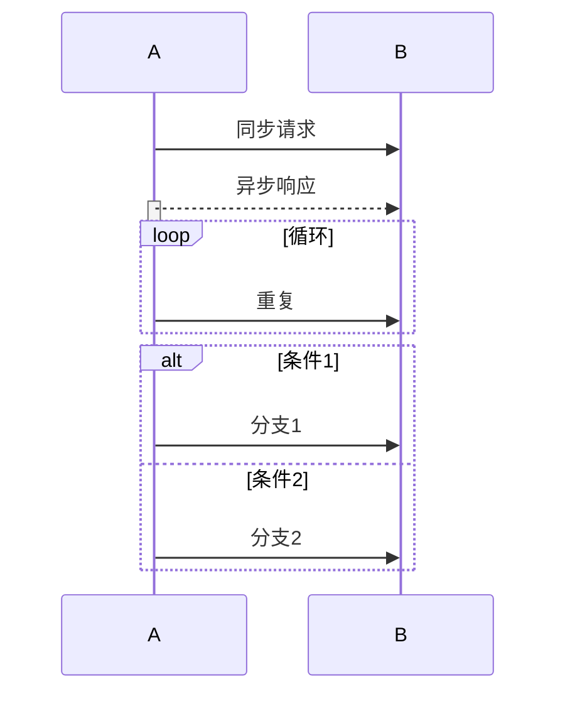
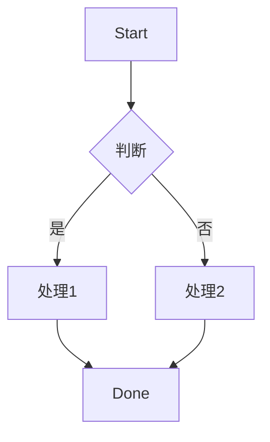

# 软件工程4+1视图自动生成器

## 触发条件

触发词参见 frontmatter `description` 字段；显式调用命令：`/dev:arc4plus1 [路径]`。

> **输入约定**：技能接受**一个参数**（位置或上下文），表示代码文件路径或工程目录路径。若用户未提供，须先通过 `AskUserQuestion` 确认目标路径。

---

## 技能目标

给定一个软件代码文件或代码工程目录，自动分析代码结构，生成软件工程的**4+1架构视图**：

- 逻辑视图 (Logical View)
- 过程视图 (Process View)
- 物理视图 (Physical View)
- 开发视图 (Development View)
- 场景视图 (Scenario View)

并将生成的 Mermaid 图存放在工程根目录下的 `arcview/` 文件夹中。

---

## 输入规范

技能接受以下两种输入之一：

| 模式 | 输入格式 | 示例 |
|------|----------|------|
| 单文件模式 | 一个源代码文件路径 | `./src/main.py` |
| 工程模式 | 一个工程目录路径 | `./my-project/` |

**支持的文件类型**：`.java`, `.py`, `.ts`, `.js`, `.go`, `.cs`, `.cpp`, `.h`, `.rs`, `.rb`, `.php`, `.kt`

---

## 输出规范

在目标工程根目录下创建 `arcview/` 文件夹，输出以下文件：

| 文件名 | 视图类型 | 说明 |
|--------|----------|------|
| `01_logical_view.md` | 逻辑视图 | 类/组件及其关系（UML类图风格） |
| `02_process_view.md` | 过程视图 | 运行时控制流/调用链（序列图/流程图） |
| `03_physical_view.md` | 物理视图 | 部署结构/节点拓扑 |
| `04_development_view.md` | 开发视图 | 目录/模块组织结构 |
| `05_scenario_view.md` | 场景视图 | 用例/场景与各视图映射 |
| `README.md` | 说明文档 | 各视图简要说明和使用指引 |

### 输出位置规则

| 输入类型 | arcview 输出根 | 备注 |
|----------|---------------|------|
| 文件路径（如 `./src/main.py`） | `{文件所在目录}/arcview/` | 若文件直接在 `arcview/` 内则追加时间戳子目录 |
| 文件夹路径（如 `./my-project/`） | `{输入目录}/arcview/` | 默认推荐 |
| Git 仓库根 | `{仓库根}/arcview/` | 不在子目录里无限嵌套 |
| 工作区根（多工程） | `{第一个工程根}/arcview/` | 其余工程归档至 `arcview/dependencies-<工程名>/` |

### 输出冲突处理策略

当 `arcview/` 目录已存在时，按下表规则处理（避免覆盖用户原有内容）：

| 冲突场景 | 处理方式 | 默认行为 |
|----------|----------|----------|
| 目录不存在 | 直接创建 | ✅ |
| 目录为空 | 直接写入 | ✅ |
| 目录已存在且仅含本次输出的同名文件 | **备份后覆盖** | ✅ |
| 目录已存在且含非本次输出的文件 | 在 README 顶部加 `⚠️ 已合并既有内容` 提示，**不可静默覆盖** | ✅ |
| 目录已存在且含敏感文件（如 `.git`、`config.yaml`） | **中止**，询问用户 | ❌ 强制 |

> **备份策略**：原文件重命名为 `<name>.<时间戳>.bak.md`，最多保留 5 个历史版本，超出时删除最旧。

---

## 视图生成规则（详细）

### 1. 逻辑视图 (Logical View)

**目标**：展示系统的静态结构、类/组件及其关系。

**生成规则**：
- 扫描所有类/接口/结构体/模块
- 识别以下 UML 关系：

| 关系类型 | Mermaid 语法 | 判断依据 |
|----------|--------------|----------|
| 继承 (泛化) | `<\|--` | extends, 子类:父类 |
| 实现 | `<\|..` | implements, interface |
| 关联 | `-->` | 成员变量/属性持有 |
| 聚合 | `o--` | 整体-部分（部分可独立） |
| 组合 | `*--` | 整体-部分（部分不可独立） |
| 依赖 | `..>` | 局部变量/参数/返回值 |

- 对于**小工程**（文件数 ≤ 20），生成**完整类图**，包含：
  - 所有属性（含类型和可见性）
  - 所有方法（含参数、返回类型、可见性）
- 对于**大工程**，按命名空间/包聚合为组件级视图

**Mermaid 语法示例**：


**可见性标识**：
- `+` public
- `-` private
- `#` protected
- `~` package

---

### 2. 过程视图 (Process View)

**目标**：展示运行时控制流、关键调用链、并发/异步流程。

**生成规则**：
- 识别入口点：
  - `main` 函数
  - API 端点（`@RestController`, `@app.route`, `app.get()`）
  - 事件处理器（`onClick`, `addEventListener`）
  - 定时任务/消息消费者
- 追踪函数调用关系（静态分析）
- 识别异步/并发点：
  - Java: `Thread`, `Executor`, `CompletableFuture`
  - Python: `async/await`, `threading`, `asyncio`
  - JS/TS: `Promise`, `async/await`, `setTimeout`, `worker`
  - Go: `go func()`, `channel`
- 生成**序列图**（优先）或**流程图**

**Mermaid 语法示例（序列图）**：


**Mermaid 语法示例（流程图-异步）**：


### 3. 物理视图 (Physical View)

**目标**：展示系统如何映射到物理节点（服务器、容器、进程、外部服务）。

**生成规则**：
- 识别配置文件中的部署信息：
  - Docker: `Dockerfile`, `docker-compose.yml`
  - k8s: `deployment.yaml`, `service.yaml`
  - Serverless: `serverless.yml`
- 识别外部依赖（从代码导入/配置中提取）：
  - 数据库连接 → 数据库节点
  - Redis客户端 → 缓存节点
  - HTTP客户端 → 外部API服务
  - 消息队列客户端 → MQ节点
- 若无明确配置，根据代码特征推断（在README中标注`[推断]`）

**Mermaid 语法示例**：


### 4. 开发视图 (Development View)

**目标**：展示代码目录结构、模块组织、构建依赖。

**生成规则**：
- 扫描目录树，保留层级结构
- 识别模块边界（package, module, namespace）
- 标注构建配置文件：
  - `package.json` (Node.js)
  - `go.mod` (Go)
  - `requirements.txt` / `pyproject.toml` (Python)
  - `pom.xml` / `build.gradle` (Java)
  - `Cargo.toml` (Rust)
- 展示模块间依赖（从import/include语句提取）

**Mermaid 语法示例**：


**目录树风格备选**：



### 5. 场景视图 (Scenario View)

**目标**：展示关键用户场景/用例如何贯穿四个视图，体现架构的完整性。

**生成规则**：
- 识别主要用例（从以下来源提取）：
  - API 路由定义
  - CLI 命令
  - 事件处理入口
  - 用户故事/测试用例（如有）
- 限制：选择 3-7 个最核心的场景
- 为每个用例绘制**场景-视图映射图**或**用例流程图**

**Mermaid 语法示例（场景映射）**：


**备选：单个用例的详细场景流**：
```mermaid
flowchart TD
    A[用户访问登录页] --> B[输入凭证]
    B --> C{前端校验}
    C -->|失败| D[显示错误]
    C -->|通过| E[API调用 /auth/login]
    E --> F[逻辑视图: AuthService.verify()]
    F --> G[过程视图: 认证序列]
    G --> H[物理视图: 查询用户DB]
    H --> I{凭证正确?}
    I -->|否| J[返回401]
    I -->|是| K[生成JWT]
    K --> L[返回Token]
    L --> M[开发视图: 前端存储Token]
    M --> N[跳转首页]
```

## 分析策略（按优先级）

### 第一步：语言检测

根据文件扩展名自动识别编程语言：

| 扩展名 | 语言 | 特殊解析能力 |
|--------|------|--------------|
| `.java` | Java | Spring注解, 泛型, 内部类 |
| `.py` | Python | 装饰器, 异步, 类型注解 |
| `.ts`, `.js` | TypeScript/JavaScript | 装饰器, Promise, 接口 |
| `.go` | Go | goroutine, interface, struct |
| `.cs` | C# | 属性, LINQ, async/await |
| `.cpp`, `.h` | C++ | 模板, 命名空间 |
| `.rs` | Rust | trait, 所有权, async |
| `.rb` | Ruby | 模块混合, 元编程 |
| `.php` | PHP | 命名空间, trait |
| `.kt` | Kotlin | 协程, 扩展函数 |

**混合语言工程**：分别分析后，在物理/开发视图中统一展示。

### 第二步：结构提取

1. **类/接口/结构体提取**
   - 使用正则匹配或AST模拟
   - 记录：名称、所在文件、行号、可见性

2. **关系推断**

| 关系 | 检测方式 |
|------|----------|
| 继承 | `class A extends B`, `class A(B):` |
| 实现 | `class A implements B`, `class A(Interface):` |
| 关联 | 成员变量类型为其他类 |
| 依赖 | 方法参数/返回/局部变量类型 |
| 聚合/组合 | 集合类型成员 + 生命周期分析 |

3. **函数调用图**
   - 解析函数体内的函数调用
   - 构建调用关系图
   - 识别递归和循环调用

4. **入口点识别**
   - `main` 函数/方法
   - 框架注解：`@RestController`, `@RequestMapping`, `@app.route`
   - 框架函数：`app.get()`, `router.post()`
   - CLI：`if __name__ == "__main__"`

### 第三步：视图生成

- 将提取的模型映射到 Mermaid 语法
- 处理大图：节点数 > 30 时，按命名空间折叠
- 使用 `click` 事件或分组（`subgraph`）实现折叠
- 避免孤立的类/模块（标注`[孤立]`）

---

## 特殊情况处理

| 情况 | 处理方式 |
|------|----------|
| 工程太小（1-5个文件） | 逻辑视图生成完整类图（含所有属性和方法），过程视图标注主要函数调用链 |
| 工程无明确架构 | 基于现有代码结构推断，在README中标注`[推断模式]` |
| 多语言混合 | 每个语言单独分析，最终在物理/开发视图中用不同颜色/style区分 |
| 无配置文件 | 物理视图基于常见模式推断（如检测到`sql.Open`→数据库节点） |
| 循环依赖 | 在视图中用红色虚线箭头标注，并在README中作为警告列出 |
| 前端项目 | 逻辑视图=组件树，过程视图=用户交互流+状态管理流，物理视图=CDN/API/客户端 |
| 微服务项目 | 每个服务单独生成视图，再生成全局视图 |
| 单文件 | 逻辑视图：文件内的所有类；开发视图：仅展示该文件结构 |

---

## 错误处理与回退策略

技能执行过程中遇到异常时，按下表的"**等级 → 响应**"逐级处理。**禁止**假装成功、**禁止**写入空文件了事。

### 等级 1：可恢复（自动继续，README 标注）

| 异常 | 检测方式 | 回退动作 |
|------|----------|----------|
| 单个文件读取失败 | `Read` 工具报错 | 跳过该文件，README 中加入 `⚠️ 跳过: <路径>（原因: <错误摘要>）` |
| 解析语言不支持 | 文件扩展名不在支持列表 | 视作文本/纯数据处理，在视图备注 `[未识别语言]` |
| Mermaid 单个代码块语法出错 | 自检清单 A.5 不通过 | 重写该代码块；连续 3 次仍失败 → 触发等级 3 `AskUserQuestion` 由人工决定降级为表格还是放弃 |
| 类/函数数过多导致 Mermaid 渲染超时 | 节点数 > 80 | 强制折叠到 `subgraph` 聚合视图 |
| 入口点为 0 | 扫描后 main / API 路由均无 | 物理/过程视图标注 `[推断入口: 默认 main]` 并继续 |

### 等级 2：可降级（输出降级，但不中止）

| 异常 | 检测方式 | 降级动作 |
|------|----------|----------|
| 工程代码完全无注释 | 静态扫描无元数据 | 视图中只用"类/函数名 + 入参类型"作为最小信息，标注 `[推理]` |
| 工程含大量生成代码（min.js、_pb2.py） | 文件头匹配生成器标记 | 跳过生成文件，README 标注 `⚠️ 已跳过 N 个生成文件` |
| 多语言混合超过 5 种 | 统计文件扩展名 | 物理/开发视图只展示占比 Top 5 语言，其余归为 `[其他]` |

### 等级 3：不可恢复（中止并询问）

| 异常 | 检测方式 | 必须动作 |
|------|----------|----------|
| 路径不存在 | `Bash test -e` 或工具报错 | 调用 `AskUserQuestion` 询问正确路径 |
| 路径无读权限 | 工具报错 | 提示用户授权，或要求重新选择路径 |
| 输出目录无写权限 | `Write` 工具报错 | 询问备用输出目录 |
| arcview 目录含敏感文件 | 冲突处理策略命中 | **中止**，确认后人工处理 |
| 工程为空目录 | 扫描结果为 0 文件 | 询问用户是否提供示例代码或跳过 |

### 通用回退原则

1. **绝不静默丢弃**：跳过的文件、推断的信息、合并的既有内容都必须在 README 汇总。
2. **保持可观察**：所有回退都伴随日志片段（`跳过原因`、`尝试 N 次后降级`等）。
3. **用户优先**：等级 3 错误必须 `AskUserQuestion` 而非自行决定。
4. **写入前校验**：每次 `Write` 前先 `Bash mkdir -p` 确认目标目录存在。

---

## 阶段化执行流程（5 阶段）

技能执行**必须**按 5 阶段顺序进行。每个阶段有明确的进入/退出条件和异常处理路径。

> **关键变化（v1.1.0）**：原"4 阶段"流程被扩充为 **5 阶段**，新增独立的 **阶段 5：强制门禁（Mermaid 校验）**。该阶段**不可跳过、不可降级、不可视为可选**——任何阶段 5 失败的执行视为整体失败。

### 阶段 1：扫描 (Scan)

**目标**：识别输入与代码全貌。

- **进入条件**：已确认输入路径存在
- **允许工具**：`Bash`、`Glob`；**禁用**：`WebFetch`、`WebSearch`
- **执行**：
  - `Bash ls` / `Glob` 列出目录结构
  - 统计文件数、行数、识别语言、识别构建/部署配置
- **退出条件**：
  - 已记录：输入路径、文件总数、代码行数、主语言、构建工具类型、配置存在情况
- **失败**：等级 3 → 询问用户

### 阶段 2：提取 (Extract)

**目标**：从代码中提取出视图所需的所有"事实"。

- **进入条件**：阶段 1 完成
- **允许工具**：`Read`、`Grep`；**禁用**：`Write`（不写盘）
- **执行**：
  - `Read` / `Grep` 解析每个文件
  - 提取：类、接口、函数签名、调用关系、配置项、入口点
  - 生成**内存中的模型**（不写盘）：`entities`, `relations`, `entrypoints`, `dependencies`
- **退出条件**：
  - 模型完整，标注 `[推断]` 项已计数
- **失败**：等级 1 → 跳过单文件并累计；等级 3 → 询问

### 阶段 3：生成 (Generate)

**目标**：把模型转成 5 个视图文件 + README。

- **进入条件**：阶段 2 完成且模型可用
- **允许工具**：`Write`、`Edit`、`Bash mkdir`、`WebFetch`（干跑）；**禁用**：`WebSearch`
- **执行**（按顺序编号，便于核对退出条件）：
  1. **生成 Mermaid 代码**：按"视图生成规则"映射出所有视图的 Mermaid 代码块（**仅在内存**，不写盘）
  2. **人工自检**：逐块对照 A.5 + A.6 + A.7 清单核对字符陷阱；不通过则回到 (1) 重写该块（每个块最多 3 次重试）
  3. **【强制门禁】自动修复 + 二次扫描**：每个块都通过 `python scripts/find_blocks.py fix` 修复常见陷阱，并要求返回 exit 0；非零则说明仍有无法自动修复的陷阱（如菱形节点含 `[]`、节点 ID 是关键字等），必须回到 (1) 人工重写该块
  4. **写盘**：`Write` 把通过 (2)(3) 的 Mermaid 块连同 Markdown 框架写入 `arcview/XX_*.md`
  5. **【强制】干跑验证**：对每个写盘的 Mermaid 块调用 `WebFetch https://mermaid.ink/img/base64?code=<base64>` 或 `https://mermaid.live/api/v1/syntax/parse` 验证 200 + image/svg+xml；失败则回到 (1) 重写该块（最多 3 次），仍失败按阶段 3 工具约束子节降级为表格 + README 标注
- **退出条件**：上述 5 步**全部成功**——即 6 个文件已写入、(2)(3)(5) 都已通过
- **失败**：连续 3 次自动修复/重写仍失败 → `AskUserQuestion` 由人工决定降级为表格（含 README 标注）还是中止该视图

#### 阶段 3 工具约束子节：Mermaid 干跑回退方案

> 这是**阶段 3 的工具回退方案**，不是独立阶段。

为执行干跑验证，**`WebFetch` 与 `Bash` 必须可调用**。若工具不可用（如纯离线环境）：

1. 改用 `Bash` 调本地 `npx -p @mermaid-js/mermaid-cli mmdc --input <file> --output <output>`，需要 Node 环境
2. 仍不可用 → 至少完成 A.6 提供的 `find_blocks.py` 静态扫描，把所有静态命中项列入 README "⚠️ 警告"
3. 干跑彻底失败的视图块 → 在自检清单中标注 `[静态通过，干跑跳过]`，告知用户需手动验证

### 阶段 4：自检 + 汇总 (Verify & Summarize)

**目标**：验证输出、汇总警告。

- **允许工具**：`Read`、`Bash ls`、`Bash awk/grep`；**禁用**：任何写入工具
- **执行**：
  - `Read` 每个输出文件确认非空
  - `Bash ls -la arcview/` 确认文件存在
  - `python scripts/find_blocks.py check arcview/*.md` 最终扫描必须 exit 0（兜底门禁）
  - 按"技能自检清单"逐项打钩
  - 生成 README.md 的"⚠️ 警告"区块，列出所有跳过、推断、降级项
- **退出条件**：所有强制项通过或已标注
- **失败**：不可恢复项返回阶段 3 重做，可恢复项记入 README

### 阶段 5：强制门禁（Mermaid 校验）【不可跳过】

**目标**：独立、显式、强制执行的 Mermaid 语法校验阶段。所有 6 个输出文件必须通过 `find_blocks.py` 的最终扫描，**失败一次即整体宣告失败**。

- **进入条件**：阶段 4 完成、6 个文件均已写入
- **允许工具**：`Bash`、`Read`；**禁用**：`Write`、`Edit`（只读）
- **执行**（按顺序执行，**任意一步返回非零立即中止**）：
  1. **【强制】运行 `find_blocks.py check`**：
     ```bash
     python scripts/find_blocks.py check arcview/*.md
     ```
     - 必须返回 `exit 0`（0 条警告）
     - 非零 → 输出所有陷阱清单 → **整体宣告失败**，必须回到阶段 3 重做
  2. **【强制】文件存在性 + 最小行数检查**：
     ```bash
     test -f arcview/01_logical_view.md   && [ "$(wc -l < arcview/01_logical_view.md)"   -ge 5 ] || exit 1
     test -f arcview/02_process_view.md   && [ "$(wc -l < arcview/02_process_view.md)"   -ge 5 ] || exit 1
     test -f arcview/03_physical_view.md  && [ "$(wc -l < arcview/03_physical_view.md)"  -ge 5 ] || exit 1
     test -f arcview/04_development_view.md && [ "$(wc -l < arcview/04_development_view.md)" -ge 5 ] || exit 1
     test -f arcview/05_scenario_view.md  && [ "$(wc -l < arcview/05_scenario_view.md)"  -ge 5 ] || exit 1
     test -f arcview/README.md            && [ "$(wc -l < arcview/README.md)"            -ge 5 ] || exit 1
     ```
  3. **【强制】README 必备区块存在性检查**：`README.md` 必须包含"视图文件清单"、"⚠️ 警告"、"使用说明" 三个二级标题
  4. **【强制】Mermaid 代码块存在性检查**：每个视图文件必须至少包含 1 个 ` ```mermaid ` 代码块
- **退出条件**：上述 4 步**全部成功**（全部 exit 0）
- **失败处理**：
  - 步骤 1（find_blocks.py check）失败 → 报告所有 R1~R19 陷阱，按规则 R1~R19 表人工修复；修复后**回到阶段 3 步骤 (3) 重做 fix + check**，直到本阶段步骤 1 通过
  - 步骤 2/3/4 失败 → 回到相应阶段补齐（阶段 3 写盘 / 阶段 4 汇总），补齐后再次回到本阶段

> **为什么独立成阶段**：原 SKILL.md 将 `find_blocks.py check` 嵌入"阶段 4"内部，容易被忽略或跳过。独立成阶段 5 后：
> - 在执行计划中**显式列出**，便于 AI 模型逐项核对
> - 退出条件用 4 个独立命令显式断言，**任何一项非零立即中止**
> - 自检清单第 5 组"阶段化执行合规"明确要求勾选"阶段 5 已通过"

### 阶段间状态持久化

为避免中断后重做，在 `.claude/arc4plus1-cache/` 写入中间模型 JSON（含时间戳）。下次同路径输入可直接复用，跳过阶段 1-2。

> 注意：**阶段 5 的检查结果不缓存**——每次执行都必须重新跑 `find_blocks.py check`，确保输出文件当下无陷阱。

---

## 最小可交付输出（MVO, Minimum Viable Output）

无论输入复杂度如何，技能**必须**保证以下内容存在。任何一项缺失视为**执行失败**。

### 必备文件

- [ ] `{目标}/arcview/01_logical_view.md`（≥ 5 行有效内容，含 1 个 Mermaid 代码块）
- [ ] `{目标}/arcview/02_process_view.md`（同上）
- [ ] `{目标}/arcview/03_physical_view.md`（同上）
- [ ] `{目标}/arcview/04_development_view.md`（同上）
- [ ] `{目标}/arcview/05_scenario_view.md`（同上）
- [ ] `{目标}/arcview/README.md`（包含视图文件清单 + 警告区块）

### 必备 README 区块

README 中必须含以下 5 个区块（顺序与示例见下方"输出示例：README.md"）：

1. 元信息表（生成时间/输入路径/文件数/主语言/构建工具）
2. 视图文件清单表（链接到 5 个 `.md`）
3. 架构摘要（1-3 句）
4. ⚠️ 警告区块（列出跳过/推断/降级项，无论是否触发）
5. 使用说明（Mermaid 渲染工具 + 重新生成方式）

### 必备元信息

每个视图文件顶部都应有：

```markdown
# {视图名}

> **生成时间**：{ISO 时间}
> **输入路径**：{路径}
> **分析阶段**：arc4plus1 v1.0.0 / {Scan|Extract|Generate|Verify} 阶段
> **统计数据**：{节点数 / 关系数 / 入口点数}
> **不确定度**：{已推断项数量}
```

**完整示例**（生成后**必须严格遵循此格式**，字段顺序、间隔符 `=` 不允许变体）：

```markdown
# 物理视图 (Physical View)

> **生成时间**：2025-01-15 14:30:22
> **输入路径**：./sensor
> **分析阶段**：arc4plus1 v1.0.0 / Generate 阶段
> **统计数据**：节点数=3, 关系数=4, 入口点数=1
> **不确定度**：0（基于Makefile与代码特征推断）
```

> 单个文件允许裁剪冗余统计项（如入门视图没有"关系数"可省略），但**已列出字段的字面值格式必须一致**。

> 注：当过程触发降级时（例如某视图降级为表格），MVO 标准仍然有效——文件**存在且非空**是底线，但其内部标注必须升级为 `[降级]`。

---

## 工具使用约束

各阶段的允许/禁用工具已在"阶段化执行流程"中标注（见阶段 1-4 表格行）。补充通用规则：

1. **批量读取**：阶段 2 解析时**优先使用并行 `Read`**，减少串行 IO。
2. **避免破坏性操作**：禁止 `rm`、`mv`、`git reset` 等，除非用户明确同意。
3. **路径相对性**：所有路径优先使用相对路径，避免在不同主机间复制失败。
4. **错误透明**：任何工具报错**必须**原样记录到 `Read tool error: ...` 形式的日志，**禁止**简化或臆造。
5. **超时防护**：单次 `Bash` 调用 ≥ 30 秒时主动 `TaskOutput` 检查；若 ≥ 5 分钟未返回，使用 TaskStop 中止并报告用户。

---

## 输出示例：README.md

# 4+1架构视图

**生成时间**：2025-01-15 14:30:22
**分析目标**：`./backend`
**分析文件数**：47 个
**代码语言**：Java (Spring Boot)

## 视图文件列表

| 视图 | 文件 | 摘要 |
|------|------|------|
| 逻辑视图 | [01_logical_view.md](./01_logical_view.md) | 37个类，继承8，实现3，关联15，依赖22 |
| 过程视图 | [02_process_view.md](./02_process_view.md) | 3个入口点，12条主要调用链，2处异步点 |
| 物理视图 | [03_physical_view.md](./03_physical_view.md) | 1个应用节点 + PostgreSQL + Redis + 2个外部API |
| 开发视图 | [04_development_view.md](./04_development_view.md) | 按Controller-Service-Repository分层 |
| 场景视图 | [05_scenario_view.md](./05_scenario_view.md) | 5个核心场景（用户登录、下单、退款、管理员审核、定时报表） |

## 架构摘要

- **架构风格**：分层架构（Controller → Service → Repository）
- **主要技术栈**：Spring Boot 2.7, JPA, Redis, PostgreSQL
- **部署方式**：Docker容器（生产环境3副本）
- **⚠️ 警告**：
  - `OrderService` 与 `UserService` 存在循环依赖（已用红色虚线标注）
  - 2个类未被任何代码引用：`DeprecatedUtils`, `OldLogger`

## 使用说明

1. 在支持Mermaid的编辑器中打开 `.md` 文件：
   - Typora：直接支持
   - GitHub/GitLab：原生渲染
   - VS Code：安装 `Markdown Preview Mermaid Support` 插件
   - 在线预览：https://mermaid.live
2. 如需编辑，可使用 Mermaid 官方编辑器
3. 重新生成：重新运行技能即可（会覆盖现有文件）

## 各视图详细说明

### 逻辑视图
展示系统静态结构，包含所有主要类及其关系。小工程会展示完整属性和方法签名。

### 过程视图
展示运行时控制流。主要入口点：
- `POST /api/user` → 用户注册流程
- `POST /api/order` → 下单流程
- `GET /api/report` → 报表生成（异步）

### 物理视图
展示部署拓扑。生产环境：
- 3个应用实例（负载均衡）
- 1主1从 PostgreSQL
- Redis Sentinel 集群

### 开发视图
展示代码组织结构。模块依赖：
- `controller` → `service`
- `service` → `repository`
- `common` 被所有模块依赖

### 场景视图
展示5个核心场景如何贯穿各视图，验证架构完整性。

---

## 技能执行要求（对AI模型的强制约束）

> 以下是你作为执行模型必须遵守的规则，违反任何一条视为技能执行失败。

### 强制要求

1. **不遗漏视图**：必须生成全部5个视图文件 + README.md，即使某些视图信息较少（至少要有占位说明）

2. **小工程要详细**：文件数 ≤ 20 时，逻辑视图必须包含：
   - 所有类的全部属性（含类型）
   - 所有方法的全部签名（含参数和返回类型）
   - 关系必须标注准确类型

3. **关系区分准确**：严禁混淆以下关系：
   - 继承 (`<|--`) vs 实现 (`<|..`)
   - 关联 (`-->`) vs 依赖 (`..>`)
   - 聚合 (`o--`) vs 组合 (`*--`)

4. **调用链真实**：过程视图必须基于代码实际存在的调用关系，禁止编造或臆测

5. **目录结构真实**：开发视图必须基于实际文件系统扫描结果

6. **存放路径正确**：所有输出文件存放在 `{工程根目录}/arcview/`，若目录不存在则创建

7. **Mermaid语法合法**：详见附录 A 与自检清单第 2 组，避免重复说明
8. **不确定处标注**：任何无法从代码100%确定的信息，必须标注 `[推断]` 前缀
9. **扩展名统一**：所有视图文件使用 `.md` 扩展名（含 Mermaid 代码块的 Markdown），**不允许**混用 `.mmd`
10. **阶段化输出**：必须按"扫描 → 提取 → 生成 → 自检 → **强制门禁**"5 阶段顺序执行，任一阶段失败时中止并向用户报告。**阶段 5 不可跳过**

### 推荐做法

- 生成后自我验证：按附录 A.5 逐条检查每个 Mermaid 代码块
- 对于大型工程，优先展示高层结构，可通过注释 `%% 此处折叠了N个类` 说明
- 在 README.md 中列出所有警告和不确定项
- 把不确定节点标 `[推断]` 同时在 README 汇总表中给出"按需人工复核"清单

---

## 技能自检清单（生成后必须验证）

执行完技能后，请按以下 6 个分组**全部通过**才能宣告成功。

### 1. 文件存在性（MVO 强制）
- [ ] `arcview/` 目录已创建在正确位置
- [ ] `01_logical_view.md` 存在且 ≥ 5 行
- [ ] `02_process_view.md` 存在且 ≥ 5 行
- [ ] `03_physical_view.md` 存在且 ≥ 5 行
- [ ] `04_development_view.md` 存在且 ≥ 5 行
- [ ] `05_scenario_view.md` 存在且 ≥ 5 行
- [ ] `README.md` 存在且 ≥ 5 行

### 2. Mermaid 语法（附录 A 强制）
- [ ] 所有 `class`/`loop`/`alt`/`par`/`rect`/`note`/`actor`/`participant`/`subgraph`/`end`/`graph` 等关键字未被用作未加引号 ID
- [ ] 所有颜色取自 A.3 列表中的 6 种
- [ ] 流程图全部使用 `flowchart` 而非 `graph`
- [ ] 节点数 > 30 的图均使用 `subgraph` 聚合
- [ ] 所有箭头两端节点都已定义
- [ ] 所有代码块满足 A.5 关键实体验证清单
- [ ] 阶段 3 强制门禁已通过：`python scripts/find_blocks.py fix` 写盘前返回 exit 0（详见阶段 3 执行步骤 (3)）
- [ ] 阶段 4 兜底门禁已通过：`python scripts/find_blocks.py check` 最终扫描返回 exit 0
- [ ] 每个 Mermaid 代码块在 https://mermaid.live 可渲染（无语法错误）

### 3. 内容质量
- [ ] 逻辑视图：小工程有完整的属性和方法签名
- [ ] 逻辑视图：关系类型标注正确（箭头形状符合 UML 规范）
- [ ] 过程视图：有明确的参与者（`participant`）和消息传递（`->>`）
- [ ] 物理视图：有节点分层和连线
- [ ] 开发视图：反映真实目录结构
- [ ] 场景视图：展示了至少 2 个场景与视图的映射

### 4. 准确性
- [ ] 没有编造不存在的类/函数
- [ ] 不确定的信息已标注 `[推断]` 或 `[推理]`
- [ ] 循环依赖等异常已标注警告

### 5. 阶段化执行合规
- [ ] 阶段 1（Scan）：已确认路径存在并统计了文件数/语言
- [ ] 阶段 2（Extract）：提取模型未写入磁盘前已记录 `[推断]` 数
- [ ] 阶段 3（Generate）：已按 5 步编号顺序执行完毕（详见阶段 3 执行步骤 (1)~(5)）
- [ ] 阶段 4（Verify）：已通过 `Read` + `Bash ls` 复核文件
- [ ] **阶段 5（强制门禁）**：已通过 `python scripts/find_blocks.py check` **最终扫描返回 exit 0**；文件存在性 + 最小行数检查全通过；README 必备区块全在；Mermaid 代码块全有

### 6. README 完整性
- [ ] 含"元信息表"（生成时间/输入路径/文件数/主语言/构建工具）
- [ ] 含"视图文件清单表"（链接到 5 个 .md）
- [ ] 含"架构摘要"（1-3 句）
- [ ] 含"⚠️ 警告区块"（列出跳过/推断/降级项，无论是否触发）
- [ ] 含"使用说明"
- [ ] 未触发任何等级 3 错误（或已通过 `AskUserQuestion` 处理）

---

## 扩展能力（可选实现）

如果技能实现者有能力，建议支持以下高级功能：

| 扩展 | 说明 | 优先级 |
|------|------|--------|
| 框架模式识别 | 识别Spring、Django、Express、React等框架的惯用模式并优化展示 | 高 |
| PlantUML输出 | 提供PlantUML格式作为Mermaid的备选 | 中 |
| 增量更新 | 仅分析变更的文件，增量生成视图 | 中 |
| HTML汇总页 | 生成一个HTML文件，包含可交互的Mermaid图（缩放、折叠） | 低 |
| CI/CD集成 | 支持通过命令行参数调用，便于集成到CI流水线 | 低 |
| 依赖版本图 | 在开发视图中展示第三方库依赖关系图 | 低 |

---

## 附录 A：Mermaid 强制约束（生成前必读）

下列约束**严禁违反**。违反将导致 Mermaid 渲染失败或图错乱。

### A.1 节点 ID / 标签禁用关键字

下列标识符**禁止**作为**节点 ID** 出现（含未加引号的 subgraph ID）。**子图标签**（`subgraph ID[label]` 中的 label）允许未加引号，但严禁含 ASCII 标点：

```
class, loop, alt, par, rect, note, actor, participant,
graph, subgraph, end, style, click, title, direction, linkStyle,
call, return, sequence, flowchart, stateDiagram, stateDiagram-v2,
classDiagram, namespace, using, for, while, do, destroy, create
```

> **大小写敏感性**：Mermaid 对关键字是**大小写不敏感**的。即 `End`、`END`、`end` 都会被识别为块结束符；`Subgraph`、`SUBGRAPH` 等同样命中。**唯一安全做法**是避免任何大小写形态。
> 如确实要表达 `End` 这类语义，用 `Done`、`Finished`、`Exit` 等**完全无关**的词替代。

若必须使用，加**双引号**包裹（仅在 label 位置有效，节点 ID 必须重命名）。建议在类/接口命名时优先避开。

### A.2 连线方向与继承箭头方向

- **类图中** `A <|-- B` 写法在部分渲染器（含 VS Code + 旧版 mermaid 插件）中会被解释为 `A` 继承 `B` 的反向，方向歧义。**统一推荐** `B --|> A`（继承箭头从子类指向父类），更兼容。
- 流程图统一使用 `flowchart`，**禁止**使用 `graph`（已废弃关键字）。
- 流程图箭头方向必须左右清晰，避免出现双向歧义。

### A.3 颜色限制

仅允许使用以下 16 种颜色（覆盖「6 基础色 + 6 浅色填充 + 4 描边色」三类，避免渲染器拒绝/打印兼容性差）：

**基础 6 色**（用于明确语义区分，慎用饱和度）：

| 颜色 | Mermaid 名 | 十六进制 |
|------|-----------|----------|
| 红 | `red` | `#ff0000` |
| 绿 | `green` | `#00ff00` |
| 蓝 | `blue` | `#0000ff` |
| 黄 | `yellow` | `#ffff00` |
| 品红 | `fuchsia` | `#ff00ff` |
| 青 | `aqua` | `#00ffff` |

**浅色填充 6 色**（用于模块层级填色，推荐使用）：

| 用途 | 十六进制 | 视觉效果 |
|------|---------|----------|
| 中绿 | `#a4c9a0` | 控制器/Service 之类 |
| 中橙 | `#e8a26d` | Repository/存储 之类 |
| 中蓝 | `#9bbde0` | 外部依赖/网关 之类 |
| 金黄 | `#f9d56e` | 警告/推断项 之类 |
| 中灰 | `#bdbdbd` | 辅助/容器 之类 |
| 中粉 | `#e69191` | 错误/降级项 之类 |

**描边色 4 色**（用于 `stroke:#xxx`）：

| 用途 | 十六进制 |
|------|---------|
| 黑 | `#000000`（也接受 `#000`） |
| 暗灰 | `#666666` |
| 中灰 | `#999999` |
| 白 | `#ffffff`（也接受 `#fff`） |

> 浅填充色必须与暗色描边搭配（建议 `stroke:#666666`），避免打印时失去边界。
> 真正需要多层级时仍优先用 `subgraph` + 浅填充色组合，而非堆叠更多颜色。
> 16 进制大小写不敏感（`#FF0000` 等价 `#ff0000`）。

### A.4 大图折叠规则

- **节点数 > 30**：按命名空间/包聚合到 `subgraph`，子图保留代表性节点（最多 10 个），其余用注释 `%% 此处折叠了 N 个类` 说明。
- **节点数 > 80**：在每个 view 顶部加 `%% 总节点数: X，折叠后: Y` 提示，避免 mermaid.live 渲染超时。
- 单文件最长边长（关系数）：类图 ≤ 60、流程图 ≤ 50、序列图 ≤ 25 participant（其余改用分组）。

### A.5 关键实体验证清单

每个 Mermaid 代码块在写入文件前，模型必须**自检**：

- [ ] 没有未闭合的引号/方括号/花括号
- [ ] 没有孤立的箭头（任何箭头两端均需已定义节点）
- [ ] 没有使用 A.1 中的关键字作为未加引号 ID（任何大小写）
- [ ] flowchart 关键字正确（`flowchart`，不是 `graph`）
- [ ] 颜色取自 A.3 列表
- [ ] 类图/序列图中 `participant`/`class` 与函数体内容无冲突
- [ ] **矩形节点文本** `Node["..."]` 中没有未转义的 `[`/`]`/`(`/`)`/`<`/`>`/`"`/`{`/`}`
- [ ] **菱形节点文本** `Node{...}` 中没有 `[]`/`""`/`()`（菱形内引号必须逐个 `\\"` 转义或换 `Node(["..."])` 圆角矩形）
- [ ] **节点文本中无 `---`**（三个连续连字符，会被识别为线声明符）
- [ ] **节点 ID 不含中横线/特殊空格**（如 `My-Node` 会破坏 mermaid 解析，统一用下划线或驼峰）

### A.6 节点形状的字符容忍度差异（互补 A.5）

A.5 列出了所有节点的通用禁忌（`()`、`---` 等）。本节补充**不同形状的额外禁忌**，仅在 A.5 基础上追加：

| 形状 | 语法 | A.5 之外的额外禁忌 | 替代方案 |
|------|------|--------------------|----------|
| 圆角矩形 | `Node("文本")` | 嵌套 `()` | 嵌套括号用 `（` `）` 全角 |
| 菱形（条件） | `Node{文本}` | 嵌套 `""` | **严禁** `Cond{argv[1] == "mock"?}`，必须改为 `Cond{argv1 等于 mock}` 或 `Cond(["argv[1] equals mock"])` 圆角矩形 |
| 平行四边形 | `Node[/文本/]`、`Node[\文本\]` | `/`、`\` | 同上转义 |

> 注：矩形（默认）节点的所有禁忌已在 A.5 完整覆盖，本节**不重复列举**，仅补 A.5 未涉及的形状特有禁忌。

### A.7 序列图 (sequenceDiagram) 字符禁忌

过程视图常用序列图。除 A.1 中 `participant` 已列入禁用 ID 关键字外，还需遵守：

- `participant <ID>` 的 ID 同样不允许含 ASCII `()`、`---`、`.`、`-`，规则同 A.5 矩形
- `participant <ID> as <别名>`：别名建议避免未加引号的 ASCII 标点，或整体加双引号：`participant "A as 客户端(WEB)" as Client`
- 消息文本 `<ID>->>Other: <text>` 中 `:` 后内容视为自由文本，但仍受 A.5 矩形规则约束（`()` 仍会被部分渲染器误判）
- `note over <ID>: <text>`、`loop <desc>`、`alt <desc>`、`par [<desc>]` 块的 `<desc>` 也按矩形文本规则对待（不要未转义 `()`/`---`）
- 块结束符 `end` 必须独立成行，不允许与上一行合并

> 序列图陷阱推荐用 `find_blocks.py` 静态扫描兜底；脚本当前主要覆盖 flowchart（流程图）陷阱，序列图陷阱由 A.7 清单人工核对。

#### 典型陷阱清单

1. **菱形节点 + 数组下标**：`Q{argv[1] == "mock"?}` ❌ → `Q{argv 1 等于 mock}` ✅
2. **节点文本 + 三个连字符**：`S["切换 --- 重做 ---"]` ❌ → `S["切换 — 重做 —"]` ✅（用全角破折号 `—`）
3. **类/接口名字段 + 关键字重名**（如 `class End`） ❌ → `class EndPoint` ✅
4. **节点名与关键字大小写接近**：`End` / `END` ❌ → `Done` / `Finished` ✅
5. **节点文本含代码箭头**：`A["exec = sensor->read()"]` ✅（在矩形内，`->` 安全）；但同样的字符串放到 `A{exec = sensor->read()}` 菱形里就有风险
6. **节点文本内含中文括号 vs ASCII**：`（UART/串口）` ✅ vs `(UART/串口)` 矩形内需要 `\\(` 转义

#### 自动化校验脚本（强制执行）

`scripts/find_blocks.py` 是本技能的**强制门禁脚本**（纯 Python 3.10+ 实现，仅依赖标准库 `re` / `sys` / `pathlib` / `argparse`，不依赖 awk / perl / sed）。

**两种模式**：

| 模式 | 命令 | 行为 | 使用时机 |
|------|------|------|----------|
| `fix` | `python scripts/find_blocks.py fix <files...>` | 原地自动修复常见陷阱，**修复后再做一次复扫** | **阶段 3 写盘前**（强制门禁） |
| `check` | `python scripts/find_blocks.py check <files...>` | 仅扫描，输出警告，不修改文件 | **阶段 4 验证**（兜底门禁） |

**退出码语义**：

- `0` = 干净（`fix` 模式下所有可修项已清零；`check` 模式下未发现陷阱）
- `1` = 仍有陷阱，必须人工介入（**禁止跳过**）

**覆盖规则（R1 ~ R19，与原 bash 版完全一致）**：

| ID | 规则描述 | 自动修复 |
|----|----------|----------|
| R1 | 菱形节点含方括号 `{}[]` | ❌ 人工 |
| R2 | 矩形节点含 ASCII `()` | ✅ 加双引号 |
| R3 | subgraph 标签含 ASCII `()` | ✅ 加双引号 |
| R4 | 矩形节点含 `---` | ✅ 加双引号 |
| R5 | 矩形节点 label 含未引号 `:` | ✅ 加双引号 |
| R6 | subgraph ID 后挂括号 | ✅ 改 `ID["label"]` |
| R7 | 序列图漏写 `participant` 关键字 | ✅ 自动补 |
| R8 | 颜色超 A.3 白名单（16 种合法色） | ❌ 人工 |
| R9 | flowchart 块内误用序列图语法 | ❌ 人工 |
| R10 | 矩形节点 ID 含 `.` 或 `-` | ❌ 重命名 |
| R11 | 节点方括号跨行未闭合 | ❌ 合并行 |
| R12 | `<br>` 标签位置可疑 | ❌ 人工 |
| R13 | flowchart 边标签 `\|..\|` 裸双引号 | ✅ 转 `&quot;` |
| R14 | flowchart 关键字误大写 | ✅ 归一小写 |
| R15 | flowchart 非法虚线箭头 `..>` | ✅ 改 `-.->` |
| R16 | flowchart 矩形 label 双重双引号 | ✅ 去重 |
| R17 | flowchart 矩形 label 嵌套空括号 | ✅ 加引号 |
| R18 | flowchart 矩形 label 非 HTML 尖括号 | ✅ 转义 `&lt; &gt;` |
| R19 | flowchart 矩形 label 裸双引号 | ✅ 转 `&quot;` |

**强制门禁语义**（必须严格遵守，违反视为执行失败）：

- **阶段 3 写盘前**：调用 `python scripts/find_blocks.py fix <files>`，**必须返回 exit 0** 才能 `Write`；非零则说明仍有无法自动修复的陷阱（如菱形节点含 `[]`、节点 ID 是关键字等），必须回到阶段 3 步骤 (1) 人工重写该块
- **阶段 4 验证**：调用 `python scripts/find_blocks.py check arcview/*.md`，**必须返回 exit 0** 才能宣告完成；非零则该次执行视为失败

**离线环境兼容**：脚本纯本地运行，**不需要联网**。在 `WebFetch` / `mermaid.live` 不可用的纯离线环境下，本脚本是唯一兜底手段。

> **脚本完整实现见**：`scripts/find_blocks.py`（与本 SKILL.md 同包）。如需阅读源码请直接打开该文件，不要在此处复制粘贴（避免内容冗余）。

> **最终验证**（可选增强）：将 Mermaid 块通过 `WebFetch https://mermaid.ink/img/base64?code=<base64>` 或 [mermaid.live](https://mermaid.live) **干跑一次**，失败则回阶段 3 重写。


## 附录 B：Mermaid 快速参考
### 类图关系符号

| 符号 | 含义 |
|------|------|
| `<\|--` | 继承 |
| `<\|..` | 实现 |
| `o--` | 聚合 |
| `*--` | 组合 |
| `-->` | 关联 |
| `..>` | 依赖 |

### 序列图常用语法



### 流程图常用语法


