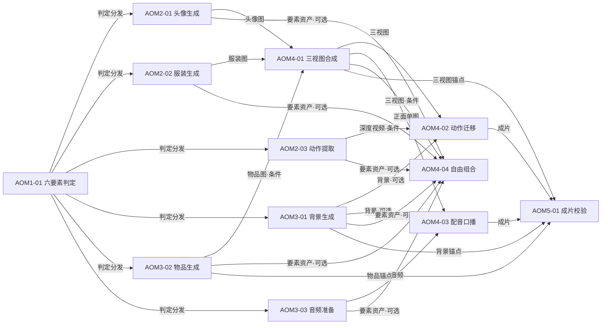

## 头像服装动作组合搭配视频 · 任务清单与依赖拓扑

按价值链组织的任务清单，附任务间关系和元操作映射提示。基于元技能系统 M2 工作流重构——按「生成 / 组合」边界重整为 5 域 12 任务：生成域产出可独立交付的六要素资产，组合域将资产组合为角色、成片与任意静态产物。

**域间逻辑流**：AOM1 → AOM2 ‖ AOM3 → AOM4 → AOM5。三条交付出口——①生成域资产独立交付（跳过 AOM4/AOM5）；②组合域自由组合静态产物直接交付（跳过 AOM5）；③组合域成片经 AOM5 质检后交付。

**输入双形态**：任务串联的输入接口兼容「提示词（描述）」与「产物（中间产物）」——图像类要素（头像/服装/物品/背景/三视图/正面单图）两者皆可，视频/音频驱动源（动作视频/深度视频/音频）须产物。提示词路径跳过中间产物、轻量快速，产物路径精确可控、可复用。

---

### AOM1 要素判定域

| ID | 任务类型 | 说明 | 依赖 | 元操作映射 |
|----|---------|------|------|-----------|
| AOM1-01 | 六要素判定 | 解析需求，判定头像/服装/动作三必备主体要素与配音口播/背景/物品三可选次要要素各自「指定」「随机」或「无」 | 无（入口） | S→C |

---

### AOM2 主体资产生成域

| ID | 任务类型 | 说明 | 依赖 | 元操作映射 |
|----|---------|------|------|-----------|
| AOM2-01 | 头像生成 | 文生图随机生成或按指定图处理角色脸（特征剥离法：脸与衣服分离） | AOM1-01 | S/C/A |
| AOM2-02 | 服装生成 | 文生图随机生成或按指定图处理服装（与头像分离、可并行） | AOM1-01 | S/C/A |
| AOM2-03 | 动作提取 | 动作视频→逐帧深度推理→深度视频（剥离长相，版权友好） | AOM1-01 | S→C→O |

---

### AOM3 次要要素生成域

| ID | 任务类型 | 说明 | 依赖 | 元操作映射 |
|----|---------|------|------|-----------|
| AOM3-01 | 背景生成 | 场景背景图（独立场景层，支持替换，直接汇入组合） | AOM1-01 | S/C/A |
| AOM3-02 | 物品生成 | 手持道具/广告产品图（回流三视图锁定手持） | AOM1-01 | S/C/A |
| AOM3-03 | 音频准备 | 配音口播音频：用户提供 / TTS 生成 / 随机 | AOM1-01 | S/C/A |

---

### AOM4 资产组合域

| ID | 任务类型 | 说明 | 依赖 | 元操作映射 |
|----|---------|------|------|-----------|
| AOM4-01 | 三视图合成 | 特征剥离法：头像+服装（+物品，条件）垫图→三视图（身份 ID 卡）→派生正面单图 | AOM2-01, AOM2-02, AOM3-02 | C→A |
| AOM4-02 | 动作迁移成片 | 深度视频（条件：1:1 动作迁移）+ 三视图 → 动作迁移成片（路径判定为基元内分步校准点；背景可选） | AOM4-01, AOM2-03, AOM3-01 | C→A |
| AOM4-03 | 配音口播对口型 | 音频 + 正面单图 → 口型驱动成片（背景/物品融合；背景可选） | AOM4-01, AOM3-03, AOM3-01 | C→A |
| AOM4-04 | 自由组合 | 任意要素（资产或描述）自由组合为静态产物（换装图/场景图/产品图/角色设定图等，提示词组合/产物组合两通道；三视图为条件依赖） | AOM2-01, AOM2-02, AOM2-03, AOM3-01, AOM3-02, AOM3-03, AOM4-01 | C→A |

---

### AOM5 质量守护域

| ID | 任务类型 | 说明 | 依赖 | 元操作映射 |
|----|---------|------|------|-----------|
| AOM5-01 | 成片校验审查 | 四维一致性（身份/服装/物品/背景）+ 合规审查，交付成片（依赖成片 + 三视图/背景/物品锚点） | AOM4-02, AOM4-03, AOM4-01, AOM3-01, AOM3-02 | G |

---

## 依赖拓扑摘要

**域内链路**：
- 要素判定：AOM1-01（入口）
- 主体资产：AOM2-01 头像生成、AOM2-02 服装生成（可并行）；AOM2-03 动作提取（深度视频）
- 次要要素：AOM3-01 背景生成（独立，汇入组合）；AOM3-02 物品生成（条件汇入 AOM4-01 锁定手持）；AOM3-03 音频准备（配音口播音频）
- 资产组合：AOM4-01 三视图合成（角色组合，校准点，派生正面单图）；AOM4-02 动作迁移 / AOM4-03 配音口播（成片组合，路径判定为各自基元内分步校准点）；AOM4-04 自由组合（任意要素→静态产物，通用通道）
- 质量守护：AOM5-01（单任务，内部一致性+合规分步）

**跨域链路（穷尽，含控制流 / 数据流 / 校验锚点三类依赖）**：
- 控制流（判定分发 1→6）：AOM1-01 → AOM2-01, AOM2-02, AOM2-03, AOM3-01, AOM3-02, AOM3-03
- 数据流（主体资产→三视图）：AOM2-01（头像图）, AOM2-02（服装图）→ AOM4-01
- 数据流（物品回流，条件）：AOM3-02（物品图）→ AOM4-01（仅物品启用时锁定手持）
- 数据流（动作→成片，条件）：AOM2-03（深度视频）→ AOM4-02（仅 1:1 动作迁移需深度视频）
- 数据流（角色→成片）：AOM4-01（三视图）→ AOM4-02；AOM4-01（正面单图）→ AOM4-03
- 数据流（次要资产→成片）：AOM3-03（音频）→ AOM4-03；AOM3-01（背景，可选）→ AOM4-02 / AOM4-03
- 数据流（任意要素→自由组合，可选）：AOM2-01/02/03, AOM3-01/02/03, AOM4-01（三视图）→ AOM4-04
- 校验锚点（回流）：AOM4-02/AOM4-03（成片）→ AOM5-01；AOM4-01（三视图锚点）, AOM3-01（背景锚点）, AOM3-02（物品锚点）→ AOM5-01

**完整处理链路**：
- 动作迁移链路：AOM1-01 → AOM2-01, AOM2-02（AOM3-02 物品条件汇入 AOM4-01）→ AOM4-01 三视图, AOM2-03 深度视频 → AOM4-02 动作迁移 → AOM5-01（锚点：AOM4-01 三视图 / AOM3-01 背景 / AOM3-02 物品）
- 配音口播链路：AOM1-01 → AOM2-01, AOM2-02 → AOM4-01 三视图, AOM3-03 音频（AOM3-01 背景汇入 AOM4）→ AOM4-03 配音口播 → AOM5-01（锚点同上）
- 自由组合链路：AOM1-01 → 任意要素资产（AOM2/AOM3，三视图另来自 AOM4-01）→ AOM4-04 自由组合 → 静态产物直接交付（无需 AOM5 成片质检）

---

## 知识图谱

### 依赖关系图（穷尽边）

### 依赖边穷尽清单（27 条）

| # | 源任务 | 输出（资产/信号） | 目标任务 | 依赖类型 | 条件 |
|---|--------|------------------|---------|---------|------|
| 1 | AOM1-01 | 六要素方案 | AOM2-01 头像生成 | 控制流 | 必选 |
| 2 | AOM1-01 | 六要素方案 | AOM2-02 服装生成 | 控制流 | 必选 |
| 3 | AOM1-01 | 六要素方案 | AOM2-03 动作提取 | 控制流 | 必选 |
| 4 | AOM1-01 | 六要素方案 | AOM3-01 背景生成 | 控制流 | 必选 |
| 5 | AOM1-01 | 六要素方案 | AOM3-02 物品生成 | 控制流 | 必选 |
| 6 | AOM1-01 | 六要素方案 | AOM3-03 音频准备 | 控制流 | 必选 |
| 7 | AOM2-01 | 头像图 | AOM4-01 三视图合成 | 数据流 | 必选 |
| 8 | AOM2-02 | 服装图 | AOM4-01 三视图合成 | 数据流 | 必选 |
| 9 | AOM3-02 | 物品图 | AOM4-01 三视图合成 | 数据流 | 条件（物品启用）|
| 10 | AOM2-03 | 深度视频 | AOM4-02 动作迁移 | 数据流 | 条件（1:1 动作迁移）|
| 11 | AOM4-01 | 三视图 | AOM4-02 动作迁移 | 数据流 | 必选 |
| 12 | AOM4-01 | 正面单图 | AOM4-03 配音口播 | 数据流 | 必选 |
| 13 | AOM3-03 | 音频 | AOM4-03 配音口播 | 数据流 | 必选 |
| 14 | AOM3-01 | 背景图 | AOM4-02 动作迁移 | 数据流 | 可选 |
| 15 | AOM3-01 | 背景图 | AOM4-03 配音口播 | 数据流 | 可选 |
| 16 | AOM2-01 | 头像图 | AOM4-04 自由组合 | 数据流 | 可选 |
| 17 | AOM2-02 | 服装图 | AOM4-04 自由组合 | 数据流 | 可选 |
| 18 | AOM2-03 | 深度视频 | AOM4-04 自由组合 | 数据流 | 可选 |
| 19 | AOM3-01 | 背景图 | AOM4-04 自由组合 | 数据流 | 可选 |
| 20 | AOM3-02 | 物品图 | AOM4-04 自由组合 | 数据流 | 可选 |
| 21 | AOM3-03 | 音频 | AOM4-04 自由组合 | 数据流 | 可选 |
| 22 | AOM4-01 | 三视图 | AOM4-04 自由组合 | 数据流 | 条件（组合三视图）|
| 23 | AOM4-02 | 成片 | AOM5-01 成片校验 | 数据流 | 必选（动作迁移）|
| 24 | AOM4-03 | 成片 | AOM5-01 成片校验 | 数据流 | 必选（配音口播）|
| 25 | AOM4-01 | 三视图锚点 | AOM5-01 成片校验 | 校验锚点 | 必选 |
| 26 | AOM3-01 | 背景锚点 | AOM5-01 成片校验 | 校验锚点 | 可选（有背景）|
| 27 | AOM3-02 | 物品锚点 | AOM5-01 成片校验 | 校验锚点 | 可选（有物品）|

### 六要素流转图谱

| 要素 | 主体/次要 | 判定 | 生成 | 组合 | 守护锚点 |
|------|----------|------|------|------|---------|
| 头像 | 必备主体 | AOM1 | AOM2-01 头像生成 | AOM4-01 三视图 → AOM4-02/03 | AOM5（身份）|
| 服装 | 必备主体 | AOM1 | AOM2-02 服装生成 | AOM4-01 三视图 → AOM4-02/03 | AOM5（服装）|
| 动作 | 必备主体 | AOM1 | AOM2-03 动作提取（深度视频）| AOM4-02 动作迁移 | — |
| 配音口播 | 可选次要 | AOM1 | AOM3-03 音频准备 | AOM4-03 配音口播 | — |
| 背景 | 可选次要 | AOM1 | AOM3-01 背景生成 | AOM4-02/03 融合替换 | AOM5（背景）|
| 物品 | 可选次要 | AOM1 | AOM3-02 物品生成 | AOM4-01 锁定 → AOM4-02/03 | AOM5（物品）|

### 关键结构特征

1. **递归嵌套**：AOM4-01 三视图合成既「组合」头像/服装/物品，又「产出」新资产三视图，三视图再作为输入参与 AOM4-02/03/04 的下一级组合——构成「资产 → 组合 → 新资产 → 组合」的递归闭环。
2. **唯一回流要素**：物品是唯一跨域回流要素（AOM3-02 → AOM4-01 三视图锁定手持），其余要素单向流转。
3. **三条交付出口**：①生成资产独立交付（AOM2/AOM3 后直接交付）；②自由组合静态产物直接交付（AOM4-04 后，跳过 AOM5）；③成片经 AOM5 质检后交付（AOM4-02/03 → AOM5）。
4. **输入双形态**：图像类要素（头像/服装/物品/背景/三视图/正面单图）的边可「图或描述」等价替换，提示词路径跳过生成域直达组合域；视频/音频驱动源（动作视频/深度视频/音频）须产物。
5. **守护锚点回流**：AOM5-01 的校验锚点（三视图/背景/物品）来自 AOM4-01/AOM3-01/AOM3-02，构成「生成-组合-校验」的锚点闭环，是四维一致性校验的数据基础。

更多组合根据具体任务动态推导。
