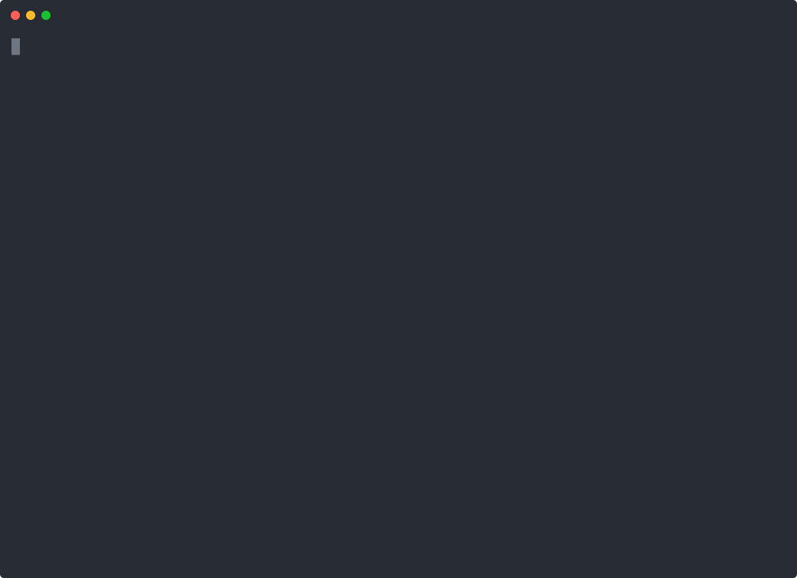

# Better Every Run

Teach the agent from explicit corrections without turning chat into permanent memory.

Better Every Run gives a correction a clean path: capture it locally, review whether it deserves to stick, then promote it to memory, a skill rule, or an eval only when the evidence is good. Nothing is learned from casual chat by accident.

```text
/ber fix vague status update -> exact command output and next action
/ber remember design software for humans from the shortest path to outcome
/ber report
```

The useful part is the boundary. The agent can improve from a sharp correction, but it still has to say what was recorded, where it lives, and whether anything durable changed.

## Start Here

```bash
git clone https://github.com/LeoStehlik/better-every-run.git
cd better-every-run
make test
```

Then read `SKILL.md` and `examples/upstream-loop.md` to see the governed correction flow.

## Install

### OpenClaw / ClawHub

```bash
openclaw skills install better-every-run
```

### Manual

```bash
git clone https://github.com/LeoStehlik/better-every-run.git ~/.openclaw/workspace/skills/better-every-run
```

For Claude Code, Codex, or other agent harnesses, copy this folder into the harness skill directory and load `SKILL.md`.

## Human Surface

Use BER when the human explicitly wants a lesson recorded:

```text
/ber fix vague status update -> exact command output and next action
/ber remember design software for humans from the shortest path to outcome
/ber report
```

The agent handles the local helper, then tells the human whether the lesson stayed in the project-local `.better-every-run/` store or was promoted through a reviewed durable flow.

## Works With

BER is written as an OpenClaw skill, but the pattern is portable to any agent runner that can load a `SKILL.md` file and run the bundled helper. It fits Codex, Claude Code, OpenCode, Hermes, and custom multi-agent harnesses that need explicit learning without silent memory writes.

## Product Rule

- The skill runs only from explicit `/ber` use or a direct request to persist a lesson.
- Humans should not manage helper internals during normal use.
- `/ber fix` and `/ber remember` never append directly to durable files, even when `--target` is supplied.
- The agent should summarize the outcome in chat, including the local store and any reviewed durable promotion.
- Lesson metadata should explain the intended scope: `run`, `project`, `workspace`, `skill`, `memory`, or `eval`.
- Durable memory and skill writes require a fresh lesson card, a stable target hash, and a clean BER scanner verdict.
- Eval durability goes through `eval-fixture`, which writes JSON/JSONL only under `tests/` or `evals/`.
- No plugin, server, web UI, database, or external service is required.

## Storage

The helper writes a project-local evidence trail under `.better-every-run/`. That folder should stay private, be excluded from publishing, and can be reviewed or deleted by the workspace owner.

## Internal Helper

The bundled helper is for agents, tests, and audits. Keep normal chat short, but disclose persistence clearly. Promotion commands are agent-facing: `card --to memory|skill` writes a lesson card with scanner state and target hash; `promote --to memory|skill` appends only when the card is still fresh and the scanner is clean; `eval-fixture` turns a correction into a JSON regression case.

Retired unsafe path: `apply-memory-patch` now refuses. `export-memory-patch` remains available as review output only.

## Upstream Of Skills, Memory, And Evals

BER is deliberately upstream of heavier machinery:

- Use `/ber fix` when the human corrects a bad outcome.
- Use `/ber report` to see accepted lessons, open proposals, expired lessons, lifecycle counts, and promotion suggestions.
- Write a lesson card before durable memory/skill promotion so stale targets and scanner issues are caught before a file is changed.
- Quarantine one-off/bad lessons and supersede stale lessons when a better rule replaces them.
- Promote only the lessons that deserve durability. Memory captures operating preferences, skills capture reusable behavior, and eval fixtures capture regressions that should fail if the agent slips again.

See `examples/upstream-loop.md` for the end-to-end flow.

## Credibility Artifact



## Repository

```text
better-every-run/
├── SKILL.md
├── assets/
│   ├── better-every-run-terminal-demo.cast
│   └── better-every-run-terminal-demo.svg
├── examples/
│   ├── asciinema-demo.sh
│   ├── demo.md
│   ├── terminal-demo.md
│   └── upstream-loop.md
├── references/
│   ├── report-template.md
│   └── workflow.md
├── scripts/
│   ├── ber
│   └── ber.js
├── tests/
│   └── smoke.sh
├── Makefile
└── README.md
```

## Status

Usable public skill bundle, published on ClawHub as `better-every-run`. The GitHub repo also carries the terminal demo proof artifact.

## Verify

```bash
make test
```
