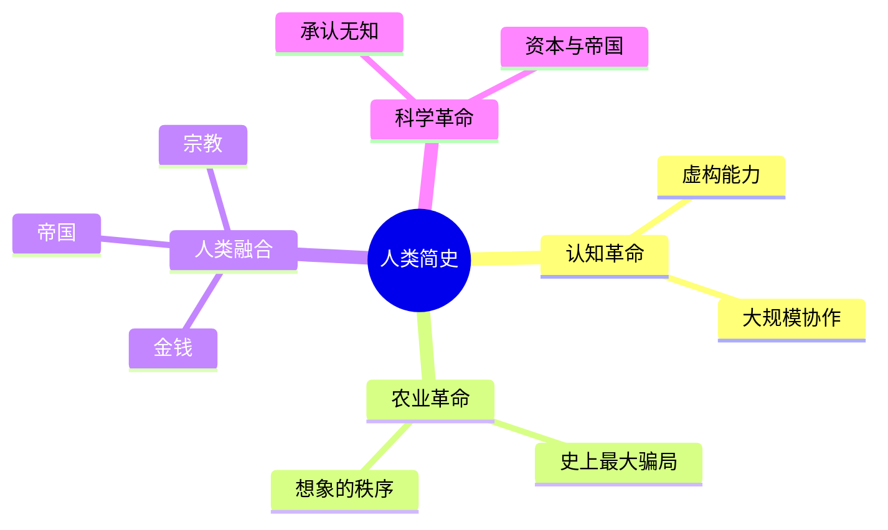
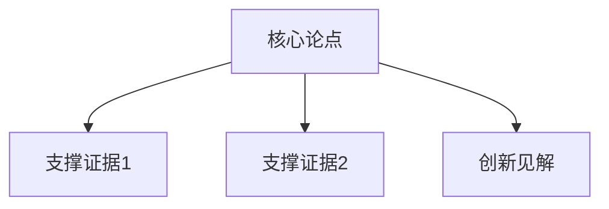

# 图书智能解读系统 · 输出规范 v1.1

本文件是产出报告的**唯一权威规范**。每次解读前完整阅读本文件；与 SKILL.md 冲突时以本文件为准。

---

## 一、总体风格要求

1. 使用 Markdown，结构清晰、层次分明，重点突出、逻辑连贯
2. 保持客观中立，忠于原著，避免过度发散
3. 注重实用性和可操作性
4. 按书籍类型微调分析维度，但 13 节主体框架不缺失

## 二、13 节报告模板

```markdown
# 《书名》深度解读报告

> 数据来源说明：[原文材料逐字引用] 或 [基于书名通识内容分析]（二选一，必须声明）

- 价值度：📚[x/10]（理由一句话）
- 难度：🎯[x/10]（理由一句话）
- 实用度：⚡[x/10]（理由一句话）

## 1. 基础信息
- 书名：[中英文书名]
- 作者：[作者信息]
- 出版信息：[出版社/年份]
- 核心主题：[一句话概括]

## 2. 内容框架
[书籍整体结构和各章节主要内容；可按书型用表格/列表呈现]

## 3. 核心观点
- **主要论点**：[3-5 个核心论点]
- **支撑证据**：[每个论点的主要支撑证据]
- **创新见解**：[作者的原创性观点]

## 4. 关键概念
[解释书中重要的概念、理论或模型，每个附一句"为什么重要"]

## 5. 精彩片段
每条引用必须带来源状态标签：`[原文]` 或 `[大意]`。
- `[原文]`：仅当逐字摘录自用户提供的材料
- `[大意]`：转述或凭公认内容概括（无材料时首选）

> [原文] "引用1"
解读：[为什么重要/有何启发]

> [大意] 引用2
解读：[为什么重要/有何启发]

（无材料且无法确证任何可直接引用的短句时，允许将本节改写为"代表性观点转述"，并在节首注明）

## 6. 应用价值
- **个人层面**：[个人如何应用]
- **组织层面**：[组织如何应用]
- **社会层面**：[更广泛的应用价值]

## 7. 思维导图
[mermaid 语法输出，详见第五节规范；若读者环境不支持渲染，在同节给出可读的文本树作为注释]

## 8. 批判性思考
- **优点**：[书籍的主要优点]
- **局限**：[存在的问题或不足]
- **延伸**：[1-2 条延伸深挖的阅读方向，点到为止]

## 9. 行动指南
1. [具体行动建议1：动词开头，可执行]
2. [具体行动建议2]
3. [具体行动建议3]

## 10. 阅读建议
- **适合人群**：[谁适合读这本书]
- **阅读策略**：[如何最有效地阅读]
- **重点章节**：[特别值得关注的部分]

## 11. 核心问答
Q1: [核心问题1]
A1: [答案1]

Q2: [核心问题2]
A2: [答案2]

## 12. 延伸思考
[书籍引发的更深层思考与开放讨论，1-2 段为宜]

## 13. 同类图书推荐（线头梳理）
见第六节"线头梳理方法"。
```

## 三、评分量规校准表

三个评分必须落在对应档位，并在分数后附一句理由（对照量规说明落到该档的原因）。

### 📚 价值度（认知增量与内容含金量）

| 档位 | 特征 |
|------|------|
| 1-3 | 信息冗余、偏消遣，可读可不读 |
| 4-6 | 有启发性观点或个别亮点框架 |
| 7-8 | 提供系统方法论或稳定新知，值得精读 |
| 9 | 认知被明显刷新，同类中的必读级 |
| 10 | 里程碑式 / 开宗立派，改变一个领域的谈法 |

### 🎯 难度（阅读门槛）

| 档位 | 特征 |
|------|------|
| 1-2 | 零门槛通识，任何读者可读 |
| 3-4 | 轻松易读，仅需少量背景 |
| 5-6 | 需要一定学科背景或持续注意力 |
| 7-8 | 术语密集、论证高密，需放慢精读 |
| 9-10 | 需先修学科基础，否则无法进入 |

### ⚡ 实用度（可操作与可迁移性）

| 档位 | 特征 |
|------|------|
| 1-2 | 纯思辨，无操作路径 |
| 3-4 | 有零星可借鉴的观点 |
| 5-6 | 有可复用的框架/清单/方法 |
| 7-8 | 大部分内容可直接落地为行动 |
| 9-10 | 手册/工具书级，边读边用 |

## 四、引文真实性细则

1. **来源状态**：每条引文与每条图书信息都必须可归入以下三类之一——
   - `[原文]`：逐字摘录自用户提供的材料（PDF/笔记/章节文本）
   - `[大意]`：基于材料或公开公认内容的转述概括
   - `[公认表述]`：广为人知、多源可考、即使无材料也可确认大意的高置信表述（使用前须自问"我能否给出两个独立来源"）
2. **禁止伪引文**：不得为了"像原文"而把转述包装成引号内引文；无法确证措辞时一律降级为 [大意] 并去掉引号
3. **无材料场景的精彩片段节**：优先全部使用 [大意]；仅当某句为极高置信的公认表述（如全书最具代表性的断言）时才可作短引并标 [公认表述]；若连公认短句都无把握，则整节改写为"代表性观点转述"并说明
4. **图书事实信息**（作者、出版年、篇目结构等）如非来自材料，须为公开可查信息，不确定处写"约/据公开信息"，不得给出精确但虚构的数字
5. **同类推荐书目**：只推荐真实存在的书与作者；拿不准的宁可少推，不推不确定的

## 五、思维导图 mermaid 规范

- 默认用 `mindmap` 语法绘制核心内容树；结构复杂时可用 `flowchart TD`
- 节点文本保持简洁，避免括号/引号等特殊字符（必要时用 `()` 圆括号包裹文本以转义）
- 输出示例（mindmap）：



- flowchart 变体示例：



- 同一节内提供一段"人可直接读的文本树"注释（保留纯文本可读性），再给 mermaid 代码块

## 六、交付自查清单（不通过不得交付）

- [ ] 报告含全部 13 节，顺序与模板一致
- [ ] 顶部有数据来源声明
- [ ] 三项评分各自落在量规档位内且附理由
- [ ] 每条引用带 [原文]/[大意]/[公认表述] 标签；无伪引文
- [ ] 同类推荐的每本书真实存在，且每本线头类型与理由成立
- [ ] 思维导图为合法 mermaid 语法（无未闭合括号等明显错误）
- [ ] HTML 版与 Markdown 版内容一致，HTML 无外部依赖、可直接双击打开
- [ ] 行动指南动词开头、可执行；阅读建议针对该书而非泛泛而谈

## 七、HTML 可视化报告规范

1. **单文件 self-contained**：所有 CSS 内联于 `<style>`，不依赖外部样式/脚本/字体/图片；语言 `lang="zh-CN"`
2. **主题适配**：用 CSS 变量 + `prefers-color-scheme` 实现浅色/深色自适应；浅色为默认
3. **推荐版式骨架**：
   - 顶部 Hero 区：书名（大标题）+ 评分三徽章（📚🎯⚡）+ 数据来源声明
   - 一个简洁的锚点目录（13 节跳转）
   - 正文分区卡片化：`section` + 圆角卡片（`border-radius: 12px`、细边框、浅底）
   - 引文用引用块样式：左侧色条 + 浅色底；[原文]/[大意] 标签做成小徽章
   - 应用价值/核心问答等可用两列或三列布局；行动指南用有序编号卡片
   - 思维导图：默认渲染为**纯 HTML/CSS 树**（嵌套 `ul/li` + 连线样式，保证离线可用）；如运行环境允许且用户需要可交互 mermaid，可另行嵌入 mermaid.js（CDN：cdn.jsdelivr.net），但不得以牺牲离线可用为代价
   - 同类图书推荐：每本书一张卡片，含 线头类型 徽章 + 推荐理由 + 建议顺序
4. **可分享**：成品可直接发送他人打开，无需联网

## 八、线头梳理方法（同类图书推荐）

**目标**：不是罗列"同类型畅销书"，而是为读者画一张"书脉地图"——说明每本推荐书与当前这本书之间那条具体的"线"是什么。

**五类线头（至少覆盖三类，推荐 2-4 本）**：

1. **同作者延续线**：作者同系列/续作/前作（如《人类简史》→《未来简史》），适合"还没读够"的读者
2. **同主题深化线**：同一议题讲得更深、更细或更学术（如《人类简史》→《枪炮、病菌与钢铁》）
3. **观点交锋线**：与本书立场相反或直接争鸣的书（如批判"农业革命骗局论"的研究），适合想看到另一面的读者
4. **方法论同源线**：研究方法/叙事风格相似的其他书（如用演化视角讲社会）
5. **跨界呼应线**：本书的某个子话题被另一领域专著展开（如货币→《债：5000 年债务史》）

**每本书的推荐格式**：

```markdown
**《书名》（作者）** · [线头类型] · 建议顺序：[先读本书 / 可并行 / 建议后续]
- 为什么是这条线：[本书哪个点延伸出来的]
- 阅读价值：[与本书互补/深化/对立的点，2-3 句]
```

**线头梳理的思考路径**（供执行时自检）：
- 这本书的作者还有谁、还写过什么？
- 这本书最核心的论点，谁是"更早的更严谨版 / 更激进的后续版 / 最有力的反对者"？
- 书中哪个子话题最让你想深挖？那件事在哪个领域有权威专著？
- 有没有一本书和它"像"但结论相反——那通常是最有价值的对照

**硬性要求**：
- 只推荐**真实存在**的书目；书名/作者无法确证的一律不写
- 每本必须写清"线头"落在哪里，禁止无理由的"同类好书"式罗列
- 标注建议阅读顺序（相对当前这本书的先后）
