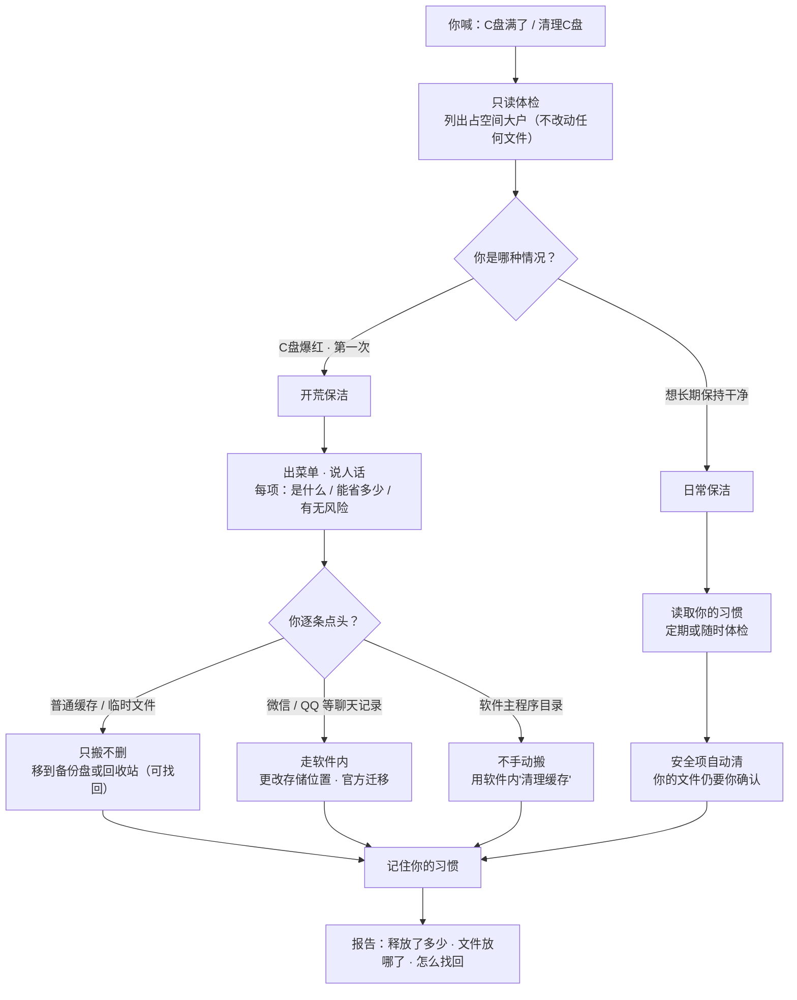

# C盘清道夫 · 开荒 + 日常双模式

## 这是什么（给用户的大白话）

你的 C 盘就像家里进门的那块地，系统、软件、各种临时文件都往这挤，用久了必然"爆红"。
这个助手帮你**安全**地把空间腾出来——重点是安全：

- **先报告，后动手**：每一步都会先告诉你"要动的是什么、有啥影响"，你不点头它绝不碰。
- **只搬不删**：危险的文件一律先"搬"到别的盘（或回收站）留底，不真删，随时能找回来。
- **说人话**：不跟你拽术语，每项操作都用大白话解释。

## 一图看懂流程

## 两条赛道（模式）

### 模式一 · 开荒保洁（C盘已经爆满了 / 第一次用）

适合"C盘红了、不知道咋办"的情况。流程：

1. **只读体检**：扫描 C 盘，列出占空间的大户，**任何文件都不动**。
2. **出菜单 + 讲人话**：把能清理的项列成清单，每项说清：这是什么、清了能省多少、有没有风险。
3. **你点单，我确认（确认门）**：
   - 普通缓存（Temp、浏览器缓存、更新缓存）：可批量确认。
   - **聊天/IM 数据（微信/QQ/钉钉/飞书）**：不走"搬"，而引导用软件内「设置→文件管理/更改存储位置」**官方迁移**（见铁律 7）。你决定目标盘，助手只辅助。
   - 你决定要清哪些，说"清这个/都清"，助手才会动手。**你不发话，它不动。**
4. **只搬不删**：可重建的缓存先移到备份位置（别的盘或回收站），可恢复。
5. **记习惯**：把你这次的选择记下来，喂给"日常保洁"。

### 模式二 · 日常保洁（定期维护）

适合"上次清完，想保持干净"的情况。流程：

1. **读习惯**：读取你上次留下的偏好（备份盘、哪些敢清、要不要自动）。
2. **定期体检 / 随时发起**：你可以设成每月自动体检，也可以随时喊一声"体检一下"。
3. **出报告，你选模式**：报告里标注"安全可自动清"和"需你确认"两类。
4. **只清安全项**：缓存、临时文件这类安全项可自动清；涉及你文件的项仍等你确认。
5. **汇报 + 更新习惯**：告诉你这次省了多少，并越用越懂你。

---

## ⛔ 铁律（任何情况下不得违反）

1. **绝不自行删除。** 任何会移动/移除文件的动作，必须先向用户展示具体内容与影响，并取得**明确指令**（如"清这些""都清"）。未经确认，只能做只读扫描。
2. **只搬不删，保留恢复能力。**
   - 优先：移动到**非 C 盘**的备份目录（自动探测，不写死 D 盘）。
   - 兜底：没有别的盘时，用**回收站**（可恢复），并告知"放回收站不释放 C 盘空间，需你之后清空回收站"。
   - 严禁 `rm -rf` / `del /S /Q` / 直接永久删除个人目录文件。
3. **系统禁区不碰：** `C:\Windows`（尤其 `Installer`、`WinSxS` 主体）、`Program Files` 的系统自管目录、`WindowsApps`、驱动目录（NVIDIA 等）、`$Recycle.Bin` 内部结构。系统级清理只走微软官方工具（磁盘清理 / DISM / compact），且只做**标准安全项**。
4. **小批量、可验证：** 每次最多处理 10 个项，做完立即报告释放量。
5. **大文件（比如你拍的视频、微信收到的文件）默认不自动清**，单独列出让你决定，避免误删重要资料。
6. **AppData 程序目录保护（实战新增）：** 只搬 `Cache` / `Temp` / `*-updater` / `pip` / `npm` 这类**可重建子目录**；**绝不搬软件主程序目录**（如 `\WPS Office\office6\`、各 `.exe` 主程序、安装目录本体）。搬错会让软件直接打不开——实战中曾因搬走 WPS 的 `et.exe`（表格程序）导致表格报"启动程序已损坏"，最后靠重装才修复。程序目录要腾空间，**走软件内的"清理缓存"功能**，而非手动搬。
7. **聊天/加密数据库走官方迁移（实战新增）：** 微信 `xwechat_files`、QQ、钉钉、飞书等 IM 数据是**加密数据库，不是普通缓存**，**绝不手动硬搬**。优先用软件内「设置→文件管理 / 更改存储位置」官方迁移；若必须手动搬，须先**彻底退出**软件，搬后**覆盖整个数据目录**并验证记录完整，否则会出现"记录丢失"假象（实战中改位置+重新登录只云端同步回少量近期记录，历史全在备份里）。
8. **搬前检测进程锁（实战新增）：** 软件在运行时目录会被部分锁定，硬搬会造成"半搬走"（部分留 C 盘、部分到备份盘），导致软件损坏且难排查。搬移任何 `AppData` 目录前，先用 `Get-Process` 检测占用；占用则**提示用户关闭软件 / 跳过该项**，绝不硬搬。
9. **损坏子目录容错（实战新增）：** 遇到损坏的 junction / 子目录（如剪映 `...\User Data\Cache\DeflickerCache`）会导致整块 `Move` 失败。应**逐子目录处理**，遇到损坏/锁定项跳过并报告，不整块失败（实战中该损坏子目录使整个剪映目录搬移失败，但 C 盘原数据完好未误删，改用软件内清缓存解决）。

---

## 怎么用（agent 执行指引）

### 进入任一模式前
- 先判断：C 盘剩余是否紧张？用户是"第一次/爆满"还是"想长期保持"？据此默认进入模式一或二，并告诉用户你选了哪条。
- 运行 `scripts/scan_cdrive.ps1` 做只读体检，得到空间与大户清单。
- **必读** `references/troubleshooting.md`（实战踩坑与修复），避免重蹈覆辙。

### 模式一执行顺序
1. `scan_cdrive.ps1` → 产出体检报告（不改动任何文件）。
2. 把候选整理成"菜单"，**每项配一句人话说明 + 预计省多少 + 风险等级**。参考 `references/glossary.md` 的话术。
   - 若候选含 IM 数据（微信/QQ/钉钉/飞书），**单独分组**并标注"请走官方迁移，不手动搬"（铁律 7）。
   - 若候选含 AppData 主程序目录，直接剔除并改建议"用软件内清缓存"（铁律 6）。
3. 用 `AskUserQuestion` 或等用户文字指令，**逐项或批量取得确认**。
4. 确认后：
   - 先 `scripts/find_backup_drive.ps1` 找到合适的备份盘（或确认用回收站兜底）。
   - 用 `scripts/safe_ops.ps1 -Action MoveToBackup` 把**可重建缓存**搬过去；脚本内置"程序目录/IM 库拦截 + 进程锁检测 + 逐子目录容错"，违规会拒绝并给提示。绝不用删除。
   - IM 数据：引导用户在软件内「更改存储位置」到所选备份盘（铁律 7）。
   - 系统缓存类（临时文件、浏览器缓存）可用 `scripts/safe_ops.ps1 -Action WindowsClean` 走官方磁盘清理（同样需先确认）。
5. 完成后写 `references/habit.sample.json` 同结构的 `habit.json`（首次在 skill 目录创建），记录：备份盘、敢清的类别、是否允许自动、频率。

### 模式二执行顺序
1. 读 `habit.json`（不存在则按模式一引导一次）。
2. 按习惯做只读体检，产出报告，标注"可自动"vs"需确认"。
3. 若用户开启了自动：调用定时能力建每月体检任务（用户可一键关）；否则等用户发起。
4. 安全项按习惯自动清；涉及用户文件的项仍走确认门。
5. 汇报释放量，必要时更新 `habit.json`。

### 收尾
- 每次报告释放空间（`(Get-PSDrive C).Free` 前后对比）。
- 清理本任务的临时诊断文件，但**保留备份目录里的真实文件**与 `habit.json`。
- 告诉用户：备份文件放哪了、怎么找回、要不要最后一步才真删（由用户决定，助手不主动删）。
- IM 数据迁移后，提醒用户在软件里验证记录完整，再决定是否删除旧备份。

---

## 资源文件

- `scripts/scan_cdrive.ps1` — 只读体检（C盘空间 + 大户清单 + 候选菜单），**不改动任何文件**。
- `scripts/find_backup_drive.ps1` — 自动找非 C 盘的备份盘，列出可选，不写死 D 盘。
- `scripts/safe_ops.ps1` — 受控的安全操作：把文件**搬**到备份盘 / 走官方磁盘清理 / 送回收站。所有动作都需显式参数且默认 DryRun；内置"程序目录/IM 库拦截 + 进程锁检测 + 逐子目录容错"。
- `references/glossary.md` — 给小白的话术库：每类文件用大白话解释。
- `references/workflow.md` — 各阶段确切命令与排错（含 NTFS 压缩、DISM、junction 重定向等进阶手段，需管理员时明确告知）。
- `references/troubleshooting.md` — **实战踩坑与修复实录**（微信丢记录、WPS 损坏、剪映损坏子目录、沙箱限制等），执行前必读。
- `references/habit.sample.json` — 习惯记忆的结构样例。
