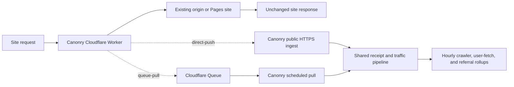

# Server-side traffic (AI Visibility — Server-Side)

Server-side traffic ingestion captures **what AI engines actually do at
your site** — bots crawling pages, AI products fetching pages for users,
and AI products sending click-through arrivals. Citation data measures
**what models say** about you. The two surfaces are independent.

## When to use it

Reach for server-side traffic when an analyst or operator asks:

- *"Is GPTBot / ClaudeBot / PerplexityBot actually fetching my pages?"*
- *"Did an AI product fetch this page for a user?"*
- *"Which paths are AI engines paying attention to?"*
- *"Are users clicking through from chatgpt.com / claude.ai / etc.?"*
- *"My citation rate is fine but there's no traffic — why?"*

GA4 referrals (chatgpt.com → your site) catch click-throughs after they
land. Server logs catch the upstream bot activity AND referrals at the
edge — including arrivals GA4 missed because of cookie consent, ad
blockers, or analytics gaps.

## Architecture

Four tables store the shared output from every adapter:

| Table | What's in it |
|---|---|
| `crawler_events_hourly` | One row per `(project, source, hour, bot, verification, path, status)` — bot crawls rolled up by hour |
| `ai_user_fetch_events_hourly` | One row per `(project, source, hour, bot, verification, path, status)` — user-initiated AI fetches rolled up by hour |
| `ai_referral_events_hourly` | One row per `(project, source, hour, product, source_domain, evidence_type, landing_path, status)` — click-through arrivals rolled up by hour |
| `raw_event_samples` | Bounded forensic samples for spot checks. Source writes plus a startup/daily global sweep enforce 30-day retention; Cloudflare also uses a per-source, per-hour cap |

Each `traffic_sources` row is one server-log integration for a project.
Adapters today:

| Adapter | Transport | Source | Best for |
|---|---|---|---|
| [`cloud-run`](#connecting-a-cloud-run-source) | Pull | GCP Cloud Run request logs via Logging API | Any service running on Cloud Run |
| [`wordpress`](#connecting-a-wordpress-source) | Pull | Canonry Traffic Logger REST endpoint | WordPress sites where you control wp-admin |
| [`vercel`](#connecting-a-vercel-source) | Pull | Vercel project logs via the Vercel API | Sites deployed on Vercel |
| [`cloudflare`](#connecting-a-cloudflare-source) | Direct push or Queue pull | A zone Worker selects edge events; Canonry either receives them directly or pulls them from Cloudflare Queues | Sites whose public traffic passes through Cloudflare |

Future adapters slot in by implementing the same contract.
Cloud Run, WordPress, Vercel, and Cloudflare Queue sources pull during
`traffic sync`. Cloudflare direct push sends selected events from its Worker
and does not use `traffic sync`.

## Connecting a Cloud Run source

```bash
# 1. Create a service account in the Cloud project that hosts the Cloud Run
#    service. Grant it `roles/logging.viewer`. Download the JSON key.

# 2. Connect from cnry CLI:
cnry traffic connect cloud-run <project> \
  --gcp-project <gcp-project-id> \
  --service-account-key <path/to/key.json>

# 3. (Optional) narrow to a specific service or location:
cnry traffic connect cloud-run <project> \
  --gcp-project <id> \
  --service-account-key <path> \
  --service my-service-name \
  --location us-east1
```

Credentials are stored in `~/.canonry/config.yaml` (not the DB). The
canonical key lives only on the host that runs `cnry serve`. The
sync flow does NOT echo the private key back in any response.

## Connecting a WordPress source

The WordPress adapter pulls events from the **Canonry Traffic Logger**
WordPress plugin, which is PHP-only: it captures non-admin GET page-loads
**that reach PHP** and exposes a paginated REST endpoint protected by an
Application Password. It has no browser-side capture path.

> **Cache blind spot.** Cache-served requests never execute PHP, so they
> produce no plugin event. A full-page cache (LiteSpeed, WP Rocket, W3 Total
> Cache, WP Super Cache) or any CDN can therefore make the source look active
> while real page views, AI crawlers, and live AI user-fetches such as
> `Claude-User` and `ChatGPT-User` go uncounted. To use this source for
> AI-agent traffic, bypass **every** cache layer for the selected AI user
> agents, or capture from access/edge logs instead.

**Which user-agents to exclude from the cache** (one per line in
LiteSpeed's "Do Not Cache User Agents", WP Rocket's
`rocket_cache_reject_ua`, or W3TC / WP Super Cache "Rejected User
Agents"):

```
GPTBot
OAI-SearchBot
OAI-AdsBot
ChatGPT-User
openai-mcp
ClaudeBot
Claude-
anthropic-ai
PerplexityBot
Perplexity-User
ShapBot
Shap-User
Google-Agent
Google-GeminiNotebook
Google-NotebookLM
Google-CloudVertexBot
Bytespider
Applebot
meta-externalagent
CCBot
cohere-ai
Diffbot
MistralAI-User
MistralAI-Index
MistralAI-Training
MistralBot
DeepSeekBot
xAI-Bot
Grok-Bot
GrokBot
YouBot
DuckAssistBot
Amazonbot
Amzn-SearchBot
Amzn-User
```

This list mirrors Canonry's current classifier: answer-engine user-fetch,
crawl, search, and training agents for which WordPress has no cache-independent
measurement surface. `ClaudeBot` covers Anthropic's unhyphenated core crawler;
`Claude-` is a separate family rule so newly named `Claude-*Bot` variants
inherit the bypass. Do NOT add traditional search agents
`Googlebot`, `bingbot`, `DuckDuckBot`, `YandexBot`, or `Baiduspider`: caching
helps them crawl efficiently, and the important Google/Bing crawl evidence is
available through their webmaster tools.

> **1.1.0 -> 1.1.1 measurement boundary.** Plugin 1.1.0 briefly added a
> JavaScript beacon to recover browser/referral page views served from cache.
> Plugin 1.1.1 removes it and returns to PHP-only capture. This intentionally
> means cache-served browser referrals can again be absent even when GA4
> reports sessions; neither version made cache-served crawler requests visible
> to PHP. Annotate the upgrade time, do not interpret a trend spanning it as
> like-for-like traffic, and purge HTML from both the WordPress cache and every
> outer CDN. A temporary `/wp-json/canonry/v1/pv` compatibility route returns
> `204` for scripts stranded in old cached HTML, but never records an event.

```bash
# 1. Install the plugin. Download the latest release zip from the
#    canonry-traffic-logger plugin's GitHub release (the repo CI workflow
#    publishes a zip on every plugin-file change), then in wp-admin:
#    Plugins → Add New → Upload Plugin → upload + activate.

# 2. In wp-admin, create an Application Password for the operator user:
#    Users → Profile → Application Passwords. Copy the generated password.

# 3. (Optional) Adjust settings at Settings → Canonry Traffic Logger:
#    - Retention window: clamps to 7-365 days, default 90.
#    - "Behind a proxy or CDN": enable this when the site sits behind
#      Cloudflare or another reverse proxy, so the real visitor IP
#      (needed to verify AI-bot hits) is read from forwarded headers
#      rather than the proxy's edge address.
#    The page also shows the current event count and oldest event.

# 4. Connect from cnry CLI:
cnry traffic connect wordpress <project> \
  --url https://example.com \
  --username admin \
  --app-password "xxxx xxxx xxxx xxxx xxxx xxxx"
```

What the events table looks like (mirrors the TS
`WordpressTrafficEventPayload`):

| Column | Meaning |
|---|---|
| `observed_at` | ISO 8601 UTC timestamp with millisecond precision |
| `method`, `host`, `path`, `query_string` | Split `REQUEST_URI` parts |
| `status` | HTTP response status code |
| `user_agent`, `referer` | Headers as captured at request time |
| `remote_ip` | Client IP address (IPv4 or IPv6), or empty when none was captured |

The plugin auto-prunes events older than the retention window (default
90 days) once per day via WP-Cron. Operators who want a different
window change it in `Settings → Canonry Traffic Logger`.

### WordPress incremental-window safety

Each incremental WordPress sync uses one fixed half-open `[since, until)`
window. A fresh source, or an idle source without an explicit
`--since-minutes`, starts with a 365-day horizon, matching the plugin's
maximum configurable retention. A site configured for less retention simply
returns its available tail. If the window needs more than one capped drain,
Canonry persists both its lower and upper bounds with the continuation cursor
and retries that exact interval until the plugin reports it is terminal. It
then advances the normal watermark. Every returned event is validated against
the requested interval; an older or custom extension that ignores `since` or
`until` fails closed before any rollup is written. Update that extension to a
bounded-window-capable Canonry traffic logger before syncing again.

Do not run generic replace-mode backfill for a WordPress source. The plugin
prunes retained events and cannot prove that it covers every bucket a replace
transaction would delete, even when no continuation is pending. Canonry
rejects that generic path universally. Keep existing rollups intact, use a
retention-aware repair, and explicitly declare any unrecoverable portion before
reporting a historical trend.

After upgrading from the former unbounded WordPress sync, a source with an old
continuation cursor is intentionally rejected rather than guessed at. Keep its
schedule paused, record the ambiguous historical span, then use the explicit
reset below to start fresh. Reset stops future replay; it does not repair past
rollups. Generic WordPress replace-mode backfill remains unavailable until a
retention-aware repair can establish coverage.

Reconnecting with a different WordPress `baseUrl` archives the old source and
creates a fresh one. Its existing rollups and any unrecovered marker remain
with the old lineage rather than mixing with the new endpoint's traffic.

## Connecting a Vercel source

The Vercel adapter pulls per-request logs from the Vercel API for a
specific project + environment. Logs are filtered by canonical domain
before classification so a multi-tenant Vercel project only surfaces
hits for the tracked site.

```bash
# 1. In the Vercel dashboard, create a token with read access to the
#    target team (Settings → Tokens → Create). Note the team ID
#    (Settings → General → Team ID) and the Vercel project ID
#    (Project → Settings → General → Project ID).

# 2. Connect from cnry CLI:
cnry traffic connect vercel <project> \
  --project-id prj_xxxxxxxx \
  --team-id   team_xxxxxxxx \
  --token     <vercel-token>            # or: --token-file <path>

# 3. (Optional) scope to a specific environment (default: production):
cnry traffic connect vercel <project> \
  --project-id prj_xxx --team-id team_xxx --token ... \
  --environment preview
```

Credentials live in `~/.canonry/config.yaml` under `vercelTraffic:`,
mirroring the cloud-run / wordpress blocks. The adapter classifies bot
crawls + AI-referral arrivals into the same `crawler_events_hourly` /
`ai_referral_events_hourly` tables — downstream commands
(`cnry traffic events / sources / status`) are source-agnostic.

### Vercel first-sync window (gotcha)

A new Vercel source captures **only going-forward traffic** by default.
`cnry traffic connect vercel` seeds `lastSyncedAt = NOW` so the first
scheduled sync uses a tight window inside Vercel's ~14-day
`request-logs` retention. Without this, the first sync would fall back
to a 30-day window, exceed retention, and throw — leaving the source
permanently stuck.

Run `cnry traffic backfill <project> --source <id> --days N` (capped at
~14 to stay inside retention) if you need any of the pre-connect
history. It's an explicit operator action; the connect flow never pulls
it implicitly.

## Connecting a Cloudflare source

Both Cloudflare modes run the same small ES-module Worker on the site's exact
zone route. It applies a broad AI filter and delivers selected edge events in
`ctx.waitUntil()`. The origin response remains independent from filtering,
scheduling, and delivery errors. Both modes use the same
`CloudflareEdgeEventBatch`, normalizer, classifier, receipts, and rollups.

- `direct-push` sends a signed batch to a public Canonry HTTPS receiver.
- `queue-pull` sends the batch to a Cloudflare Queue. The single-team Canonry
  server pulls and acknowledges it through the Cloudflare Queues HTTP API.

The adapter does not pull Cloudflare analytics or request logs.



### Setup flow

1. Create or select a Canonry project with one exact canonical hostname.
2. Choose delivery: direct push needs a stable public Canonry HTTPS URL outside
   the site route; Queue pull needs a pre-created Queue and HTTP pull consumer.
3. Authenticate Wrangler with the Cloudflare account that owns the zone.
4. Inspect existing Worker routes for the exact canonical hostname.
5. **Size the request volume** (see below) and decide whether an
   asset-exclusion route is needed.
6. Run the local Cloudflare connect command with `--deploy`.
7. Attach the printed route in Cloudflare and set it to **Fail open** — it
   defaults to OFF.
8. Attach the asset-exclusion route if step 5 called for one.
9. Activate the source and set a `traffic-sync` schedule. Connect syncs once
   and does not schedule; use `*/15 * * * *`, not daily, so a failed sync can
   still recover inside the queue's retention window.
10. Send the smoke requests and run the Canonry doctor.

A full operator walkthrough with copy-paste commands lives in
`docs/cloudflare-traffic-setup.md`.

### Current support boundary

Both modes currently target one local, single-team `canonry serve` instance.
The Queue consumer is not a multi-tenant Cloudflare control plane. The CLI and
server must read the same `~/.canonry/config.yaml` credential store. Direct
push requires a stable public HTTPS receiver; Queue pull does not.

The Cloud Run `apps/api` service has no Cloudflare credential store.
Therefore, `apps/api` cannot retain direct-push bearer/HMAC values or the
Queue API token.

CAUTION: Use one authoritative server-traffic source for the canonical site.
Connecting any adapter while a sibling source is active creates or keeps a
paused staged source. `canonry traffic activate` validates the target's local
credential, atomically pauses every sibling, and moves or removes the one
traffic-sync schedule. Overlapping adapters outside this cutover can still
double-count project totals.

### Expose the Canonry receiver (direct push only)

Complete the local dashboard setup and set its password before you expose
Canonry. A tunnel makes the loopback server reachable from the public Internet.

Use a named Cloudflare Tunnel or another stable reverse proxy:

```text
https://canonry-ops.example.net
  -> stable tunnel or reverse proxy
  -> http://127.0.0.1:4100
```

Then complete these steps:

1. Back up `~/.canonry/config.yaml`.
2. Set `publicUrl` to the external Canonry URL.
3. If Canonry uses a base path, include that path in `publicUrl`.
4. Restart `canonry serve`.
5. Send an unsigned request to the ingest path from the public Internet.
6. Make sure that the response status is `401`.

```yaml
publicUrl: https://canonry-ops.example.net
```

```bash
CANONRY_PUBLIC_URL=https://canonry-ops.example.net

curl -sS -o /dev/null -w '%{http_code}\n' \
  -X POST -H 'content-type: application/json' --data '{}' \
  "${CANONRY_PUBLIC_URL%/}/api/v1/projects/<project>/traffic/cloudflare/ingest"
```

The `401` response proves that the request reached Canonry's transport
authentication. A `403` can mean that Cloudflare Access or a WAF rule blocked
the request first. Exempt only the exact ingest path from interactive
challenges. Keep the rest of Canonry behind its normal access controls.

Do not use a random TryCloudflare URL for production. The Worker stores the
ingest URL at deployment time. If a temporary URL changes, rerun connect and
redeploy the Worker.

The public URL is the Canonry receiver, not the tracked site. Use a different
hostname from the generated Worker route. Do not add credentials, a query, or
a fragment to this URL.

### Prerequisites and route preflight

1. Install a current Wrangler release.
2. Run `wrangler login`.
   If Wrangler lists multiple accounts, pass the exact `--account-id`.
3. Run `wrangler whoami` to get the account ID.
4. Get the zone ID from the Cloudflare zone Overview page.
5. Make sure that the zone belongs to the selected account.
6. Make sure that Cloudflare proxies the canonical hostname in DNS.
7. Inspect every Worker route that overlaps the canonical hostname. Cloudflare
   uses the most-specific matching route. Record any excluded path coverage.
8. Make sure that `<canonical-host>/*` is unclaimed. If a more-specific route
   must remain, integrate Canonry there or accept that those paths are absent.
9. If another Worker owns the catch-all route, stop. Integrate Canonry into that
   Worker instead of attaching a second Worker.
10. Review the account request volume. A route invokes the Worker for every
   matching request. The filter does not reduce Worker invocations.

### Sizing the route before you attach it

"Review the account request volume" is not a judgement call. Compute it:

```
sessions/day  x  pageviews/session  x  SAME-ORIGIN requests/pageview
```

Only same-origin requests count. Assets on a third-party CDN never reach the
zone and never invoke the Worker. Count them on one real page:

```bash
curl -s https://<host>/ \
  | grep -oE '(src|href)="/[^"]+\.(js|css|woff2?|png|jpg|svg)"' | wc -l
```

A JavaScript app will exceed the Workers Free allowance (100,000 requests/day,
account-wide) by a wide margin, because the HTML is one request and the bundle
is dozens. Measured on a Nuxt storefront: 7,238 sessions/day and 27 same-origin
`/_nuxt/*` assets per page projected 200k-400k/day, and the deployed Worker
logged 958 invocations in 4 minutes (~345k/day). Images were on
`cdn.shopify.com` and cost nothing.

Attach an asset-exclusion route unless the site is server-rendered with few
same-origin assets, or the account is on Workers Paid.

### Excluding static assets from the route

A route with NO script disables Workers on that path, and Cloudflare applies
the most specific match. This removes the bundle without losing any crawler
evidence, because crawlers request pages, not JS chunks.

```bash
# assets -> no worker. Omitting "script" is what disables it.
curl -s -X POST -H "Authorization: Bearer $CF_TOKEN" -H "Content-Type: application/json" \
  --data '{"pattern":"<host>/_nuxt/*"}' \
  "https://api.cloudflare.com/client/v4/zones/$ZONE/workers/routes"
```

Prefixes by framework: `/_nuxt/*` Nuxt, `/_next/*` Next.js, plus `/assets/*`,
`/static/*`, `/build/*`.

**The Worker's own "Domains and Routes" tab cannot do this.** That screen only
attaches routes TO that Worker, so adding the asset path there routes assets
INTO the Worker and doubles the load. Asset exclusion is zone-level: the zone's
Workers Routes page, or the API above.

### Fail open defaults to OFF

`request_limit_fail_open` is per route and defaults to `false`. Left off, a
Worker error or an exhausted request allowance returns 5xx for every request on
that route, which on a catch-all is the whole site. Setting it is not optional
and it is not the default, so verify rather than assume:

```bash
curl -s -H "Authorization: Bearer $CF_TOKEN" \
  "https://api.cloudflare.com/client/v4/zones/$ZONE/workers/routes" \
  | jq '.result[] | {pattern, script, request_limit_fail_open}'
```

Both route operations need `Zone | Workers Routes | Edit` on the token.

```bash
npm install -g wrangler@latest
wrangler login
wrangler whoami
```

Canonry does not pass a `--profile` option to Wrangler. Wrangler uses the auth
profile that is active for the current directory, or its default profile. If
you use named profiles, activate one before you run Canonry:

```bash
wrangler auth list
wrangler auth activate <profile> .
wrangler whoami --json
```

The project must already exist. Use a bare public hostname such as
`www.example.com` for its canonical domain. `--zone-id` is mandatory with
`--deploy`. You can omit `--account-id` when the active profile has one account.

The generated route covers only the project's exact canonical hostname. It
does not also cover `www` or the apex. Test and redirect the other hostname
separately.

A Worker Route can run in front of a Cloudflare Pages custom domain. If the
origin is another Worker, use a Custom Domain or integrate Canonry into that
Worker. A same-zone Worker Route cannot be the target of `fetch()`.

Workers Free includes 100,000 requests per account each day. The quota
resets at midnight UTC. A fail-closed route returns Cloudflare error 1027
after the account exhausts this quota. A fail-open route bypasses the
Worker and keeps the origin available. See [Cloudflare Workers limits](https://developers.cloudflare.com/workers/platform/limits/).

Free-plan classification uses user-agent, referer, and UTM evidence. Granular
`request.cf.botManagement` scores require the Enterprise Bot Management add-on.

### Generate or deploy direct push

```bash
# Generate secret-free worker.js and wrangler.toml in
# ./canonry-cloudflare-<project-slug>:
cnry traffic connect cloudflare <project> \
  --delivery-mode direct-push \
  --zone-id <cloudflare-zone-id> \
  --account-id <cloudflare-account-id>

# Deploy only the Worker after the route preflight.
# Both safety acknowledgements are mandatory:
cnry traffic connect cloudflare <project> \
  --delivery-mode direct-push \
  --zone-id <cloudflare-zone-id> \
  --account-id <cloudflare-account-id> \
  --deploy --confirm-route --confirm-fail-open

# Optional artifact directory / source label:
cnry traffic connect cloudflare <project> \
  --display-name "Cloudflare · production" \
  --output-dir ./infra/canonry-cloudflare
```

`--confirm-route` acknowledges that you inspected the exact route.
`--confirm-fail-open` acknowledges that you will configure the required route
toggle. Canonry does not persist these flags. Neither flag changes Cloudflare.

The command prints the source ID, artifact directory, and manual route steps.
Keep the source ID for the acceptance test and later diagnosis.

With `--deploy`, Canonry checks Wrangler before it connects the source. The
preflight uses `--dry-run --secrets-file ... --strict` to parse and bundle
representative generated artifacts. An incompatible Wrangler stops this step
before Canonry changes state. The generated `[secrets].required` table is an
[official Wrangler safety check](https://developers.cloudflare.com/changelog/post/2026-03-24-secrets-config-property/);
it does not contain secret values.

The generated TOML never declares `[[routes]]`. Thus, Wrangler deploys the
Worker without placing it on production traffic. After deployment, open
Cloudflare Dashboard and complete these steps:

1. Open **Workers & Pages → Overview** and select the generated Worker.
2. Open **Settings → Domains & Routes → Add → Route**.
3. Select the zone and enter the exact `<canonical-host>/*` route.
4. Set **Request limit failure mode** to **Fail open**.
5. Add the route.

Wrangler cannot configure the failure-mode toggle.

The generated source and TOML contain no credential values. Non-secret
configuration values are Worker vars. The `--account-id` option makes
connect write `account_id` at the top level.

The bearer and HMAC values stay in the local Canonry credential store.
They become `CANONRY_BEARER_TOKEN` and `CANONRY_HMAC_SECRET` Worker
secrets. With `--deploy`, the CLI uses a mode-0600 temporary secrets file.
Then it invokes Wrangler with `--secrets-file ... --strict` and removes
the file.

Rerun the same connect command to update an old generated Worker. Canonry
atomically replaces recognizable Canonry-generated files. It refuses
operator-owned files and symlinks. Therefore, doctor remediation does not
require manual file deletion.

Wrangler preflight failures occur before Canonry creates a source. Artifact or
deployment failures can occur after source creation. Rerun the same command
with the same output directory. Canonry reuses the source and its credentials.

Cloudflare connect is absent from MCP because deployment reads local
secrets. An agent can guide the CLI command. It must not request, print,
or send either secret through chat.

### Generate or deploy Queue pull

Queue pull reuses the same edge filter without requiring a public Canonry
receiver. Create the Queue first. Then use `wrangler queues info` to get its ID.
Create a Cloudflare API token with **Account Queues Edit** for the owning
account. Put only the token in a mode-0600 file. Keep that file off shell argv.

```bash
wrangler queues create canonry-traffic-<project>

# Workers Paid only: use this command to change the four-day default.
wrangler queues update canonry-traffic-<project> \
  --message-retention-period-secs <seconds>

wrangler queues info canonry-traffic-<project>
wrangler queues consumer http add canonry-traffic-<project>

cnry traffic connect cloudflare <project> \
  --delivery-mode queue-pull \
  --zone-id <cloudflare-zone-id> \
  --account-id <cloudflare-account-id> \
  --queue-id <cloudflare-queue-id> \
  --queue-name canonry-traffic-<project> \
  --api-token-file <path-to-mode-0600-token-file> \
  --retention-seconds <actual-queue-retention-seconds>

cnry traffic connect cloudflare <project> \
  --delivery-mode queue-pull \
  --zone-id <cloudflare-zone-id> \
  --account-id <cloudflare-account-id> \
  --queue-id <cloudflare-queue-id> \
  --queue-name canonry-traffic-<project> \
  --api-token-file <path-to-token-file> \
  --retention-seconds <actual-queue-retention-seconds> \
  --deploy --confirm-route --confirm-fail-open
```

Read the Queue ID from the `wrangler queues info` output. Pass that exact value
to `--queue-id`.

The `queues update` command sets Cloudflare retention on Workers Paid. The
Canonry `--retention-seconds` option only records the actual value. It does not
change the Queue. Use `86400` for Workers Free, where retention is fixed at one
day. Workers Paid defaults to `345600` (four days). Paid accounts accept values
from 60 seconds through 14 days. If you change the paid Queue, use the same
value in both commands. See Cloudflare's [Queue limits](https://developers.cloudflare.com/queues/platform/limits/).

The HTTP-consumer command is required. The producer binding does not enable
HTTP pull. Cloudflare does not support an HTTP pull consumer in
`wrangler.toml`. Remove any existing Worker consumer before you enable HTTP
pull. One Queue cannot use both consumer types at the same time. See
Cloudflare's [pull-consumer setup](https://developers.cloudflare.com/queues/configuration/pull-consumers/).

The token stays only in Canonry's local credential store. It is not written to
the source row, Worker, TOML, command output, MCP, or Worker bindings. Wrangler
authentication remains the operator's active Wrangler profile. Canonry does
not reuse the Queue pull token for deployment.

The generated TOML contains one `[[queues.producers]]` binding named
`CANONRY_TRAFFIC_QUEUE` and no direct-push ingest URL or Worker secrets. After
the Worker is deployed and the route is ready, activate a staged source:

```bash
cnry traffic activate <project> --source <source-id>
cnry traffic sync <project> --source <source-id>
```

A new project with no other active traffic source activates immediately. A
mode change stays paused until the explicit activation command. Activation
pauses the prior source and points the project's one `traffic-sync` schedule at
Queue pull; activating direct push removes that Queue schedule.

For Queue-to-direct rollback, drain Queue pull until its backlog is empty,
switch the Cloudflare route, then activate direct push immediately. The route
change and Canonry activation are separate operator actions, so keep the
cutover window short.

### Queue-pull acceptance test

Use this test after the Queue-pull source is active and the Worker route is
attached. The UTM request provides a deterministic classification signal.
If connect reports `activationRequired`, activate the source before this test:

```bash
cnry traffic activate <project> --source <source-id>
```

```bash
CANONRY_QUEUE_SMOKE_PATH="/canonry-cloudflare-queue-smoke/$(date -u +%Y%m%dT%H%M%SZ)"

curl -sS -o /dev/null -w '%{http_code}\n' \
  "https://www.example.com${CANONRY_QUEUE_SMOKE_PATH}?utm_source=chatgpt"

sleep 2
cnry traffic sync <project> --source <source-id>
cnry traffic events <project> --source <source-id> \
  --kind all --since-minutes 120 --limit 5000 --format json
cnry traffic status <project> --format json
cnry doctor --project <project> --check 'traffic.source.*' --format json
```

The manual sync must complete. The events output must contain the unique smoke
path as an AI referral. The status output shows `queueBacklogCount` and
`queueBacklogObservedAt`. The doctor must not report a credential failure. If
the path is absent, wait two seconds and repeat the sync up to ten times.

### Direct-push behavior and smoke test

The Worker forwards a request candidate when at least one condition is true:

- Its user-agent matches a known AI crawler or user-fetch agent.
- Its user-agent contains the broad `bot`, `crawler`, or `spider` keyword.
- Its referer or `utm_source` matches a known AI product.
- Bot Management marks it as verified or gives it a score below 30.

The shared Canonry classifier makes the strict classification after delivery.
Thus, the broad edge filter can send a candidate that produces no rollup.

Direct push observes only requests that reach this Worker. A terminating
Access, WAF, bot-protection, or AI Crawl Control action can stop a request first.
For a crawler smoke test, use a narrow exception for only the smoke path when
the site's security policy permits it. Do not disable site-wide protection.

Direct push has bounded retries for network failures and HTTP 408, 425,
429, and 5xx responses (250 ms, then 1 s). Delivery is asynchronous and
never changes the site's response. If Canonry remains unavailable after
the retry budget, the selected event is lost. Direct push has no durable
edge buffer. Use Queue pull when delivery needs a durable edge buffer.

The receiver accepts at most 256 KiB per request. Its default budgets are
6,000 requests per minute for each source and each caller IP. A bearer token
and HMAC protect the route. The HMAC timestamp window is five minutes. A
transactional receipt protects each event ID for ten minutes. Receipt claims,
hourly rollups, samples, and source progress commit in one transaction.

Direct push sends one selected event per batch. It does not batch or sample at
the edge. Canonry stores at most 100 raw samples per source per UTC hour, while
it continues to add all classified events to hourly rollups.

The Worker transports the raw client IP, full query string, and full referer
URL for classification. Canonry does not persist these raw values. Raw samples
store `ipHash: null`, a normalized path without its query, and only the referer
host. A later privacy change can send only the query parameters that the
classifier requires.

Raw samples retain the user-agent and normalized path. Do not put personal
data in URL paths. Canonry replaces numeric, UUID, and long hexadecimal path
segments with `:id`, but it retains other path segments.

### Direct-push acceptance test

1. Choose a stable, harmless origin path and create a unique smoke-run name.
2. Before route attachment, capture the origin response and source rollups.
3. Attach the exact route with **Fail open**.
4. Capture the origin response again. Compare its body and critical headers.
5. Send four classified requests and one negative control.
6. Poll the source rollups, inspect the unique paths, and run the doctor.

Replace the example hostname, `<project>`, and `<source-id>` before you run
these commands:

```bash
CANONRY_SMOKE_SITE=https://www.example.com
CANONRY_SMOKE_RUN=run-$(date -u +%Y%m%dT%H%M%SZ)
CANONRY_SMOKE_PREFIX=/canonry-cloudflare-smoke/$CANONRY_SMOKE_RUN
CANONRY_SMOKE_DIR=$(mktemp -d)

# Run these commands before route attachment.
curl -sS -D "$CANONRY_SMOKE_DIR/origin-before.headers" \
  -o "$CANONRY_SMOKE_DIR/origin-before.body" \
  "$CANONRY_SMOKE_SITE$CANONRY_SMOKE_PREFIX/origin"
cnry traffic events <project> --source <source-id> \
  --kind all --since-minutes 120 --limit 5000 --format json \
  > "$CANONRY_SMOKE_DIR/events-before.json"

# Stop here. Attach the exact route with Fail open, then continue.
curl -sS -D "$CANONRY_SMOKE_DIR/origin-after.headers" \
  -o "$CANONRY_SMOKE_DIR/origin-after.body" \
  "$CANONRY_SMOKE_SITE$CANONRY_SMOKE_PREFIX/origin"
grep -Ei '^(HTTP/|content-type:|cache-control:|location:)' \
  "$CANONRY_SMOKE_DIR/origin-before.headers" \
  "$CANONRY_SMOKE_DIR/origin-after.headers"
cmp "$CANONRY_SMOKE_DIR/origin-before.body" \
  "$CANONRY_SMOKE_DIR/origin-after.body"

# AI crawler
curl -sS -o /dev/null -w '%{http_code}\n' -A 'GPTBot/1.2' \
  "$CANONRY_SMOKE_SITE$CANONRY_SMOKE_PREFIX/crawler"

# AI user fetch
curl -sS -o /dev/null -w '%{http_code}\n' -A 'ChatGPT-User/1.0' \
  "$CANONRY_SMOKE_SITE$CANONRY_SMOKE_PREFIX/user-fetch"

# AI referral by referer
curl -sS -o /dev/null -w '%{http_code}\n' -A 'Mozilla/5.0 CanonrySmoke' \
  -e 'https://chatgpt.com/' \
  "$CANONRY_SMOKE_SITE$CANONRY_SMOKE_PREFIX/referral"

# AI referral by UTM
curl -sS -o /dev/null -w '%{http_code}\n' -A 'Mozilla/5.0 CanonrySmoke' \
  "$CANONRY_SMOKE_SITE$CANONRY_SMOKE_PREFIX/utm?utm_source=chatgpt"

# Negative control: this request must not add a classified traffic rollup
curl -sS -o /dev/null -w '%{http_code}\n' -A 'Mozilla/5.0 CanonrySmoke' \
  "$CANONRY_SMOKE_SITE$CANONRY_SMOKE_PREFIX/control"

# Poll until the deterministic UTM event arrives, for at most 20 seconds.
for CANONRY_SMOKE_ATTEMPT in 1 2 3 4 5 6 7 8 9 10; do
  cnry traffic events <project> --source <source-id> \
    --kind all --since-minutes 120 --limit 5000 --format json \
    > "$CANONRY_SMOKE_DIR/events-after.json"
  grep -Fq "$CANONRY_SMOKE_PREFIX/utm" \
    "$CANONRY_SMOKE_DIR/events-after.json" && break
  sleep 2
done

cat "$CANONRY_SMOKE_DIR/events-before.json"
cat "$CANONRY_SMOKE_DIR/events-after.json"

if grep -Fq "$CANONRY_SMOKE_PREFIX/control" \
  "$CANONRY_SMOKE_DIR/events-after.json"; then
  echo 'Unexpected classified control rollup'
else
  echo 'Negative control passed'
fi

cnry doctor --project <project> --check 'traffic.source.*' --format json
```

The smoke paths can return `404`. The body and critical headers must match the
no-Worker baseline. When all four selected requests reach the Worker, the
unique paths must show one crawler, one AI user fetch, and two AI referrals.
The control path must not appear in a classified rollup. On Bot Management
plans, a low bot score can still cause its transport.

The crawler request uses a spoofed user agent. It tests forwarding and
classification only. Canonry reports it as `claimed_unverified` unless the
client IP belongs to the bot's published IP ranges. If only the crawler path is
absent, inspect AI Crawl Control, Access, WAF, and other terminating rules. The
UTM request is the deterministic direct-push transport check.

The events command returns hourly rollups, not raw request records. The doctor
must report current Worker version and recent traffic.

### Staging release test

1. Cause a receiver failure. Make sure that the origin stays healthy.
2. Return HTTP `429` from staging and send a bounded bot burst.
3. Make sure that delivery stops after one request and two retries.
4. Compare p50 and p95 TTFB before and after route attachment.
5. Inspect Worker logs. Make sure that logs contain no secret values.
6. Rehearse rollback and make sure that the origin stays healthy.

A direct-push source does not use `cnry traffic sync` or a traffic-sync
schedule.

### Rollback and teardown

For a dedicated Canonry-generated Worker:

1. Detach the exact site route from the Worker.
2. Request an ordinary site page. Make sure that the origin status,
   headers, and body remain healthy.
3. If this source uses Queue pull, run manual syncs until its backlog is zero.
4. If a replacement source exists, activate it after the Queue is empty.
5. If no replacement source exists, run
   `cnry schedule remove <project> --kind traffic-sync`.
6. If this source uses Queue pull, run
   `wrangler queues consumer http remove <queue-name>`.
7. Run `wrangler delete --config <artifact-directory>/wrangler.toml`.
8. If this source uses direct push, stop its unused tunnel.
9. Run the doctor. Expect source-health warnings until Canonry supports
   Cloudflare disconnect.

CAUTION: If no other producer uses the Queue, delete it only after the drain:

```bash
wrangler queues delete <queue-name>
```

If the API token is dedicated to Canonry, revoke it after you remove the HTTP
consumer.

If Canonry code shares an existing Worker, remove only the Canonry code and
bindings. Redeploy the prior Worker version. Do not delete the shared Worker.

The current CLI and API have no Cloudflare disconnect operation. The source
row and local credential store remain after teardown. A follow-up must add
source archival and local credential cleanup.

### Cloudflare troubleshooting

| Symptom | Action |
|---|---|
| Wrangler preflight fails | Install the latest Wrangler. Run `wrangler whoami`. Then rerun connect. |
| Worker deploys to the wrong account | Make the correct Wrangler profile active. Pass the matching `--account-id`. |
| Route cannot attach | Make sure that the zone is active, DNS is proxied, and the exact route is unclaimed. Inspect every overlapping route. |
| Direct-push receiver returns `403` | Remove the Access or WAF challenge from the exact ingest path. |
| Direct-push Worker log shows ingest `401` | Rerun connect from the credential-owning host. Make sure that system clocks differ by less than five minutes. |
| No direct-push events arrive | Make sure that the route matches the exact host. Make sure that `publicUrl` is reachable. Inspect AI Crawl Control, Access, WAF, and route precedence. Then send the UTM smoke request. |
| No Queue-pull events arrive | Run `wrangler queues info <queue-name>` and `wrangler queues consumer http list <queue-name>`. Make sure that the producer binding uses that Queue. Make sure that the account ID, Queue ID, and token scope match. Then run the Queue acceptance test. |
| Queue pull returns `403` | Create a token with **Account Queues Edit** for the Queue account. Reconnect with the token file. |
| Queue backlog remains above 1,000 | Run a manual sync. If the backlog grows again, shorten the 30-minute schedule interval. |
| Some paths are absent | Inspect more-specific routes and terminating security rules. Integrate Canonry into those routes or document the excluded coverage. |
| Direct-push ingest returns `429` | Wait for the rate window. The Worker retries twice, then drops the event. |
| Site returns Cloudflare error `1027` | Set the route to **Fail open**, or detach it. The account exhausted its daily Worker requests. |
| Doctor reports stale or empty direct-push data | Do not run `traffic sync`. Inspect the route, receiver, and Worker logs. Then repeat the smoke request. |

### Queue pull delivery guarantees

Queue delivery is at least once. Canonry claims a durable source-scoped sync
lease, short-polls bounded batches, validates the transport-neutral event
schema and canonical host, and commits event receipts plus rollups in one DB
transaction. It acknowledges the Cloudflare lease only after that commit.

If acknowledgement fails after commit, Cloudflare can redeliver the batch.
The durable receipt makes the redelivery a no-op before Canonry acknowledges it
again. Unsupported V8 messages and malformed message bodies are acknowledged
as poison after their safe lease metadata is read; raw bodies and the API token
never enter errors or logs. A process crash leaves unacknowledged messages for
Cloudflare to redeliver after the visibility timeout.

The source lease rejects concurrent scheduler and operator drains. A stale
lease can be recovered after its expiry, and only its owner can release it.
Receipts remain for Cloudflare's current 14-day platform maximum plus a replay
margin. This stays safe even when the locally recorded retention is stale or
lower than the Queue's actual setting.

Each default Queue sync drains at most 10 batches of 100 messages: **1,000
messages per tick**. Doctor reports a residual of 1–1,000 messages as within
that budget. If no new messages arrive, the next scheduled sync can clear it.
Doctor warns when more than 1,000 messages remain because one default tick
cannot drain the residual. Run a manual sync to accelerate the drain. If the
backlog remains above 1,000, shorten the `traffic-sync` schedule interval.

## Syncing data

```bash
# Manual sync — pulls [lastSyncedAt, now]. For a freshly connected
# source the window is short (since connect-time NOW). For a
# regular-cadence schedule the window stays ~30 min wide.
cnry traffic sync <project> --source <id>

# Override the lookback window (minutes) — note: clamped forward to
# lastSyncedAt, so this can only NARROW the window, never widen it
# past data already pulled.
cnry traffic sync <project> --source <id> --since-minutes 4320  # 3 days
```

Cloudflare Queue pull is cursorless and ignores `--since-minutes`; each call
drains a bounded set of leased Queue messages. Repeat the command when you need
to accelerate a backlog, or let the auto-created 30-minute schedule continue
draining. Direct push still rejects `traffic sync` because it has no pull
transport.

### Unsticking a stuck source

If a Vercel (or Cloud Run) source has been failing for so long that
`lastSyncedAt` aged past the upstream retention boundary, every sync
will throw a retention error and `lastSyncedAt` will never advance —
the source is permanently stuck. Recovery:

```bash
# Advances lastSyncedAt to NOW, clears the error state. Skipped
# history is unrecoverable from the sync path; run backfill separately
# if any of it needs to be captured.
cnry traffic reset <project> --source <id> --advance-to-now
```

`--advance-to-now` is required — there is no implicit reset.

`reset` accepts any **non-archived** source type. A WordPress reset clears
its `last_cursor` and pending-window marker as well as advancing
`lastSyncedAt`, so the next bounded drain begins at the reset watermark
instead of combining it with an old cursor. The primary use case is the
retention-trap recovery above; clearing `lastError` for a transient WordPress
failure also works. Reset deliberately abandons any ambiguous pending history;
it is not a historical repair. Archived sources are rejected — re-connect them
with `cnry traffic connect ...` instead.

Time-window and cursor adapters use the `last_event_ids` overlap ring. Queue
pull uses durable event receipts sized to Queue retention. Both paths make a
repeated pull safe to schedule or trigger from CI.

## Inspecting source state

```bash
# All sources with last-24h totals + latest sync run (single-call):
cnry traffic status <project> --format json

# Just the source list:
cnry traffic sources <project> --format json

# Windowed events (defaults to last 24h):
cnry traffic events <project> --kind crawler --limit 200 --format json
cnry traffic events <project> --kind ai-referral --since 2026-04-01 --until 2026-04-30
```

The `traffic status` composite returns the same per-source detail
(24h crawler hits, AI-referral arrivals, raw-event-sample count, latest
sync-run summary) whether you reach it via the CLI, the API, or the
MCP `canonry_traffic_status` tool.

**Crawler hits are segmented by path class (#719).** On real sites the raw
`crawlerHits` total is dominated by infrastructure polling — a bot re-fetching
`sitemap_index.xml`, `robots.txt`, and static assets — which overstates how
much of your *content* is being crawled. `traffic status` and `traffic events`
therefore return, alongside the unchanged `crawlerHits` total:

- `crawlerContentHits` — crawls of actual content/document pages (the signal you
  usually want: "are bots reading my pages?").
- `crawlerInfraHits` — sitemap + robots + asset fetches.
- `crawlerSegments` — the full `{ content, sitemap, robots, asset, other }`
  breakdown; the five buckets sum to `crawlerHits`, and
  `content + infra + other == crawlerHits`. `other` captures non-page downloads
  and feeds (PDF, CSV, RSS) plus WordPress polling endpoints that are not page
  reads (`/feed`, `/<path>/feed`, `/wp-json/...`, `xmlrpc.php`, `wp-cron.php`), so
  they stay out of `crawlerContentHits`.

Each crawler row from `traffic events` also carries a `pathClass`
(`content | sitemap | robots | asset | other`). The dashboard leads with the
content figure and shows infrastructure polling as a secondary number. The
classification is read-time only (the pure `classifyTrafficPath` helper) — no
schema change, the stored rollups are untouched.

## Where the data shows up

| Surface | What's rendered |
|---|---|
| Project dashboard `/projects/:name/activity` | Live source table + 24h totals + GA4 referrals (combined view) |
| Top-level `/traffic` route | Cross-project source admin (connect, sync, archive) |
| `cnry report <project>` (HTML + SPA) | "AI Visibility — Server-Side" section, ranked above Indexing Health |
| `cnry doctor --project <name>` | Source health checks, including last-observed Worker drift for direct and Queue sources plus Queue local credential/sync state |
| MCP toolkit `traffic` | Read/status tools plus pull-source setup/sync tools. Cloudflare connect is local-CLI-only so Worker secrets cannot enter an MCP transcript. |

## Doctor signals

The doctor checks are adapter-agnostic. When they fail or warn:

| Check | Code | What to do |
|---|---|---|
| `traffic.source.connected` | `traffic.source.none` | No source — `cnry traffic connect cloud-run …` |
| `traffic.source.connected` | `traffic.source.all-errored` | Re-connect the source. The check's `details.lastError` shows the underlying reason. |
| `traffic.source.recent-data` | `traffic.recent-data.stale` | For pull sources, run `cnry traffic sync …`. For Cloudflare direct push, inspect the route and receiver. |
| `traffic.source.recent-data` | `traffic.recent-data.empty` | Inspect source configuration. For Cloudflare direct push, send the UTM smoke request and inspect Worker logs. |
| `traffic.source.queue-backlog` | `traffic.queue-backlog.within-drain-budget` | 1–1,000 Queue messages remain. If no new messages arrive, the next scheduled sync can drain them. Run a manual sync to accelerate. |
| `traffic.source.queue-backlog` | `traffic.queue-backlog.remaining` | More than 1,000 Queue messages remain. Run a manual sync. If the backlog persists, shorten the traffic-sync schedule. |
| `traffic.source.credentials` | `traffic.credentials.resolve-failed` | Reconnect from the host that owns the source credentials. Queue pull requires a non-empty Account Queues Edit token paired by source ID. |
| `traffic.source.cache-blindspot` | `traffic.cache-blindspot.wordpress-plugin` | Cache-served requests never execute PHP and produce no event, so a source can look active while real page views go uncounted. Exclude selected AI user agents from every page-cache and CDN layer, or switch to a log/edge source. Warns only, not a failure. |
| `traffic.source.worker-version` | `traffic.worker-version.waiting-for-first-event` | Send a smoke-test request through the Worker. For Queue delivery, run a sync to ingest it. Then run the doctor again. |
| `traffic.source.worker-version` | `traffic.worker-version.stale` | Regenerate and redeploy the Worker from the credential-owning host with the source's existing delivery mode, then verify the route or Queue binding. |

Cloudflare doctor behavior is capability-driven: only
`deliveryMode=direct-push` (and legacy Cloudflare rows with no mode) skips
pull-watermark lag. Both direct and Queue modes enable
`traffic.source.worker-version`. That check compares the shared current
generated version with `lastWorkerVersion`, the version on the most recently
ingested batch. It is last-observed evidence, not proof that every deployment
or queued message runs that version. Queue pull also keeps its pull-lag checks.

## Scheduling

`cnry schedule` supports `--kind traffic-sync` for pull sources. Activation of
Queue, Cloud Run, WordPress, or Vercel creates or repoints this schedule at a
30-minute cadence.
Cloudflare direct push is event-driven and must not receive a traffic-sync
schedule. Recurring syncs are safe because of the adapter's overlap ring or
durable Queue receipts.

Keep the auto-created 30-minute schedule for Queue pull. The Worker sends one
selected event in each Queue message. At its 1,000-message limit, this cadence
drains about 0.56 selected events per second. If the Queue backlog remains
above 1,000, run a manual sync. Then shorten the interval:

```bash
cnry schedule set <project> --kind traffic-sync \
  --source <source-id> --cron "*/10 * * * *"
```

Use these cadences only for Cloud Run, WordPress, and Vercel:

| Cadence | Use case |
|---|---|
| `0 */6 * * *` (every 6h) | Production agencies tracking active client sites |
| `0 0 * * *` (daily) | Lower-traffic sites or local dev |
| Manual only | First few weeks while validating data |

## Telemetry

Every successful or failed sync emits a `traffic.synced` event to the
canonry telemetry pipeline:

```jsonc
{
  "event": "traffic.synced",
  "errorCode": "PROVIDER_AUTH",       // present only when status='failed'
  "properties": {
    "status": "completed" | "failed",
    "sourceType": "cloud-run",        // adapter type
    "sourceId": "<uuid>",             // opaque
    "pulledEvents": 234,
    "crawlerHits": 200,
    "aiReferralHits": 12,
    "durationMs": 4150
  }
}
```

Counts are aggregate. The sourceId is an opaque UUID. No raw paths,
domains, or PII are surfaced.

## Limits & caveats

- **The WordPress plugin is PHP-only.** The `wordpress` adapter records only
  requests that reach PHP. Cache-served page requests, including AI crawlers
  and live AI user-fetches, go uncounted even while crawls of uncached
  sitemaps, assets, or cache misses appear. On a cached WordPress site, treat
  this source as a floor unless the selected AI user agents bypass every
  page-cache and CDN layer. The static doctor warning surfaces this limitation
  without requesting the origin. Otherwise, use a cache-independent
  `cloud-run`, `vercel`, or edge-log source. Adapter coverage
  differs: `vercel` ingests edge request logs so cache hits are captured (it
  records the `cache` HIT/MISS label), and `cloud-run` logs every request that
  reaches the service, missing only what a CDN ahead of Cloud Run serves at its
  own edge.
- **Path-level citation cross-reference is not implemented yet.** The
  citation store is domain-grain (`query_snapshots.cited_domains`). A
  future iteration that lands URL-grain citation evidence will extend
  the `topCrawledPaths` entry with a `citationState` flag. Until then,
  treat the report's crawled-paths table as "engine attention" — the
  signal is the bot fetched it, not whether it was cited.
- **Verified vs unverified.** The headline numbers count only
  published-IP-range-verified hits. Unverified bots claim a known UA but
  do not match the operator's published IP ranges. The bot can be real or an
  imitator. Do not promote unverified counts in client-facing copy.
  **Vercel sources are a special case:** the Vercel pull API returns
  no client IP, so every Vercel crawler hit is unverified by
  construction (UA-only). A Vercel source reading 100% unverified is
  expected, not a misconfiguration.
- **Four adapters ship: Cloud Run, WordPress, Vercel, and Cloudflare with
  direct-push and queue-pull delivery. More adapters are planned.** The doctor checks and report renderer are
  adapter-agnostic — adding a new adapter is just a new entry in
  `traffic_sources.source_type` and a `TrafficSourceValidator`
  registration.

### Page caches and PHP-only coverage

A page cache (LiteSpeed, WP Rocket, Super Cache, or any
`advanced-cache.php` drop-in) can serve a request before WordPress boots. The
plugin therefore has one capture lane only: PHP. It cannot recover a
cache-served crawler, user fetch, referral, or browser page view after the
fact.

For the AI agents measured by this source, configure cache bypasses at every
layer that can answer the public request: the WordPress cache, a host/CDN cache,
and any edge cache. A LiteSpeed exclusion alone is insufficient when an outer
CDN can return a cached response first.

Cache exclusions for the selected AI agents can recover crawler and user-fetch
coverage, but they do not recover ordinary browser referrals served from cache.
Use GA4 for landed browser visits or edge/access logs for cache-independent
request coverage. The `traffic.source.cache-blindspot` doctor check is a static
warning; it does not request or impersonate traffic against the public origin.
