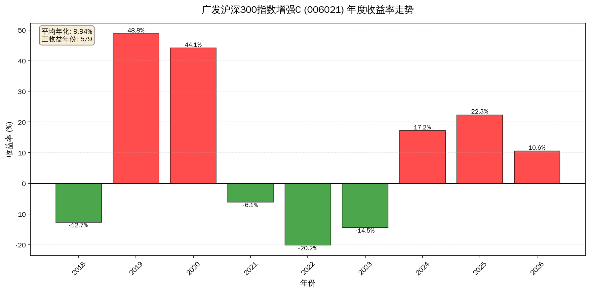
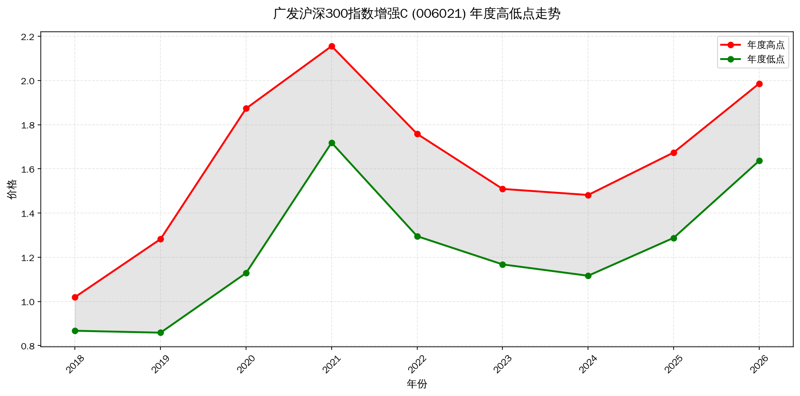
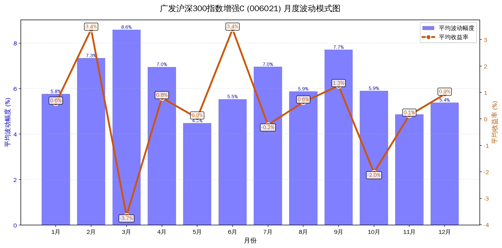
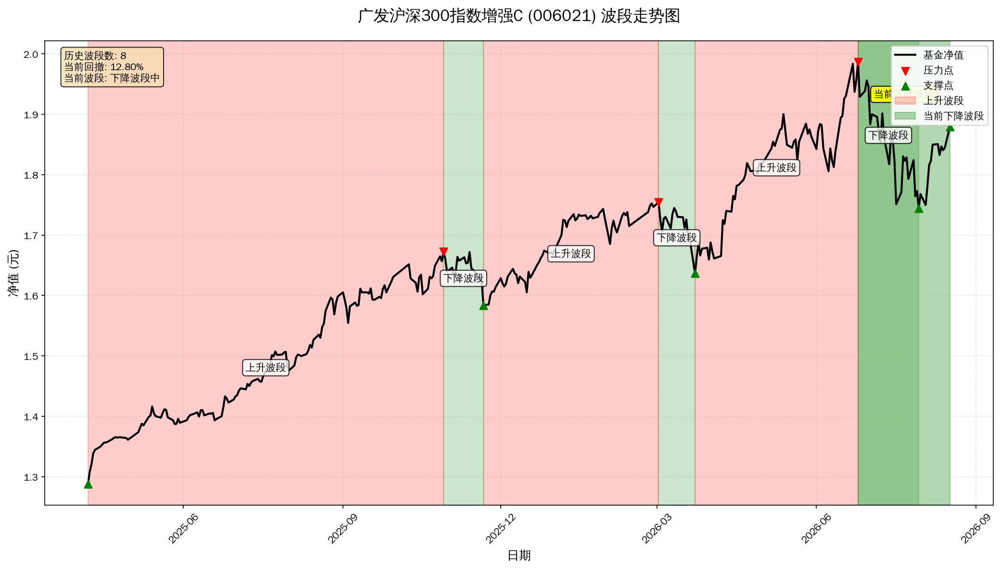

# 广发沪深300指数增强C (006021) 投资分析报告
**分析日期**: 2026-08-18

**数据期间**: 2018-06-29 至 2026-08-17

**交易日数**: 1964天

**上市首日开盘价**: 1.000元

**最新收盘价**: 1.880元

**累计涨跌**: 87.94%

---

## 一、年度走势特点分析

### 1.1 年度高低点统计
| 年份 | 年度低点 | 低点日期 | 年度高点 | 高点日期 | 年度收益率 | 年度波幅 |
|------|---------|----------|---------|----------|-----------|---------|
| 2018 | 0.867 | 2018-12-27 | 1.020 | 2018-07-31 | -12.73% | 17.57% |
| 2019 | 0.859 | 2019-01-03 | 1.282 | 2019-12-31 | 48.77% | 49.34% |
| 2020 | 1.129 | 2020-03-23 | 1.873 | 2020-12-31 | 44.11% | 65.97% |
| 2021 | 1.718 | 2021-08-20 | 2.156 | 2021-02-10 | -6.13% | 25.44% |
| 2022 | 1.295 | 2022-10-31 | 1.758 | 2022-01-04 | -20.19% | 35.75% |
| 2023 | 1.168 | 2023-12-20 | 1.509 | 2023-01-30 | -14.46% | 29.27% |
| 2024 | 1.116 | 2024-02-02 | 1.482 | 2024-10-08 | 17.18% | 32.75% |
| 2025 | 1.288 | 2025-04-07 | 1.674 | 2025-12-26 | 22.34% | 29.99% |
| 2026 | 1.637 | 2026-03-23 | 1.986 | 2026-06-25 | 10.56% | 21.37% |

### 年度收益率走势图

### 年度高低点走势图

### 1.2 走势特点总结

1. **长期表现**: 近9年平均年化收益率为9.94%

2. **波动特征**: 年度波幅平均为34.16%，具有较高的波动性

3. **季节性规律**: 待分析具体数据

---

## 二、 当前市场建议

**当前位置**: 1.880元

**历史分位**: 第95百分位

**判断**: 当前处于历史高位区域，需注意回调风险

---

## 三、波动规律与季节性分析

### 3.1 月度波动规律

| 月份 | 平均价格 | 月度收益率 | 波动幅度 | 交易天数 |
|------|----------|------------|----------|----------|
| 2025-09 | 1.599 | 1.60% | 4.77% | 22 |
| 2025-10 | 1.636 | -0.74% | 4.33% | 17 |
| 2025-11 | 1.632 | -1.97% | 5.40% | 20 |
| 2025-12 | 1.640 | 2.41% | 4.21% | 23 |
| 2026-01 | 1.728 | 1.62% | 2.49% | 20 |
| 2026-02 | 1.727 | 3.63% | 3.89% | 14 |
| 2026-03 | 1.706 | -5.41% | 6.91% | 22 |
| 2026-04 | 1.760 | 7.48% | 8.99% | 21 |
| 2026-05 | 1.862 | 1.11% | 4.11% | 18 |
| 2026-06 | 1.894 | 6.17% | 9.54% | 21 |
| 2026-07 | 1.832 | -9.16% | 11.03% | 23 |
| 2026-08 | 1.829 | 7.43% | 7.11% | 11 |

### 月度波动模式图

### 3.2 季节性规律

| 平均收益率 | 月份名称 |
|------------|----------|
| 0.48% | 1月 |
| 3.30% | 2月 |
| -2.36% | 3月 |
| 2.02% | 4月 |
| -0.34% | 5月 |
| 4.12% | 6月 |
| 0.34% | 7月 |
| 0.61% | 8月 |
| 1.28% | 9月 |
| -2.13% | 10月 |
| 0.98% | 11月 |
| 1.73% | 12月 |

### 3.3 最佳/最差月份

**最佳月份（平均正收益最高）:**

- 6月: 平均收益率 4.12%

- 2月: 平均收益率 3.30%

- 4月: 平均收益率 2.02%

**最差月份（平均负收益最高）:**

- 3月: 平均收益率 -2.36%

- 10月: 平均收益率 -2.13%

- 5月: 平均收益率 -0.34%

---

## 四、一年持有期基准

### 4.1 一年持有期统计

- 分析周期: 365 个交易日 (约一年)

- 总统计期数: 1600 个

- 盈利期数: 938 个

- 亏损期数: 662 个

- 胜率: 58.63%

- 平均收益率: 13.99%

- 最佳单期收益: 88.64%

- 最差单期收益: -30.95%

- 中位数收益: 10.27%

### 4.2 投资建议

- 一年持有期胜率一般，建议结合波段操作

- 长期持有预期正收益，年化约 13.99%

---

## 五、波段分析

### 5.1 波段识别统计

- 识别出的转折点总数: 53 个

- 完整波段数量: 51 个

- 当前波段状态: 下降波段中

- 当前波段进度: 44.02%

- 当前价格: 1.880元

- 起点价格: 1.986元 (2026-06-25 00:00:00)

- 终点价格: 1.744元 (2026-07-30 00:00:00)

- 当前价格距离最近高点回撤: 12.80%

### 5.2 历史波段表现

| 波段类型 | 起点日期 | 起点价格 | 终点日期 | 终点价格 | 振幅/回撤 | 持续天数 |
|----------|----------|----------|----------|----------|-----------|----------|
| 上升 | 2025-04-07 | 1.288 | 2025-10-29 | 1.673 | 29.89% | 205 |
| 下降 | 2025-10-29 | 1.673 | 2025-11-21 | 1.584 | 5.33% | 23 |
| 上升 | 2025-11-21 | 1.584 | 2026-03-02 | 1.754 | 10.78% | 101 |
| 下降 | 2026-03-02 | 1.754 | 2026-03-23 | 1.637 | 6.71% | 21 |
| 上升 | 2026-03-23 | 1.637 | 2026-06-25 | 1.986 | 21.37% | 94 |
| 下降 | 2026-06-25 | 1.986 | 2026-07-30 | 1.744 | 12.20% | 35 |

### 波段走势图

### 5.3 波段分析结论

### 5.3 波段分析结论

- 当前处于下降波段中，需防守为主

- 下降波段处于中期，建议观望

---

## 六、买入时机分析

### 6.1 历史低点回顾
| 低点日期 | 低点价格 | 距前一年高点跌幅 | 反弹幅度(3个月内) |
|----------|----------|------------------|------------------|
| 2024-02-02 | 1.116 | -26.04% | 14.63% |
| 2025-04-07 | 1.288 | -13.09% | 12.29% |
| 2026-03-23 | 1.637 | -2.25% | 17.95% |

### 6.2 买入策略建议

**当前位置**：处于历史中等区域

**专业建议**：
- 可结合技术面指标择机介入
- 关注季度末、年底等关键时间窗口的波动机会
- 建议设置明确止损位，控制单笔仓位风险

**左侧交易（价值投资）**：

- **条件**：价格较年度高点回撤超过35%（当前回撤12.8%）

- **信号**：成交量萎缩、RSI低于30、MACD底背离

- **时机**：确认底部形态后，在低点出现后的1-2周内分批买入

**右侧交易（趋势跟随）**：

- **条件**：确认底部形态（W底、头肩底）并有效突破颈线位

- **信号**：连续3日收于短期均线之上、MACD金叉、成交量配合放大

- **时机**：突破确认后，回踩确认支撑时加仓

**季节性机会**：
- 最佳买入窗口：1月, 2月（平均正收益）
- 建议策略：在季节性高点前1-2个月布局，季节性低点后观察反弹机会

**右侧交易（趋势跟随）**：

- **条件**：确认底部形态（W底、头肩底）并有效突破颈线位

- **信号**：连续3日收于短期均线之上、MACD金叉、成交量配合放大

- **时机**：突破确认后，回踩确认支撑时加仓

**季节性机会**：
- 最佳买入窗口：1月, 2月（平均正收益）
- 建议策略：在季节性高点前1-2个月布局，季节性低点后观察反弹机会

**季节性风险**：
- 需规避窗口：3月, 5月（平均负收益）
- 建议策略：在这些月份避免重仓买入，或考虑对冲策略

---

## 七、卖出时机分析

### 7.1 历史高点回顾
| 高点日期 | 高点价格 | 距前一年低点涨幅 | 持续天数 | 后续最大回撤 |
|----------|----------|------------------|----------|--------------|
| 2024-10-08 | 1.482 | 26.92% | 249天 | 13.09% |
| 2025-12-26 | 1.674 | 49.98% | 263天 | 2.25% |
| 2026-06-25 | 1.986 | 54.23% | 94天 | 12.20% |

### 7.2 卖出策略建议

**当前位置**：处于历史相对高位区域

**专业建议**：
- 估值偏高，建议谨慎追高
- 可等待技术性回调后寻找卖出机会
- 若已持仓，建议考虑部分止盈，锁定收益

**目标收益率止盈**：

- **保守目标**：10.3%（接近历史中位数）
- **中性目标**：24.3%（历史平均+中位数）
- **乐观目标**：34.5%（历史平均+2倍中位数）

- **说明**：基于历史数据，超过此收益率的概率约50%，需结合市场环境调整

**技术止盈信号**：

- **顶部形态**：双顶、三重顶、头肩顶
- **量价背离**：价格新高但成交量萎缩（RSI高于70时尤其明显）
- **均线死叉**：短期均线下穿长期均线，且持续3日以上
- **MACD顶背离**：价格创新高但MACD指标未创新高

**时间止盈策略**：

- **单笔持仓周期**：建议不超过6个月，避免长期持有导致时间成本上升
- **季度评估**：每季度末评估基金表现，偏离目标价±10%时考虑调仓
- **年度再平衡**：每年底重新评估投资组合，根据市场环境调整仓位

**风险控制**：

- **最大回撤参考**：历史高点后最大回撤48.2%
- **建议止损位**：从高点回撤{max_drawdown * 0.6:.1f}%时考虑止损
- **移动止盈**：最高点回撤10%时止盈，锁定大部分收益

---

## 八、预估收益率

### 8.1 基于历史数据的统计
| 情景 | 年化收益率 | 概率 | 说明 |
|------|-----------|------|------|
| 保守 | 8.2% 至 13.2% | 41% | 行业继续探底或市场低迷，历史中位数以下表现 |
| 中性 | 14.0% 至 19.0% | 35% | 行业筑底或震荡，政策托底但无强刺激 |
| 乐观 | 12.3% 至 22.3% | 50% | 政策强力刺激，类似历史反弹行情 |
| 极端乐观 | 88.6%+ | 5% | 行业基本面反转，类似历史最佳表现 |

### 8.2 风险提示

- **最大回撤风险**：历史最大回撤约48.2%，需做好仓位管理
- **波动率风险**：年度波幅平均34.2%，波动较大
- **胜率风险**：一年持有期胜率58.6%，需注意时机选择

---

## 九、投资策略建议

### 9.1 三种操作方案

#### 方案一：保守型（低风险偏好）

- 建仓：当前价位30%，回调至前低附近加仓

- 止盈：目标收益率20-33%

- 止损：跌破前低全部止损

- 适合人群：风险厌恶型投资者、退休资金

- 预期年化：8%-15%

#### 方案二：平衡型（中等风险偏好）

- 建仓：当前价位40%，每下跌3%加仓10%，最多加仓至80%

- 止盈：每上涨10%减仓20%，目标收益率30-40%

- 止损：跌破前低止损50%，跌破更低前低清仓

- 适合人群：稳健型投资者、希望获得中等收益的投资者

- 预期年化：15%-25%

#### 方案三：激进型（高风险偏好）

- 建仓：当前价位一次性建仓70%，保留30%资金补仓

- 止盈：目标收益率50%+，采用移动止盈（最高点回撤10%止盈）

- 止损：亏损15%无条件离场

- 适合人群：风险偏好型投资者、追求高收益的投资者

- 预期年化：25%-40%

---

## 十、风险管理

- **仓位控制**：考虑到波动率34.2%，建议单只基金仓位不超过总资产的23%

- **单笔最大亏损**：建议不超过总资金的1%，避免单一投资导致过大回撤

- **持仓时间**：基于58.6%的胜率，建议单笔持仓不超过6个月，避免长期持有导致收益被时间成本侵蚀

- **再评估周期**：超过2个月未达目标需重新评估，避免陷入长期亏损

- **止损纪律**：严格执行止损，胜率58.6%意味着41%的时间可能亏损，必须控制单笔损失

- **分散投资**：建议将2只不同类型的基金组合投资，降低单一基金波动风险
---

## 十一、关键时间节点提醒

| 时间窗口 | 操作建议 |
|----------|----------|
| 1月 | 重点关注建仓机会，避免在2月过度追高 |
| 2月 | 建议逐步减仓，锁定前期收益 |
| 3月 | 建议减仓或观望，规避风险 |
| 5月 | 避免重仓建仓，可考虑对冲策略 |

### 技术提醒：
- **当前趋势**：下降波段中，建议关注44.0%的进度
- **关键支撑位**：关注历史低点附近的技术支撑
- **反弹机会**：当RSI低于30时可考虑分批建仓

---

## 十二、综合建议

> **当前最优策略**：建议波段操作为主，控制单笔仓位，设置严格止损

> **核心逻辑**：
1. 胜率58.6%一般，不适合长期持有，建议以波段操作为主
2. 平均收益14.0%，需通过波段操作提升收益
3. 最大回撤48.2%，建议单笔仓位不超过20%

> **需要关注的风险信号**：

- **年度波动风险**：年度波幅平均34.2%，建议设置15%的止损位
- **回撤控制**：历史最大回撤48.2%，需做好仓位管理
- **流动性风险**：关注基金规模变化，避免在规模急剧缩小时被强制赎回

---

## 免责声明

本分析仅基于历史数据，不构成投资建议。市场有风险，投资需谨慎。

历史表现不代表未来结果，请根据自身风险承受能力谨慎决策。