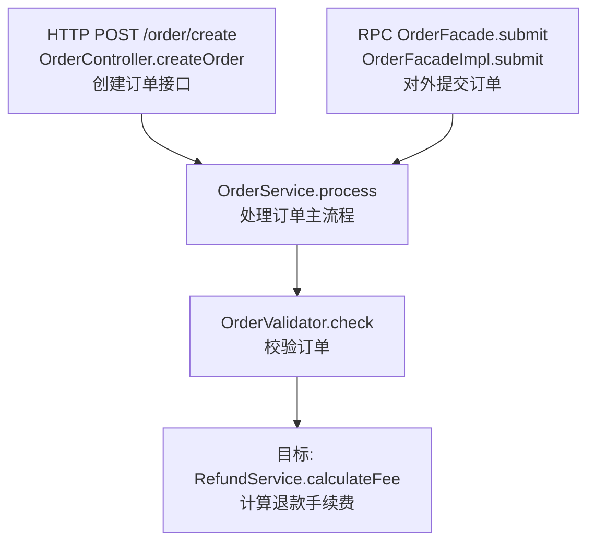

# 代码引用

根据代码证据只读分析，生成指定 Java 方法的**向上调用图**（谁调用了它，一直追到入口）。不修改业务代码，不跨服务搜索。

## 范围

- **搜索范围**：目标方法所属的当前 Git 仓库（含 monorepo 内子模块），不扫描工作区其他同级服务。
- **追溯方向**：仅向上（caller → … → 入口），不展开被调用方（callee）。
- **终止条件**：到达以下任一入口即停止该分支：
  - **HTTP**：`@RestController` / `@Controller` 类上带 `@RequestMapping`、`@GetMapping`、`@PostMapping`、`@PutMapping`、`@DeleteMapping`、`@PatchMapping` 的方法。
  - **RPC 提供方**：带 `@DubboService`、`@Service`（Dubbo）、`@HSFProvider`、`@RpcService` 等注解的实现类中的对外方法；或明确标注为 RPC 接口实现且在本仓库被暴露的方法。
  - **其他本仓库入口**（若存在且无 HTTP/RPC 上层）：`@Scheduled`、`@XxlJob`、`@KafkaListener`、`@RocketMQMessageListener`、`CommandLineRunner` / `ApplicationRunner`、Servlet `Filter`/`Interceptor` 的入口方法。标注为「非 HTTP/RPC 入口」。
- **跨服务边界**：遇到 Feign Client、HTTP Client、RPC Consumer 调用外部服务时，在该节点标注「跨服务调用，本 skill 不继续追溯」，停止该分支。

## 输入解析

1. 接受：`ClassName.methodName`、`包名.类名.方法名`、文件路径 + 方法名、或粘贴的方法签名。
2. 路径/类名不完整时，用 `rg` 补全；存在重载时结合参数类型、行号或调用点消歧。
3. 目标不存在或仍有多个无法区分的候选时，列出候选和缺少的信息，不猜测。

## 工作流程

```
1. 定位目标方法（文件、类、行号）
2. 确认所属 Git 仓库；可选 READ gitnexus://repo/{name}/context 检查索引是否过期
3. 自目标方法向上 BFS/DFS 收集调用链，直到所有分支到达入口或无法继续
4. 用 rg 核对 GitNexus 结论；消除同名方法误匹配
5. 为最上层入口和各层节点补充一句话功能说明（入口略详，中间层从简）
6. 输出调用图 + 入口汇总
```

### 步骤 1：定位目标

读取目标方法所在类，记录：`服务/模块名`、`完整类名`、`方法签名`、`文件绝对路径:行号`。

### 步骤 2：选择追溯工具

**优先 GitNexus**（若当前环境已索引该仓库）：

1. `gitnexus_context({ name, file_path, kind: "Method" })` 获取直接 callers。
2. 对每个 caller 递归调用 `context`，或一次性用 `cypher` 查多跳上游：

```cypher
MATCH path = (entry)-[:CodeRelation*1..10 {type: 'CALLS'}]->(target:Method {name: "目标方法名"})
WHERE entry.filePath CONTAINS "目标文件名"
RETURN [n IN nodes(path) | n.name + " @ " + n.filePath] AS chain
LIMIT 50
```

3. 索引过期时提示运行 `npx gitnexus analyze`，同时改用 rg 手工追溯。

**rg 回退策略**（GitNexus 不可用或需核对时）：

1. 搜索直接调用：`rg '\.methodName\s*\(' --glob '*.java'` 与 `rg 'methodName\s*\('`（排除定义处）。
2. 对每个命中读取上下文，确认调用对象类型与目标类/接口一致（含实现类、父类、`@Autowired` 注入字段类型）。
3. 递归搜索每个 caller 方法的 callers，直到入口或无新结果。
4. 接口方法：同时搜索接口名与实现类名的调用点。

### 步骤 3：识别入口

对每个到达顶层的 caller，读取其类注解与方法注解：

| 类型 | 识别依据 | 输出标签 |
|------|----------|----------|
| HTTP | Controller 类 + Mapping 注解 | `HTTP {METHOD} {path}` |
| RPC 提供方 | Dubbo/HSF 等 Service 注解 | `RPC {接口/类名}.{方法}` |
| 定时/消息 | Scheduled / XxlJob / Listener | `JOB` / `MQ` / `SCHEDULED` |
| 无上层调用 | 仓库内未找到 caller | `ROOT`（可能是入口或动态调用） |

HTTP path 拼接规则：类级 `@RequestMapping` + 方法级 mapping 合并；无法静态确认时标注「路径需运行时确认」。

### 步骤 4：补充功能说明

定位到入口后，**只做概览级说明**，不展开内部实现、数据库表或分支细节。

- **最上层入口（重点）**：读入口方法及其类注释/方法名/核心调用，用 **1 句话（≤20 字优先）** 说明该入口对外做什么。例如：`测试接口：触发邮件删档并写入 Doris`。
- **中间层节点（从简）**：每个节点附 **≤10 字** 短语即可，说明它在链路中的作用。例如：`校验退款参数`、`组装 IMAP 连接`。
- **目标方法**：可附 1 句说明其职责，便于理解为何被这些入口引用。
- 依据不足时写「功能待确认」，不要根据命名臆测复杂业务。

### 步骤 5：去重与合并

- 多条路径汇入同一节点时，在图中合并为一个节点。
- 同一入口经不同中间层到达目标时，保留所有独立路径。
- 排除 `src/test` 测试代码，除非用户明确要求包含测试。

## 输出格式

使用中文。先给结论，再给图和证据。

### 1. 概要

- 目标方法：`完整签名 @ 文件:行号`
- 所属服务/模块
- 搜索范围：当前仓库名
- 发现入口数量、最长调用深度、未闭合分支说明

### 2. 调用图

**默认用 Mermaid**（自上而下：入口 → … → 目标）：



- 节点标签格式：`类名.方法名` + 换行 + **一句话功能说明**；入口节点额外保留 `HTTP/RPC` 与 path。
- 入口节点说明稍详细（1 句）；中间层从简（短语）；目标节点前缀「目标:」。
- 跨服务边界节点用虚线框或后缀「⚠ 跨服务」。
- 分支超过 8 条时，主图只保留到二级中间节点，其余放「完整路径列表」。

### 3. 入口汇总表

| 入口类型 | 入口标识 | 入口功能（概览） | 调用链（入口 → 目标） | 置信度 |
|----------|----------|------------------|------------------------|--------|
| HTTP POST | `/order/create` | 创建订单 | OrderController.createOrder → … → calculateFee | 已确认 |

置信度：`已确认`（静态调用证据完整）/ `可能`（反射、动态代理、接口多实现）/ `未闭合`（上层 caller 未找到）。

### 4. 证据

- 每条主路径至少给出 1 处关键调用点的 `绝对路径:行号`。
- 无法静态确认的调用（反射、SpEL、MQ 异步）单独列出，不捏造链路。

## 注意事项

- 不要仅凭方法名判定调用关系；必须结合类型、import、注入字段类型。
- 实现类与接口同时存在时，以实际注入/调用的类型为准。
- AOP、事件发布（`publishEvent`）、异步（`@Async`）可能导致静态图不完整，需标注。
- 本 skill 只做调用图与**概览级**功能说明；不展开数据库表、详细业务流程或跨服务 consumer。若用户还要完整用途分析，建议配合 `分析代码` skill。

## 示例

**输入**：`RefundService.calculateFee`

**输出摘要**：

- 2 个 HTTP 入口、1 个 RPC 入口，最长深度 4
- 主图展示三条独立路径汇入 `RefundService.calculateFee`
- 入口表列出 POST `/refund/apply` 等路由

详细示例见 [examples.md](examples.md)。
