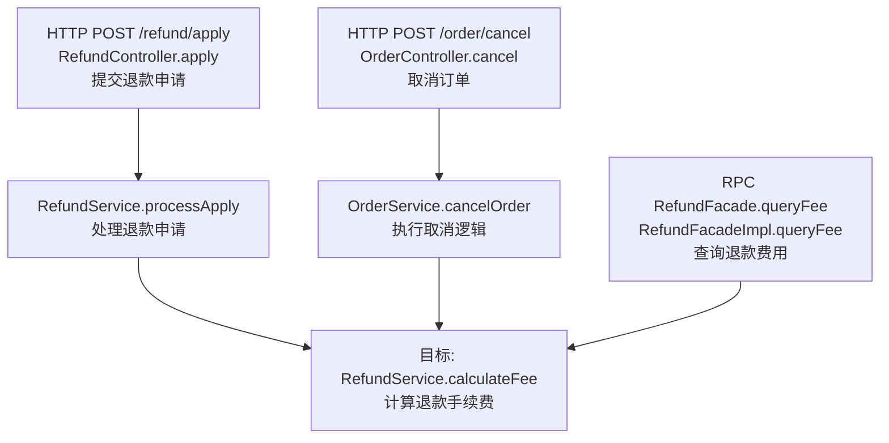
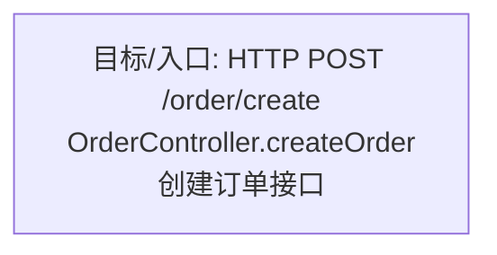

# 代码引用 — 示例

## 示例 1：普通 Service 方法

**输入**

```
RefundService.calculateFee
```

**输出概要**

```
目标：com.example.order.service.RefundService.calculateFee @ RefundService.java:128
所属模块：order-service
搜索范围：order-service（当前仓库）
入口：HTTP×2，RPC×1，最长深度 4
```

**调用图**



**入口汇总**

| 入口类型 | 入口标识 | 入口功能（概览） | 调用链 | 置信度 |
|----------|----------|------------------|--------|--------|
| HTTP POST | `/refund/apply` | 提交退款申请 | RefundController.apply → RefundService.processApply → calculateFee | 已确认 |
| HTTP POST | `/order/cancel` | 取消订单 | OrderController.cancel → OrderService.cancelOrder → calculateFee | 已确认 |
| RPC | RefundFacade.queryFee | 对外查询退款费用 | RefundFacadeImpl.queryFee → calculateFee | 已确认 |

---

## 示例 2：已是 HTTP 入口

**输入**

```
OrderController.createOrder
```

**输出概要**

```
目标本身即为 HTTP 入口，无上层调用方。
入口：HTTP POST /order/create
```

**调用图**



---

## 示例 3：存在跨服务边界

**输入**

```
PaymentClient.notifyResult
```

**说明**：`PaymentClient` 为 Feign 接口，实际调用方在其他服务。

**输出片段**

```
分支在 PaymentService.syncStatus 处停止：
  PaymentService.syncStatus → PaymentClient.notifyResult ⚠ 跨服务（Feign），本仓库不继续追溯
上层入口（本仓库内）：HTTP POST /payment/callback → PaymentService.syncStatus
```

---

## 示例 4：反射 / 无法静态闭合

**输出片段**

| 入口类型 | 入口标识 | 调用链 | 置信度 |
|----------|----------|--------|--------|
| — | — | HandlerRegistry 通过反射调用 executeTask | 可能 |
| ROOT | — | executeTask 无静态 caller | 未闭合 |

说明：标注「可能」或「未闭合」，不伪造完整链路。
