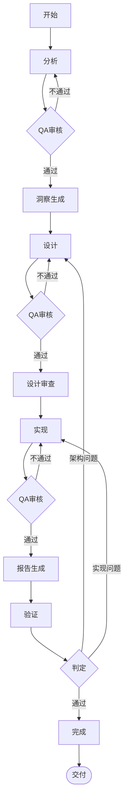

# conspect 阶段流转协议

> 定义 conspect Skill 各阶段的流转规则和检查点（v3.0：全流程自动推进，无用户确认节点）。

## 阶段状态图

## 阶段定义

| 阶段 | 自动推进 | 执行者 | 前置条件 | 产出物 | 质量审核 |
|------|---------|--------|---------|--------|---------|
| 开始 | [自动]  | 主控Agent | 无 | `_cs-baton.md` | -- |
| 分析 | [自动]  | 分析Agent | 接力棒存在 | `_cs-analysis.md` | [必须] |
| 洞察生成 | [自动]  | AI Agent | 分析完成+审核通过 | `_cs-insights.json` | -- |
| 设计 | [自动]  | 设计Agent | 洞察生成完成 | `_cs-design.md` | [必须] |
| 设计审查 | [自动]  | 视觉设计师Agent | 设计通过+审核通过 | 设计审查意见 | -- |
| 实现 | [自动]  | 实现Agent | 设计审查完成 | `_cs-implement.md` 等 | [必须] |
| 报告生成 | [自动]  | 报告Agent | 实现+审核通过 | `_cs-report.{md,html,pdf,docx}` | [必须] |
| 验证 | [自动]  | 验证Agent | 报告生成完成 | `_cs-verify.md` | [必须] |
| 完成 | [自动]  | 主控Agent | 验证完成+审核通过 | 最终报告 | [必须] |

## 阻断规则

- 前置产物不存在 → 阻断进入下一阶段
- 质量审核未通过 → 阻断进入下一阶段
- 质量审核重试超过2次 → FAILED，需人工介入
- **数据源完整性未验证 → 阻断进入分析阶段**（分析 Agent 的前置检查中 Sheet 枚举未完成，不得开始数据分析）
- **输出产物路径不一致 → 阻断交付**（实现产物必须输出到 `{项目路径}/.agent/harness/`，验证者检查路径合规性）

> **v3.0 变更**：原"确认"阶段（等待用户确认）已删除。分析 QA 通过即自动推进至洞察生成→设计，全流程零用户确认环节。用户偏好从开始阶段的初始需求中识别。

## 验证链规则

- **计数验证**：声称"N个"必须列出N个
- **列表验证**：涉及文件必须列出具体路径，不得用"等"
- **文件验证**：产物写入后必须 read 确认
- **流程图验证**：必须使用标准 Mermaid 语法
