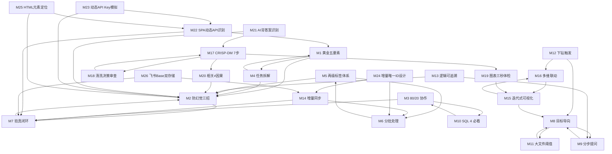

# INDEX — 26 原子方法论引用图

> v3.1 教程蒸馏升级：M12-M16 由蒸馏入口从 6 篇真实教程中萃取，2026-07-22 挂载。
> v3.3 D1 教程蒸馏升级：M17-M21 从 D1 数据分析与可视化课程中萃取，2026-07-24 挂载。
> v3.4.0 爬虫能力强化：M22-M26 从 TRAE 社区爬虫教程中萃取，2026-07-26 挂载（场景 1 网页采集专项强化）。

## 方法论清单

| # | 名称 | 文件 | 何时用 |
|---|------|------|--------|
| M1 | 黄金五要素 | [M1-golden-five-elements.md](../references/methods/M1-golden-five-elements.md) | 采集/提取类 |
| M2 | 防幻觉三招 | [M2-anti-hallucination-trio.md](../references/methods/M2-anti-hallucination-trio.md) | 涉及金额/人数/结论 |
| M3 | 80/20 协作 | [M3-80-20-collaboration.md](../references/methods/M3-80-20-collaboration.md) | 写 SQL/代码 |
| M4 | 任务拆解 | [M4-task-decomposition.md](../references/methods/M4-task-decomposition.md) | 复杂多步任务 |
| M5 | 两级标签体系 | [M5-two-level-taxonomy.md](../references/methods/M5-two-level-taxonomy.md) | 分类标注 |
| M6 | 分批处理 | [M6-batch-processing.md](../references/methods/M6-batch-processing.md) | >1000 条 |
| M7 | 验真闭环 | [M7-verification-loop.md](../references/methods/M7-verification-loop.md) | 任何关键输出 |
| M8 | 目标导向 | [M8-goal-oriented-prompt.md](../references/methods/M8-goal-oriented-prompt.md) | 深度分析 |
| M9 | 分步提问 | [M9-stepwise-questioning.md](../references/methods/M9-stepwise-questioning.md) | 高要求报告 |
| M10 | SQL 4 必看 | [M10-sql-four-checks.md](../references/methods/M10-sql-four-checks.md) | 审查 SQL |
| M11 | 大文件阈值 | [M11-large-file-threshold.md](../references/methods/M11-large-file-threshold.md) | 大数据量 |
| **M12** | **下钻触发** | [M12-drill-down-trigger.md](../references/methods/M12-drill-down-trigger.md) | **探索性分析（涌现维度）** |
| **M13** | **中间逻辑可追溯** | [M13-intermediate-logic-traceability.md](../references/methods/M13-intermediate-logic-traceability.md) | **AI 分析可信度** |
| **M14** | **增量同步** | [M14-incremental-sync.md](../references/methods/M14-incremental-sync.md) | **定期运行任务** |
| **M15** | **迭代式可视化** | [M15-iterative-visualization.md](../references/methods/M15-iterative-visualization.md) | **图表制作** |
| **M16** | **多维数据联动** | [M16-multi-dim-linkage.md](../references/methods/M16-multi-dim-linkage.md) | **多维关系展现** |
| **M17** | **CRISP-DM 7 步 SOP** | [M17-crispdm-7step-sop.md](../references/methods/M17-crispdm-7step-sop.md) | **端到端分析全流程** |
| **M18** | **清洗决策审查** | [M18-cleaning-decision-review.md](../references/methods/M18-cleaning-decision-review.md) | **数据清洗决策审计** |
| **M19** | **图表三秒体检** | [M19-chart-3sec-checkup.md](../references/methods/M19-chart-3sec-checkup.md) | **图表正确性验收** |
| **M20** | **相关≠因果验证** | [M20-correlation-causation-verification.md](../references/methods/M20-correlation-causation-verification.md) | **统计因果断言验证** |
| **M21** | **AI 背答案识别** | [M21-ai-recitation-detection.md](../references/methods/M21-ai-recitation-detection.md) | **教学场景 AI 诊断** |
| **M22** | **SPA 动态 API 识别** | [M22-spa-dynamic-api-identification.md](../references/methods/M22-spa-dynamic-api-identification.md) | **现代 SPA 网站抓取前置** |
| **M23** | **动态 API Key 模拟** | [M23-dynamic-api-key-simulation.md](../references/methods/M23-dynamic-api-key-simulation.md) | **Algolia 等动态 Key 服务** |
| **M24** | **增量唯一 ID 设计** | [M24-incremental-unique-id-design.md](../references/methods/M24-incremental-unique-id-design.md) | **增量抓取区分已抓/未抓** |
| **M25** | **HTML 元素定位法** | [M25-html-element-location.md](../references/methods/M25-html-element-location.md) | **AI 识别失败兜底** |
| **M26** | **飞书多维表格双存储** | [M26-feishu-base-dual-storage.md](../references/methods/M26-feishu-base-dual-storage.md) | **本地 CSV + 飞书 Base 双写** |

## 引用图

## v3.4.0 关键引用关系（新增）

- **M22→M1/M7**（v3.4.0 新增）：SPA 识别后仍需黄金五要素 + 验真闭环
- **M23→M22/M2**（v3.4.0 新增）：动态 Key 模拟依赖 SPA 识别 + 防幻觉（Key 失效即静默失败）
- **M24→M14/M6**（v3.4.0 新增）：唯一 ID 设计是 M14 增量同步的标识层 + 配合分批处理
- **M25→M2/M22**（v3.4.0 新增）：HTML 定位是 AI 识别失败兜底 + 防 SPA 误判
- **M26→M14/M7**（v3.4.0 新增）：双存储需增量同步 + 验真抽查避免数据漂移

## 关键引用关系

- **M1→M2**：采集/提取类场景，五要素之后必须叠加防幻觉三招
- **M4→M1/M2**：拆解后每一步都套五要素+三招
- **M5→M6**：标签体系定好后才用分批策略
- **M3→M10**：SQL 协作姿势的具体审查点
- **M8→M9/M11**：深度分析场景，目标导向+分步提问+大文件阈值组合使用
- **M12→M8/M16**（v3.1 新增）：探索性分析下钻后常用目标导向 + 多维联动展示
- **M13→M2/M9**（v3.1 新增）：可追溯性需要防幻觉证据 + 分步追问
- **M14→M6/M7**（v3.1 新增）：定期同步常配合分批处理 + 验真抽查
- **M15↔M16**（v3.1 新增）：可视化迭代与多维联动相互配合
- **M13 与 M9 联动**（v3.1 新增）：分步提问深挖时，每步结果都要可追溯
- **M14 与 M2 联动**（v3.1 新增）：增量同步失败兜底需 M2 防幻觉（不脑补缺数据）
- **M17→M18/M19/M20**（v3.3 新增）：CRISP-DM 7 步骨架串联清洗审查+图表体检+因果验证
- **M19→M15**（v3.3 新增）：图表体检是迭代式可视化的验收关
- **M20→M2**（v3.3 新增）：因果验证是防幻觉的统计特化
- **M21→M17/M2**（v3.3 新增）：背答案识别用于教学场景，串联全流程防幻觉

## 8 场景常用组合

| 场景 | 规模 | 组合 |
|------|------|------|
| 1 采集 | 任意 | M1+M2+M7 |
| 1 采集（定期） | 任意 | M1+M2+M7+M14 |
| 2 提取 | <100 份 | M1+M2 |
| 2 提取 | >100 份 | M1+M2+M6 |
| 3 SQL | 任意 | M3+M10+M2 |
| 4 核对 | 任意 | M2+M7（顶配） |
| 4 核对（含 AI 分析） | 任意 | M2+M7+M13 |
| 5 标注 | <1000 条 | M5+M2 |
| 5 标注 | >1000 条 | M5+M6+M2 |
| 6 周报 | 任意 | M1+M7+M4 |
| 6 周报（含洞察） | 任意 | M1+M7+M4+M12+M13 |
| 7 深度报告 | <5000 行 | M8+M9 |
| 7 深度报告 | <5000 行 + 可视化 | M8+M9+M15+M16 |
| 7 深度报告 | >10万行 | M8+M9+M11 |
| 7 深度报告 | >10万行 + 可视化 | M8+M9+M11+M15+M16 |
| 7 深度报告（探索性） | 任意 | M8+M9+M12+M13 |
| **8 完整分析全流程**（v3.3） | 任意 | **M1+M2+M7+M17+M18+M19+M20** |
| **8 完整分析（教学场景）**（v3.3） | 任意 | **M1+M2+M7+M17+M18+M19+M20+M21** |
| **8 完整分析（含下钻）**（v3.3） | 任意 | **M1+M2+M7+M12+M13+M17+M18+M19+M20** |
