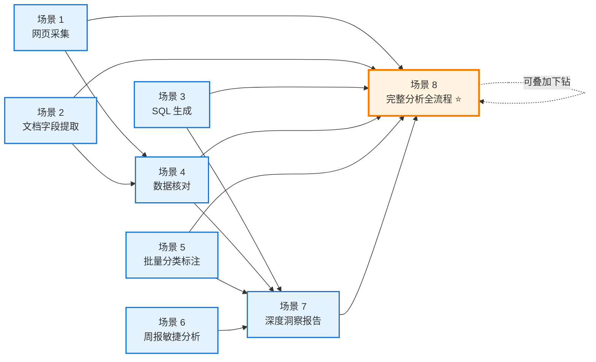

# 能力地图（Capability Map）v3.3.1

> SKILL.md 主入口的能力总览。新用户首次启动 / 用户问"你能做什么" / 完成一个场景后想知道"还能做什么"时，AI 主动展示本文件。
> v3.3.1 新增：解决"功能多但用户不知道能做什么"的核心痛点，与 [trigger-guide.md](trigger-guide.md) 5 层触发引导配套使用。

## 何时展示能力地图

| 时机 | 触发条件 | 展示方式 |
|------|---------|---------|
| **首次启动** | 用户说"启动数据分析""引导数据分析""你能做什么""有哪些场景" | 展示 § 能力总览表 + § 8 场景速查 |
| **场景完成后** | 完成场景 N 交付后 | 展示 § 场景流转图 + "接下来可以做..."提示 |
| **用户卡住** | 用户说"不知道做什么""还有什么能做" | 展示 § 能力总览表 + § 方法论咒语表 |
| **场景识别失败** | Layer 1-4 都未命中 | 展示 § 8 场景速查让用户选 |

---

## 能力总览表（一张表看完所有能力）

### 入口层（2 个入口）

| 入口 | 触发词 | 干什么 | 产出 |
|------|--------|--------|------|
| **A 引导** | `启动数据分析` / `我有一堆简历` / `CSV 想知道` / `CRISP-DM` / `从问题到报告` | 为数据分析需求生成高质量 Prompt | Prompt + 附加交付物 |
| **B 蒸馏** | `蒸馏教程` / `萃取方法论` / `榨干教程` | 从教程中萃取方法论挂载到方法库 | 新方法论文件 + 路由更新 |

### 场景层（8 大场景）

| 场景 | 名称 | 强信号词 | 默认方法论 | 交付物 | 典型输入示例 |
|------|------|---------|-----------|--------|------------|
| **1** | 网页采集 | "抓数据""爬取""网页表格" | M1+M2+M7 | Prompt+Excel 模板+验真脚本 | "帮我把基金排行榜抓下来" |
| **2** | 文档字段提取 | "简历""合同""发票""抠字段" | M1+M2（<100）/ M1+M2+M6（>100） | Prompt+Excel 模板+验真脚本 | "我有一堆候选人简历 PDF" |
| **3** | SQL 生成 | "写 SQL""JOIN""子查询" | M3+M10+M2 | Prompt+DDL+JSON Schema+验真脚本 | "帮我写统计活跃学员的 SQL" |
| **4** | 数据核对 | "对账""核对""两张表对得上" | M2+M7 | Prompt+Excel 模板+异常清单 | "我要核对两张表对得上" |
| **5** | 批量分类标注 | "打标签""分类""标注" | M5+M2（<1000）/ M5+M6+M2（>1000） | Prompt+JSON 标签树+决策树 | "5000 条用户反馈要打标签" |
| **6** | 周报敏捷分析 | "周报""合并""完成率" | M1+M7+M4 | Prompt+报告模板 | "周报合并+完成率" |
| **7** | 深度洞察报告 | "深度分析""报告""1500 行" | M8+M9 | Prompt+报告模板+SQLite 样例 DB | "1500 行数据深度报告" |
| **8** | 完整分析全流程 ⭐ | "CSV 想知道""端到端""CRISP-DM""从问题到报告" | M1+M2+M7+**M17+M18+M19+M20** | Prompt+5 个 v3.3 清单+报告模板 | "我有 CSV 想端到端分析" |

⭐ 场景 8 是 v3.3 旗舰场景，端到端 CRISP-DM 7 步全流程，覆盖场景 7 的子集。
🌐 场景 1 在 v3.4.0 强化：现代 SPA 网站默认追加 M22，旗舰版组合 M1+M2+M7+M14+M22+M24+M26。

### 方法论层（26 原子方法论）

#### 基础方法论（M1-M11，v2.0）

| # | 名称 | 一句话 | 何时用 |
|---|------|--------|--------|
| M1 | 黄金五要素 | 范围+字段+规则+格式+异常 | 采集/提取类 |
| M2 | 防幻觉三招 | 亮证据+给示弱+禁脑补 | 涉及金额/人数/结论 |
| M3 | 80/20 协作 | AI 写初稿+人审业务口径 | 写 SQL/代码 |
| M4 | 任务拆解 | 提取→清洗→核对→分析 | 复杂多步任务 |
| M5 | 两级标签体系 | 一级+二级+边界+样例 | 分类标注 |
| M6 | 分批处理 | 50-100/批+对齐基准+序号 | >1000 条 |
| M7 | 验真闭环 | 标注依据+抽查+异常标记 | 任何关键输出 |
| M8 | 目标导向 | 多给目标少给绘图指令 | 深度分析 |
| M9 | 分步提问 | /plan 出大纲→确认→深挖 | 高要求报告 |
| M10 | SQL 4 必看 | JOIN/时间/去重/口径 | 审查 SQL |
| M11 | 大文件阈值 | <1500 直拖/>10万写脚本 | 大数据量 |

#### 蒸馏扩展方法论（M12-M16，v3.1）

| # | 名称 | 触发咒语 | 何时用 |
|---|------|---------|--------|
| M12 | 下钻触发 | "深入分析""下钻""为什么这个数据""哪些维度有趣" | 探索性分析（涌现维度） |
| M13 | 中间逻辑可追溯 | "为什么这个结论""这个怎么算的""推导链""验证逻辑" | AI 分析可信度 |
| M14 | 增量同步 | "定期采集""每天自动跑""增量更新""只处理变更" | 定期运行任务 |
| M15 | 迭代式可视化 | "画个图""可视化""图表优化""先粗后美" | 图表制作 |
| M16 | 多维数据联动 | "多维关系""联动""多个图表组合""热力图+气泡图" | 多维关系展现 |

#### v3.3 D1 教程蒸馏方法论（M17-M21）

| # | 名称 | 触发咒语 | 何时用 |
|---|------|---------|--------|
| **M17** | **CRISP-DM 7 步 SOP** | "完整分析""端到端""CRISP-DM""从问题到报告""7 步流程" | 端到端分析全流程（场景 8 默认成套挂载） |
| **M18** | **清洗决策审查** | "清洗""缺失值""异常值""预处理""数据质量" | 数据清洗决策审计（场景 8 Step 3） |
| **M19** | **图表三秒体检** | "画图后""图表对吗""可视化验证""轴标签""三秒" | 图表正确性验收（场景 8 Step 5） |
| **M20** | **相关≠因果验证** | "A 导致 B""为什么这个结论""因果""相关性""推导链" | 统计因果断言验证（场景 8 Step 6） |
| **M21** | **AI 背答案识别** ⚠️ | "教学""学习""挑战任务""测试 AI""背答案""数据陷阱" | 教学场景特化（不当默认方法论用） |

⚠️ M21 仅在教学场景信号触发时挂载，避免污染非教学场景。

#### v3.4.0 爬虫能力强化方法论（M22-M26）

| # | 名称 | 触发咒语 | 何时用 |
|---|------|---------|--------|
| **M22** | **SPA 动态 API 识别** 🌐 | "requests.get 抓不到""网页内容是空的""XHR/Fetch""Network 面板""源码搜不到" | 现代 SPA 网站抓取前置（80% 网站默认追加） |
| **M23** | **动态 API Key 模拟** 🔑 | "API Key 失效""Key 几分钟就过期""Algolia""requests.Session""Cookie+Token" | 动态 Key 服务（自动追加 M22） |
| **M24** | **增量唯一 ID 设计** 🆔 | "增量""重复数据""唯一 ID""tid""fingerprint""区分已抓未抓" | 增量抓取标识层（自动追加 M14+M6） |
| **M25** | **HTML 元素定位** 🎯 | "AI 没识别到""抓不到字段""DevTools""F12""复制 HTML" | AI 识别失败兜底（不当默认方法论用） |
| **M26** | **飞书多维表格双存储** ☁️ | "飞书多维表格""双存储""bitable""PERSONAL_BASE_TOKEN""本地+云端" | 本地 CSV + 飞书 Base 双写（自动追加 M14+M24） |

⚠️ M22 是场景 1 现代 SPA 网站的默认前置；M25 是兜底方法论（仅 M22 失败时追加）；M23/M26 触发时会自动追加依赖链。

### 附加交付物层（按场景路由）

| 场景 | 附加交付物 |
|------|----------|
| 1 采集 / 2 提取 | Excel 模板 + 验真脚本 |
| **1 采集（v3.4.0 强化）** 🌐 | **网站分析脚本模板 + 场景 1 提示词模板（8 段式）+ 爬虫调试经验库 + 飞书存储模板** |
| 3 SQL | DDL.sql + JSON Schema + 验真脚本 |
| 4 核对 | Excel 模板 + 异常清单模板 |
| 5 标注 | JSON 标签树 + 标签冲突决策树 |
| 6 周报 / 7 深度报告 | 报告模板 |
| **8 完整分析全流程** ⭐ | **数据体检清单 + 清洗决策审查表 + 图表三秒体检清单 + 相关≠因果验证清单 + 分析报告 Markdown 模板** |
| **8 完整分析（教学场景）** | **上述 5 项 + 数据手术脚本 + AI 背答案三问诊断清单** |

---

## 场景流转图（C5 v3.3.1 新增）

8 场景间的转换路径。完成一个场景后，AI 主动提示可衔接的下一个场景：

### 流转路径说明

| 起点 | 终点 | 流转场景 | 联动提示话术 |
|------|------|---------|------------|
| 场景 1 完成 | → 场景 4 | 抓到数据后核对 | "数据抓到了，要不要核对两张表是否一致（场景 4）？" |
| 场景 1 完成 | → 场景 8 | 抓到数据后端到端分析 | "数据抓到了，要从问题到报告做完整分析（场景 8）吗？" |
| 场景 2 完成 | → 场景 4 | 提取字段后核对 | "字段提取完了，要不要核对两张表（场景 4）？" |
| 场景 2 完成 | → 场景 8 | 提取字段后完整分析 | "字段提取完了，要做 CRISP-DM 7 步全流程（场景 8）吗？" |
| 场景 3 完成 | → 场景 7 | 写完 SQL 后深度报告 | "SQL 写好了，要不要做深度洞察报告（场景 7）？" |
| 场景 3 完成 | → 场景 8 | 写完 SQL 后完整分析 | "SQL 写好了，要从问题到报告做完整分析（场景 8）吗？" |
| 场景 4 完成 | → 场景 7 | 核对完后深度报告 | "核对完成，要做深度洞察报告（场景 7）吗？" |
| 场景 4 完成 | → 场景 8 | 核对完后完整分析 | "核对完成，要做 CRISP-DM 7 步全流程（场景 8）吗？" |
| 场景 5 完成 | → 场景 7 | 标注完后深度报告 | "标注完成，要做深度洞察报告（场景 7）吗？" |
| 场景 5 完成 | → 场景 8 | 标注完后完整分析 | "标注完成，要从问题到报告做完整分析（场景 8）吗？" |
| 场景 6 完成 | → 场景 7 | 周报后深度报告 | "周报完成，要做深度洞察报告（场景 7）吗？" |
| 场景 7 完成 | → 场景 8 | 深度报告后完整分析 | "深度报告完成，要走 CRISP-DM 7 步全流程（场景 8）补充清洗审查+图表体检+因果验证吗？" |
| 场景 8 完成 | → 场景 8 | 完整分析含下钻 | "完整分析完成，要追加探索性下钻（M12+M13）吗？" |

### 联动提示规则

1. **完成场景 1-7 后必提示**：场景 8 是端到端全流程，覆盖所有子集场景，是默认推荐下一步
2. **场景 7 完成后必提示**：场景 8 的 M18/M19/M20 能补全场景 7 缺失的清洗审查+图表体检+因果验证
3. **场景 8 完成后可追加下钻**：M12+M13 探索性下钻
4. **同一场景内不重复提示**：用户拒绝联动后不再追问
5. **联动提示精简**：只展示 1-2 个最相关的下一步，不展示全部可能

---

## 能力地图使用指南

### 给 AI 的指引

1. **首次启动时**：用户说"启动数据分析"等触发词后，**先展示 § 能力总览表的"8 场景速查"部分**（不要展示全部，避免信息过载），让用户选择场景或继续描述需求
2. **场景识别失败时**：展示 § 8 场景速查让用户选
3. **场景完成后**：根据 § 场景流转图主动提示 1-2 个最相关下一步
4. **用户问"能做什么"时**：展示完整 § 能力总览表
5. **不要每次都展示**：只在以上时机展示，避免每次回复都贴能力地图

### 给用户的指引

- 想看能做什么 → 说"你能做什么"或"有哪些场景"
- 想从某个场景到下一个 → 完成后 AI 会主动提示，也可直接说"接下来做场景 X"
- 想触发某个方法论 → 参考 § 方法论层的"触发咒语"列，直接说出来

---

## 与其他路由文件的关系

- **[scenario-router.md](scenario-router.md)**：场景识别决策树（识别逻辑）
- **[method-composition.md](method-composition.md)**：方法论组合矩阵（组合规则）
- **[trigger-guide.md](trigger-guide.md)**：5 层触发引导机制（触发流程）+ **方法论咒语表**（v3.3.1 新增）+ **场景联动提示**（v3.3.1 新增）
- **[capability-map.md](capability-map.md)**（本文件）：能力总览 + 场景流转图（能力发现 + 联动引导）
- **[interview-flow.md](interview-flow.md)**：资料感知访谈流程

## 版本

- v3.3.1（2026-07-26）：首次创建，含能力总览表 + 21 方法论速查 + 场景流转图 + 联动提示规则
