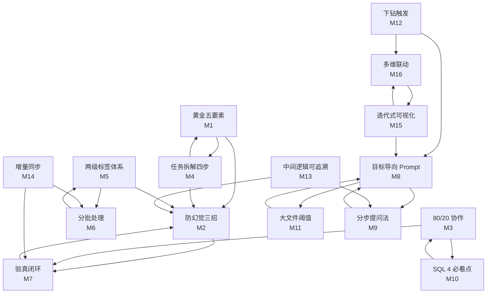

# 方法论组合矩阵

> 基于场景 + 数据规模 + 任务复杂度，智能匹配 16 个原子方法论的组合。
> v3.1 新增：M12 下钻触发 / M13 中间逻辑可追溯 / M14 增量同步 / M15 迭代式可视化 / M16 多维数据联动。

## 组合矩阵

| 场景 | 数据规模 | 推荐组合 | 理由 |
|------|---------|---------|------|
| 1 采集 | 任意 | M1+M2+M7 | 五要素+防幻觉+验真 |
| 1 采集（定期运行） | 任意 | M1+M2+M7+**M14** | 加增量同步（指纹缓存+批量写入+失败兜底） |
| 2 提取 | <100 份 | M1+M2 | 五要素+防幻觉（小量不需要分批） |
| 2 提取 | >100 份 | M1+M2+M6 | 加分批策略 |
| 3 SQL | 任意 | M3+M10+M2 | 80/20+4必看+防幻觉 |
| 4 核对 | 任意 | M2+M7（顶配） | 防幻觉三招强化+验真 |
| 4 核对（含 AI 分析） | 任意 | M2+M7+**M13** | 加中间逻辑可追溯（推导链+校验点） |
| 5 标注 | <1000 条 | M5+M2 | 标签体系+防幻觉 |
| 5 标注 | >1000 条 | M5+M6+M2 | 加分批 |
| 6 周报 | 任意 | M1+M7+M4 | 五要素+验真+拆解（多文件合并） |
| 6 周报（含洞察） | 任意 | M1+M7+M4+**M12**+**M13** | 加下钻触发+可追溯（涌现式洞察+可信度） |
| 7 深度报告 | <1500 行 | M8+M9 | 目标导向+分步提问 |
| 7 深度报告 | 1500-5000 行 | M8+M9 | 同上 |
| 7 深度报告 | >10万行 | M8+M9+M11 | 加大文件阈值 |
| 7 深度报告（含可视化） | 任意 | M8+M9+**M15**+**M16** | 加迭代式可视化+多维联动 |
| 7 深度报告（探索性） | 任意 | M8+M9+**M12**+**M13** | 加下钻触发+可追溯（涌现式维度+逻辑链） |
| 7 深度报告（探索性+可视化） | >10万行 | M8+M9+M11+**M12**+**M13**+**M15**+**M16** | 全套探索+可视化组合 |

## v3.1 新增方法论定位

| 方法论 | 核心定位 | 触发条件 | 联动组合 |
|--------|---------|---------|---------|
| **M12 下钻触发** | 探索性数据分析（涌现式维度） | "深入分析""下钻""为什么这个数据" | M8（目标导向）+ M16（多维联动） |
| **M13 中间逻辑可追溯** | AI 分析可信度机制 | "为什么这个结论""这个怎么算的" | M2（防幻觉）+ M9（分步提问） |
| **M14 增量同步** | 定期运行任务效率优化 | "定期采集""每天自动跑""增量更新" | M6（分批处理）+ M7（验真） |
| **M15 迭代式可视化** | 图表制作三步迭代流程 | "画个图""可视化""图表优化" | M8（目标导向）+ M16（多维联动） |
| **M16 多维数据联动** | 多维关系展现四步法 | "多维关系""联动""多个图表组合" | M15（迭代式可视化）+ M12（下钻触发） |

## 复合场景的组合策略

### 跨场景任务（用 M4 编排）

例："抓数据 + 清洗 + 核对 + 出报告"

```
Step 1 提取：M1+M2（采集/提取类 Prompt）
Step 2 清洗：M1（统一格式、去重）
Step 3 核对：M2+M7（防幻觉顶配+验真）
Step 4 分析：M8（目标导向）
```

每步独立出 Prompt，每步结果检查后再进下一步。

**v3.1 增强**：若 Step 3 含 AI 自动核对，追加 M13 中间逻辑可追溯；若 Step 4 含可视化，追加 M15+M16。

### 高风险场景（强化 M2+M7）

涉及金额/人数/合规/对账的场景，M2+M7 必须**顶配**：

```
- M2 三招必须全部出现（亮证据+给示弱+禁脑补）
- M7 验真抽查比例提高（100% 抽查金额大的，5% 抽查金额小的）
- v3.1 增强：若涉及 AI 自动计算（如汇总/聚合），追加 M13 中间逻辑可追溯
```

### 探索性场景（M8 自主权放大 + M12 涌现式下钻）

不确定要什么的探索性分析，M8 自主权放到最大 + M12 下钻触发：

```
- 只给分析目标和维度
- 不给具体指标（让 AI 自己发现）
- 不给绘图指令（让 AI 自己选）
- 容忍一定的试错
- v3.1 增强：基础分析后主动追问"哪些维度有趣？是否下钻？"
```

### 可视化场景（M15 三步迭代 + M16 多维联动）

需要图表展示的场景：

```
Step 1 · 基础代码块（matplotlib/seaborn 静态图）
  → 让 AI 先出最简版本，验证数据正确性
Step 2 · 美化配色（prompt 改写配色+字体）
  → 在 Step 1 基础上优化视觉
Step 3 · 增加交互效果（plotly 动态图）
  → 升级为可悬停/筛选/缩放的交互图

v3.1 增强：若数据含 ≥5 维，追加 M16 多维联动（如热力图+气泡图组合）
```

### 定期运行场景（M14 增量同步 + M6 分批 + M7 验真）

需要定期（如每天/每周）执行的场景：

```
- 首次运行：完整采集 + M6 分批 + M7 验真
- 后续运行：M14 增量同步（指纹缓存比对，只处理变更部分）
- 失败兜底：M14 失败回滚 + M2 防幻觉（不脑补缺数据）
- v3.1 增强：清空+批量写入优于逐行更新（快 30 倍）
```

## 方法论引用图



## 关键引用关系

- **M1→M2**：采集/提取类场景，五要素之后必须叠加防幻觉三招
- **M4→M1/M2**：拆解后每一步都套五要素+三招
- **M5→M6**：标签体系定好后才用分批策略
- **M3→M10**：SQL 协作姿势的具体审查点
- **M8→M9/M11**：深度分析场景，目标导向+分步提问+大文件阈值组合使用
- **M12→M8/M16**（v3.1）：探索性下钻后常用目标导向 + 多维联动
- **M13→M2/M9**（v3.1）：可追溯性需要防幻觉证据 + 分步追问
- **M14→M6/M7**（v3.1）：定期同步常配合分批处理 + 验真抽查
- **M15↔M16**（v3.1）：可视化迭代与多维联动相互配合
