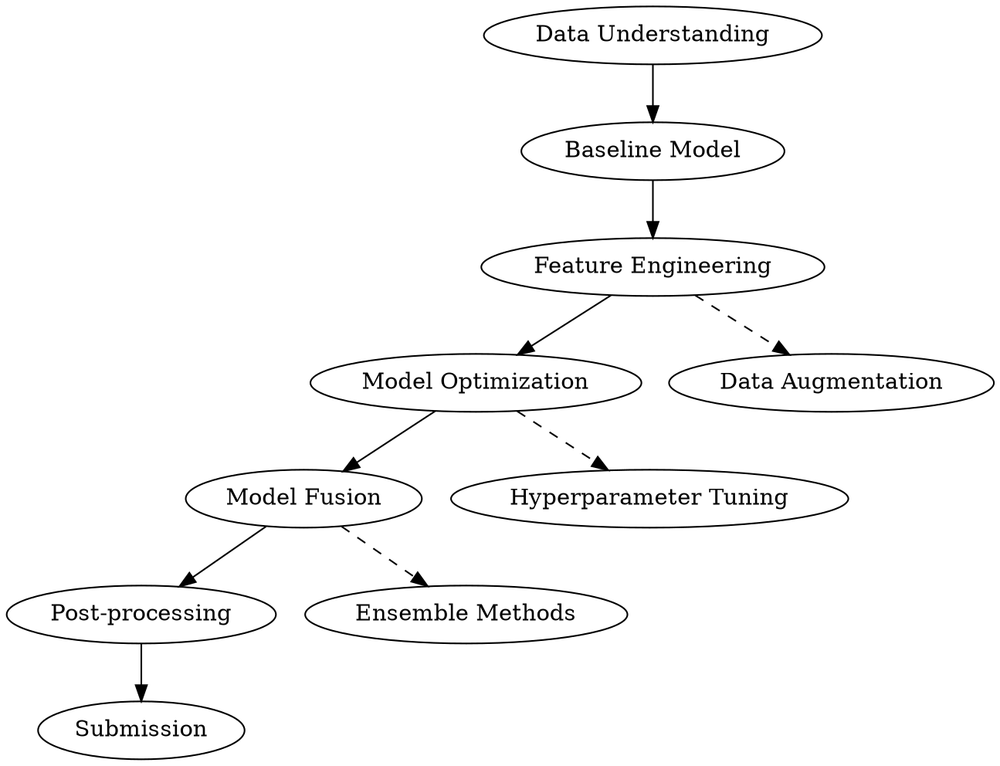

# Competitive Data Science: Baseline to Topline

## Overview

A comprehensive reference guide for data science competitions, covering the complete technical stack from basic baseline to advanced topline solutions. Based on real competition code from multiple platforms (Kaggle, CCF BDCI, DCIC, etc.).

**Core principle:** Systematic progression from simple baseline to complex topline through iterative improvements in data processing, feature engineering, model building, and fusion strategies.

## When to Use

- Starting a new data science competition
- Improving an existing baseline solution
- Need advanced feature engineering techniques
- Building multi-model fusion systems
- Optimizing model performance for leaderboard

**When NOT to use:**
- Production deployment (different considerations)
- Real-time inference systems
- Small datasets where simple models suffice

## Core Workflow



## Data Processing Techniques

### Data Cleaning

| Technique | When to Use | Example |
|-----------|-------------|---------|
| JSON field parsing | Structured data in JSON format | `json.loads(x)['field']` |
| Time field extraction | Temporal features needed | `df['hour'] = df['datetime'].dt.hour` |
| Missing value handling | NaN values present | `fillna('__NaN__')` or `fillna(method='ffill')` |
| Outlier detection | Anomalous values | IQR method or domain-specific rules |

### Feature Engineering

**Time-based Features:**
```python
# Time difference features
df['ts_diff'] = df.groupby('user')['timestamp'].diff(1)

# Cyclical encoding
df['hour_sin'] = np.sin(df['hour']/24*2*np.pi)
df['hour_cos'] = np.cos(df['hour']/24*2*np.pi)
```

**Aggregation Features:**
```python
# Group-by statistics
for method in ['mean', 'max', 'min', 'std']:
    df[f'feature_{method}'] = df.groupby('group')['feature'].transform(method)

# Cross-group statistics
df['feature_ratio'] = df['feature'] / df.groupby('group')['feature'].transform('mean')
```

**Text Embedding Features:**
```python
# Word2Vec
from gensim.models import Word2Vec
model = Word2Vec(sentences, vector_size=64, window=5)
df['text_emb'] = df['text'].map(lambda x: model.wv[x])

# TF-IDF + SVD
from sklearn.feature_extraction.text import TfidfVectorizer
from sklearn.decomposition import TruncatedSVD
tfidf = TfidfVectorizer(ngram_range=(1,2))
svd = TruncatedSVD(n_components=100)
tfidf_svd = svd.fit_transform(tfidf.fit_transform(texts))
```

**Target Encoding:**
```python
# Mean encoding with smoothing
global_mean = df['target'].mean()
df['target_encoded'] = df.groupby('category')['target'].transform(
    lambda x: (x.mean() * len(x) + global_mean * 10) / (len(x) + 10)
)
```

### Data Augmentation

| Method | Application |
|--------|-------------|
| Time series sampling | Sequential data |
| Pseudo labeling | Semi-supervised learning |
| Oversampling | Class imbalance (SMOTE, RandomOverSampler) |
| Text augmentation | NLP tasks (synonym replacement, back translation) |

## Model Building Methods

### Traditional ML Models

**LightGBM (Primary for tabular data):**
```python
params = {
    'objective': 'binary',
    'metric': 'auc',
    'num_leaves': 64,
    'learning_rate': 0.05,
    'feature_fraction': 0.8,
    'bagging_fraction': 0.9,
    'bagging_freq': 4
}
model = lgb.train(params, train_set, valid_sets=[val_set])
```

**XGBoost:**
```python
params = {
    'objective': 'binary:logistic',
    'tree_method': 'hist',
    'eval_metric': 'auc',
    'max_depth': 8,
    'subsample': 0.8,
    'colsample_bytree': 0.9
}
```

### Deep Learning Models

**Transformer for NLP:**
```python
class CustomModel(nn.Module):
    def __init__(self, model_name):
        super().__init__()
        self.config = AutoConfig.from_pretrained(model_name)
        self.model = AutoModel.from_pretrained(model_name)
        self.fc = nn.Linear(self.config.hidden_size, 1)
    
    def forward(self, input_ids, attention_mask):
        outputs = self.model(input_ids, attention_mask)
        return self.fc(outputs.last_hidden_state[:, 0])
```

**Full FC for Tabular:**
```python
class FullFC(nn.Module):
    def __init__(self, emb_dim, other_dim):
        super().__init__()
        self.fc1 = nn.Linear(emb_dim, 256)
        self.fc2 = nn.Linear(256, 64)
        self.fc3 = nn.Linear(64, 1)
        self.dropout = nn.Dropout(0.3)
```

### Adversarial Training

**FGM (Fast Gradient Method):**
```python
class FGM:
    def __init__(self, model, epsilon=0.5):
        self.model = model
        self.epsilon = epsilon
    
    def attack(self, emb_name='word_embeddings'):
        for name, param in self.model.named_parameters():
            if param.requires_grad and emb_name in name:
                self.backup[name] = param.data.clone()
                norm = torch.norm(param.grad)
                if norm != 0:
                    r_at = self.epsilon * param.grad / norm
                    param.data.add_(r_at)
    
    def restore(self):
        for name, param in self.model.named_parameters():
            if name in self.backup:
                param.data = self.backup[name]
```

## Training Techniques

### Cross-Validation Strategies

| Strategy | Use Case |
|----------|----------|
| StratifiedKFold | Classification tasks |
| GroupKFold | Prevent data leakage (grouped data) |
| KFold | Regression tasks |
| TimeSeriesSplit | Temporal data |

### Learning Rate Scheduling

**Cosine Annealing:**
```python
scheduler = get_cosine_schedule_with_warmup(
    optimizer,
    num_warmup_steps=warmup_steps,
    num_training_steps=total_steps
)
```

**PyTorch CosineAnnealingLR:**
```python
scheduler = torch.optim.lr_scheduler.CosineAnnealingLR(optimizer, T_max=epochs)
```

### Advanced Training

**Gradient Accumulation:**
```python
loss = loss / accumulation_steps
scaler.scale(loss).backward()
if (step + 1) % accumulation_steps == 0:
    scaler.step(optimizer)
    scaler.update()
```

**Mixed Precision (AMP):**
```python
scaler = torch.cuda.amp.GradScaler()
with torch.cuda.amp.autocast():
    outputs = model(inputs)
    loss = criterion(outputs, targets)
```

**EMA (Exponential Moving Average):**
```python
class EMA:
    def __init__(self, model, decay=0.999):
        self.model = model
        self.decay = decay
        self.shadow = {name: param.clone() for name, param in model.named_parameters()}
    
    def update(self):
        for name, param in self.model.named_parameters():
            self.shadow[name] = self.decay * self.shadow[name] + (1 - self.decay) * param.data
```

## Model Fusion Strategies

### Weighted Average Fusion

**Rank-based Fusion (Recommended):**
```python
# Convert to ranks before averaging
rank1 = pd.Series(pred1).rank()
rank2 = pd.Series(pred2).rank()
rank3 = pd.Series(pred3).rank()
final = (rank1 * 0.4 + rank2 * 0.4 + rank3 * 0.2)
```

### Stacking

**NN + Tree Fusion:**
```python
# Train NN, get OOF predictions
nn_oof = train_nn_model()

# Add NN predictions as features for Tree model
df_train['nn_pred'] = nn_oof
df_test['nn_pred'] = nn_test_pred

# Train Tree model with NN features
tree_model = lgb.train(params, train_set)
```

### K-Fold Ensemble

```python
oof = np.zeros(len(train))
preds = np.zeros(len(test))

for fold, (train_idx, val_idx) in enumerate(kf.split(X, y)):
    model = lgb.train(params, train_set)
    oof[val_idx] = model.predict(X[val_idx])
    preds += model.predict(X_test) / n_folds
```

### MC Dropout Ensemble

```python
class MCModel(nn.Module):
    def forward(self, x, mode='train'):
        p1 = self.dropout1(self.fc1(x))
        p2 = self.dropout2(self.fc2(p1))
        p3 = self.dropout3(self.fc3(p2))
        
        if mode == 'test':
            # Multiple predictions with different dropout masks
            return (torch.sigmoid(p1) + torch.sigmoid(p2) + torch.sigmoid(p3)) / 3
```

## Engineering Practices

### Code Organization

```
project/
├── data/           # Raw data
├── features/       # Processed features
├── models/         # Trained models
├── ans/           # Predictions/submissions
├── src/           # Source code
└── notebooks/     # EDA and experiments
```

### Reproducibility

```python
def set_seed(seed):
    torch.manual_seed(seed)
    torch.cuda.manual_seed_all(seed)
    np.random.seed(seed)
    random.seed(seed)
    torch.backends.cudnn.deterministic = True
```

### Result Naming Convention

```python
# Include score in filename
sub.to_csv(f'ans/lgb_{timestamp}_{score:.5f}.csv', index=False)
```

### Feature Importance Analysis

```python
importance = model.feature_importance(importance_type='gain')
feats_importance = pd.DataFrame({
    'name': feature_names,
    'importance': importance / n_folds
}).sort_values('importance', ascending=False)
```

## Competition Strategies

### Single Model Optimization

1. Start with simple baseline
2. Iterate on feature engineering
3. Tune hyperparameters
4. Add regularization

### Multi-Model Fusion

1. Train multiple models (different algorithms/parameters)
2. Get OOF predictions for each
3. Analyze correlation between predictions
4. Weight by individual performance
5. Use rank-based averaging

### Data Splitting Strategy

| Task Type | Split Strategy |
|-----------|----------------|
| Classification | StratifiedKFold |
| Regression | KFold |
| Grouped data | GroupKFold |
| Time series | Time-based split |

### Post-processing

**Threshold Optimization:**
```python
best_threshold = 0.5
best_f1 = 0
for threshold in np.arange(0.1, 0.9, 0.01):
    f1 = f1_score(y_true, (y_pred > threshold).astype(int))
    if f1 > best_f1:
        best_f1 = f1
        best_threshold = threshold
```

## Quick Reference

### Feature Engineering Checklist

- [ ] Time-based features (hour, day, month, diff)
- [ ] Aggregation features (mean, max, min, std)
- [ ] Interaction features (ratios, differences)
- [ ] Text embeddings (Word2Vec, TF-IDF+SVD)
- [ ] Target encoding
- [ ] Cosine similarity/distance

### Model Selection Guide

| Data Type | Recommended Models |
|-----------|-------------------|
| Tabular | LightGBM, XGBoost, CatBoost |
| Text | DeBERTa, BERT, RoBERTa |
| Image | ResNet, EfficientNet, ViT |
| Time Series | LSTM, Transformer, TCN |
| Multi-modal | Fusion of above |

### Common Mistakes

| Mistake | Fix |
|---------|-----|
| Data leakage | Use proper CV, check group features |
| Overfitting | Add regularization, use dropout |
| Poor feature scaling | Normalize/standardize features |
| Ignoring class imbalance | Use SMOTE, class weights, or focal loss |
| Not enough CV folds | Use 5-10 folds for stability |
| Single model only | Always try ensemble/fusion |

## Real-World Impact

Based on analysis of competition solutions:

- **Feature engineering** typically contributes 60-70% of performance gain
- **Model fusion** adds 2-5% on top of best single model
- **Data cleaning** prevents 10-20% performance loss
- **Proper CV** ensures reliable local validation

## References

- LightGBM documentation
- Hugging Face Transformers
- scikit-learn cross-validation
- Kaggle competition solutions
