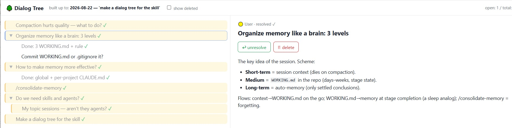

# dialog-tree

You're working through a hard problem with Claude. You ask a question — the answer raises three follow-ups. You dive into the first one; it branches again. Twenty minutes deeper, you surface and try to remember what else you meant to explore. It's gone. And once the session's context gets compacted, it's gone for Claude too.

**dialog-tree** keeps that map for you — as a live, visual tree you open in your browser: every branch of the conversation clickable, with what's answered, what's still open, and what you decided to skip.



The tree is **logical, not literal**: nodes are topics, steps, and decisions distilled from the conversation by Claude — not raw chat messages. One long answer may become three nodes; five messages of back-and-forth may collapse into one. That's what makes it a map you can navigate, and what sets it apart from tools that visualize the message log itself.

*A [Claude Code skill](https://code.claude.com/docs/en/skills). Everything is local: a data file plus a self-contained HTML viewer in your project repo.*

## What this skill does

- Claude maintains a logical tree of the conversation in a data file in your repo (`<project>-tree-data.js`), rendered by a generic viewer next to it (`<project>-tree.html` — the viewer finds its data by its own file name, so several trees coexist on one machine): nodes are **topics and steps** (not raw messages), each with a short label and a condensed digest — code samples, traces, conclusions. Data and view are separate: Claude only ever edits the data file, and viewer upgrades never touch your data.
- You get the tree in a browser: your questions highlighted on the left, details on the right, buttons to mark **resolved** / **delete**, a counter of open branches.
- Your marks live in the browser's localStorage keyed by stable node ids — they survive Claude rewriting the data.
- A `builtUpTo` marker records how far into the conversation the tree is built, so updates are incremental ("update the tree" = decompose only what's new).
- The tree doubles as a session conspectus: after compaction or in a new session, Claude re-reads it to restore the map of what was discussed and what's still open.

## Install

Copy this folder into your skills directory:

```bash
cp -r dialog-tree ~/.claude/skills/dialog-tree
```

## Use

In any Claude Code session:

- *"Set up a dialog tree for this conversation"* — creates `<project>-tree.html` + `<project>-tree-data.js` in your project root (or wherever you tell Claude to put them) and decomposes the conversation so far. The files live in your repo, next to your code — so the tree is versioned with the project and survives any session.
- *"Update the tree"* — appends everything since the last `builtUpTo` marker.
- *"Show open branches"* — the open nodes are the stack of unexplored threads.

You don't open any files by hand: Claude starts a local static server and hands you an `http://localhost:<port>/<project>-tree.html` link — in Claude Code it also opens right in the built-in browser pane. Ask for the link again in any later session ("show the tree") and Claude restarts the server.

(Opening the HTML straight from disk also works, as a fallback — but pick one way and stick to it: your resolve/delete marks live in the browser's localStorage, which is bound to the origin, so `file://` and `localhost` keep separate marks.)

## Pairs well with working-memory

[working-memory](../working-memory/) carries a project's state across many sessions; **dialog-tree** maps the branches of one live conversation. One is the memory of *the work*, the other is the map of *this discussion*.

## Notes

- Everything is dependency-free and local: the viewer loads the data via `<script src>`, which works from disk too (no CORS issues, unlike fetching JSON).
- To localize the UI, define a `STRINGS` object in the data file (a commented template is included) — the viewer ships English defaults.
- The tree is built by the model, not by a parser: decomposing prose into semantic nodes is exactly the part that needs an LLM, so the app stays a dumb renderer by design.
