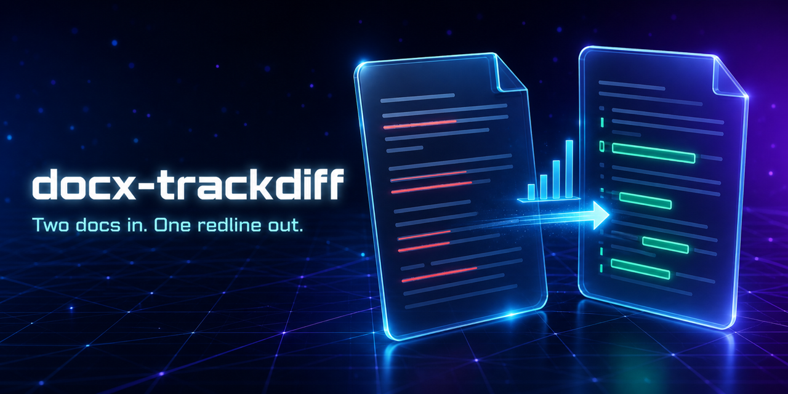
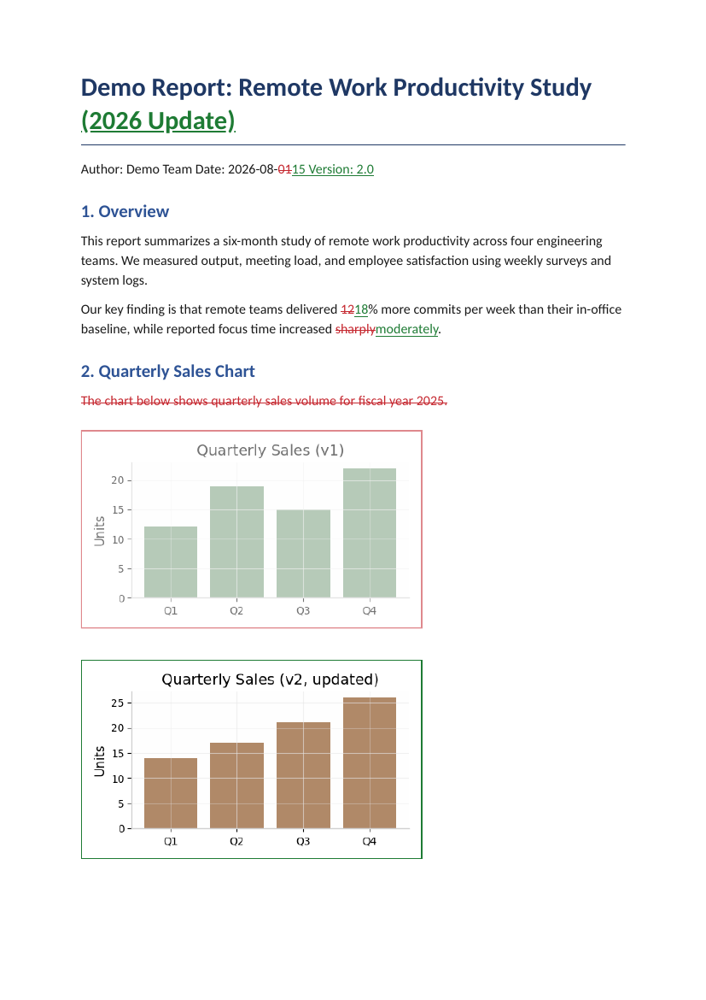
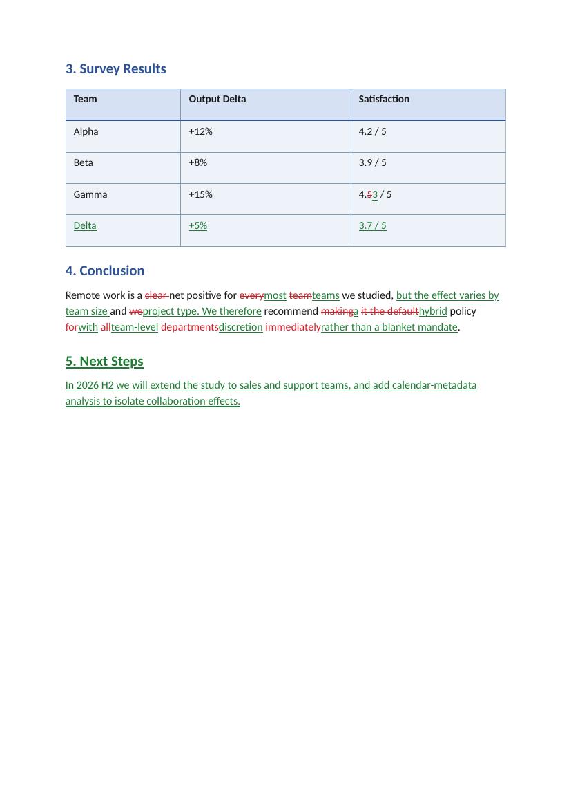

# 📝 docx-trackdiff



**Compare two Word documents (.docx) and get a native Track Changes redline — as if a human editor had revised the old draft into the new one with "Track Changes" switched on.**

English | [简体中文](README.zh-CN.md)


`track-changes` `docx-diff` `word-compare` `redline` `document-comparison` `ooxml` `kimi-skill` `agent-swarm`

---

## 🤔 Why this exists

In the age of AI-assisted writing, documents iterate *fast*. A paper, a report, a contract — every prompt produces a new version, and suddenly you have `v3-final-FINAL.docx` chaos. You want to know **exactly what changed** between two drafts, in the one format every collaborator understands: **Word's native revision mode**, where each edit can be individually accepted or rejected.

Existing options fall short:

- ☁️ Online comparison tools require uploading your unpublished manuscript — a privacy no-go for pre-publication research.
- 📄 Word's built-in *Compare* works, but is manual, GUI-bound, and can't be scripted into an automated pipeline.
- 🐍 `difflib` & friends give you text diffs, not a Word file with real `<w:ins>` / `<w:del>` revision marks.

This tool fills the gap: **one command in, one tracked-changes `.docx` out** — open it in Microsoft Word, WPS, or LibreOffice and review every insertion and deletion in the familiar "All Markup" view.

## 📸 Demo

Two synthetic demo documents (text + figure + table) are compared — no real data involved:

| Page 1 — title, inline edits, deleted caption, replaced figure | Page 2 — table cell edit, new row, rewritten conclusion, new section |
|---|---|
|  |  |

Notice the details:

- 🔤 **Word-level inline revisions** — `12%` → ~~12~~`18%`, ~~sharply~~`moderately`
- 🖼️ **Figure replacement tracked** — the old chart is marked deleted *with its original bytes preserved*, the new chart marked inserted
- 📊 **Table edits** — a changed cell (`4.5` → `4.3`) and an inserted row (`Delta`)
- ➕➖ **Whole-paragraph insertions & deletions** — the removed caption, the new "Next Steps" section

Try it yourself with the files in [`examples/`](examples/):

```bash
python3 scripts/compare_docx_tracked.py examples/demo_v1.docx examples/demo_v2.docx out.docx --author "You"
```

## ✨ Features

- ✅ **Native Word revisions** — real `<w:ins>` / `<w:del>` with unique IDs, author, and date; `w:trackChanges` enabled automatically
- ✅ **Word-level granularity** — modified paragraphs get fine-grained inline diffs, not just whole-paragraph replace
- ✅ **Structure-aware** — headings, styles, tables, footnotes, hyperlinks, equations (OMML), and section layout are preserved from the new version
- ✅ **Image fidelity, both directions** — changed figures keep the *old* image bytes inside the deletion mark, so "reject change" truly restores the old picture
- ✅ **Privacy-first** — 100% local, no upload, no network call
- ✅ **Self-verifying** — bundled verifier simulates *accept all* (must equal the new file) and *reject all* (must equal the old file), plus 5 more structural checks
- ✅ **Zero config** — one Python file + `lxml`, that's it

## 🚀 Quick Start

Requirements: Python 3.8+, `lxml` (`pip install lxml`). LibreOffice optional (render check only).

```bash
git clone https://github.com/stephenlzc/docx-trackdiff.git
cd docx-trackdiff

# 1. Generate the tracked-changes document
python3 scripts/compare_docx_tracked.py OLD.docx NEW.docx OUTPUT.docx \
    --author "Your Name" --date "2026-08-15T00:00:00Z"

# 2. Verify (mandatory — 7 automated checks)
python3 scripts/verify_tracked.py OUTPUT.docx OLD.docx NEW.docx

# 3. Optional render check
soffice --headless --convert-to pdf OUTPUT.docx
```

Open `OUTPUT.docx` in Word → Review tab → **All Markup**. Accept or reject each change individually.

### Options

| Flag | Default | Meaning |
|---|---|---|
| `--author` | `Editor` | Revision author shown in Word's markup panel |
| `--date` | today | Revision timestamp |
| `--threshold` | `0.45` | Paragraph similarity cutoff: above → inline word-level diff; below → whole-paragraph delete+insert |

## 🤖 Use as a Kimi Agent Skill

This repo doubles as a **Kimi agent skill**. Clone it (or download the ZIP) and drop the folder into your Kimi skills directory (`~/.kimi-code/skills/` or `~/.agents/skills/`), then simply say:

> "对比一下这两个版本的 docx，给我一份修订模式的文件"
> "Compare these two Word documents with track changes"

The agent reads `SKILL.md`, runs the bundled scripts, verifies the output, and hands you the redline — no manual steps.

## 🧠 How it works

1. **Paragraph alignment** — `difflib.SequenceMatcher` over normalized text (curly quotes, dashes, spaces folded) aligns paragraphs between versions; a DP second pass pairs up "modified" paragraphs inside replace blocks (similarity ≥ threshold).
2. **Word-level diff** — modified paragraphs are tokenized and diffed; runs are split at diff boundaries while preserving original formatting. Paragraphs whose diff boundary crosses an atomic element (image, equation, hyperlink) fall back to whole-paragraph delete+insert by design.
3. **OOXML surgery, done right** — deleted paragraphs are deep-copied with their formatting, converted to `w:delText`, paragraph marks flagged, relationship IDs remapped, and *old image bytes copied into the package* so reject-all is lossless. `w:trackChanges` is injected at the schema-correct position in `settings.xml`.
4. **Verification** — unique revision IDs, no stray `w:t` inside `w:del`, no dangling references, accept/reject round-trip equality, deleted-content coverage, author/date presence, and old-image byte preservation.

See [`references/ooxml-revision-rules.md`](references/ooxml-revision-rules.md) for the full rulebook and known failure modes.

## ⚠️ Limitations

- Compares the **main document body** (including table cells); comments and footnote *content* are not diffed
- A few paragraphs containing images/equations may appear as whole-paragraph delete+insert (designed fallback)
- Verified via LibreOffice + XML-level simulation; for high-stakes use, eyeball the result in desktop Word's All Markup view
- `.doc` files must be converted to `.docx` first

## 🌱 Origin Story

This skill was **not** designed in the abstract — it was born from a real workflow. While iterating on an academic paper across multiple AI-assisted revisions, [Big Stephen](https://github.com/stephenlzc) needed to see exactly what changed between drafts. The entire pipeline — diff algorithm, OOXML revision markup, verification harness, and this very skill packaging — was implemented through **Kimi K3's Agent Swarm** (by [Moonshot AI](https://www.moonshot.ai/)): a coder subagent built and hardened the scripts, and a swarm-style evaluation round (paired with-skill vs. baseline runs, blind grading by a verifier subagent) caught and fixed a real image-fidelity bug before release.

The headline results of that evaluation: the with-skill run finished in **~1 minute** versus **~15 minutes** for a competent from-scratch baseline, with zero judgment errors. And the blind grader earned its keep — it caught a genuine image-fidelity defect (a replaced figure's *old* bytes were silently lost, so "reject change" would have restored the wrong picture) that the skill's own text-only verifier could not see. The fix and two hardened verifier checks (now 7 total) came straight out of that loop. Full report: [EVALUATION.md](EVALUATION.md).

It worked so well in daily use that it was distilled into this reusable skill and open-sourced. **Built with Kimi K3.** 🌒

## 🙌 Credits

- **Author**: Big Stephen — idea, requirements, real-world testing
- **Co-author**: Kimi K3 Agent Swarm by [Moonshot AI](https://www.moonshot.ai/) ([@MoonshotAI](https://github.com/MoonshotAI) · [Kimi-K3](https://github.com/MoonshotAI/Kimi-K3)) — implementation, verification, packaging

## 📄 License

[MIT](LICENSE) — use it anywhere, attribution appreciated.

## 🔖 Topics

`docx` `track-changes` `word-diff` `redline` `document-comparison` `ooxml` `python` `kimi` `kimi-k3` `moonshot-ai` `agent-skill` `ai-writing` `diff-tool` `word-documents` `revision-tracking`
