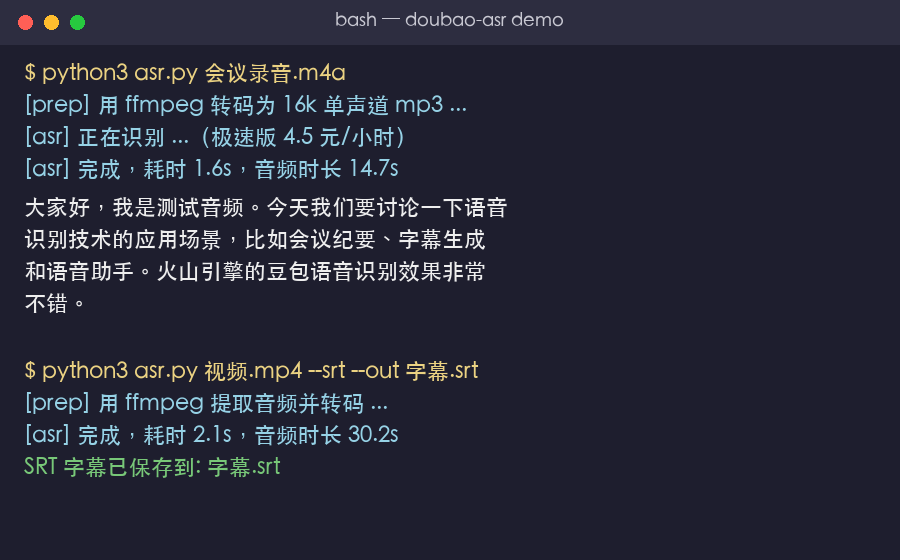

# Doubao ASR Flash · 豆包语音识别极速版 Agent Skill

[](LICENSE)

> 火山引擎豆包语音识别（录音文件**极速版**）的轻量 Agent Skill — 一个 API Key、一次请求、直接出文字。
> A lightweight Agent Skill for ByteDance Volcengine Doubao ASR (Audio File Recognition **Flash** tier) — one API key, one HTTP request, transcript out.

把本地音频/视频文件（或公网音频 URL）转成文字：录音转写、会议纪要、播客字幕、视频伴音提取、字幕(SRT)导出。
Transcribe local audio/video files (or public audio URLs) to text: meeting notes, podcast subtitles, video audio extraction, SRT export.

## ✨ 特性 Features

- **极简配置**：只需 **1 个 API Key**（新版控制台"专属 API Key"），无需 IAM、无需 TOS 对象存储
  One API key only — no IAM credentials, no TOS bucket setup.
- **极速接口**：flash 极速版，**一次 HTTP POST 直接返回结果**，无需 submit/query 轮询
  Flash tier — single HTTP POST returns the transcript, no polling.
- **视频直转**：mp4/mov/mkv 等一切视频自动用 ffmpeg 提取音频并转码；m4a/flac/aac 等音频同样自动转码
  Any video/audio format auto-transcoded via ffmpeg (16kHz mono mp3).
- **逐句时间戳**：`--json` 输出含 `utterances`（每句起止毫秒），`--srt` 直接导出标准字幕
  Per-utterance timestamps in `--json`; standard SRT subtitle export.
- **中文识别业界领先**：普通话/粤语/四川话等方言 + 13+ 语言
  Best-in-class Chinese ASR (Mandarin / Cantonese / Sichuan dialect + 13+ languages).
- **零额外依赖**：Python 3 + requests（转码时才需要 ffmpeg）
  Python 3 + requests only (ffmpeg needed only for non-WAV/MP3/OGG inputs).

## 🖥️ 效果演示 Demo



## 📦 安装 Install

```bash
# 方式一：从 ClawHub 安装（推荐）
openclaw skills install doubao-asr-flash

# 方式二：从 GitHub 克隆后复制为 agent skill
# 复制到你的 skills 目录（Claude Code / OpenClaw / pi 等）
git clone https://github.com/BlackCorvu/doubao-asr-flash.git
cp -r doubao-asr-flash ~/.pi/agent/skills/doubao-asr      # pi
cp -r doubao-asr-flash ~/.claude/skills/doubao-asr        # Claude Code
```

依赖：`pip3 install requests`；转码需要 `ffmpeg`（`brew install ffmpeg` / `apt install ffmpeg`）。

## 🔑 配置 Setup（约 2 分钟）

1. 打开火山引擎**语音技术**控制台：<https://console.volcengine.com/speech/app>（未注册先注册 + 实名认证）
2. 左侧「语音识别」→ 开通「录音文件识别」（申请 `volc.bigasr.auc_turbo` 资源权限）
3. 左侧「API Key 管理」→ 创建 API Key（UUID 格式）

把 Key 存到配置文件（推荐，持久化）：

```bash
mkdir -p ~/.config/doubao-asr
printf '{"api_key": "你的API Key"}\n' > ~/.config/doubao-asr/config.json
chmod 600 ~/.config/doubao-asr/config.json
```

或使用环境变量：`export DOUBAO_ASR_API_KEY="你的API Key"`，或每次调用 `--api-key`。

> Key 查找优先级：`--api-key` 参数 > 环境变量 `DOUBAO_ASR_API_KEY` > `~/.config/doubao-asr/config.json`

## 🚀 使用 Usage

```bash
ASR="scripts/asr.py"

python3 "$ASR" /path/to/recording.m4a                  # 音频 → 全文
python3 "$ASR" /path/to/meeting.mp4                    # 视频自动提取音频 → 全文
python3 "$ASR" https://example.com/audio.mp3           # 公网 URL 直传
python3 "$ASR" a.m4a --out transcript.txt              # 保存到文件
python3 "$ASR" a.m4a --json                            # 完整 JSON（含逐句时间戳）
python3 "$ASR" a.m4a --srt --out subs.srt              # 导出 SRT 字幕
python3 "$ASR" a.m4a --out text.txt --srt              # 文本 + 字幕双输出
```

### 输出示例 Sample output

```
大家好，我是测试音频。今天我们要讨论一下语音识别技术的应用场景，
比如会议纪要、字幕生成和语音助手。火山引擎的豆包语音识别效果非常不错。
```

`--json` 包含逐句时间戳：

```json
{
  "audio_info": {"duration": 14700},
  "result": {
    "text": "大家好，我是测试音频。...",
    "utterances": [
      {"start_time": 80, "end_time": 2320, "text": "大家好，我是测试音频。"},
      {"start_time": 2680, "end_time": 10640, "text": "今天我们要讨论一下..."}
    ]
  }
}
```

`--srt` 生成标准字幕（可导入剪辑软件/播放器）：

```
1
00:00:00,080 --> 00:00:02,320
大家好，我是测试音频。
```

## 💰 价格 Pricing（2026-08 官方）

| 产品 | 按量后付费 |
|------|-----------|
| 录音文件识别 **极速版**（本 skill） | **4.5 元/小时**（按音频时长） |
| 录音文件识别 标准版 | 2.3 元/小时 |
| 录音文件识别 闲时版 | 1.2 元/小时 |

限流限制：单文件 ≤ 2 小时、≤ 100MB；超过请先分段（`ffmpeg -ss .. -t ..` 切割）。

## 🛠️ 开发细节

- 接口：`POST https://openspeech.bytedance.com/api/v3/auc/bigmodel/recognize/flash`
- 鉴权：`X-Api-Key` + `X-Api-Resource-Id: volc.bigasr.auc_turbo` + `X-Api-Request-Id(UUID)` + `X-Api-Sequence: -1`
- 官方文档：<https://www.volcengine.com/docs/6561/1631584>

## ⚠️ 免责声明 Disclaimer

- 本项目为独立开源实现，与字节跳动/火山引擎官方无关联
- 音频会上传到火山引擎云端处理，**敏感内容请勿上传**
- 使用前请确认你的账号已开通相应服务并知悉计费规则；本仓库不承担任何费用责任
- 参考文档以火山引擎官方最新版本为准

## 📄 License

[MIT](LICENSE)

---

*If this project helps you, consider giving it a ⭐ — it helps other Chinese-ASR users find the easiest path to Doubao ASR.*
