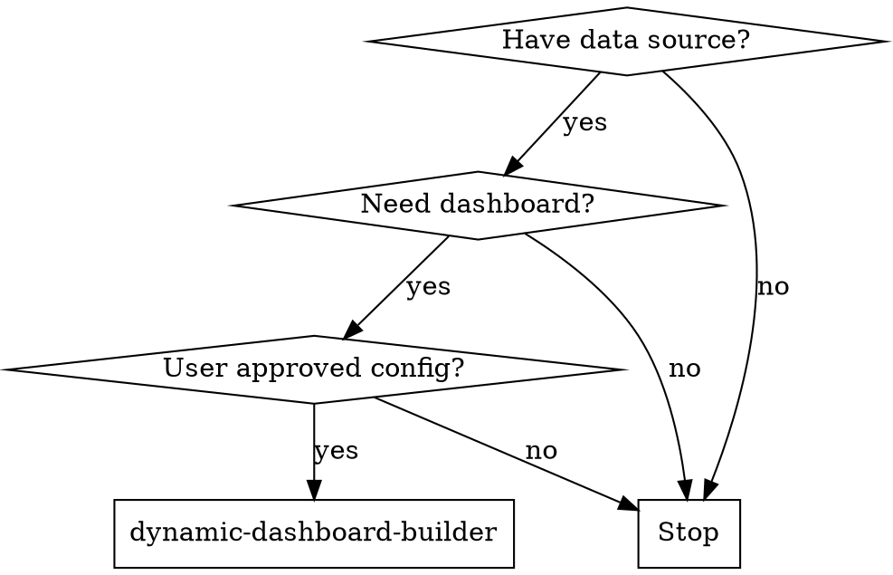

<!-- ===== X∞ COMPLIANCE LAYER (auto-applied by skill-architecture-standard) ===== -->
# dynamic-dashboard-builder — X∞ Compliance Layer

## 1. IDENTITY
Skill milik user: `dynamic-dashboard-builder`. Mengikuti Skill Architecture Standard X∞ (wajib).

## 2. PURPOSE
Membangun dashboard HTML dinamis dari tabel database eksisting dengan refresh periodik—dengan gerbang validasi: endpoint harus terpercaya & disetujui user, polling rate disepakati, skema di-review, dan tidak mengekspos PII. Mencegah hardcode endpoint & auto-create skema tanpa izin.

## 3. METADATA
- name: dynamic-dashboard-builder
- version: 0.2.1
- standard: Skill Architecture Standard X∞ (21-node)
- scope: dashboard HTML dinamis + polling data
- depends_on: database (user-approved), env vars untuk endpoint

## 4. TRIGGER ENGINE
Aktif ketika user meminta hal yang cocok dengan deskripsi di atas.
Negative trigger: di luar scope deskripsi.

## 5. CONTEXT ENGINE
Baca OS/ARCH/runtime sebelum bertindak. Termux Android ARM64 ≠ Ubuntu x86_64.

## 6. DECISION POLICY
IF uncertainty → VERIFY
IF high risk → ASK/STOP
IF tool unavailable → ALTERNATIVE
IF action fails → RECOVER

## 7. REASONING POLICY
Evidence-first. Bedakan FAKTA vs HIPOTESIS. Confidence: CONFIRMED/LIKELY/POSSIBLE/UNKNOWN.

## 8. EXECUTION POLICY
Ambil tindakan relevan, lalu VERIFY. Jangan klaim sukses sebelum diverifikasi.

## 9. TOOL POLICY
Pilih tool berdasar kebutuhan+konteks. Jangan asal panggil semua tool.

## 10. MEMORY POLICY
Ingat hal relevan; abaikan noise. Retrieve saat dibutuhkan, update bila berubah.

## 11. VERIFICATION ENGINE
ACTION → VERIFY → SUCCESS? Jika tidak: DIAGNOSE → RETRY/CHANGE STRATEGY.

## 12. ERROR RECOVERY
transient→retry; timeout→backoff; auth→credential check; dependency→diagnosis; unknown→investigate.

## 13. SECURITY GUARDRAILS
NEVER log secret. REDACT API KEY/TOKEN/PASSWORD/SECRET sebelum simpan. PII: MINIMIZE→REDACT→HASH.

## 14. EVALUATION
Self-eval: capai goal? terverifikasi? ada asumsi? ada gagal? Kirim ke Agent Evaluation Engine.

## 15. OBSERVABILITY
Emit: START/PROGRESS/TOOL CALL/ERROR/RETRY/SUCCESS/FAILURE + TRACE_ID (tanpa secret).

## 16. PERFORMANCE OPTIMIZATION
FULL→OPTIMIZED→LOW RESOURCE mode bila terbatas. Prioritas: TASK>SAFETY>RELIABILITY.

## 17. SELF-IMPROVEMENT
USE→OBSERVE→EVALUATE→FIND WEAKNESS→IMPROVE→TEST→NEW VERSION (via evaluasi+regresi).

## 18. VERSIONING
Semver. Perubahan struktur = MAJOR. CHANGELOG wajib.
**CHANGELOG**
- 0.2.1 — Perbaikan kualitas lapisan X∞: frontmatter `description` rusak (berisi teks changelog) diganti deskripsi trigger nyata; Node 2 (PURPOSE) & Node 3 (METADATA) diisi (bukan stub); `metadata.openclaw.version` diset 0.2.1 seragam dengan _meta/origin. Konten domain (validation gates, core rules, error handling) dipertahankan.

## 19. COMPATIBILITY
Tahu OS/ARCH/RUNTIME/versi/tool/API tersedia.

## 20. KNOWLEDGE SOURCES
Trust hierarchy: OFFICIAL>PRIMARY>REPUTABLE>COMMUNITY>UNKNOWN. Tandai VERIFIED/LIKELY/UNCERTAIN/OUTDATED/CONFLICTING.

## 21. EXIT CONDITIONS
Berhenti pada: SUCCESS/FAILURE/BLOCKED/NEED USER/NEED CREDENTIAL/NEED TOOL/NEED VERIFICATION.
<!-- ===== END X∞ COMPLIANCE LAYER ===== -->


# Dynamic Dashboard Builder

## When to Use

User wants to create a dynamic HTML dashboard from existing database tables with periodic data refresh.



## ⚠️ Validation Gates (MUST confirm before proceeding)

- [ ] **Database endpoint** is TRUSTED and explicitly user-approved
- [ ] **API polling frequency** is agreed (default: 300s, minimum: 60s only for trusted internal APIs)
- [ ] **Schema design** is reviewed and approved by user before creation
- [ ] **No sensitive/PII data** will be exposed in the dashboard
- [ ] **Data retention policy** is understood and accepted

## Core Architecture

1. **Schema Design** — Design database structure based on provided data sample
2. **API Integration** — Connect to user-specified endpoint (never hardcode)
3. **Dashboard Build** — Dynamic HTML with chart components
4. **Polling Loop** — Configurable refresh interval with error handling

## Core Rules

- **NEVER** hardcode API endpoints — always use user-provided or environment variables
- **NEVER** auto-create database structures without explicit user confirmation
- **NEVER** poll external APIs faster than agreed rate limit
- **ALWAYS** sanitize data before rendering
- **ALWAYS** handle API failures gracefully (fallback to cached data)
- **ALWAYS** confirm schema with user before executing CREATE/ALTER operations

## Example

<Good>
```javascript
// ✅ Correct: User-configurable endpoint
const API_URL = process.env.DASHBOARD_API_URL;
const POLL_INTERVAL = parseInt(process.env.POLL_INTERVAL_MS) || 300000;

async function fetchData(endpoint) {
  const res = await fetch(endpoint, {
    method: 'POST',
    headers: { 'Content-Type': 'application/json' },
    body: JSON.stringify({ collection_name: userApprovedTable })
  });
  if (!res.ok) throw new Error(`HTTP ${res.status}`);
  return res.json();
}
```
</Good>

<Bad>
```javascript
// ❌ Wrong: Hardcoded endpoint — NEVER do this
const API_URL = 'https://third-party.com/api/engine/generalDataApi';
setInterval(() => fetch(API_URL), 60000); // Hardcoded 60s polling
```
</Bad>

## Error Handling

| Scenario | Response |
|----------|----------|
| API failure | Show last cached data + error indicator |
| Rate limit hit | Exponential backoff (2x, 4x, 8x...) |
| Invalid schema | Stop and ask user, never auto-correct |
| Auth failure | Alert user immediately, do not retry |
| Network timeout | Retry max 3x with 5s delay, then alert |

## Common Rationalizations

| Excuse | Reality |
|--------|---------|
| "The endpoint is internal, it's fine" | Internal endpoints change. Always configurable. |
| "60s polling is standard" | Standard ≠ safe. Confirm with user and endpoint owner. |
| "I'll create the schema automatically" | Auto-creation destroys data. Always confirm first. |
| "It's just a dashboard, no risk" | Dashboards expose data. PII leaks are permanent. |

## Red Flags — STOP and Ask User

- Hardcoded URL in any file
- Polling interval < 300s without explicit approval
- Auto-executing CREATE TABLE / ALTER TABLE
- Missing error handling on API calls
- Rendering raw user input without sanitization

## Verification Checklist

Before marking dashboard complete:
- [ ] All endpoints are user-configured (env vars or config file)
- [ ] Polling interval is user-approved and documented
- [ ] Schema changes were explicitly confirmed
- [ ] Error states render gracefully (no blank screens)
- [ ] No sensitive data is logged to console or files
- [ ] Rate limiting is implemented and tested
