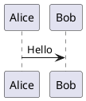

> **Bilingual note**: This English edition mirrors `SKILL.zh-CN.md`. For the authoritative Chinese version, see `SKILL.zh-CN.md`.


# ElegantBook LaTeX Book Builder

本技能用于把用户提供的 Markdown 文档与 `ElegantLaTeX/ElegantBook` 最新中文模板文件一并交给大模型直接阅读、理解和重写，由大模型新写符合 ElegantBook 风格的 LaTeX 源文件，而不是依赖机械转换器逐行转换。生成过程中需优化表格样式，将 Mermaid 与 PlantUML 图表转换为 SVG 后插入，生成完整 LaTeX 书籍项目，并使用本机 TeX Live 编译为 PDF。遇到编译问题时，需要主动定位、修复并重新编译，直到产出可打开的 PDF 或清晰报告阻塞原因。


## ⚠️ Security & Side-Effects Disclosure

| Behaviour | Default | Rationale |
|---|---|---|
| Network access | OFF | Only fetch remote resources when user explicitly approves. |
| Host toolchain install | OFF / fail-closed | Never auto-run `pip install`, `npm install -g`, `apt install`, etc. Report missing deps and wait for manual confirmation. |
| LaTeX `-shell-escape` | OFF | Disabled by default; only enabled when user consents AND environment is sandboxed AND content is trusted. |

**Core principles:**

1. Offline by default — all side-effects require explicit user consent.
2. Fail closed on missing dependencies — never auto-install packages.
3. Never enable `-shell-escape` on untrusted input.
4. Pin remote fetches to release tags (never master/main) — require user approval before network access.

## ⚠️ 安全与副作用声明

| 行为 | 默认值 | 说明 |
|---|---|---|
| 网络访问 | 关闭 | 仅在用户明确同意后访问网络资源。 |
| 主机工具链安装 | 关闭 / 失败即止 | 不会自动运行 `pip install`、`npm install -g`、`apt install` 等。缺失依赖时报告给用户并等待手动确认。 |
| LaTeX `-shell-escape` | 关闭 | 默认不启用 `-shell-escape`；仅在用户明确同意、沙箱/容器化环境、受信内容三者同时满足时才可开启。 |

**核心原则：**

1. 默认离线，所有副作用需用户明确同意。
2. 缺失依赖时**失败即止**，不自动安装任何包。
3. 对不受信内容禁用 `-shell-escape`。
4. 远程获取资源时**固定版本/标签**，不追踪 master/main，并需用户批准。

## 灵活输入支持

本技能接受多种输入格式：

| 输入类型 | 说明 |
|---|---|
| Markdown / TXT 文件 | 最常见输入，直接处理。 |
| JSON 结构化数据 | 包含 `title`、`chapters[]`、`content` 字段时作为结构化大纲处理。 |
| 直接 LLM 上下文 | 当用户以对话方式提供内容时，自动从上下文提取大纲与正文。 |
| URL / 仓库地址 | 仅在用户明确同意后抓取远程内容。 |

## When to Invoke

当用户提出以下任一需求时调用本技能：

- 输入 Markdown，输出 LaTeX 书籍项目或 PDF；
- 使用 ElegantBook / ElegantLaTeX 中文模板排版文档；
- 将 Markdown 内容改写成更像中文书籍、讲义、教程、白皮书或长文档的形式；
- 需要将 Mermaid / PlantUML 图表渲染为 SVG 并插入 LaTeX；
- 需要优化 Markdown 表格为 LaTeX 书籍中的专业表格；
- 需要用本机 TeX Live 自动编译、排错并交付 PDF。

## 输入与输出

### 输入

用户通常会提供以下一种或多种输入：

- 一个 `.md` Markdown 文件；
- Markdown 文本内容；
- 书籍标题、作者、机构、日期、封面风格等元信息；
- 对章节结构、表格样式、图表编号、中文字体、纸张尺寸的特殊要求。

如果缺少关键信息，应采用合理默认值，不要因小问题中断：

- 标题：从 Markdown 一级标题提取；没有则使用文件名；
- 作者：未提供则留空或使用“作者”；
- 编译引擎：优先使用 `xelatex` 或 `latexmk -xelatex`；
- 文档语言：中文优先；
- 输出目录：生成一个独立项目目录，包含 `main.tex`、章节文件、图片资源、编译脚本、最终 PDF。

### 输出

最终应交付：

1. 一个完整 LaTeX 书籍项目目录；
2. 一个可打开的 PDF；
3. 必要时附带编译日志摘要与已修复问题说明。

## Workflow Overview

1. 检查输入 Markdown 与依赖环境；
2. 获取 `https://github.com/ElegantLaTeX/ElegantBook` 最新模板；
3. 读取并理解 ElegantBook 模板的主文件、类文件、示例章节、宏包用法和中文排版约定；
4. 读取并理解用户 Markdown 的标题、章节、表格、代码块、图片、脚注、引用与图表；
5. 由大模型基于 Markdown 原意和模板风格直接新写 LaTeX 文件，不使用 Pandoc 等机械转换结果作为最终正文；
6. 提取 Mermaid 与 PlantUML 代码块并转换为 SVG；
7. 在新写 LaTeX 中以专业方式插入图表、重排内容并优化表格为 `booktabs` / `tabularx` / `longtable` / `threeparttable` 等样式；
8. 生成 ElegantBook 项目；
9. 使用 TeX Live 编译；
10. 根据日志修复错误并迭代编译；
11. 交付项目与 PDF。

## 环境检查

开始处理前，检查以下命令是否可用：

```powershell
xelatex --version
latexmk --version
bibtex --version
```

根据图表类型检查：

```powershell
node --version
npm --version
mmdc --version
java -version
plantuml -version
```

如果缺少 Mermaid CLI，**报告给用户并等待手动安装**。不要自动运行 `npm install -g`。可提供以下命令供用户手动执行：

```powershell
npm install -g @mermaid-js/mermaid-cli
```

缺失时可提供替代方案：保留 Mermaid 源代码块、生成占位图或要求用户安装依赖。

如果缺少 PlantUML，优先检查系统是否已有 `plantuml.jar`、`plantuml` 命令或 Java 环境。不要盲目假设环境完整；缺失时应说明并尽可能提供替代方案，例如保留源代码块、生成占位图或要求用户安装依赖。

**不要自动运行 `tlmgr install`、`apt install` 或任何其他包管理器命令。**

## 获取 ElegantBook 模板

⚠️ 本节涉及网络访问。默认 OFF，仅在用户明确同意后执行。

优先使用本地已有的模板文件。如需从 GitHub 获取，必须固定到 release tag（不得使用 master/main）：

```powershell
git clone --branch <TAG> --depth 1 https://github.com/ElegantLaTeX/ElegantBook.git ElegantBook-template
```

如仓库已存在，**不得执行 `git pull`**（可能拉取未审核的上游变更）。如需更新，应删除旧目录后重新 clone 指定 tag。

注意事项：

- 使用固定版本的中文模板文件作为基础；
- 必须实际读取模板中的示例 `.tex`、`elegantbook.cls`、README / README-cn、示例章节等关键文件，理解其命令、选项、封面、章节、定理环境、提示盒、列表、代码和表格写法；
- 保留 ElegantBook 的许可证与模板来源说明；
- 不要直接污染用户原始 Markdown 文件；
- 输出项目应是独立目录，方便用户再次编译。

## 大模型直写 LaTeX 原则

本技能的核心要求是：**大模型直接读取 Markdown 与 ElegantBook 模板文件后，重新创作新的 LaTeX 源文件**。

必须遵守：

- 不把 Pandoc、markdown-it、脚本解析器等机械转换结果作为最终正文；
- 可以使用脚本辅助提取代码块、图片路径、表格原始数据和图表块，但最终 `main.tex` 与章节 `.tex` 的正文结构、叙述、表格、图注和排版应由大模型综合模板风格后新写；
- 在写 LaTeX 前，先阅读 Markdown 原文与模板关键文件，形成对内容结构和模板能力的理解；
- 新写 LaTeX 时应主动利用 ElegantBook 的章节层级、盒子环境、强调环境、定理/定义/提示类环境等模板特性；
- Markdown 中的内容要保留事实和技术细节，但表达可重组为更适合中文书籍的连续叙述；
- 表格不做逐字符转换，应根据语义重新设计列宽、对齐方式、标题、备注和跨页策略；
- Mermaid / PlantUML 图表应先转换为 SVG，再由大模型在合适位置写入 `figure` 环境、caption、label 与必要说明；
- 如果 Markdown 很长，应分章读取和分章新写，保持术语、编号、图表引用和章节风格一致；
- 生成的 LaTeX 必须是可维护源码，而不是难以阅读的一整段自动转换结果。

推荐直写流程：

1. 读取 Markdown 全文或按章节读取；
2. 读取 ElegantBook 最新模板示例和类文件中与排版相关的命令；
3. 确定书名、章节结构、宏包补充、图表资源清单；
4. 先新写 `main.tex`，再按章节新写 `chapters/chapter-XX.tex`；
5. 对每章内容进行语义重排、表格重设、图表插入和交叉引用；
6. 编译后根据错误日志修正 LaTeX 源码。

## Markdown 解析与内容重写

### 解析策略

解析 Markdown 的目的不是机械转码，而是帮助大模型建立内容地图、资源清单和重写计划。识别以下 Markdown 元素：

- YAML frontmatter；
- `#`、`##`、`###` 标题层级；
- 普通段落；
- 有序 / 无序列表；
- 任务列表；
- 表格；
- 代码块；
- Mermaid 代码块：```` ```mermaid ````；
- PlantUML 代码块：```` ```plantuml ```` 或 `@startuml ... @enduml`；
- 图片：``；
- 链接；
- 引用块；
- 脚注；
- 数学公式；
- 分隔线。

### 重写原则

将 Markdown 改写为更适合中文书籍的表达，并直接写成新的 LaTeX 源码：

- 保留原意，不虚构事实；
- 修正明显语病、口语化表达和重复表述；
- 增加必要的章节过渡句；
- 将零散 bullet 适度整合成段落；
- 为图表添加清晰标题与说明；
- 保持技术术语一致；
- 对英文缩写首次出现时可补充中文解释；
- 避免过度扩写导致内容偏离原文；
- 不保留 Markdown 痕迹，例如原始 `#` 标题、管道表格、裸代码围栏等，除非它们位于代码示例中；
- LaTeX 文件应像人工撰写的书籍源码，结构清楚、章节拆分合理、命令使用一致。

### 章节映射建议

- Markdown `#` → `\chapter{}`；
- Markdown `##` → `\section{}`；
- Markdown `###` → `\subsection{}`；
- Markdown `####` → `\subsubsection{}`；
- 更深层级改为加粗段落标题或列表。

如果 Markdown 只有一个一级标题，可将其作为书名，后续二级标题提升为章。

## LaTeX 项目结构

推荐生成如下结构：

```text
book-project/
  main.tex
  chapters/
    chapter-01.tex
    chapter-02.tex
  figures/
    diagram-001.svg
    diagram-001.pdf 或 diagram-001.png（必要时）
  tables/
    可选：复杂表格片段
  assets/
    原始图片与其他资源
  build.ps1
  README-build.md（仅在用户需要或项目复杂时创建）
  main.pdf
```

如 SVG 不能被当前 LaTeX 编译链直接插入，应使用 `inkscape`、`rsvg-convert` 或其他工具转换为 PDF，再在 LaTeX 中插入 PDF，同时保留 SVG 原文件。

## ElegantBook 主文件配置

主文件必须由大模型在阅读最新模板后重新编写。可以参考模板的结构、命令和风格，但不要简单复制示例正文，也不要将 Markdown 机械替换进模板占位符。主文件应基于 ElegantBook 最新中文模板改造，至少包含：

```latex
\documentclass[cn,11pt,chinese]{elegantbook}

\title{书名}
\subtitle{副标题}
\author{作者}
\institute{机构}
\date{\today}
\version{1.0}

\extrainfo{本文档由 Markdown 内容整理并基于 ElegantBook 模板排版生成。}

\cover{cover.jpg} % 如无封面可删除或使用模板默认
\logo{logo.png}   % 如无 logo 可删除或使用模板默认

\usepackage{booktabs}
\usepackage{tabularx}
\usepackage{longtable}
\usepackage{threeparttable}
\usepackage{array}
\usepackage{makecell}
\usepackage{multirow}
\usepackage{graphicx}
\usepackage{svg}
\usepackage{float}
\usepackage{caption}
\usepackage{subcaption}
\usepackage{listings}
\usepackage{xcolor}
\usepackage{hyperref}

\begin{document}
\maketitle
\frontmatter
\tableofcontents
\mainmatter

\input{chapters/chapter-01}

\end{document}
```

应根据实际 ElegantBook 最新模板调整选项，不要机械套用旧版本语法。若模板包与 TeX Live 中已安装版本不一致，优先使用项目内随模板提供的 `.cls` 或相关文件。

## 表格优化规范

Markdown 表格不要简单转换为普通竖线表格，也不要逐列照搬成不可读源码。应由大模型理解表格语义后重新设计 LaTeX 表格，优先使用专业排版：

### 简短表格

使用 `booktabs`：

```latex
\begin{table}[htbp]
  \centering
  \caption{表格标题}
  \label{tab:example}
  \begin{tabular}{lll}
    \toprule
    列一 & 列二 & 列三 \\
    \midrule
    内容 & 内容 & 内容 \\
    \bottomrule
  \end{tabular}
\end{table}
```

### 宽表格

使用 `tabularx`：

```latex
\begin{table}[htbp]
  \centering
  \caption{宽表格标题}
  \label{tab:wide-example}
  \begin{tabularx}{\textwidth}{lXX}
    \toprule
    项目 & 说明 & 备注 \\
    \midrule
    A & 较长说明文本 & 备注文本 \\
    \bottomrule
  \end{tabularx}
\end{table}
```

### 跨页表格

当行数较多时使用 `longtable`：

```latex
\begin{longtable}{lll}
\caption{跨页表格标题}\label{tab:long-example}\\
\toprule
列一 & 列二 & 列三 \\
\midrule
\endfirsthead
\toprule
列一 & 列二 & 列三 \\
\midrule
\endhead
内容 & 内容 & 内容 \\
\bottomrule
\end{longtable}
```

### 表格处理要求

- 自动生成稳定 label，例如 `tab:chapter-keyword-001`；
- 表头加粗或保持清晰层次；
- 数字列右对齐；
- 文本列使用 `X` 或 `p{}` 控制换行；
- 避免竖线；
- 过宽时优先改为横向页面、缩放或拆表；
- 对表格下方注释使用 `threeparttable`。

## Mermaid 图表转换

### 提取

将以下代码块保存为独立 `.mmd` 文件：

````markdown

````

### 转换为 SVG

使用 Mermaid CLI：

```powershell
mmdc -i 'figures\diagram-001.mmd' -o 'figures\diagram-001.svg' -b transparent
```

如果需要更稳定的中文字体，可配置 Puppeteer / Mermaid theme CSS，确保图中文字显示正常。

### 插入 LaTeX

优先尝试：

```latex
\begin{figure}[htbp]
  \centering
  \includesvg[width=0.9\textwidth]{figures/diagram-001.svg}
  \caption{图表标题}
  \label{fig:diagram-001}
\end{figure}
```

如果 `svg` 包依赖 shell escape 或 Inkscape 不可用，应转换为 PDF：

```powershell
inkscape 'figures\diagram-001.svg' --export-type=pdf --export-filename='figures\diagram-001.pdf'
```

然后插入：

```latex
\includegraphics[width=0.9\textwidth]{figures/diagram-001.pdf}
```

## PlantUML 图表转换

### 提取

识别以下形式：

````markdown

````

以及普通代码块或文本中的 `@startuml` 到 `@enduml`。

### 转换为 SVG

如果系统有 `plantuml` 命令：

```powershell
plantuml -tsvg 'figures\diagram-002.puml'
```

如果使用 jar：

```powershell
java -jar 'plantuml.jar' -tsvg 'figures\diagram-002.puml'
```

### 插入方式

同 Mermaid，优先保留 SVG，必要时转换为 PDF 插入。

## 图片、资源与封面处理

### 封面图强制规则

ElegantBook 模板对封面图片有明确尺寸要求。生成或修改 ElegantBook 项目时，封面必须按以下规则处理：

1. **封面最终尺寸必须严格为 `1280×1024`**。不得只依赖 LaTeX 自动缩放；必须在图片文件层面完成裁剪和缩放。
2. **封面必须由用户提供**。不得自动从 Pixabay、Pexels 或其他远程源下载封面图。
3. 若用户没有指定封面图，可省略 `\cover{}` 并使用模板默认标题页。
4. 不得使用 iStock 广告图、搜索结果缩略图、未知来源或许可证不可确认的图片作为最终封面。
5. 如果使用项目 logo，logo 只能作为封面设计元素，不应被强行拉伸为整张封面背景。
6. 封面源图应保存为 `figures/cover-original.*` 或 `figures/cover-pixabay-original.jpg`；裁剪后的主封面保存为 `figures/cover.png`。
7. `main.tex` 必须设置 `\cover{figures/cover.png}`。
8. 必须记录图片来源到 `metadata/image-sources.md` 或等价文件，包含：来源页面 URL、作者/平台、许可证、访问日期、裁剪方式、最终尺寸。
9. 编译前必须用脚本或图片库验证 `figures/cover.png` 的实际像素为 `1280×1024`。

推荐 Python 裁剪逻辑：先按 5:4 比例中心裁剪，再 resize 到 `1280×1024`。若主体会被中心裁剪切掉，应进行人工裁剪或调整裁剪窗口。

### 普通图片资源处理

- 本地相对路径图片复制到 `assets/` 或 `figures/`；
- 网络图片只有在允许访问且必要时下载，否则保留链接说明；
- 图片文件名统一安全化：英文、小写、连字符或编号；
- 每个图都应有 `caption` 和 `label`；
- 如果图片缺失，生成明确占位说明，不要让编译直接失败；
- 图表图片不要求 1280×1024，只有封面图必须严格遵守该尺寸。

## 代码块处理

普通代码块使用 `listings` 或 `minted`。默认优先 `listings`，因为 `minted` 依赖 Python Pygments 与 shell escape。

示例：

```latex
\begin{lstlisting}[language=Python,caption={示例代码},label={lst:example}]
print("hello")
\end{lstlisting}
```

如果用户明确要求高亮效果且环境支持，可使用 `minted`，并在编译命令中添加 `-shell-escape`。

## 编译流程

⚠️ `-shell-escape` 默认关闭。仅在用户明确同意且环境沙箱化时才启用。

默认（安全）编译：

```powershell
latexmk -xelatex -interaction=nonstopmode -file-line-error main.tex
```

如果没有 `latexmk`，使用多轮 `xelatex`：

```powershell
xelatex -interaction=nonstopmode -file-line-error main.tex
xelatex -interaction=nonstopmode -file-line-error main.tex
```

如果有参考文献：

```powershell
xelatex -interaction=nonstopmode -file-line-error main.tex
bibtex main
xelatex -interaction=nonstopmode -file-line-error main.tex
xelatex -interaction=nonstopmode -file-line-error main.tex
```

## 编译错误处理

遇到错误时必须读取 `.log` 文件并定位根因，不要只看终端最后几行。

### 常见问题与处理

#### Unicode 字符错误

症状：

```text
Unicode character ... not set up for use with LaTeX
```

处理：

- 确认使用 `xelatex`；
- 替换特殊符号或在导言区定义；
- 对代码块内容进行转义；
- 避免直接把 Markdown 原始符号塞入普通 LaTeX 文本。

#### 中文字体问题

症状：找不到 SimSun、Fandol、Source Han 等字体。

处理：

- 检查 ElegantBook 默认中文字体；
- Windows 下可优先使用系统字体，如 SimSun、Microsoft YaHei、KaiTi；
- 避免硬编码不存在字体；
- 必要时移除自定义字体设置，使用模板默认。

#### 图片或 SVG 插入失败

处理顺序：

1. 检查文件路径是否正确；
2. 检查路径是否含空格或中文；
3. 尝试将 SVG 转 PDF；
4. 改用 `\includegraphics` 插入 PDF/PNG；
5. svg 包的 `\includesvg` 需要 `-shell-escape`，但默认关闭；优先使用 PDF 转换方式。

#### 表格过宽

处理：

- 改用 `tabularx`；
- 调整列为 `p{}` 或 `X`；
- 横向排版：`pdflscape`；
- 拆分表格；
- 最后才考虑 `\resizebox{\textwidth}{!}{...}`。

#### LaTeX 特殊字符

必须转义普通文本中的：

```text
# $ % & _ { } ~ ^ \
```

但不要破坏 LaTeX 命令、数学环境和代码块。

#### 缺少包

处理：

- 报告缺失包并停止。**不要自动运行 `tlmgr install`**；
- 改用已安装包的替代方案；
- 如果是 ElegantBook 项目内依赖，确认模板文件是否完整复制。

## 质量检查

交付前执行：

- PDF 是否生成且大小合理；
- 编译日志是否无致命错误；
- 目录是否存在；
- 章节编号是否正确；
- 图表是否显示；
- 表格是否没有明显溢出；
- 中文是否正常显示；
- 原 Markdown 主要内容是否保留；
- Mermaid / PlantUML 原代码与生成 SVG 是否保存。

可用命令检查 PDF：

```powershell
Get-Item main.pdf
```

如可用，也可用 `pdfinfo main.pdf` 检查页数。

## 文件放置规范

- 中间脚本、临时转换文件、缓存文件放在工作目录；
- 最终 LaTeX 项目和 PDF 放在用户可访问的输出目录；
- 不要把 `node_modules`、临时日志、调试脚本污染到最终目录，除非用户明确需要；
- 必须提供最终 PDF 与项目入口文件的可访问链接。

## 交付回复模板

完成后简洁说明：

```markdown
已生成 ElegantBook LaTeX 书籍项目并编译为 PDF：

- [查看 PDF](computer://.../main.pdf)
- [查看 LaTeX 主文件](computer://.../main.tex)

已处理 Mermaid / PlantUML 图表转换和表格排版优化。
```

如果有无法自动解决的问题：

```markdown
项目已生成，但 PDF 编译被以下问题阻塞：...
我已完成的修复：...
建议下一步：...
```

## 禁止事项

- 不要跳过编译直接声称 PDF 已生成；
- 不要忽略 LaTeX 编译日志中的致命错误；
- 不要删除用户原始 Markdown；
- 不要把 Mermaid / PlantUML 原图表直接丢弃；
- 不要把 Pandoc 或其他工具的自动转换结果当作最终 LaTeX 正文；
- 不要在没有读取 Markdown 原文和 ElegantBook 模板关键文件的情况下直接生成 LaTeX；
- 不要简单套壳：即只复制模板并把 Markdown 文本粗暴粘贴进去；
- 不要使用与用户要求无关的模板替代 ElegantBook，除非 ElegantBook 无法使用并已明确说明；
- 不要绕过网络或工具限制获取不可访问内容；
- **不要自动运行 `npm install -g`、`tlmgr install`、`apt install` 等包管理器命令；**
- **不要在默认编译中启用 `-shell-escape`；**
- **不要在未经用户批准的情况下 clone 未固定版本的远程仓库；**
- **不要自动下载远程图片/封面，除非用户明确同意。**
