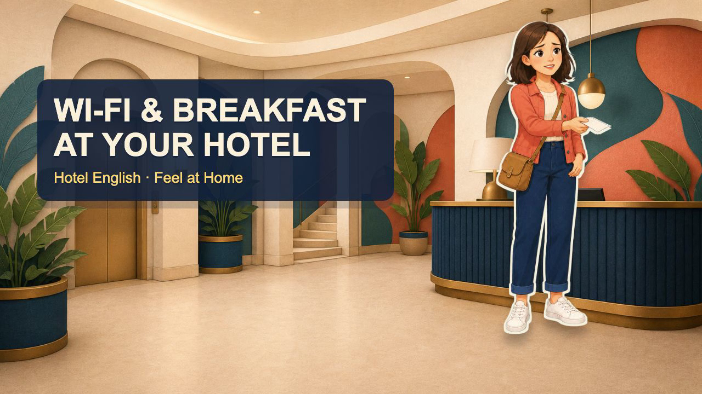
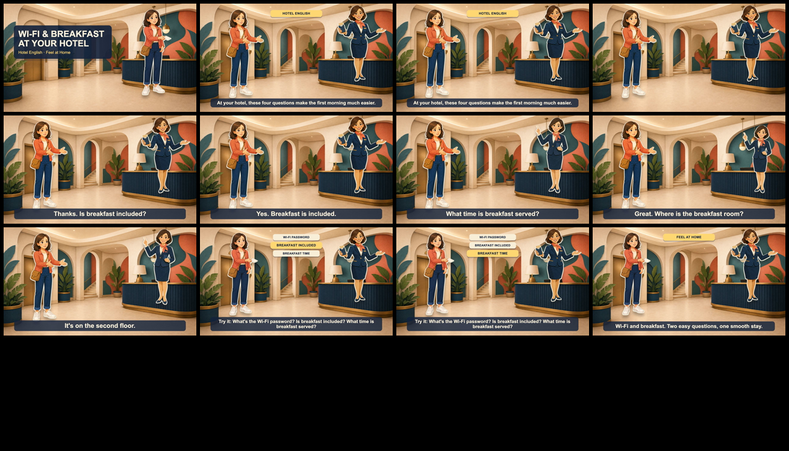
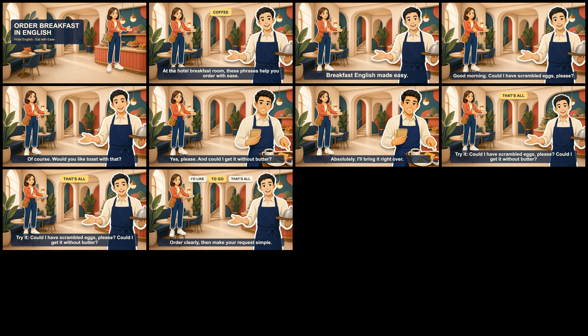

# English Learning Animation

Create short, character-led English-learning videos with layered editorial-cartoon visuals, role-matched Qwen3-TTS voices, English-only on-video copy, and audio-driven timing.

It is designed for repeatable social-video production: a clear cover, a small practical dialogue, phrase practice, and an export that has passed both mechanical checks and visual review.

## What it produces

- Original paper-collage / editorial-cartoon scenes composed from a background plate and independent transparent character layers.
- Distinct Qwen3 VoiceDesign roles, each with a stable voice profile and per-line performance cue.
- Actual-audio-driven scene timing rather than an arbitrary target runtime.
- An English-only video surface, including cover, captions, and practice cards.
- A preflight and post-render review pipeline for sync, layer opacity, render streams, and review-frame extraction.

## Real output

Hotel Wi-Fi and breakfast lesson cover:



Representative review frames from the same episode:



Breakfast-order episode review frames:



## Quality guarantees

The skill validates the production constraints that commonly break short animated lessons:

- Role ownership, voice-profile stability, audio duration, segment windows, and no overlap.
- A solid-alpha character matte: no ghosted characters or flattened background plates.
- English-only on-video text by default and a 2–3 second outcome-led cover.
- Low-frequency, low-amplitude character motion to avoid visual shaking.
- Topic-to-scene metadata via `semantic_contract` and `semantic_tags`.
- Data-driven phrase cards from `script.json`, preventing stale cards from earlier episodes.

Visual meaning still needs human review. The validation workflow extracts a cover and one representative frame for every spoken segment so that setting, props, speaker emphasis, phrase cards, and captions can be checked before publishing.

## Quick start

```bash
python scripts/init_project.py /path/to/new-lesson
cd /path/to/new-lesson
```

Edit `voice-manifest.json` and `script.json`, add the required background plate and transparent character layers, then generate role-separated audio:

```bash
python /path/to/english-learning-animation/scripts/generate_qwen3_voices.py \
  voice-manifest.json \
  --model /path/to/Qwen3-TTS-VoiceDesign
```

Run the complete preflight before rendering:

```bash
python /path/to/english-learning-animation/scripts/validate_project.py .
```

After the Remotion render:

```bash
python /path/to/english-learning-animation/scripts/validate_project.py . \
  --video out/final.mp4 \
  --review-dir work/review-frames
```

## Required lesson metadata

Each project declares its topic and visual intent in `script.json`:

```json
{
  "semantic_contract": {
    "topic": "Ask for subway directions",
    "setting": "subway station entrance",
    "scene_visual_brief": "A transit map, station entrance, and a traveler asking a local for directions.",
    "required_scene_tags": ["subway", "transit", "city"],
    "prohibited_terms": ["coffee", "breakfast"]
  },
  "phrase_cards": {
    "n1": ["SUBWAY DIRECTIONS"],
    "n6": ["HOW DO I GET TO…?", "IS IT FAR?"]
  }
}
```

Every scene also carries matching `semantic_tags`. The semantic validator rejects missing metadata, prohibited stale copy, and renderer code that hard-codes phrase cards.

## Requirements

- Python 3 with the packages required by the bundled validators and local Qwen3-TTS runtime.
- A local Qwen3-TTS VoiceDesign checkpoint for no-reference voice generation.
- Node.js, Remotion, FFmpeg, and FFprobe for rendering and review.
- An image-generation workflow capable of producing empty background plates and chroma-key character cutouts.

Model weights, generated voices, and final videos are intentionally not bundled in this repository.

## License

MIT. See [LICENSE](LICENSE).
