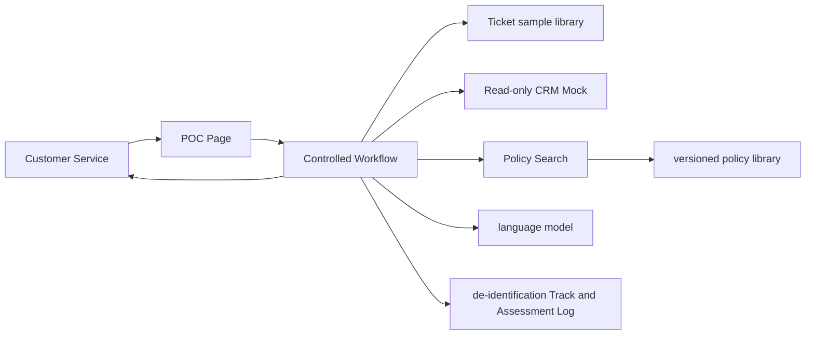

# Complete example of deployment architecture

## Scene

Generate draft responses for billing interpretation tickets. POC only reads the CRM and policy library, and does not send or close ticket.

## Minimal architecture

## Key decisions

| ADR | Decision | Justification | Unproven Content |
|---|---|---|---|
| ADR-001 | Use controlled workflow without autonomous multi-agent | Fixed process, reduce cost and override surface | None |
| ADR-002 | CRM uses read-only Mock | Customer test account will not be available until the second week, verify the business draft first | Real interface delay and reliability |
| ADR-003 | Search returns policy paragraph and version | SupportPOC-003evidence traceability | Production knowledge update process |
| ADR-004 | Customer service confirmation is required after generation | POC is prohibited from being automatically sent | Automated revenue upper limit |

## Permissions and Control

- The tool only has the ability to read ticket, read customer levels, and retrieve policies;
- No sending, closing, modifying CRM or external network access;
- Each output displays the policy source, confidence prompts and items to be confirmed;
- Stop generation and request manual processing when policy conflicts or missing customer levels are detected;
- The log retains the de-identified ticket ID, version, tool track, time consumption and rating, and will be deleted after 30 days.

## Technical Debt

- Mock CRM needs to be replaced with a customer read-only test interface;
- There is no enterprise SSO for the POC page;
- Manually update the policy database, production requires approval and automatic indexing;
- Concurrency, disaster recovery, formal penetration and privacy impact assessments have not yet been conducted.
