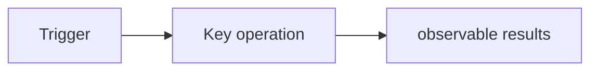

# {Customer/POC Name} PRD Specification Handover Package

| Project | Content |
|---|---|
| Document version | v0.1 |
| Status | Pending specification confirmation / Available for handover |
| Author | |
| Last updated | YYYY-MM-DD |
| Upstream Issue Package | #1 `fde-problem-discovery`: |
| Upstream POC Contract | #2 `fde-engagement-charter`: |

## 0. Upstream Contract Summary

- **Confirmed issue and target users:**
- **Current workflow and evidence link:**
- **POC Questions to Answer:**
- **POC proof criterion:**POC-001…
- **Timebox and responsibilities of both parties:**
- **Confirmed range:**
- **[To be confirmed] / [Dependency]:**

## 1. POC scope and boundaries

### 1.1 Included in this issue

| Priority | Requirement Number | Description |
|---|---|---|
| P0 | FR-001 | |

### 1.2 Clearly do not do it

- OUT-001：

### 1.3 This POC does not prove anything

- NPROVE-001：

## 2. Roles and key workflows

| Role | Task/goal | Authority or decision-making responsibility |
|---|---|---|
| | | |

<!-- Only reserved for stateful, branched, or asynchronous handoffs. -->

## 3. Functional requirements

### FR-001{requirement name}

- **Priority:** P0/P1/P2
- **Corresponding POC certificate:**POC-001
- **User Value:** As {role}, I want {action} in order to {benefit}.
- **Trigger and preconditions:**
- **Main process:**
  1. 
  2. 
- **Business rules and validation:**
- **Exceptions/Boundaries/Fallback:**
- **Permissions and Visibility:**
- **Dependency:** [Dependency]

## 4. Data, integration and non-functional requirements (reserved on demand)

| Field / System | Type or Direction | Source / Trigger | Validation / Permission | Failure Handling | True / Mock / Pending Confirmation |
|---|---|---|---|---|---|
| | | | | | |

| Dimensions | Verifiable Requirements |
|---|---|
| Performance | |
| Security and Privacy | |
| Reliability | |

## 5. Acceptance, testing and demo tracking

| ID | Corresponding requirement | Given / When / Then |
|---|---|---|
|AC-001|FR-001| Given..., when..., then... |

| Requirements | Acceptance Criteria | Test/Demonstration Scenario | POC Proof/Goals |
|---|---|---|---|
| FR-001 | AC-001 | TS-001 | POC-001 / G-001 |

> The number can be added to the project namespace (such as `FR-TR-001`); the success criteria can be`POC-xxx`or`SC-xxx`; the acceptance criteria can be associated with FR or NFR. The tracking check script supports all the above writing methods.

## 6. Downstream handover

### 6.1 Deployment handover → #4

- System, data and environmental constraints:
- Roles, permissions and security requirements:
- Integration, dependencies and Mock boundaries:
- Architectural decisions requiring confirmation:

### 6.2 Briefing on Agent Skills → #5

- Roles and tasks to be served:
- Trigger, input and expected output:
- Workflow rules and tool boundaries:
- Guardrails, manual validation and upgrades:
- Assessment cases and unacceptable results:

### 6.3 POC execution package → #6

- POC proof criterions and passing thresholds:
- Must-run test/Demo scenario:
- Boundaries of test data, real data and simulated data:
- Demo Narrative (Problem → Key Action → Visible Value):

### 6.4 Starting point of value measurement → #7

| Expected Results | Metric Definition | Baseline/Target | Data Source | Owner | Status |
|---|---|---|---|---|---|
| | | [To be confirmed] | | | |

## 7. Risks, Dependencies and To Be Confirmed

| ID | Type | Description | Impact | Responder/Decision Maker | Status |
|---|---|---|---|---|---|
| R-001 | Risk | | | | |
| OQ-001 | To be confirmed | | | | |

## 8. Change record

| Version | Date | Author | Change Notes |
|---|---|---|
| v0.1 | YYYY-MM-DD | | First Draft |
