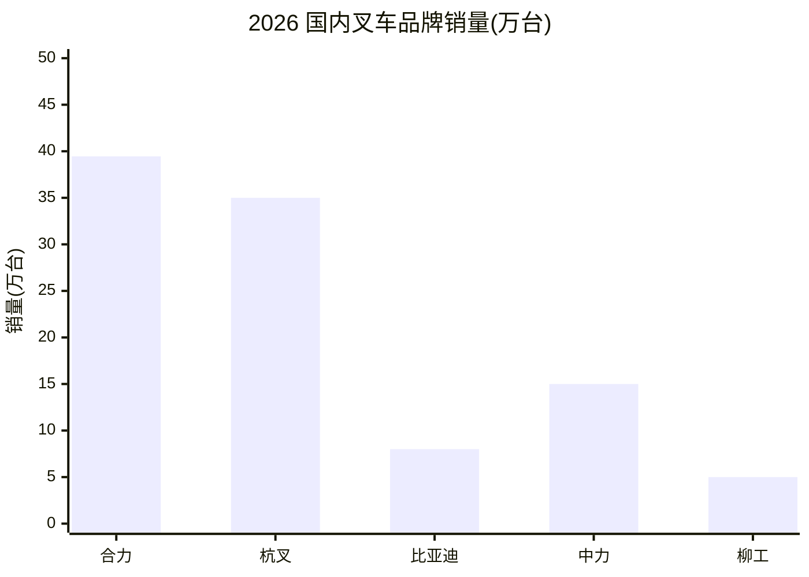

<!--
Copyright (c) 2026 杨鹏飞 / 微信公众号「叉车技术老炮」
Licensed under the MIT License - 完整协议见 ../LICENSE.md
-->
# 叉车销售动态模块（联网 + 图表）

> 本模块在「销售类」问题触发,采用"联网检索 → 分类汇总 → 图表展示"的三段式工作流。
> 数据基准:**实时联网检索**(最近 30-90 天),本地库只作结构骨架,具体数字必须现拉。
> 强制输出形式:**国内品牌 / 国外品牌分别列表 + Markdown 表格 + ASCII 柱状图**。

---

## 一、触发场景（满足任意一条即激活）

### 中文触发词
- "叉车销量"、"叉车销售"、"卖得最好的叉车"、"叉车市场份额"
- "叉车销量排行"、"叉车品牌排行"、"叉车出口数据"
- "2026 叉车市场"、"最近叉车"、"这个月叉车卖得怎样"
- "叉车销量排名"、"哪家叉车卖得好"、"叉车销售冠军"
- "叉车月报"、"叉车季报"、"叉车半年报"、"叉车年报"
- "锂电叉车销量"、"电动叉车销量"、"AGV 销量"、"出口销量"
- "国内品牌 vs 国外品牌"、"国产叉车 进口叉车"

### 英文触发词
- "forklift sales", "forklift market share", "forklift sales ranking"
- "top forklift brands 2026", "forklift market report"
- "electric forklift sales", "lithium forklift sales"
- "forklift export data", "forklift shipments"

### 场景型问题（隐式触发）
- 用户问"想买叉车,看哪个牌子卖得好" → 销售排行视角
- 用户问"叉车行业今年行情" → 销售数据视角
- 用户问"国产和外资叉车差距" → 对比视角,需销量数据支撑

---

## 二、模块工作流（三段式）

```
┌────────────────────────────────────────────────────────┐
│  段 1: 联网检索                                          │
│  ├─ 用 web_search 查"最近 30-90 天"销量数据/新闻          │
│  ├─ 优先源:CITA 月报、海关、上市公司财报、品牌官网新闻        │
│  └─ 至少 2 个独立来源交叉验证                              │
└────────────────────────────────────────────────────────┘
                         ↓
┌────────────────────────────────────────────────────────┐
│  段 2: 分类汇总                                          │
│  ├─ 国内品牌组(自主品牌):合力/杭叉/比亚迪/中力/柳工/...     │
│  ├─ 国外品牌组(外资/合资):丰田/凯傲/永恒力/科朗/...       │
│  └─ 合资/外资在华品牌(凯傲宝骊)按母公司归类                 │
└────────────────────────────────────────────────────────┘
                         ↓
┌────────────────────────────────────────────────────────┐
│  段 3: 图表展示                                          │
│  ├─ Markdown 表格(销量/份额/同比)                        │
│  ├─ ASCII 柱状图(横向条形,直观对比)                       │
│  └─ Mermaid 可选(若宿主支持渲染)                          │
└────────────────────────────────────────────────────────┘
```

---

## 三、联网检索关键词模板（直接套用）

```
# 月度/季度销量
"叉车 销量 2026年 <月份>"
"中国 叉车 销量 月度"
"CITA 工业车辆 月报 2026"
"forklift sales China 2026 monthly"

# 出口数据
"叉车 出口 数据 2026"
"海关 工业车辆 出口"
"forklift export China 2026"

# 品牌动态
"杭叉 销量 2026"
"合力 销量 公告"
"比亚迪 叉车 销量"
"丰田 叉车 销量 全球"
"林德 凯傲 财报 2026"

# 细分市场
"锂电叉车 销量 2026"
"电动叉车 渗透率 销量"
"AGV 叉车 销量 2026"
"lithium forklift sales 2026"

# 财经/上市公司
"杭叉 603298 业绩快报 2026"
"合力 600761 业绩快报 2026"
"中力 603194 业绩快报 2026"
"凯傲 KION 财报 2026"

# 海外重点
"丰田 自动织机 叉车 销量"
"三菱 物捷仕 叉车 销量"
"永恒力 财报 2026"
```

---

## 四、国内/国外品牌分组（标准化分类）

### 国内品牌组（自主品牌）

| 品牌 | 上市 | 备注 |
|------|------|------|
| 安徽合力 | 600761.SH | 央企背景,综合龙头 |
| 杭叉集团 | 603298.SH | 民营龙头,锂电先行 |
| 比亚迪叉车 | 1211.HK | 三电自研,钠电领先 |
| 中力股份 | 603194.SH | 步行式仓储专家 |
| 柳工叉车 | 000528.SZ | 大吨位内燃强项 |
| 三一重工 | 600031.SH | 跨界工程机械 |
| 诺力股份 | 603611.SH | 仓储 + AGV |
| 龙工叉车 | 3339.HK | 中大吨位内燃 |
| 中联重科 | 000157.SZ | 工程机械综合 |
| 海康机器人/极智嘉等 | — | AGV/AMR 专业厂 |

### 国外品牌组（外资/合资）

| 品牌 | 总部 | 在华布局 |
|------|------|----------|
| 丰田叉车 | 日本丰田自动织机 | 销售 + 少量装配 |
| 凯傲集团(林德) | 德国 | 林德 + 永恒力 + 宝骊 |
| 永恒力 | 德国 | 销售 + 部分装配 |
| 科朗设备 | 美国 | 进口为主 |
| 曼尼通 | 法国 | 越野叉车进口 |
| 卡尔玛 | 芬兰 | 港口设备进口 |
| 海斯特-耶鲁 | 美国 | 进口 |
| 三菱物捷仕 | 日本 | 进口 |
| 斗山山猫 | 韩国/美国 | 进口 + 国产 |

### 合资/外资在华品牌

| 品牌 | 母公司 | 归类 |
|------|--------|------|
| 凯傲宝骊 | 凯傲集团(德) | 归入"国外品牌组" |
| 海斯特(部分) | 美国 Hyster | 归入"国外品牌组" |

---

## 五、输出模板（销售类问题强制使用）

### 模板 S:销售排行（核心模板）

```
# 叉车销售动态报告(截至 YYYY-MM-DD)

> 数据来源:联网检索(检索日期:YYYY-MM-DD)
> 数据基期:最近月度公告 / 最近季度财报
> 本地库基准:2026-06,实际数字以联网为准

## 一、市场总览

| 指标 | 数值 | 同比 | 数据源 |
|------|------|------|--------|
| 中国总销量(万台) | xx.x | +x.x% | CITA / 海关 |
| 内销(万台) | xx.x | +x.x% | CITA |
| 出口(万台) | xx.x | +x.x% | 海关 |
| 电动叉车占比 | xx% | +x pp | CITA |
| 锂电叉车占比 | xx% | +x pp | 协会 |

## 二、国内品牌销售排行(图表)

### 销量表

| 排名 | 品牌 | 销量(万台) | 份额 | 同比 |
|------|------|------------|------|------|
| 1 | 安徽合力 | xx.xx | xx.x% | +xx% |
| 2 | 杭叉集团 | xx.xx | xx.x% | +xx% |
| 3 | 比亚迪叉车 | xx.xx | xx.x% | +xx% |
| ... | ... | ... | ... | ... |

### ASCII 柱状图(销量对比)

```
安徽合力   ████████████████████████  xx.xx 万台
杭叉集团   ██████████████████████    xx.xx 万台
比亚迪叉车 ████████████              xx.xx 万台
中力股份   ██████                    x.xx 万台
柳工叉车   █████                     x.xx 万台
...
```

## 三、国外品牌销售排行(图表)

### 销量表(全球或在华)

| 排名 | 品牌 | 销量(万台) | 全球份额 | 在华份额 |
|------|------|------------|----------|----------|
| 1 | 丰田 | xx.xx | xx% | xx% |
| 2 | 凯傲(林德+永恒力) | xx.xx | xx% | xx% |
| 3 | 三菱物捷仕 | xx.xx | xx% | — |
| ... | ... | ... | ... | ... |

### ASCII 柱状图(全球销量对比)

```
丰田自动织机 ████████████████████████  xx.xx 万台
凯傲集团     ██████████████████        xx.xx 万台
三菱物捷仕   ████████████              xx.xx 万台
永恒力       ██████████                xx.xx 万台
科朗         ██████                    x.xx 万台
...
```

## 四、国内 vs 国外 横向对比

| 维度 | 国内品牌合计 | 国外品牌合计 | 差距 |
|------|-------------|-------------|------|
| 在华销量(万台) | xx.xx | xx.xx | xx.xx |
| 在华份额 | xx% | xx% | xx pp |
| 同比 | +xx% | +xx% | — |
| 主流动力 | 锂电领先 | 锂电跟进中 | — |
| 主流场景 | 全场景 | 高端 + 港口 | — |

### ASCII 对比图

```
国内品牌 ████████████████████████  xx.xx 万台 (xx%)
国外品牌 ████████                  xx.xx 万台 (xx%)
```

## 五、关键趋势(联网洞察)

1. **国内龙头**:合力/杭叉电动化继续领先,比亚迪钠电切入 2026 拐点
2. **国外动态**:丰田保持全球第一,凯傲整合林德+永恒力协同效应
3. **电动化**:锂电渗透率突破 70%,钠电开始小批量
4. **出口**:中国出口受欧盟反倾销影响,东南亚/中东增长强劲
5. **(其他联网发现的最新动态)**

## 六、信息源

| 来源 | URL | 数据类型 |
|------|-----|----------|
| CITA 工业车辆分会 | www.chinaforklift.com | 月度公报 |
| 海关总署 | customs.gov.cn | 出口数据 |
| 上交所/深交所 | sse.com.cn / szse.cn | 财报 |
| 品牌官网新闻 | 见 brands.md | 企业动态 |
| 中叉网 | www.chinaforklift.com | 行业新闻 |

资料来源:杨鹏飞/叉车技术老炮维护的 forklift-expert
```

---

## 六、图表格式选择指南

| 场景 | 推荐图表 | 原因 |
|------|----------|------|
| 销量数值对比 | ASCII 柱状图 | 直观,无依赖 |
| 市场份额 | Markdown 表格 | 精确 |
| 同比变化 | Markdown 表格 + 升/降符号 | 同时显示绝对值和变化 |
| 多年度对比 | ASCII 折线(用 ▁▂▃▄▅▆▇█) | 趋势 |
| 排名变化 | Markdown 表格 + ↑↓ 箭头 | 简洁 |

### ASCII 柱状图制作规则

```
1. 用 █ 字符(U+2588)表示 1 个单位宽度
2. 最大长度 30 个字符,根据数据等比例缩放
3. 数字取整到 1 位小数
4. 品牌名右对齐(可用空格填充)
5. 示例模板:

品牌名(占 12 字符) | ████████... | 数字 + 单位
```

### Mermaid 可选(宿主支持时)



---

## 七、硬规则（给 LLM 的执行约束）

1. **必须联网**:销售类问题不允许"凭印象"答,必须 web_search 拉最新数据
2. **必须分两组**:国内品牌 vs 国外品牌,**不可混排**
3. **必须用图表**:Markdown 表格 + ASCII 柱状图至少各 1 个
4. **必须带日期**:所有数字标注"截至 YYYY-MM"或"检索日期 YYYY-MM-DD"
5. **必须标来源**:每组数字后跟来源(CITA/海关/财报/官网新闻)
6. **区分全球/在华**:
   - 全球销量 → 国外品牌表用全球数据
   - 在华销量 → 国外品牌表用中国市场数据
   - 国内品牌 → 主要看中国市场(出口单列)
7. **不编造销量**:具体数字必须是联网查到的,查不到就标"未查到"
8. **避免诱导提问**:不要反问"您想了解哪个品牌",而是用默认数据回答
9. **合资品牌归类**:凯傲宝骊归"国外品牌组";中外合资销售公司按股权归类
10. **图表自适应**:数据差距过大时用对数刻度或截断提示(如 "▏ 超量程")

---

## 八、与其他模块的协同

| 用户问题组合 | 触发模块 |
|--------------|----------|
| "杭叉销量 + 锂电技术参数" | sales-news(销量段) + knowledge.md(技术段) |
| "叉车市场份额 + 出口国别" | sales-news(国内/国外对比) + market-trends.md(出口格局) |
| "丰田叉车全球销售 + 中国售价" | sales-news(国外品牌段) + selection-guide.md(价格段) |
| "锂电叉车销量 + 渗透率走势" | sales-news(细分) + market-trends.md(锂电渗透) |

---

## 九、不在范围内

- 经销商折扣/底价(不给具体数字)
- 二手叉车转手价(走 used-forklift-evaluation.md)
- 未来 5 年预测(走 market-trends.md 的预测段,带"预测"标注)
- 上市公司内部财务数据(只能引公开财报)

---

## 十、版本与更新

- 模块版本:v1.0(2026-08)
- 配套 Skill:forklift-expert v2.3
- 数据刷新频率:**每次问答都联网**（不缓存）
- 已知局限:部分细分车型(III 类步行式等)销量数据公开度低,可能仅有协会口径