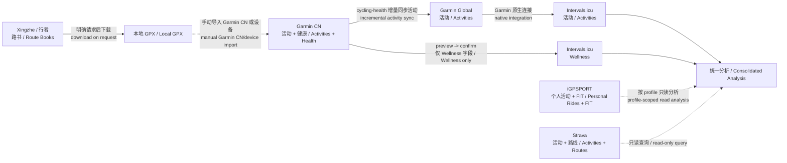

# Cycling Health Analysis / 骑行健康分析

Use `cycling-health` as the source of truth for supported Garmin, iGPSPORT, Intervals.icu, Xingzhe, and Strava operations. The public CLI is available from `https://github.com/baijian/cycling-health`.

以 `cycling-health` 作为 Garmin、iGPSPORT、Intervals.icu、行者和 Strava 相关操作的事实来源。公共 CLI 位于 `https://github.com/baijian/cycling-health`。

## Language / 语言

- Accept requests in Chinese or English and reply in the user's language. For mixed-language requests, follow the language used for the requested output or the user's latest explicit preference.
- 支持中文和英文请求，并默认使用用户当前语言回复；中英混合时，以用户指定的输出语言或最近一次明确偏好为准。
- Keep CLI commands, flags, JSON field names, IDs, filenames, units, and product names unchanged. Explain them in the response language instead of translating machine-readable tokens.
- CLI 命令、参数、JSON 字段、ID、文件名、单位和产品名保持原样，只翻译说明文字，不翻译机器可读标识。

## Principles / 原则

- Be environment-neutral. Do not assume a home directory, repository checkout, shell profile, or operating system.
- Prefer `cycling-health` from `PATH`. If it is missing, guide installation from the public repository.
- When command execution is available, run `cycling-health upgrade --output json` once before status, synchronization, or analysis commands.
- Prefer `--output json` for collection and analysis.
- Treat Garmin credentials, Intervals.icu API keys, OAuth tokens, passwords, MFA codes, account descriptions, downloaded FIT/GPX files, and exported activity files as sensitive local data. Never ask the user to paste secrets into chat.
- Analyze only returned fields. Do not invent HRV, power, zones, fitness, fatigue, form, FTP, W/kg, or causal relationships.
- Collect in stages. Start with summary/list/statistics calls, then request intervals, streams, curves, raw payloads, or exported files only when the conclusion needs them.
- Separate current recovery from durable ability. A poor night or negative form can affect today's decision without proving fitness loss.
- Preserve genuine CLI warnings and unresolved gaps. Expected no-data responses are already normalized by the CLI and do not need to be restated as failures.
- Do not hardcode a timezone such as `Asia/Shanghai`. Use dates/timezones returned by the selected source/profile or ask the user when date ownership is ambiguous.
- Apply the safety, retry, and ambiguity rules below before executing network requests or writes.

Garmin query-region rules / Garmin 区域选择规则:

- If neither Garmin region is logged in, prompt for login.
- If one region is logged in, use it for Garmin queries.
- If both are logged in and the user did not specify a region, default Garmin queries to `cn`.
- Pass the selected region with `--region cn|global`.
- Garmin CN to Global activity sync requires both regions.
- Garmin to Intervals.icu Wellness sync defaults to `--source garmin-cn`. Use `garmin-global` only when explicitly requested because Intervals.icu can already ingest Garmin Global data through its native connection.

## Skill Owner's Best Practice / 技能作者的个人最佳实践

Use the following as the skill owner's personal default architecture, not as a claim that every user has the same integrations. Confirm actual account connections before relying on an automatic hop.

以下是本技能默认采用的个人最佳实践，不代表所有用户都已经配置相同连接。依赖自动同步前，先确认目标账号确实启用了对应连接。



Default decisions / 默认决策:

- Activities / 活动: sync Garmin CN to Garmin Global incrementally; let the user's native Garmin Global to Intervals.icu connection ingest activities. Never duplicate-upload the same Garmin activity through this skill.
- Wellness / 健康: preview Garmin CN health changes with `intervals wellness sync --source garmin-cn`; write only after authorization, then read back and verify.
- iGPSPORT: analyze only the explicitly selected profile and FIT channels. Treat the private CN integration as unsupported and do not auto-sync it elsewhere.
- Strava: keep the CLI workflow read-only; use it for personal activities, routes, zones, gear, streams, and rate-limit context.
- Xingzhe / 行者: use route metadata first, download GPX only when requested, and keep Garmin CN import as a separate manual step.
- Cross-platform / 跨平台: combine conclusions only after confirming identity, time range, units, sensor coverage, and duplicate status.

| Platform / 平台 | Personal role / 个人定位 | Data movement / 数据流 |
| --- | --- | --- |
| Garmin CN | Garmin activity and health source / Garmin 活动与健康源 | Activities to Garmin Global through CLI; selected Wellness fields to Intervals.icu through preview-confirm sync |
| Garmin Global | Activity bridge and Garmin-side query source / 活动中转与 Garmin 查询源 | Activities to Intervals.icu only through the user's native connection |
| Intervals.icu | Consolidated activities, Wellness, power, and training analysis / 汇总活动、健康、功率与训练分析 | Receives the two Garmin flows above; writes remain preview-first |
| iGPSPORT | Selected profile's personal rides and FIT sensor streams / 指定 profile 的个人活动与 FIT 传感器流 | Read/analyze only; no automatic sync |
| Strava | Personal read-only athlete, activities, routes, zones, gear, streams, and rate limits / 个人只读查询 | Read-only in this CLI; no sync to or from Intervals.icu |
| Xingzhe / 行者 | Route books, route detail, and requested GPX download / 路书、路线详情与 GPX 下载 | Download to a local file; Garmin CN import remains manual |

If the Garmin Global native connection is absent or broken, stop and report that prerequisite. There is no fallback that directly uploads Garmin CN activities or FIT files to Intervals.icu.

## Safety, Retry, And FAQ / 安全、重试与常见问题

### Network Retry / 网络重试

- Retry only transient read-only or idempotent network failures: temporary DNS resolution, connection reset, connection timeout, HTTP `408`, `425`, `429`, `500`, `502`, `503`, or `504`.
- When the provider client has no known internal retry, allow at most **3 command executions total** at the skill layer: the initial attempt, then at most two retries. Wait 2 seconds before attempt 2 and 5 seconds before attempt 3.
- Count CLI-internal attempts toward the same budget. Intervals.icu safe requests already use an initial request plus up to two internal retries; do not rerun the command after that retry budget is exhausted.
- Honor `Retry-After` for `429` or `503` when it is 30 seconds or less. If it is longer, stop and report the server-requested delay instead of waiting silently.
- Do not add another retry loop when the CLI reports that its internal retry budget is exhausted. Preserve the final error and the CLI's retry metadata.
- Never retry `400`, `401`, `403`, expected `404` no-data responses, validation errors, profile/region mistakes, permission failures, conflicts, or user cancellation. Fix the cause or ask for authorization instead.
- Preview and read commands may be retried under this policy. Do not automatically replay confirmed writes, deletes, credential changes, event mutations, or `--overwrite` operations after an ambiguous timeout; read back or reconcile remote state first.
- Stop immediately after success. A successful response containing warnings is not a retry trigger; preserve and explain the warnings.

中文摘要：仅对临时网络错误重试；初次请求和内外层重试合计最多 3 次，退避为 2 秒、5 秒，不能在 CLI 内部重试之外再叠加三轮。认证、参数、权限、冲突和预期无数据不能靠重试解决。写操作超时后先回读确认，禁止直接重复写入。

### Security Warnings / 安全警告

- Treat Garmin credentials, Intervals.icu API keys, OAuth tokens, passwords, MFA codes, account descriptions, downloaded FIT/GPX files, and exported activities as sensitive local data. Never ask the user to paste secrets into chat or expose them in logs and reports.
- Treat every global `--profile` as an isolated identity. Do not assume Garmin, Intervals.icu, iGPSPORT, Strava, and Xingzhe profiles belong to the same person or that similarly timed activities are duplicates.
- Preview Garmin Wellness synchronization and Intervals.icu settings/events before writing. Use `--confirm` only after clear authorization; require separate explicit approval for `--overwrite`, deletes, credential revocation, and replacing an existing GPX destination.
- Keep Strava read-only. Treat iGPSPORT as an unsupported private API integration. Do not bypass the public CLI with improvised raw API calls when a command is unavailable.
- Health and recovery observations are not medical diagnosis. Report source, date range, missing data, model limitations, and uncertainty.

中文摘要：凭据和活动文件只保存在本地；不同 `--profile` 默认视为不同身份；所有远端写入先预览、再确认、写后回读；覆盖、删除和撤销授权必须单独批准；健康分析不替代医疗诊断。

### FAQ / 常见问题

**Why are Garmin CN activities not uploaded directly to Intervals.icu? / 为什么不把 Garmin CN 活动直接上传到 Intervals.icu？**

The personal default is Garmin CN -> Garmin Global -> the user's native Intervals.icu connection. Direct upload would risk duplicate activities. Wellness uses a separate field-level sync.

**Why run `cycling-health upgrade` first? / 为什么每次先执行 CLI 自升级？**

The public CLI evolves faster than the skill. Upgrade once per invocation, then verify the requested command with `--help`. If upgrade fails, report it and ask before continuing with the installed version.

**Why is data missing? / 为什么查不到数据？**

Check date semantics, Garmin wake date, region, profile, account identity, activity type, pagination, API scope, and sensor coverage before expanding the date range. Empty normalized results and missing FIT channels can be valid no-data outcomes.

**Can a failed login, permission error, or conflict be retried? / 登录、权限或冲突错误可以重试吗？**

No. Correct authentication, scope, region/profile, input, or authorization. Retrying unchanged non-transient failures wastes quota and can trigger lockouts.

**Will synchronization overwrite existing values? / 同步会覆盖已有数据吗？**

Not by default. Wellness sync previews changes and skips conflicting values. `--overwrite --confirm` requires explicit approval after conflicts are reviewed.

**Can records from different platforms be merged automatically? / 不同平台记录可以自动合并吗？**

No. First establish that profiles represent the same person and that records are duplicates using timestamps, duration, distance, device/source IDs, and sensor coverage. Otherwise keep each source labeled separately.

## References / 参考文档

Read the following references only when the task needs them / 仅在任务需要时读取以下参考文档:

- Read `references/cli-workflows.md` for installation, Garmin authentication, CN-to-Global activity sync, sleep/recovery queries, Garmin ride analysis, file analysis, and Garmin failure handling.
- Read `references/intervals-workflows.md` for Intervals.icu authentication, Garmin CN Wellness sync, Wellness and training-health analysis, activities, power, statistics, settings, sport settings, calendar events, comparisons, and Intervals-specific failure handling.
- Read `references/igpsport-workflows.md` for profile-isolated iGPSPORT authentication, activity/FIT analysis, sensor streams, cache behavior, and unsupported-private-API warnings.
- Read `references/xingzhe-workflows.md` for official Xingzhe OAuth, route-book queries, navigation data, and guarded GPX download.
- Read `references/strava-workflows.md` for official OAuth, personal read-only athlete/activity/route/gear queries, staged stream collection, rate limits, and failure handling.

## Workflow / 工作流

1. Verify and upgrade the CLI:
   - Run `cycling-health version`.
   - Run `cycling-health upgrade --output json` once per invocation.
   - If upgrade fails, preserve the error and ask before continuing with the installed version unless the user already authorized that fallback.
   - Verify the requested top-level source and subcommand with `--help` after upgrade. If missing, report that the installed public CLI is too old instead of improvising another client or raw API call.

2. Check only the authentication needed for the task:
   - Garmin query or CN-to-Global activity sync: run `cycling-health garmin status --output json` and apply the region rules above.
   - Intervals.icu query: run `cycling-health intervals athlete --output json`.
   - Garmin Wellness to Intervals.icu sync: verify Intervals.icu with `intervals athlete` and Garmin CN with `garmin status --region cn`.
   - iGPSPORT task: run `cycling-health --profile PROFILE igpsport auth status --output json`; preserve the requested profile and account description.
   - Xingzhe task: run `cycling-health --profile PROFILE xingzhe auth status --output json`.
   - Strava task: run `cycling-health --profile PROFILE strava auth status --output json`, then query only the athlete, activity, route, gear, or rate-limit data needed for the request.

3. Route the task:
   - Garmin CN activity sync: inspect sync status, then run incremental sync by default.
   - Garmin Wellness sync: preview Garmin CN changes, inspect conflicts/warnings, then confirm only when authorized.
   - Garmin sleep/recovery: use wake-date-aware sleep and summary queries, then add selected health metrics.
   - Garmin single ride or device-specific analysis: start with Garmin activity details and add extended/raw/file data only as needed.
   - Garmin account, trend, race, course, workout, training-plan, achievement, nutrition, or lifestyle query: use only the matching read-only command family and preserve region-specific warnings.
   - Intervals.icu riding health, long-term fitness, power, statistics, or comparison: start with Wellness, activity list, power model/curves, and aggregate statistics appropriate to the question.
   - Intervals.icu settings, sport settings, or calendar event task: read current state first and preview any mutation before requesting authorization.
   - iGPSPORT ride analysis: select the profile explicitly, identify the ride from a bounded list, then add FIT analysis or selected sensor streams only as needed.
   - Xingzhe route task: list or fetch route metadata first; download GPX only when requested and never overwrite an existing path without explicit approval.
   - Strava query: start with athlete or bounded list metadata, then fetch one activity/route, laps, streams, zones, or gear only when needed.

4. Report results:
   - Lead with the conclusion.
   - State date ranges and data source for each conclusion.
   - State the selected region/profile and account description when they affect identity or source ownership.
   - Separate observed values, interpretation, confidence/gaps, and next actions.
   - Use compact units such as km, h:min, bpm, W, W/kg, rpm, m, CTL, ATL, and percent.
   - For writes, report previewed changes, conflicts, uploaded records, verified records, and warnings.

## Task Guidance / 任务指导

### Sync Garmin China Activities To Garmin Global / 同步 Garmin 国服活动到国际服

Use when the user asks to mirror or backfill Garmin China activities into Garmin Global.

1. Confirm both regions are logged in.
2. Inspect `garmin syncstatus`.
3. Run `garmin sync --new-only` unless the user explicitly requests historical backfill.
4. Report retried, synced, failed, and last activity time.

Do not treat this as a direct Intervals.icu upload. The user's Garmin Global connection handles subsequent activity ingestion into Intervals.icu.

### Sync Garmin Health To Intervals.icu / 同步 Garmin 健康数据到 Intervals.icu

Use when the user asks to sync Garmin health, sleep, recovery, or Wellness data to Intervals.icu.

1. Default to Garmin CN and a seven-day range unless the user provides dates.
2. Verify Garmin CN and Intervals.icu authentication.
3. Run `intervals wellness sync --source garmin-cn` without `--confirm` first.
4. Inspect field-level `changes`, `conflicts`, `warnings`, and record actions.
5. If there are no changes, stop; do not issue a confirmed no-op merely for appearance.
6. If the user already clearly requested a live sync, or confirms after seeing the preview, rerun the same range with `--confirm`.
7. Skip conflicting existing values by default. Use `--overwrite --confirm` only after the user explicitly approves replacing them.
8. Report `changedRecords`, `changedFields`, `conflictFields`, `uploadedRecords`, and `verifiedRecords`.

The automatic mapping currently covers sleep duration, sleep score, average sleeping heart rate, overnight HRV, resting heart rate, daily average SpO2, average sleeping respiration, and steps. Missing Garmin values are omitted. Do not reinterpret Garmin stress, Body Battery, training readiness, calories burned, or training load as Intervals.icu Wellness fields.

### Sleep Query And Analysis / 睡眠查询与分析

Use when the user asks about sleep duration, stages, score, overnight HRV, resting heart rate, stress, Body Battery, readiness, or recent sleep trends.

1. Resolve a night by wake date and include the adjacent prior date in sleep lookup.
2. Start with sleep list plus wake-date daily summary.
3. Default recent trends to seven days; use 14-30 days for an explicit baseline/trend question.
4. Add only the health metrics needed for the question.
5. Check adjacent-date and summary fallbacks before declaring sleep details unavailable.
6. Compare with the user's available baseline and avoid medical diagnosis.

### Garmin Cycling Query And Analysis / Garmin 骑行查询与分析

Use Garmin when the question depends on Garmin training effect/status/readiness, device zones, detailed laps/splits, gear/weather, or local FIT/GPX records.

1. Classify the request as single ride, durable ability/progression, or today's training decision.
2. Start a single ride with `garmin activity get`; use extended/raw/file analysis only for missing detail.
3. For ability, default to 90 days and add direct cycling FTP, max metrics, endurance score, hill score, and body weight only when relevant.
4. Use activity progress only for requested axes.
5. Keep recovery/readiness separate from durable ability.
6. Account for terrain, weather, equipment, and sensor coverage; speed alone is not fitness.

### Garmin Extended Queries / Garmin 扩展查询

Use the dedicated read-only Garmin command families for health trends, races/events, saved courses, workouts, training plans, achievements, activity extensions, gear, account settings, nutrition, and lifestyle records. Query only fields relevant to the user's question, keep CN and Global results labeled, and preserve endpoint warnings because some private Garmin responses can differ by region or account.

### Intervals.icu Cycling Query And Analysis / Intervals.icu 骑行分析

Use Intervals.icu when the user asks about riding health/fitness, consolidated training history, eFTP, CTL/ATL/form, power curves/models, aggregate statistics, or comparisons.

1. Choose the smallest useful date range and identify `Ride` records when activity lists include multiple sports.
2. For daily health/recovery, query Wellness. For training health, combine aggregate fitness, fatigue, form, ramp rate, load, and eFTP from statistics; do not conflate these with subjective Wellness values.
3. For one ride, identify it with list/search, fetch detail, then add intervals, streams, best efforts, or activity-analysis endpoints only as needed.
4. For power ability, start with the current MMP model and `42d,1y,all` curves; add per-activity duration values or power-versus-heart-rate data for progression or efficiency questions.
5. For statistics, use a recent range and, when comparison is requested, a preceding non-overlapping range of equal length.
6. Compare like with like: same duration, sport, units, and comparable terrain/workout type. Show absolute and percentage change only when both values are valid.
7. Use Intervals.icu server-calculated values as returned. Do not silently recompute or combine duplicate Garmin/Intervals activity records.
8. Correlate Wellness and performance cautiously; date alignment supports context, not causation.

For Intervals.icu settings, sport settings, and calendar events, query the current object first. Preview settings updates with `--dry-run`; preview event uploads and reconcile with a stable `external_id`; delete only with `--confirm`. Garmin events require explicit mapping and review because there is no automatic Garmin-to-Intervals event-sync command.

### iGPSPORT Cycling Query And Analysis / iGPSPORT 骑行分析

Use iGPSPORT only for the selected personal account profile. Start with a bounded activity list and metadata detail, then use FIT analysis or selected streams for speed, heart rate, cadence, elevation, power, GPS, temperature, laps, or sessions. Report missing channels as sensor coverage, not API failure, when the FIT file lacks them. Label the source as an unsupported private iGPSPORT CN integration and do not merge it with Garmin or Intervals records unless identity and duplication have been established.

### Xingzhe Route Query And Download / 行者路书查询与下载

Use Xingzhe for route books, route navigation/elevation/climb data, and explicitly requested GPX downloads. Query `mine` or `collects` with pages of at most 20 records. Download to a user-approved destination; do not use `--overwrite` without explicit authorization. The CLI does not upload the GPX to Garmin CN, so report the local path and leave Garmin CN/device import as a separate step.

### Strava Read-Only Queries / Strava 只读查询

Use Strava for the authenticated user's athlete profile/zones, cycling activity lists and details, laps, selected streams, routes, route streams, gear, and API rate limits. Start with bounded list or summary data and request detailed streams only when the question needs them. Preserve the selected profile, date range, activity/route IDs, granted scopes, sensor gaps, and returned rate-limit metadata. The CLI is read-only and does not upload, update, delete, synchronize, or cache Strava API data; authorization revocation is a separate destructive action that requires `--confirm`.

## Usage Examples / 使用示例

These examples assume `cycling-health version`, the once-per-invocation
upgrade check, and the required authentication checks have already succeeded.
Replace dates, IDs, profiles, and paths with values from the user's request.

### Example 1: Sync Garmin CN Health To Intervals.icu / 同步 Garmin CN 健康数据

User request: "把 7 月 20 日到 7 月 26 日的 Garmin CN 健康数据同步到
Intervals.icu。"

Preview first:

```bash
cycling-health garmin status --region cn --output json
cycling-health intervals athlete --output json
cycling-health intervals wellness sync \
  --source garmin-cn --start 2026-07-20 --end 2026-07-26 \
  --output json
```

If the preview contains intended changes and the user authorized this live
sync, rerun the exact range with `--confirm`:

```bash
cycling-health intervals wellness sync \
  --source garmin-cn --start 2026-07-20 --end 2026-07-26 \
  --confirm --output json
```

Report changed/conflicting fields, uploaded and verified dates, and warnings.
Do not add `--overwrite` unless differing existing values were reviewed and
the user explicitly approved replacing them.

### Example 2: Explain Last Night's Recovery / 分析昨晚恢复

User request: "分析一下我 7 月 26 日早上醒来的睡眠和恢复情况。"

```bash
cycling-health garmin sleep list \
  --region cn --start 2026-07-25 --end 2026-07-26 --output json
cycling-health garmin summary get \
  --region cn --date 2026-07-26 --output json
cycling-health garmin health get \
  --region cn --start 2026-07-25 --end 2026-07-26 \
  --metrics hrv,rhr,stress,bb,respiration,spo2 --output json
```

Lead with sleep duration/score and recovery direction. Then cite available
sleep stages, overnight HRV versus baseline, resting HR, stress, Body Battery,
respiration, and SpO2. Keep today's readiness separate from durable fitness and
preserve any missing-day or endpoint warnings.

### Example 3: Compare Two Intervals.icu Training Blocks / 比较训练周期

User request: "比较最近四周和之前四周的骑行状态与功率变化。"

```bash
cycling-health intervals stats summary \
  --start 2026-06-29 --end 2026-07-26 --output json
cycling-health intervals stats summary \
  --start 2026-06-01 --end 2026-06-28 --output json
cycling-health intervals power curves \
  --curves 42d,1y,all --sport Ride --output json
cycling-health intervals power activities \
  --days 90 --durations 5,60,300,1200,3600 \
  --sport Ride --output json
```

Compare equal, non-overlapping ranges. Report volume, elevation, load, fitness,
fatigue, form, ramp rate, eFTP/eFTP/kg, and aligned power durations when
present. Distinguish repeated recent ability from one peak effort and state
terrain, sensor, and weight limitations.

### Example 4: Inspect A Strava Cycling Activity / 查看 Strava 骑行

User request: "查一下 Strava 最近的骑行，并看看其中一次的圈段、功率和装备。"

```bash
cycling-health strava activity list \
  --start 2026-07-01 --end 2026-07-26 \
  --page 1 --per-page 30 --output json
cycling-health strava activity get \
  --activity-id ACTIVITY_ID --output json
cycling-health strava activity laps \
  --activity-id ACTIVITY_ID --output json
cycling-health strava activity streams \
  --activity-id ACTIVITY_ID \
  --keys time,distance,heartrate,cadence,watts --output json
cycling-health strava gear get \
  --gear-id GEAR_ID --output json
```

Select a cycling record from the bounded list before requesting detail. Resolve
gear only when the activity returns a gear ID, and request only available
streams needed for the question. Include observed rate-limit metadata and
distinguish missing sensor streams from API errors.

### Example 5: Analyze An iGPSPORT Ride From Another Profile / 分析其他 Profile 的 iGPSPORT 骑行

User request: "分析 child 账号 7 月份最近一次骑行的心率、踏频和功率。"

```bash
cycling-health --profile child igpsport account get --output json
cycling-health --profile child igpsport activity list \
  --start 2026-07-01 --end 2026-07-31 \
  --page 1 --per-page 20 --output json
cycling-health --profile child igpsport activity analyze \
  --activity-id RIDE_ID --output json
cycling-health --profile child igpsport activity streams \
  --activity-id RIDE_ID \
  --channels speed,heart_rate,cadence,elevation,power \
  --resolution 10s --max-points 5000 --output json
```

Keep the `child` profile on every command and report its account description.
Use FIT-derived channels only when recorded by the device/sensors, and do not
merge this ride with another profile's Garmin or Intervals.icu history.

### Example 6: Find And Download A Xingzhe Route Book / 查询并下载行者路书

User request: "从我收藏的行者路书里找到目标路线，下载 GPX 给 Garmin 用。"

```bash
cycling-health xingzhe route list \
  --collection collects --offset 0 --limit 20 --output json
cycling-health xingzhe route get \
  --route-id ROUTE_ID --output json
cycling-health xingzhe route download \
  --route-id ROUTE_ID --path /absolute/path/route.gpx --output json
```

Choose the route from title, distance, sport, elevation, and climb/navigation
data before downloading. Never add `--overwrite` without explicit approval.
Report the saved absolute path and clarify that Garmin CN or device import
is a separate step.

## Feedback And Issues / 反馈与问题

For installation problems, supported-source data gaps, synchronization failures, or analysis issues, direct users to the Discord feedback channel:

```text
https://discord.gg/R6xPZc5Dg
```
