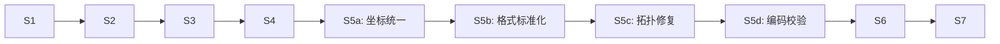
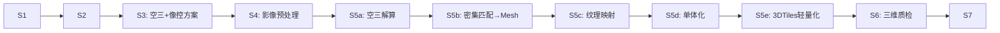
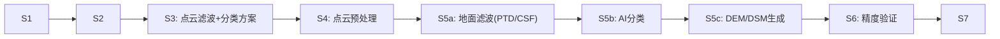
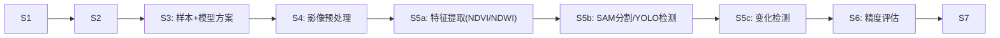
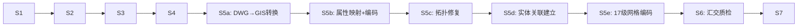
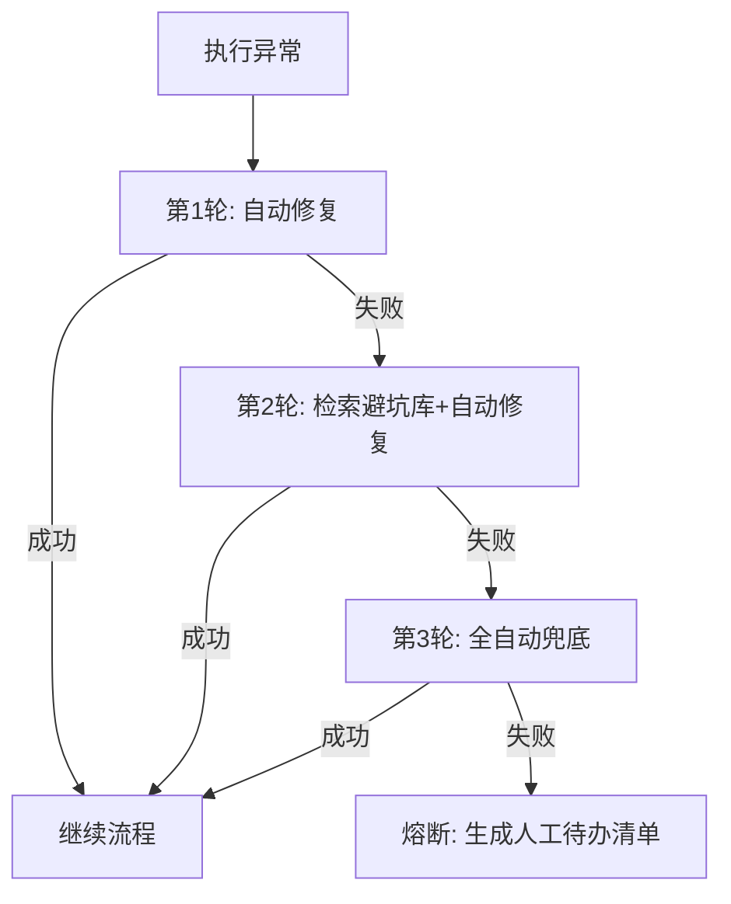

<!-- wm:坤图_GIS:V5.0 -->

# 七阶段流程引擎 + 五条分支工作流

> 全局唯一知识ID: GIS-WF-001
> 版本: V5.0

## 主链路：DLG建库7节点（缺一不可）

```mermaid
graph LR
    S1["阶段1: 需求锁定\n输出: 需求确认单"] -->|"准入凭证: 需求确认单"| S2["阶段2: 数据探查\n输出: 探查报告"]
    S2 -->|"准入凭证: 探查报告"| S3["阶段3: 方案生成\n输出: 执行方案"]
    S3 -->|"准入凭证: 执行方案"| S4["阶段4: 环境与预处理\n输出: 预处理日志"]
    S4 -->|"准入凭证: 预处理日志"| S5["阶段5: 核心执行\n输出: 过程日志"]
    S5 -->|"准入凭证: 过程日志"| S6["阶段6: 成果自检\n输出: 质检报告"]
    S6 -->|"准入凭证: 质检报告"| S7["阶段7: 输出归档\n输出: 归档清单"]
    
    style S1 fill:#e1f5fe
    style S7 fill:#c8e6c9
```



## 流程校验规则库

| 阶段 | 自动化检查项 | 不通过处理 |
|------|-------------|-----------|
| S1→S2 | 需求单所有必填字段已填 | 暂停→弹确认 |
| S2→S3 | 坐标系已识别/字段列表完整/异常已标记 | 暂停→补全探查 |
| S3→S4 | 方案引用正确标准号/工序无缺失/容差已设置 | 暂停→修正方案 |
| S4→S5 | 环境检测通过/原数据备份完成/输出目录已创建 | 暂停→初始化 |
| S5→S6 | 每步运算日志完整/异常已自动修复/熔断未触发 | 暂停→修复重跑 |
| S6→S7 | 质检通过率≥95%/不合规项已标记 | 暂停→人工复核 |
| S7 | 成果文件完整/元数据已生成/归档清单齐全 | 完成 |

---

## 五条差异化分支工作流

### 分支A: 常规生产（DLG/DEM/DOM）



| 原子Skill | ATS |
|-----------|-----|
| 坐标转换 | ATS-001 |
| 数据探查 | ATS-002 |
| 拓扑修复 | ATS-003 |
| 国标编码 | ATS-004 |
| 二级质检 | ATS-005 |
| 元数据生成 | ATS-006 |
| 项目归档 | ATS-010 |

### 分支B: 实景三维



| 原子Skill | ATS |
|-----------|-----|
| 倾斜摄影单体化 | ATS-007 |
| 元数据生成 | ATS-006 |
| 项目归档 | ATS-010 |

### 分支C: 点云处理



### 分支D: 遥感AI



| 原子Skill | ATS |
|-----------|-----|
| 遥感解译 | ATS-008 |

### 分支E: 国土建库



| 原子Skill | ATS |
|-----------|-----|
| DWG↔GIS互转 | ATS-009 |
| 国标编码校验 | ATS-004 |
| 拓扑修复 | ATS-003 |
| 二级质检 | ATS-005 |
| 项目归档 | ATS-010 |

---

## 异常降级与3轮熔断



### 熔断输出模板

```markdown
## 熔断报告

**任务**:  [任务名称]
**熔断时间**: [时间]
**失败工序**: [工序名]
**已执行轮次**: 3/3

### 机器已完成
- [ ] [已完成的工序1]
- [ ] [已完成的工序2]

### 需补充资料
- [参数1: ________________]
- [文件1: ________________]

### 需人工介入
- [工序X: 原因/操作规范参考]
```
