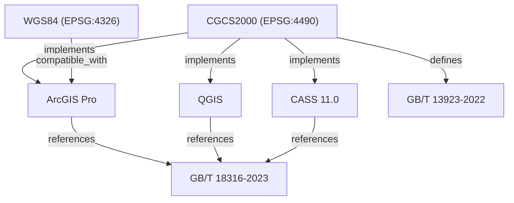
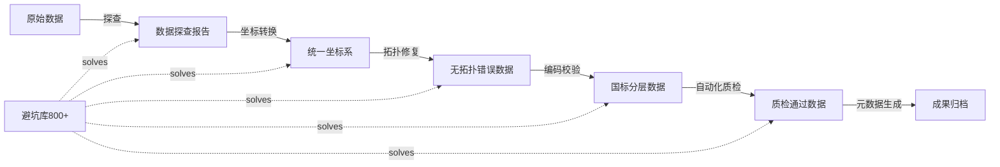

<!-- wm:坤图_GIS:V5.0 -->
# GeoKG 地理知识图谱 V5.0

> 版本：V5.0 | 性质：全知识库实体关系图谱 | 用途：GraphRAG混合检索底层支撑

---

## 图谱架构

```
                  ┌─────────────────────────────┐
                  │     GIS_SKILL V5.0           │
                  │   全局唯一知识ID根节点        │
                  └──────────┬──────────────────┘
                             │
        ┌────────────────────┼────────────────────────┐
        │                    │                         │
   ┌────▼────┐         ┌────▼────┐              ┌─────▼─────┐
   │ 坐标系   │         │ 软件工具 │              │ 国家标准   │
   │ Entity   │◄───────►│ Entity  │◄────────────►│ Entity    │
   └────┬────┘         └────┬────┘              └─────┬─────┘
        │                    │                         │
   ┌────▼────┐         ┌────▼────┐              ┌─────▼─────┐
   │ 投影方法 │         │ 数据格式 │              │ 质量规范   │
   │ Entity   │         │ Entity  │              │ Entity    │
   └─────────┘         └─────────┘              └───────────┘
```

## 知识ID编码规则

```
格式: GK-{群组}-{子类}-{序号}
示例:
  GK-01-CRS-001 → CGCS2000坐标系定义
  GK-03-SW-012 → ArcGIS Pro拓扑检查工具
  GK-05-PT-160 → 避坑库：坐标偏移问题
  GK-02-STD-005 → GB/T 18316质量检验标准
```

---

## 实体类别定义

| 类别 | 前缀 | 说明 | 预估实体数 |
|------|------|------|-----------|
| 坐标系 | CRS | 椭球/基准面/投影/GCS/PCS | 200+ |
| 软件工具 | SW | 桌面/命令行/库/Web服务 | 80+ |
| 国家标准 | STD | GB/T/CH/T/行业/地方 | 100+ |
| 数据格式 | FMT | 矢量/栅格/点云/三维/时序 | 60+ |
| 算法方法 | ALG | 空间分析/插值/分类/转换 | 120+ |
| 避坑条目 | PIT | WRONG/CAUSE/SOLUTION/CODE | 800+ |
| 行业案例 | CAS | 18行业完整项目案例 | 180+ |
| 代码模板 | COD | Python/R/SQL/ArcPy/PyQGIS | 200+ |
| Agent任务 | AGT | 数据探查/处理/质检/合规/文档 | 50+ |
| 版本信息 | VER | 软件版本/格式版本/标准版本 | 100+ |

---

## 关系类型定义

| 关系 | 含义 | 示例 |
|------|------|------|
| `references` | 引用关系 | GB/T 18316 `references` GB/T 13923 |
| `implements` | 实现关系 | ArcPy `implements` 坐标转换算法 |
| `defines` | 定义关系 | CGCS2000 `defines` 椭球参数 |
| `depends_on` | 依赖关系 | GeoPandas `depends_on` Shapely |
| `replaces` | 替代关系 | GB/T 24356-2023 `replaces` GB/T 24356-2009 |
| `conflicts_with` | 冲突关系 | WKT轴序 `conflicts_with` EPSG定义 |
| `solves` | 解决关系 | 避坑条目 `solves` 坐标偏移 |
| `belongs_to` | 归属关系 | DLG质检 `belongs_to` 数据生产流程 |
| `uses` | 使用关系 | 倾斜摄影 `uses` 3DTiles格式 |
| `compatible_with` | 兼容关系 | GeoPackage `compatible_with` QGIS |

---

## 核心Mermaid关联图

### 坐标系→软件→标准 三角关系



### 数据生产全链路



---

## 全文索引映射

每个知识库文档分配全局唯一ID后，建立以下索引：

```
/doc_id_mapping.json        # 文档ID→路径映射
/entity_index.json          # 实体名→知识ID索引
/relation_index.json        # 关系三元组索引
/keyword_index.json         # 关键词→实体/文档倒排索引
/version_index.json         # 版本→关联文档索引
```

---

> **使用方式**：
> - 文本检索：关键词→倒排索引→文档
> - 图谱检索：实体→关系遍历→关联文档
> - 混合检索(GraphRAG)：文本+图谱并行搜索，结果交叉验证
