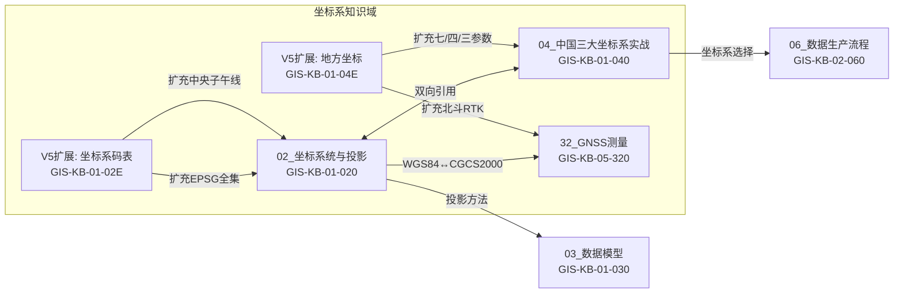
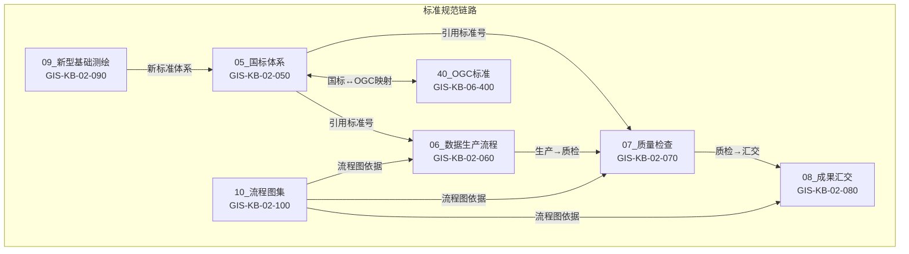
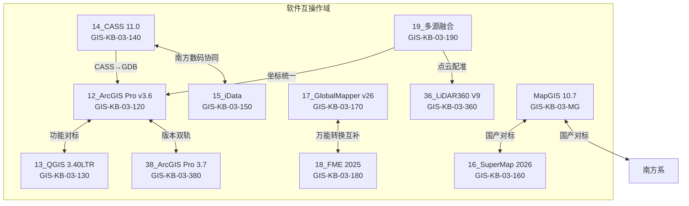
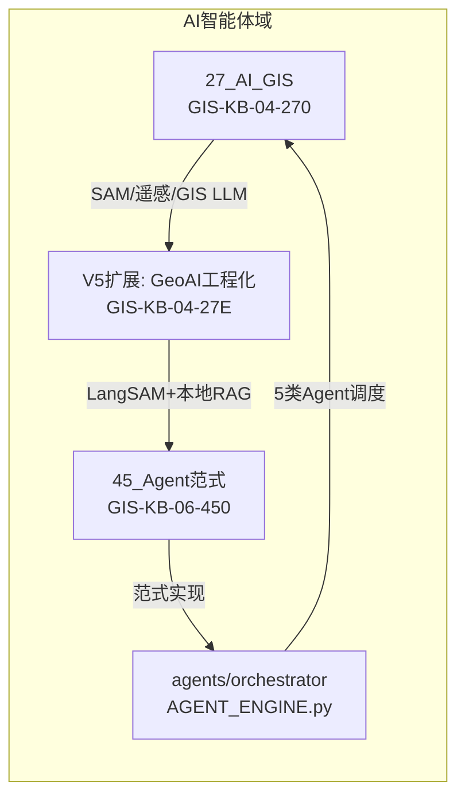
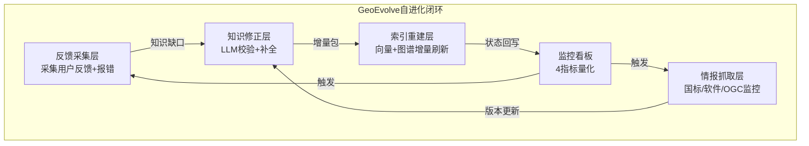

<!-- wm:坤图_GIS:V5.0 -->

# GeoKG 地理知识图谱核心关联图

> 全局唯一知识ID: GIS-KG-MERMAID-001
> 版本: V5.0
> 关联模块: 全部知识群组
> 风险等级: 低

---

## 一、总览：五大实体域全关联图

```mermaid
graph TB
    subgraph 坐标系域["坐标系域 (CRS)"]
        CGCS2000["CGCS2000\nGIS-KG-CRS-001"]
        WGS84["WGS84\nGIS-KG-CRS-002"]
        BJ54["北京54\nGIS-KG-CRS-003"]
        XA80["西安80\nGIS-KG-CRS-004"]
        LOCAL["地方独立坐标系\nGIS-KG-CRS-005"]
    end

    subgraph 软件域["软件域 (SW)"]
        ArcGIS["ArcGIS Pro\nGIS-KG-SW-001"]
        QGIS["QGIS\nGIS-KG-SW-002"]
        CASS["CASS\nGIS-KG-SW-003"]
        SuperMap["SuperMap\nGIS-KG-SW-004"]
        FME["FME\nGIS-KG-SW-005"]
        LiDAR["LiDAR360\nGIS-KG-SW-006"]
        GlobalM["GlobalMapper\nGIS-KG-SW-007"]
        iData["iData\nGIS-KG-SW-008"]
        MapGIS["MapGIS\nGIS-KG-SW-009"]
    end

    subgraph 标准域["标准域 (STD)"]
        GBT["GB/T国标\nGIS-KG-STD-001"]
        CHT["CH/T行标\nGIS-KG-STD-002"]
        OGC["OGC国际\nGIS-KG-STD-003"]
        LOCAL_STD["地方测绘规范\nGIS-KG-STD-004"]
    end

    subgraph 格式域["格式域 (FMT)"]
        VECTOR["矢量格式\nGIS-KG-FMT-001"]
        RASTER["栅格格式\nGIS-KG-FMT-002"]
        POINTCLOUD["点云格式\nGIS-KG-FMT-003"]
        THREED["三维格式\nGIS-KG-FMT-004"]
        TIMESERIES["时序格式\nGIS-KG-FMT-005"]
    end

    subgraph 算法域["算法域 (ALG)"]
        TRANSFORM["坐标转换\nGIS-KG-ALG-001"]
        TOPO["拓扑修复\nGIS-KG-ALG-002"]
        SPATIAL["空间分析\nGIS-KG-ALG-003"]
        DL["深度学习\nGIS-KG-ALG-004"]
        INTERP["插值算法\nGIS-KG-ALG-005"]
    end

    %% 坐标系 ↔ 软件
    CGCS2000 -->|"法定基准"| ArcGIS
    CGCS2000 -->|"法定基准"| QGIS
    CGCS2000 -->|"法定基准"| CASS
    CGCS2000 -->|"法定基准"| SuperMap
    CGCS2000 -->|"法定基准"| MapGIS
    WGS84 -->|"GPS基准"| ArcGIS
    WGS84 -->|"GPS基准"| QGIS
    BJ54 -->|"历史兼容"| CASS
    XA80 -->|"历史兼容"| CASS

    %% 坐标系 ↔ 标准
    CGCS2000 -->|"GB/T 39612-2020"| GBT
    CGCS2000 -->|"自然资源规范"| CHT

    %% 软件 ↔ 格式
    ArcGIS --> VECTOR
    ArcGIS --> RASTER
    ArcGIS --> THREED
    QGIS --> VECTOR
    QGIS --> RASTER
    QGIS --> POINTCLOUD
    FME --> VECTOR
    FME --> RASTER
    FME --> THREED
    LiDAR --> POINTCLOUD
    LiDAR --> THREED

    %% 标准 ↔ 软件
    GBT -->|"质检依据"| ArcGIS
    GBT -->|"质检依据"| QGIS
    CHT -->|"生产规范"| CASS
    OGC -->|"Web服务"| QGIS
    OGC -->|"Web服务"| ArcGIS

    %% 算法 ↔ 软件
    TRANSFORM -->|"ArcPy实现"| ArcGIS
    TRANSFORM -->|"PyQGIS实现"| QGIS
    TOPO -->|"拓扑引擎"| ArcGIS
    DL -->|"SAM/UNet"| ArcGIS
    DL -->|"GEE"| QGIS
```

## 二、坐标系统知识域深层关联

## 三、标准规范知识域链路

## 四、软件互操作知识域

## 五、AI与智能体知识域

## 六、自进化闭环

---

<!-- wm:坤图_GIS:V5.0 -->
