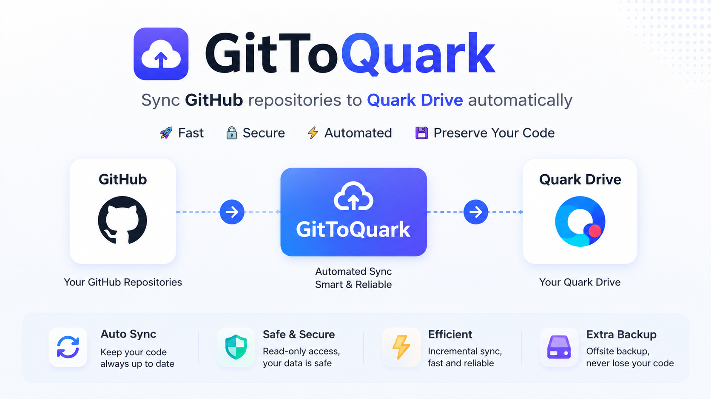

# GitToQuark

[](https://skills.sh/GitToQuark/GitToQuark)



<a href="README.zh-CN.md"></a>

Agent skill for saving GitHub repository contents to Quark Cloud Drive.

### Quark Cloud Drive CLI

This project relies on the Quark Cloud Drive CLI published by Quark:
https://github.com/quark-clouddrive/quarkclouddrive_offical

### Installation

```bash
npx skills add GitToQuark/GitToQuark
```

### Usage

After installation, GitToQuark is available in your agent environment. Provide a GitHub repository URL or `owner/repo` format, and the agent will guide you through downloading and uploading to Quark Cloud Drive.

### Features

- Automatic geolocation detection with proxy fallback for CN users
- GitHub repository source download (default branch)
- GitHub Release asset download with OS detection
- Direct upload to Quark Cloud Drive
- Support for Windows, macOS, and Linux

### Feedback

- Issues: https://github.com/GitToQuark/GitToQuark/issues
- Discussions: https://github.com/GitToQuark/GitToQuark/discussions
