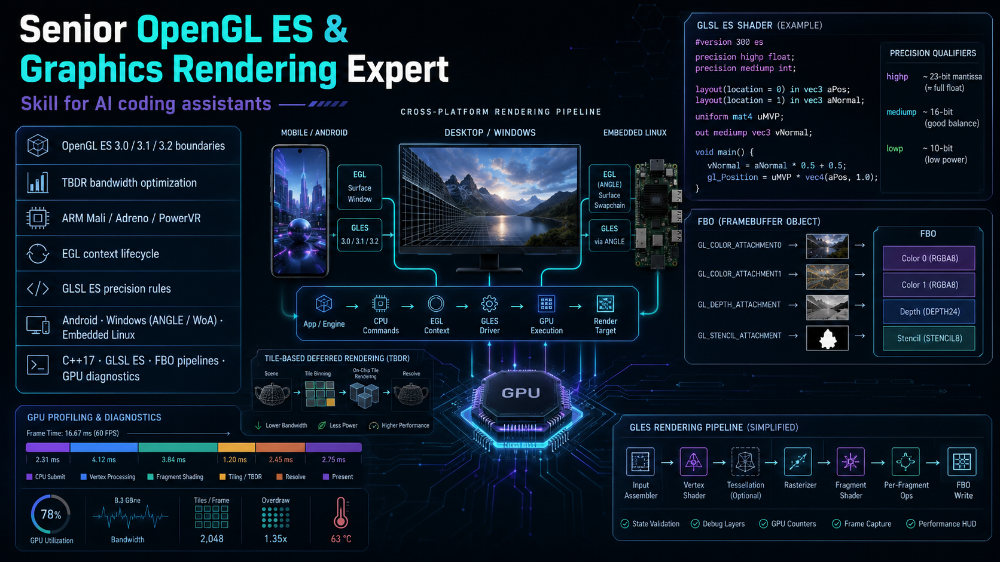

# gles-rendering-expert-skill



> **AI Expert Skill for OpenGL ES 3.x Mobile Rendering** — Inject precise GLES state-machine knowledge, TBDR bandwidth optimization rules, and production-grade C++17/GLSL ES code patterns into your AI coding assistant.

## Why This Skill?

Large Language Models frequently:
- **Confuse Desktop OpenGL with OpenGL ES** — generating `glBegin/glEnd`, `glPolygonMode`, or invalid texture formats.
- **Ignore TBDR architecture** — producing code that causes massive DRAM bandwidth waste on mobile GPUs (Mali, Adreno, PowerVR).
- **Miss EGL/context management** — overlooking context loss recovery, shared context synchronization, and proper lifecycle.

This skill eliminates these failure modes by constraining AI output to **mobile-first, TBDR-aware, GLES 3.0+ idioms**.

## Quick Start

### Cursor IDE
```bash
# Copy the skill file to your project's cursor rules
cp SKILL.md .cursor/rules/gles-rendering-expert.mdc
```

### Claude Projects / ChatGPT Custom GPTs
Copy the entire content of [`SKILL.md`](SKILL.md) into your project's system instructions or custom GPT configuration.

### Windsurf / Roo-Code / Other AI Tools
Paste `SKILL.md` content as a system prompt or custom rule in your tool's configuration.

## Repository Structure

```
gles-rendering-expert-skill/
├── SKILL.md                       # Core System Prompt (AI Skill entry point)
├── README.md                      # This file
├── LICENSE                        # MIT License
├── .cursorrules                   # Cursor IDE quick-link
├── references/                    # All reference material (rules, cards, examples)
│   ├── rules/                     # Modular rule documents
│   │   ├── gles-api-standards.md      # API version constraints & desktop API prohibition
│   │   ├── tbdr-bandwidth-rules.md    # TBDR bandwidth & FBO discard optimization
│   │   ├── egl-and-context.md         # EGL lifecycle & multi-thread context sync
│   │   ├── glsl-es-optimization.md    # GLSL ES precision & shader optimization
│   │   ├── mali-arm-best-practices.md # ARM Mali techniques (OpenGL ES SDK for Android)
│   │   ├── windows-platform.md        # Windows: ANGLE, Windows-on-ARM, NDK host
│   │   ├── adreno/                    # Qualcomm Adreno techniques, one topic per file
│   │   │   ├── README.md              # Adreno module index & GMEM/LRZ vocabulary
│   │   │   ├── gmem-load-store.md     # Avoid GMEM loads / reduce GMEM stores
│   │   │   ├── efficient-msaa.md      # On-tile MSAA resolve
│   │   │   ├── variable-rate-shading.md # QCOM_shading_rate (VRS)
│   │   │   ├── lrz-and-flexrender.md  # LRZ, FlexRender, depth
│   │   │   └── frame-extrapolation-and-upscaling.md # AFME, SGSR2
│   │   └── powervr/                   # Imagination PowerVR techniques, one topic per file
│   │       ├── README.md              # PowerVR module index & HSR/ISP vocabulary
│   │       ├── hsr-and-rendering-order.md # HSR, no depth pre-pass
│   │       ├── pixel-local-storage-and-deferred.md # PLS on-chip deferred
│   │       ├── img-extensions.md      # IMG_framebuffer_downsample, cubic, binary shaders
│   │       └── bandwidth-and-tile-management.md # Clear/invalidate, PB, MSAA
│   ├── cards/                     # Knowledge cards by GLES feature (quick reference)
│   │   ├── README.md              # Card index & format guide
│   │   ├── 01-api-version-constraints.md  # API version & desktop GL prohibition
│   │   ├── 02-texture-formats-compression.md  # Texture formats & ASTC/ETC2
│   │   ├── 03-buffer-objects.md       # VAO/VBO/UBO/SSBO/PBO
│   │   ├── 04-framebuffer-objects.md  # FBO lifecycle & MRT
│   │   ├── 05-shader-precision-layout.md  # GLSL ES precision & I/O
│   │   ├── 06-compute-shader.md       # Compute shader & sync
│   │   ├── 07-egl-context-lifecycle.md  # EGL init/thread/context-lost
│   │   ├── 08-tbdr-bandwidth.md       # TBDR architecture & bandwidth
│   │   ├── 09-overdraw-fillrate.md    # Overdraw & fill-rate
│   │   ├── 10-msaa-antialiasing.md    # MSAA on TBDR
│   │   ├── 11-synchronization.md      # Fence/memory barrier/orphaning
│   │   ├── 12-draw-call-optimization.md  # Batching/instancing/indirect
│   │   ├── 13-mali-pls-multiview.md   # Mali PLS & multiview
│   │   ├── 14-adreno-gmem-vrs-lrz.md  # Adreno GMEM/VRS/LRZ
│   │   ├── 15-windows-egl-angle.md    # Windows EGL/ANGLE/Windows-on-ARM
│   │   └── 16-powervr-hsr-img-extensions.md # PowerVR HSR/PLS/IMG extensions
│   └── examples/                  # Reference code (few-shot samples)
│       ├── egl_context_manager.cpp    # EGL init, shared context, context loss
│       ├── vertex_array_object.hpp    # RAII VBO/VAO with state cache
│       ├── offscreen_pipeline.cpp     # FBO with glInvalidateFramebuffer (TBDR)
│       └── shaders/
│           ├── pbr_brdf.frag             # Cook-Torrance PBR (GLSL ES 3.00)
│           ├── particle_simulation.comp  # Compute particle system (GLSL ES 3.10)
│           ├── deferred_pls.frag         # Pixel Local Storage deferred shading (Mali)
│           └── multiview_stereo.vert     # Single-pass stereo via GL_OVR_multiview2
├── agents/                        # AI agent configurations
│   ├── claude-code.yaml           # Claude Code integration
│   └── openai.yaml                # OpenAI Codex/GPT integration
├── assets/                        # Visual assets
│   └── gles-rendering-expert-banner.png  # Project banner
```

## Core Capabilities

| Capability | Description |
|:---|:---|
| **API Boundary Enforcement** | Strict GLES 3.0/3.1/3.2 only — zero desktop OpenGL contamination |
| **TBDR Optimization** | Automatic `glInvalidateFramebuffer`, FBO clear patterns, bandwidth analysis |
| **RAII C++17** | All GPU resources managed via move-only RAII classes with state caching |
| **GLSL ES Precision** | Correct `precision` declarations, `highp`/`mediump` guidance per data type |
| **EGL Lifecycle** | Full init/teardown, shared contexts, Android context-lost recovery |
| **Performance Diagnosis** | Structured analysis: Symptom → Root Cause → Fix → Expected Improvement |

## Target GPUs

- **ARM Mali** (T6xx, T7xx, T8xx, G31, G51, G71, G76, G77, G78, G710, G715)
- **Qualcomm Adreno** (3xx, 4xx, 5xx, 6xx, 7xx)
- **Imagination PowerVR** (Series 6, 7, 8, 9, Series 10)

## Use Cases

1. **Mobile Engine Development** — RAII resource management, render pass architecture
2. **Shader Writing** — Correct GLSL ES 3.00/3.20 with proper precision
3. **Performance Optimization** — TBDR bandwidth reduction, overdraw elimination
4. **Platform Integration** — EGL setup, Android NDK, multi-threaded loading
5. **Debugging** — Frame stutter analysis, thermal throttling diagnosis

## Requirements

- OpenGL ES 3.0+ capable device
- C++17 compiler (Clang for Android NDK, GCC for Linux embedded)
- EGL 1.4+ platform support

## Contributing

Contributions are welcome! Areas of interest:
- Additional GPU-specific optimization notes (new Mali/Adreno/PowerVR architectures)
- More code examples (deferred rendering, MSAA patterns, video texture pipelines)
- Benchmark data validating bandwidth savings
- Additional AI tool integrations

## License

[MIT](LICENSE) — Free for commercial and personal use.

## Acknowledgments

Inspired by [vulkan-rendering-expert-skill](https://github.com/oahc09/vulkan-rendering-expert-skill) — the Vulkan counterpart to this GLES-focused skill.
