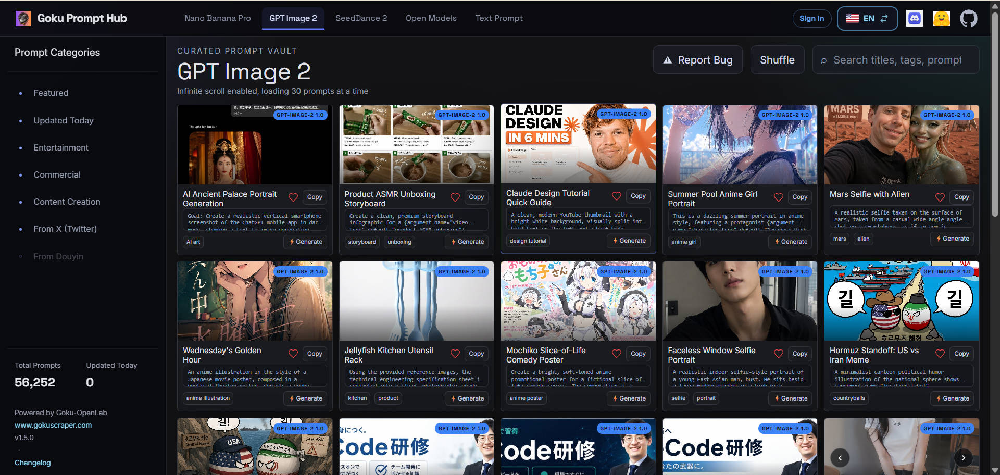

# AI 图像提示词推荐 — 15,600+ GPT Image 2 提示词

[](https://huggingface.co/datasets/Goku-OpenLab/gpt-image-2-prompts-datasets)
[](https://github.com/gokuscraper/gpt-image-2-prompts-skill)
[](LICENSE)
[](README.md) [](README.zh.md)

> **别再花时间到处找 AI 图像提示词了。** 一句话告诉 AI 助手你的需求 — 它会从 15,600+ 条精选 GPT Image 2 提示词中搜索并返回最匹配的 3 条，附带示例图片，开箱即用。
>
> 🖼️ [浏览数据集 →](https://prompthub.gokuscraper.com/prompts/?model=gpt-image-2)



## 这是什么？

一个 **AI Agent Skill**，让 Claude、OpenClaw、Cursor 等 AI 助手能够智能搜索 15,600+ 条精选 GPT Image 2（OpenAI 图像模型）提示词库，为你的需求推荐最佳匹配，甚至能根据你的内容定制提示词。

**GPT Image 2** 是 OpenAI 最新的图像生成模型 — 目前最强大的 AI 图像生成器之一。好的提示词是生成好图片的关键。

## 为什么使用这个 Skill？

- ✅ **15,600+ 条提示词** — 覆盖各种使用场景
- ✅ **每条提示词都附带示例图片** — 复制前先看效果
- ✅ **智能语义搜索** — 描述需求，AI 自动匹配
- ✅ **内容混搭模式** — 粘贴你的文章或视频脚本，获取定制提示词
- ✅ **多语言支持** — 用你的语言交流，始终提供英文提示词用于生成
- ✅ **双语数据** — 提示词支持中英文

---

## 安装

### OpenClaw（推荐）

```bash
clawhub install gpt-image-2-prompts-skill
```

或在 OpenClaw 聊天室中搜索：

> "Install the gpt image 2 prompts skill from clawhub"

### Claude Code

```bash
npx skills i gokuscraper/gpt-image-2-prompts-skill
```

### 其他 AI 助手（Cursor、Codex、Gemini CLI、Windsurf）

```bash
# 通用安装器 — 自动识别你的 AI 助手
npx skills i gokuscraper/gpt-image-2-prompts-skill
```

### 手动 / openskills

```bash
npx openskills install gokuscraper/gpt-image-2-prompts-skill
```

---

## 使用方法

### 模式 1：直接搜索

直接描述你的需求：

```
"帮我找一个赛博朋克风格的头像提示词"
"我需要旅行博客封面的提示词"
"找一张白底产品图的提示词"
"帮我找一个科技评测视频的 YouTube 缩略图提示词"
```

你会获得最多 3 条推荐，包含：
- 翻译后的标题和描述（中文）
- 可直接复制使用的英文提示词
- 预览样式的示例图片

### 模式 2：内容配图（混搭）

粘贴内容并请求匹配的配图：

```
"这是我写的一篇关于创业失败的文章 — 帮我生成一张封面图：
[粘贴文章全文]"

"我需要这个视频脚本的缩略图：[粘贴脚本]"

"帮我为这期关于 AI 的播客生成一张配图：[粘贴笔记]"
```

Skill 会：
1. 推荐匹配的风格模板
2. 询问几个个性化问题（性别、氛围、场景）
3. 根据你的内容生成定制提示词

---

## 数据概览

| 项目 | 详情 |
|------|------|
| 总提示词数 | 15,600 |
| 语言 | 英文、中文（双语） |
| 来源 | [GokuOpenLab GPT Image 2 数据集](https://huggingface.co/datasets/Goku-OpenLab/gpt-image-2-prompts-datasets) |
| 协议 | Skill 代码：MIT · 数据集：CC BY 4.0 |
| 格式 | JSONL（每行一条提示词） |

---

## 工作原理

```
用户描述需求
      ↓
搜索提示词库（基于 grep，永不加载完整文件）
      ↓
返回 Top 3 提示词 + 图片 + 翻译描述
      ↓
[可选] 用户选择一条 → Skill 根据内容混搭定制
```

**节能设计**：Skill 永不加载完整提示词文件，使用 grep 风格搜索，只提取匹配行，即使词库有 15,600+ 条提示词也能保持极低的 token 消耗。

---

## 数据来源

提示词来自公开社区，数据源于 HuggingFace 上的 [GokuOpenLab GPT Image 2 数据集](https://huggingface.co/datasets/Goku-OpenLab/gpt-image-2-prompts-datasets) — 15,600 条提示词，包含完整元数据、预览图片和双语支持。

*提示词由 [GokuOpenLab](https://prompthub.gokuscraper.com/) 通过公开社区搜集 ❤️*

---

## 常见问题

**问：什么是 GPT Image 2？**
GPT Image 2 是 OpenAI 最新的图像生成模型，能够从文本提示词生成高质量的写实和艺术图片。

**问：使用这个 Skill 需要注册账号吗？**
不需要。Skill 完全免费，支持任何兼容自定义 Skill 的 AI 助手（OpenClaw、Claude Code、Cursor、Codex、Gemini CLI）。

**问：这个和自己在 Twitter 搜提示词有什么区别？**
词库经过预分类和筛选，15,600+ 条提示词都是精选优质内容，每条都附带示例图片，复制前就能看到效果。混搭模式还能根据你的内容个性化定制。

**问：我可以贡献提示词吗？**
数据源是开源的（CC BY 4.0）。欢迎访问 [HuggingFace 数据集](https://huggingface.co/datasets/Goku-OpenLab/gpt-image-2-prompts-datasets) 了解更多。

**问：词库多久更新一次？**
HuggingFace 数据集由 GokuOpenLab 社区定期更新。

**问：这些提示词能用于其他图像生成模型吗？**
提示词针对 GPT Image 2 优化，但也适用于其他模型。

**问：OpenClaw 和 Claude Code 安装方式有什么区别？**
OpenClaw 使用 `clawhub install` 命令，直接集成到 OpenClaw agent 工作区。Claude Code 使用 `npx skills i`，安装到 Claude 项目上下文中。两者使用相同的 SKILL.md 和提示词库。

---

## 项目结构

```
gpt-image-2-prompts-skill/
├── SKILL.md                 # Skill 指令（兼容 Claude Code、OpenClaw、Cursor 等）
├── README.md
├── README.zh.md
├── LICENSE
├── package.json
├── public/
│   └── cover.png            # 封面截图
├── scripts/
│   └── setup.js             # 从 HuggingFace 下载提示词库
├── references/              # 自动下载的提示词数据
│   ├── .gitkeep
│   └── metadata.jsonl       # 15,600+ 条提示词（由 setup.js 生成）
└── .claude-plugin/
    └── marketplace.json
```

---

## 开发

### 前置条件

- Node.js 18+

### 安装

```bash
pnpm install
```

这会自动从 HuggingFace 下载提示词库。手动更新：

```bash
node scripts/setup.js --force
```

---

## 相关项目

- 🖼️ [GokuOpenLab GPT Image 2 数据集](https://huggingface.co/datasets/Goku-OpenLab/gpt-image-2-prompts-datasets) — HuggingFace 上的源数据集（15,600+ 提示词、图片、元数据）

## 相关工具

- [Claude Code](https://claude.com/claude-code) — Anthropic 的终端原生 AI agent
- [OpenClaw](https://openclaw.ai) — AI agent 平台，支持 skill 生态
- [skills CLI](https://www.npmjs.com/package/skills) — 通用 AI skills 安装器

---

## 协议

MIT © [GokuOpenLab](https://huggingface.co/Goku-OpenLab)
