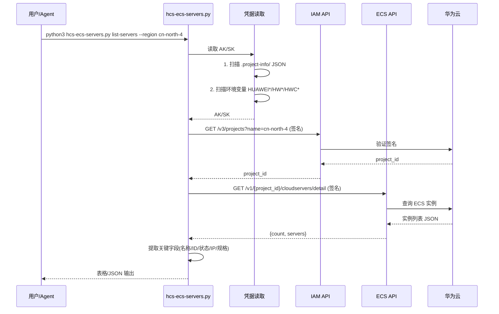
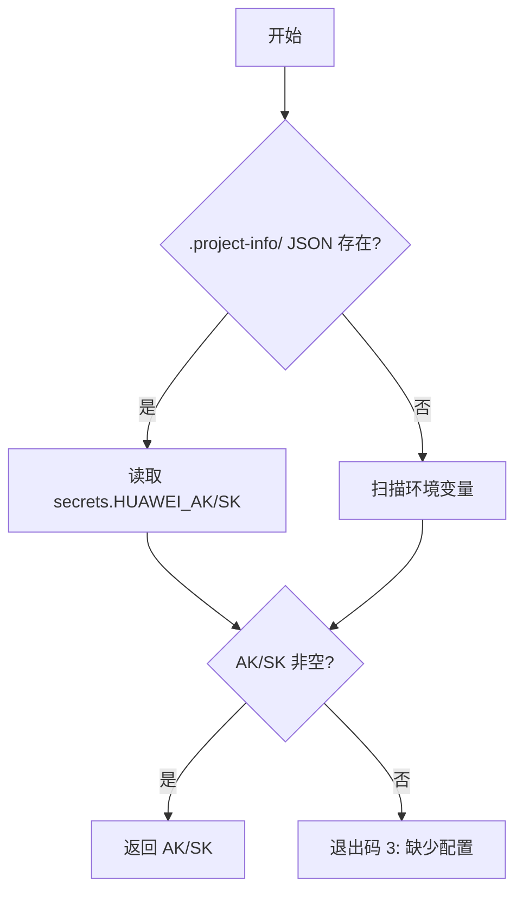
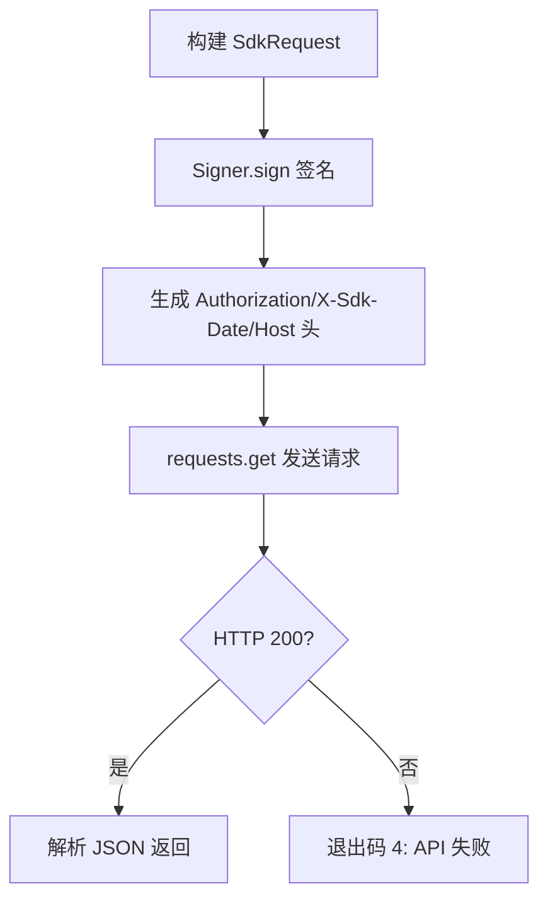

# 数据流图

## 请求/响应流程

```mermaid
sequenceDiagram
    participant User as 用户/Agent
    participant Script as hcs-ecs-servers.py
    participant Cred as 凭据读取
    participant IAM as IAM API
    participant ECS as ECS API
    participant HWC as 华为云

    User->>Script: python3 hcs-ecs-servers.py list-servers --region cn-north-4
    Script->>Cred: 读取 AK/SK
    Cred->>Cred: 1. 扫描 .project-info/ JSON
    Cred->>Cred: 2. 扫描环境变量 HUAWEI*/HW*/HWC*
    Cred-->>Script: AK/SK
    Script->>IAM: GET /v3/projects?name=cn-north-4 (签名)
    IAM->>HWC: 验证签名
    HWC-->>IAM: project_id
    IAM-->>Script: project_id
    Script->>ECS: GET /v1/{project_id}/cloudservers/detail (签名)
    ECS->>HWC: 查询 ECS 实例
    HWC-->>ECS: 实例列表 JSON
    ECS-->>Script: {count, servers}
    Script->>Script: 提取关键字段(名称/ID/状态/IP/规格)
    Script-->>User: 表格/JSON 输出
```

## 凭据解析流程

```mermaid
flowchart TD
    A[开始] --> B{.project-info/ JSON 存在?}
    B -- 是 --> C[读取 secrets.HUAWEI_AK/SK]
    B -- 否 --> D[扫描环境变量]
    C --> E{AK/SK 非空?}
    D --> E
    E -- 是 --> F[返回 AK/SK]
    E -- 否 --> G[退出码 3: 缺少配置]
```

## 签名流程

```mermaid
flowchart TD
    A[构建 SdkRequest] --> B[Signer.sign 签名]
    B --> C[生成 Authorization/X-Sdk-Date/Host 头]
    C --> D[requests.get 发送请求]
    D --> E{HTTP 200?}
    E -- 是 --> F[解析 JSON 返回]
    E -- 否 --> G[退出码 4: API 失败]
```
