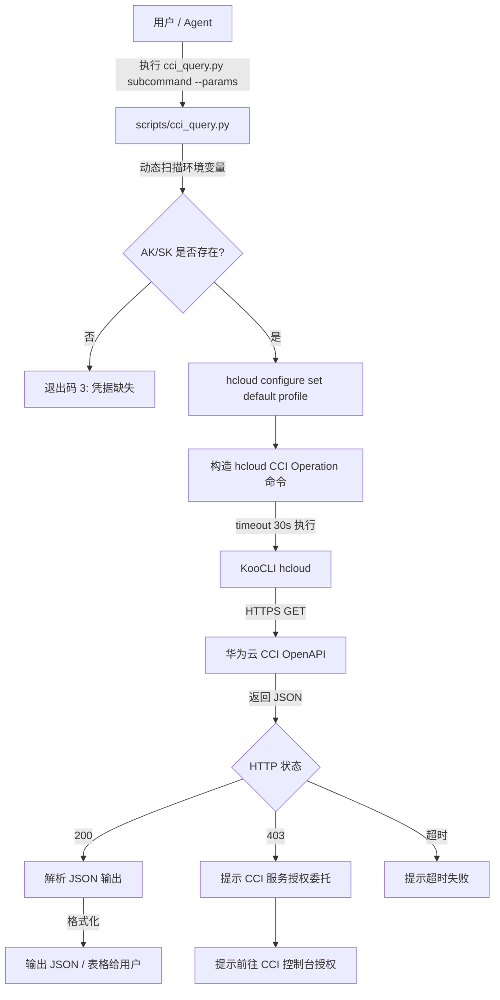
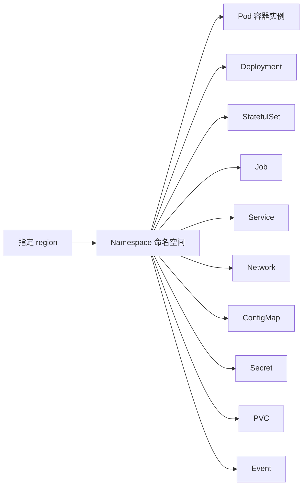
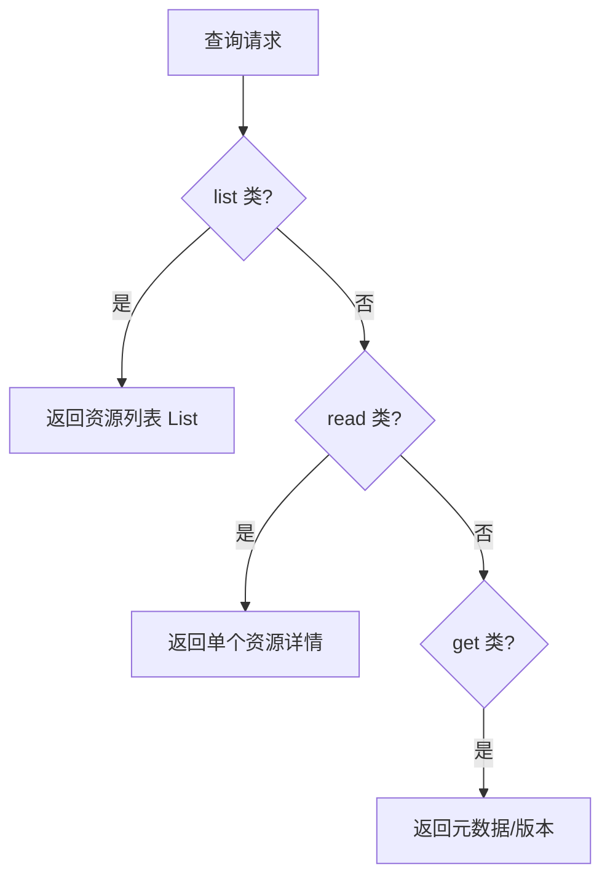

# 数据流图

## 请求/响应流程

```mermaid
flowchart TD
    A[用户 / Agent] -->|执行 cci_query.py subcommand --params| B[scripts/cci_query.py]
    B -->|动态扫描环境变量| C{AK/SK 是否存在?}
    C -->|否| D[退出码 3: 凭据缺失]
    C -->|是| E[hcloud configure set default profile]
    E --> F[构造 hcloud CCI Operation 命令]
    F -->|timeout 30s 执行| G[KooCLI hcloud]
    G -->|HTTPS GET| H[华为云 CCI OpenAPI]
    H -->|返回 JSON| I{HTTP 状态}
    I -->|200| J[解析 JSON 输出]
    I -->|403| K[提示 CCI 服务授权委托]
    I -->|超时| L[提示超时失败]
    J -->|格式化| M[输出 JSON / 表格给用户]
    K --> N[提示前往 CCI 控制台授权]
```

## 资源查询层级

```mermaid
flowchart LR
    R[指定 region] --> NS[Namespace 命名空间]
    NS --> POD[Pod 容器实例]
    NS --> DEP[Deployment]
    NS --> STS[StatefulSet]
    NS --> JOB[Job]
    NS --> SVC[Service]
    NS --> NET[Network]
    NS --> CM[ConfigMap]
    NS --> SEC[Secret]
    NS --> PVC[PVC]
    NS --> EVT[Event]
```

## 只读操作语义

```mermaid
flowchart TD
    Q[查询请求] --> LIST{list 类?}
    LIST -->|是| LRET[返回资源列表 List]
    LIST -->|否| READ{read 类?}
    READ -->|是| RRET[返回单个资源详情]
    READ -->|否| GET{get 类?}
    GET -->|是| GRET[返回元数据/版本]
```
