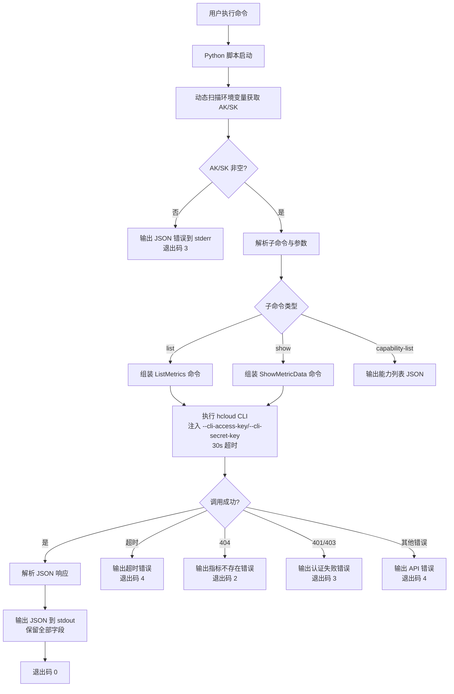

# 数据流图

## Skill 请求/响应流程



## 数据结构

### list 请求 → 响应

```
请求: hcloud CES ListMetrics --cli-region=cn-north-4 [--namespace] [--metric_name] [--dim.0] [--order] [--limit] [--start]
响应: {"count": N, "total": M, "marker": "...", "metrics": [{指标全部字段}, ...]}
```

### show 请求 → 响应

```
请求: hcloud CES ShowMetricData --cli-region=cn-north-4 --namespace=SYS.ECS --metric_name=cpu_util --dim.0=instance_id,xxx --filter=average --period=3600 --from=时间戳 --to=时间戳
响应: {"metric_name": "...", "datapoints": [{数据点全部字段}, ...]}
```

### 指标字段（list 返回，API 全部字段）

- `namespace`：服务命名空间（如 SYS.ECS、SYS.OBS）
- `dimensions`：维度数组（含 name 和 value）
- `metric_name`：指标名称（如 cpu_util）
- `unit`：指标单位（如 Byte、%）

### 数据点字段（show 返回，API 全部字段）

- `timestamp`：数据点时间戳
- `unit`：指标单位
- `statistics`：统计数据（含 max/min/sum/average/variance）
- 其他 API 返回字段
