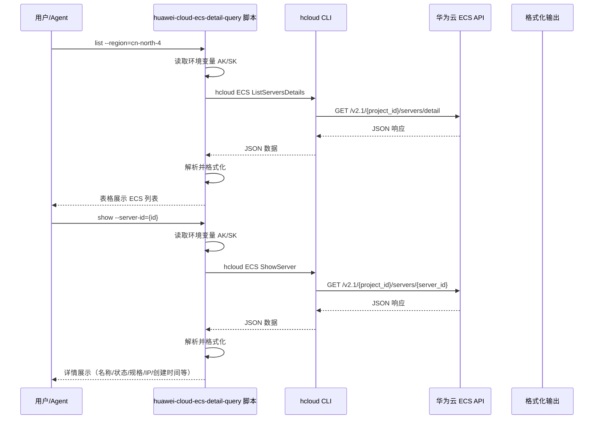

# 数据流图

```mermaid
sequenceDiagram
    participant User as 用户/Agent
    participant Script as huawei-cloud-ecs-detail-query 脚本
    participant CLI as hcloud CLI
    participant HWCloud as 华为云 ECS API
    participant Output as 格式化输出

    User->>Script: list --region=cn-north-4
    Script->>Script: 读取环境变量 AK/SK
    Script->>CLI: hcloud ECS ListServersDetails
    CLI->>HWCloud: GET /v2.1/{project_id}/servers/detail
    HWCloud-->>CLI: JSON 响应
    CLI-->>Script: JSON 数据
    Script->>Script: 解析并格式化
    Script-->>User: 表格展示 ECS 列表

    User->>Script: show --server-id={id}
    Script->>Script: 读取环境变量 AK/SK
    Script->>CLI: hcloud ECS ShowServer
    CLI->>HWCloud: GET /v2.1/{project_id}/servers/{server_id}
    HWCloud-->>CLI: JSON 响应
    CLI-->>Script: JSON 数据
    Script->>Script: 解析并格式化
    Script-->>User: 详情展示（名称/状态/规格/IP/创建时间等）
```

## 请求流程

1. 用户输入命令（list 或 show）
2. 脚本校验参数并读取 AK/SK
3. 脚本调用 hcloud CLI 执行对应操作
4. hcloud CLI 向华为云 ECS API 发送 HTTP GET 请求
5. 华为云返回 JSON 格式数据
6. 脚本解析 JSON 并格式化输出给用户
