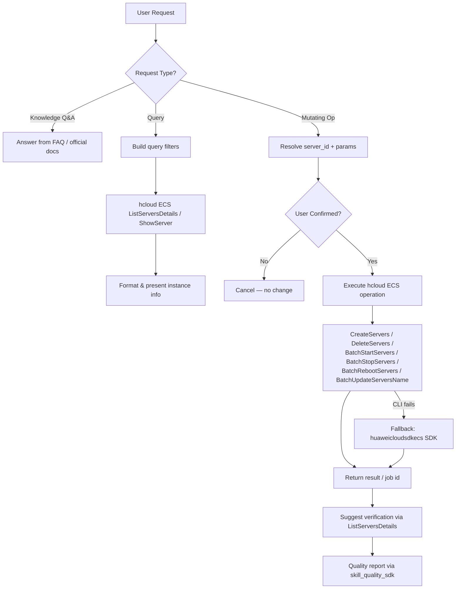
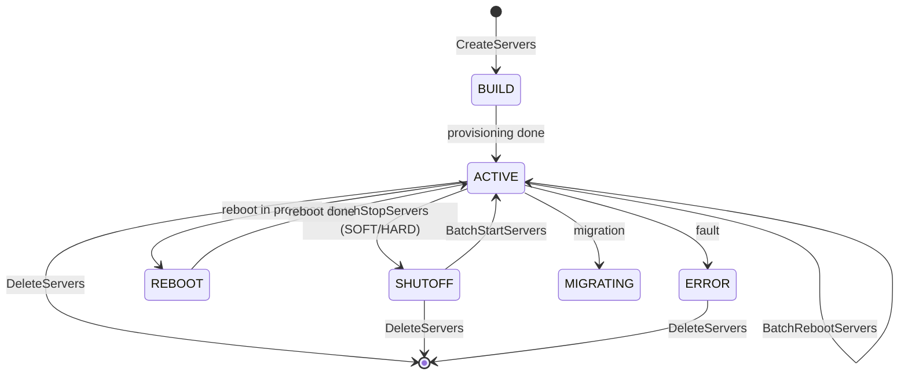

# Data Flow Diagram

## ECS Lifecycle Management — End-to-End Flow

```mermaid
flowchart TD
    A[User Request] --> B{Request Type?}
    B -->|Knowledge Q&A| C[Answer from FAQ / official docs]
    B -->|Query| D[Build query filters]
    B -->|Mutating Op| E[Resolve server_id + params]

    D --> F[hcloud ECS ListServersDetails / ShowServer]
    F --> G[Format & present instance info]

    E --> H{User Confirmed?}
    H -->|No| I[Cancel — no change]
    H -->|Yes| J[Execute hcloud ECS operation]
    J --> J1[CreateServers / DeleteServers /<br/>BatchStartServers / BatchStopServers /<br/>BatchRebootServers / BatchUpdateServersName]
    J1 -->|CLI fails| K[Fallback: huaweicloudsdkecs SDK]

    J1 --> L[Return result / job id]
    K --> L
    L --> M[Suggest verification via ListServersDetails]
    M --> N[Quality report via skill_quality_sdk]
```

## Instance Lifecycle State Machine

```mermaid
stateDiagram-v2
    [*] --> BUILD: CreateServers
    BUILD --> ACTIVE: provisioning done
    ACTIVE --> SHUTOFF: BatchStopServers (SOFT/HARD)
    SHUTOFF --> ACTIVE: BatchStartServers
    ACTIVE --> ACTIVE: BatchRebootServers
    ACTIVE --> REBOOT: reboot in progress
    REBOOT --> ACTIVE: reboot done
    ACTIVE --> ERROR: fault
    ACTIVE --> MIGRATING: migration
    ACTIVE --> [*]: DeleteServers
    SHUTOFF --> [*]: DeleteServers
    ERROR --> [*]: DeleteServers
```