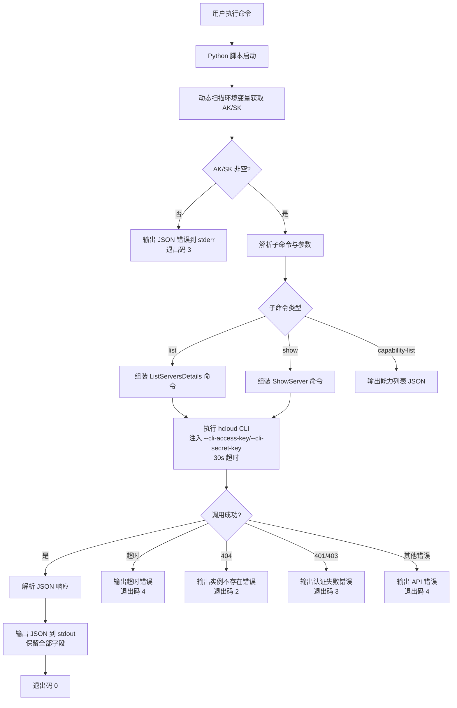

# 数据流图

## Skill 请求/响应流程



## 数据结构

### list 请求 → 响应

```
请求: hcloud ECS ListServersDetails --cli-region=cn-north-4 [--status] [--name] [--flavor] [--ip] [--limit]
响应: {"count": N, "servers": [{实例全部字段}, ...]}
```

### show 请求 → 响应

```
请求: hcloud ECS ShowServer --cli-region=cn-north-4 --server_id=<UUID>
响应: {"server": {实例全部字段}}
```

### 实例字段（API 返回全部字段）

- `id`：实例 ID
- `name`：实例名称
- `status`：实例状态
- `addresses`：公网/私网 IP
- `flavor`：规格（vCPU/内存）
- `OS-EXT-AZ:availability_zone`：可用区
- `created`：创建时间
- `image`：镜像信息
- `vpc_id`：VPC ID
- `subnet_id`：子网 ID
- `security_groups`：安全组
- `volumes_attached`：磁盘信息
- 其他 API 返回字段
