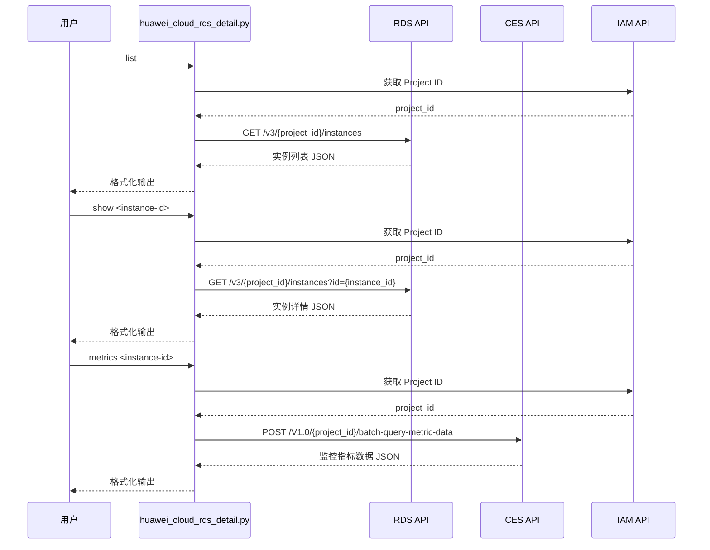

# 数据流图

## 请求流程说明

1. **认证层**：脚本从环境变量读取 AK/SK，初始化 SDK 客户端
2. **项目 ID 获取**：自动调用 IAM API 查询当前区域对应的项目 ID（仅首次调用，后续缓存）
3. **API 调用**：根据用户选择的子命令，调用对应华为云 API
4. **结果返回**：API 返回结构化 JSON，脚本格式化后输出

## 组件依赖

| 组件 | 用途 | 只读 |
|------|------|------|
| huaweicloudsdkiam | 获取项目 ID | ✅ |
| huaweicloudsdkrds | 查询 RDS 实例列表和详情 | ✅ |
| huaweicloudsdkces | 查询监控指标数据 | ✅ |