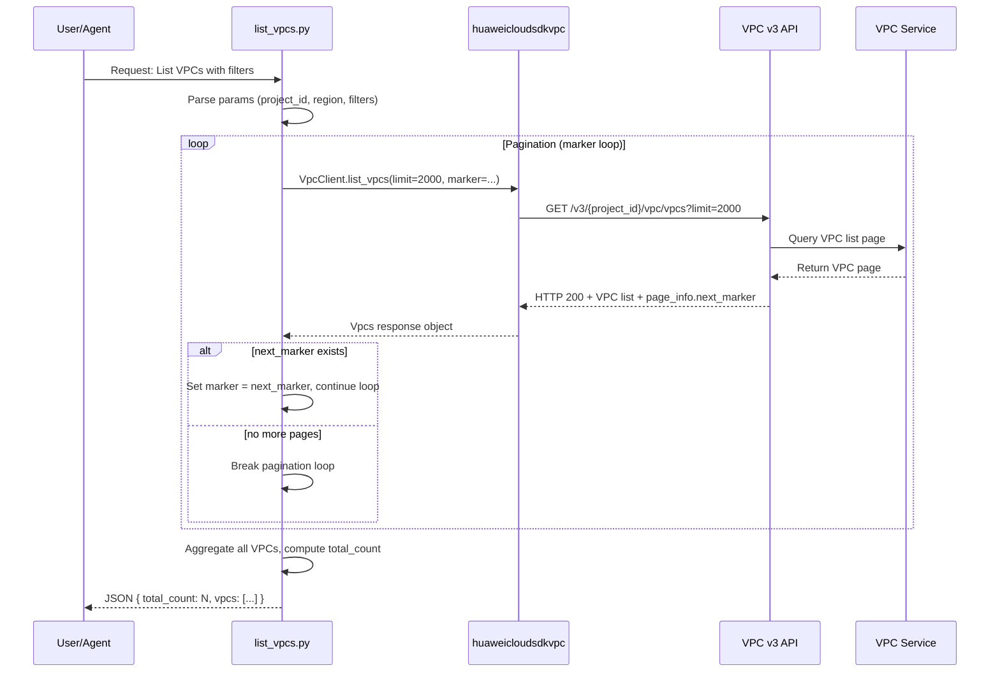

# Dataflow Diagram

## Flow Description

1. User/agent invokes `scripts/list_vpcs.py` with region, project ID, and optional filters
2. The script loads AK/SK from environment variables (using dynamic scanning)
3. The script uses huaweicloudsdkvpc SDK to call VPC v3 API (`ListVpcs`)
4. **Critical pagination fix**: the script loops through ALL pages using the
   `next_marker` from each response, aggregating VPCs until no more pages exist
5. A safety limit of 50 pages prevents infinite loops
6. Duplicate detection (first-item check) prevents marker failure from causing duplicates
7. `total_count` reflects the actual total VPC count across all pages, not just
   the first page
8. This skill performs **read-only** queries — no VPC is created, modified, or deleted