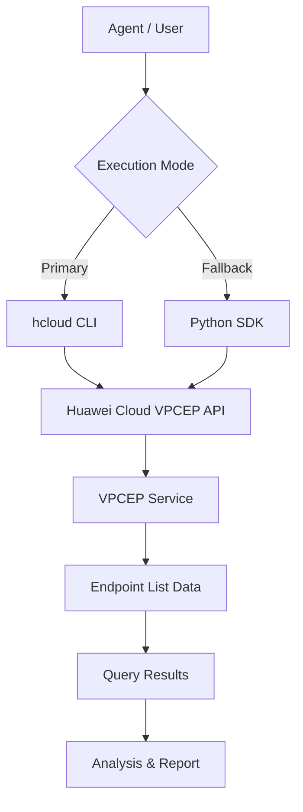

# Data Flow Diagram

## VPCEP Name List Skill Data Flow

## Query Categories

All API paths below are read from the `huaweicloudsdkvpcep` v1 SDK definitions.

| Category | API Path | Methods |
|----------|----------|---------|
| Endpoint List | `/v1/{project_id}/vpc-endpoints` | ListEndpoints |
