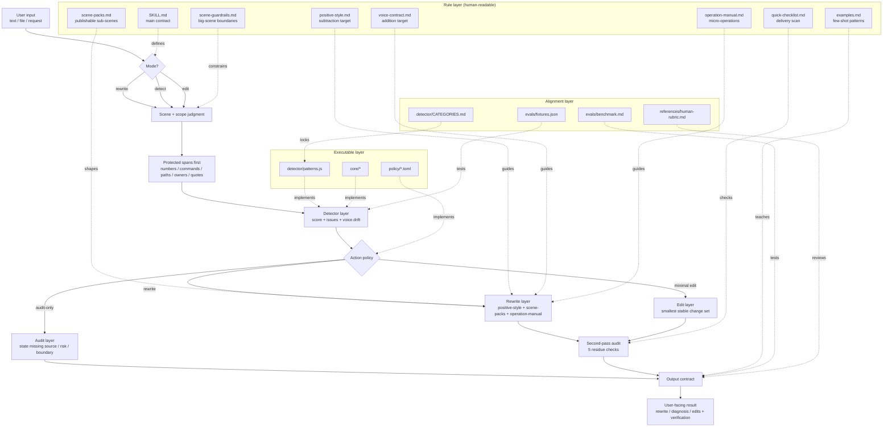

# Skill Architecture

This file describes how `humanize-text-skill` works as a **skill**, not just as a
detector. The detector is one layer; the actual skill also includes scene
judgment, rewrite policy, second-pass audit, and output shaping.

## 1. Architecture at a glance

## 2. Layer responsibilities

### A. Entry contract

Source of truth: `SKILL.md`

- defines the three modes: `rewrite / detect / edit`
- defines output shape
- defines second-pass audit
- defines the non-negotiable protected-spans-first rule

### B. Decision layer

Sources of truth: `scene-guardrails.md`, `scene-packs.md`, `policy/*.toml`

- decide what kind of text this is
- decide how aggressive the tool is allowed to be
- decide whether the safer action is `rewrite`, `audit-only`, or `minimal edit`

### C. Execution layer

Sources of truth: `operation-manual.md`, `positive-style.md`, `voice-contract.md`

- `operation-manual.md` says how to cut or rewrite a concrete problem family
- `positive-style.md` says what “cleaner but still human” should feel like
- `voice-contract.md` says how to pull toward a target voice without drifting facts

### D. Teaching layer

Sources of truth: `examples.md`, `quick-checklist.md`

- `examples.md` is few-shot material: how to answer, not just what to detect
- `quick-checklist.md` is the last delivery scan

### E. Alignment layer

Sources of truth: `detector/CATEGORIES.md`, `evals/*`, `human-rubric.md`

- keep prose, engine, and output behavior from drifting apart
- separate machine scoring from human rewrite quality review

## 3. Current design rules

### One scorer, many decisions

- `score` lives only in `core/scoring.js`
- mode/scene/scope/output are **not** scoring concerns
- `voice.drift` is guidance, not a rewrite permission slip

### Protected spans before style

- if a sentence can sound smoother only by changing a protected span, keep it stiff
- this is why fidelity is a gate, not a style preference

### Rewrite policy is scene-sensitive

- same phrase can lead to different actions in different scenes
- `status/docs` often prefer `audit-only` where `public-writing` prefers rewrite

## 4. Unreasonable patterns we fixed

### Before: the public architecture mostly showed the detector

Problem:

- readers could mistake `humanize-text-skill` for “a detector with some references”
- the actual interaction logic lived across `SKILL.md`, `scene-packs`, and examples, but had no top-level map

Fix:

- add this architecture file
- update the README architecture section to show both skill runtime and detector internals

### Before: few-shot examples had duplicate labels

Problem:

- `examples.md` had repeated example letters after the few-shot expansion
- that makes references ambiguous during maintenance and eval discussions

Fix:

- renumber examples so scene-pack and mode examples have stable, unique IDs

### Before: output-shaping guidance was spread out but not clearly layered

Problem:

- it was easy to miss which file controls behavior vs examples vs polish

Fix:

- this file makes the ownership explicit:
  - `SKILL.md` = main contract
  - `scene-*` = decision layer
  - `operation-manual` = execution
  - `examples` = teaching
  - `evals` = alignment

## 5. Maintenance rule

When adding new behavior, decide which layer it belongs to first:

- new contract or default behavior → `SKILL.md`
- new scene-specific decision → `scene-guardrails.md` or `scene-packs.md`
- new rewrite move → `operation-manual.md`
- new few-shot teaching material → `examples.md`
- new measurable engine signal → `detector/*` + `CATEGORIES.md` + evals

If the same rule starts appearing in multiple files, one file should own it and the others should only point to it.
