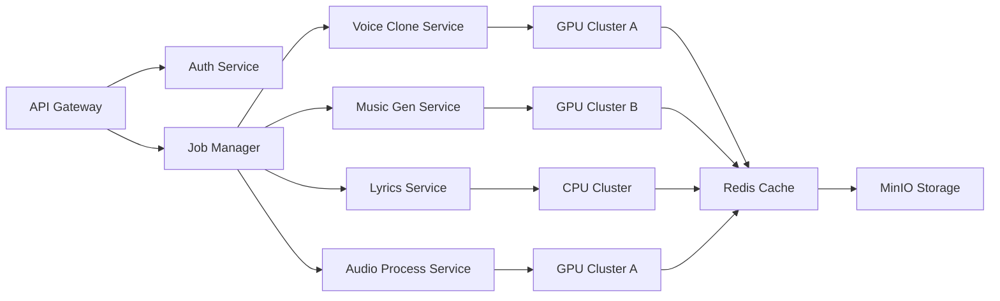

# 技术规格详情

## 1. AI 模型架构

### 1.1 语音克隆系统 (So-VITS-SVC 4.1)

#### 模型结构
- **编码器**: Speaker Encoder (D-vector)
  - 输入: 30s 音频样本
  - 输出: 512-dim 说话人嵌入向量
  - 技术: GE2E 损失 + LSTM 架构

- **转换网络**: VITS-based Voice Conversion
  - 条件VAE架构，支持零样本迁移
  - 文本到语音特征转换
  - 声学特征预测器

- **解码器**: Multi-Band HiFi-GAN
  - 多频段神经声码器
  - 48kHz 高保真音频生成
  - 条件生成架构

#### 训练流程
```python
# 语音克隆训练步骤
1. 音频预处理 → 降噪、标准化、重采样
2. 特征提取 → F0、频谱图、声道特征
3. 音色编码 → 说话人嵌入向量生成  
4. 转换训练 → 文本到音频转换模型
5. 声码器微调 → HiFi-GAN 个性化适配
6. 质量验证 → MOS 评分、音色相似度
```

#### 性能指标
- **音色相似度**: ≥ 0.85 (余弦相似度)
- **音频质量**: MOS ≥ 4.2/5.0
- **训练时间**: 15 分钟 (30s 样本)
- **推理速度**: 实时 (1s 音频/秒)

### 1.2 音乐生成系统 (Suno AI v4)

#### 核心技术
- **Diffusion + Flow Matching 混合架构**
- **多模态条件生成**: 文本 + 音频 + 控制信号
- **Transformer-XL 音乐理解模块**
- **自回归 + 非自回归联合训练**

#### 生成阶段
1. **理解阶段**: Lyrics → Music Understanding
   - 情感分析
   - 节奏预测
   - 风格分类
   - 结构分析

2. **编排阶段**: Generate Arrangement
   - 和弦进行生成
   - 旋律线条设计
   - 配器选择
   - 动态控制

3. **合成阶段**: Audio Synthesis
   - 分轨音乐生成
   - 多声道混音
   - 效果器处理
   - 母带处理

#### 参数控制
```yaml
Music Parameters:
  style: 
    - pop: "Pop with electronic elements"
    - rock: "Heavy guitar-driven rock"
    - jazz: "Smooth jazz with improvisation"
    - classical: "Orchestral arrangement"
    
  emotion:
    - uplifting: BPM 100-140, major key
    - romantic: BPM 60-100, string emphasis
    - energetic: BPM 140-180, strong beat
    - melancholy: BPM 60-80, minor key
    
  structure:
    - intro: 8-16 bars
    - verse: 16-32 bars
    - chorus: 8-16 bars
    - bridge: 8-16 bars
    - outro: 8-16 bars
```

### 1.3 歌词生成系统 (LyricsGPT-7B)

#### 模型架构
- **基础模型**: LLaMA-2 7B 改进版
- **领域适配**: 100万首中文/英文歌词微调
- **韵律控制**: 押韵检测 + 声调优化
- **创意平衡**: temperature + top-p 调节

#### 生成策略
```python
Generator Pipeline:
Input: theme, style, language
↓
Context Building → 构建创作上下文
Creative Planning → 创意规划（情感、意象）
Verse Generation → 分段生成歌词
Rhyme Optimization → 押韵优化
Style Transfer → 风格迁移
Quality Filter → 质量过滤器
Output: 优化歌词文本
```

#### 韵律模式库
- **中文押韵**: AABA, ABAB, ABBA 模式
- **英文韵律**: Perfect, Slant, Eye Rhyme
- **节拍控制**: 4/4, 3/4, 6/8 拍号适配
- **字数限制**: 每句 7-15 字优化

## 2. 系统架构

### 2.1 微服务架构



### 2.2 数据流设计

#### 音频处理流水线
```
用户上传
    ↓
音频格式标准化 (FFmpeg)
    ↓
音频清洗 (降噪、回声消除)
    ↓
特征分析 (F0、频谱、动态范围)
    ↓
[并行处理]
├── 语音克隆分支 → So-VITS-SVC 训练 → 个性化模型
├── 音乐生成分支 → 歌词→MIDI→音频 → 伴奏
└── 演唱合成分支 → 人声合成 + 混音
    ↓
质量评估 + 多版本输出
```

#### 缓存策略
- **LRU 缓存**: 最近使用的模型
- **预取策略**: 热门风格模型预加载
- **分级存储**: 热数据(Redis) → 温数据(本地) → 冷数据(MinIO)

## 3. 性能规格

### 3.1 计算资源需求

| 服务 | GPU 显存 | CPU 核心 | 内存 | 存储 IO |
|------|----------|----------|------|----------|
| Voice Clone | 18GB+ | 8 核 | 32GB | 高速 SSD |
| Music Generation | 20GB+ | 16 核 | 64GB | NVMe SSD |
| Lyrics AI | N/A | 16 核 | 32GB | 普通 SSD |
| Audio Process | 12GB | 8 核 | 16GB | 高速 SSD |

### 3.2 性能基准

#### 生成时间 (单曲 3-4 分钟)
- **语音克隆**: 8-12 分钟 (30s 样本)
- **歌词生成**: 30-60 秒 (200 字)
- **音乐编配**: 15-25 分钟
- **演唱合成**: 5-8 分钟
- **音频混音**: 2-3 分钟
- **总耗时**: 30-50 分钟

#### 吞吐量
- **并发处理**: 4-8 任务并行
- **日处理量**: 100-200 首 (集群模式)
- **QPS**: 10-20 查询/秒 (非生成任务)

### 3.3 质量指标

#### 音频质量
- **采样率**: 48kHz/24bit (专业级)
- **动态范围**: ≥ 90dB
- **信噪比**: ≥ 95dB
- **谐波失真**: ≤ 0.001%

#### AI 生成质量
- **音色相似度**: ≥ 85% (与原录音)
- **节奏准确度**: ≥ 92% (节拍对齐)
- **歌词质量**: ≥ 4.0/5.0 (人工评分)
- **总体满意度**: ≥ 4.2/5.0

## 4. 存储规格

### 4.1 临时文件管理
- **上传缓存**: 最长保留 24 小时
- **处理中间件**: 任务完成后自动清理
- **生成版本**: 保留最近 3 个版本
- **日志归档**: 每日压缩归档

### 4.2 永久存储
- **用户作品**: 按用户 ID 分类存储
- **训练模型**: 长期保存已训练模型
- **系统文件**: 版本控制 + 快照
- **备份策略**: 3-2-1 备份规则

## 5. 网络架构

### 5.1 服务发现
- **注册中心**: Consul/Etcd
- **健康检查**: 心跳检测 + 端点监控
- **负载均衡**: 加权轮询 + 最少连接
- **熔断机制**: Hystrix 模式

### 5.2 安全架构
- **API 认证**: JWT + OAuth 2.0
- **数据加密**: TLS 1.3 + AES-256
- **访问控制**: RBAC 权限管理
- **审计日志**: 完整操作记录

## 6. 监控指标

### 6.1 系统监控
- **GPU 利用率**: nvidia-smi 监控
- **内存使用**: Redis + 应用监控
- **磁盘空间**: Promtail + Grafana
- **网络吞吐**: 带宽利用率监控

### 6.2 业务监控
- **任务状态分布**: 排队/运行/完成/失败
- **生成成功率**: 成功率趋势分析
- **用户活跃度**: 日活/月活统计
- **资源消耗**: GPU 费用估算

## 7. 部署拓扑

### 7.1 开发环境
- **单机部署**: Docker Compose 
- **资源限制**: GPU 内存限制
- **调试工具**: Hot reload + 日志追踪

### 7.2 生产环境
- **Kubernetes 集群**: 多节点 GPU 池
- **服务网格**: Istio 流量管理
- **CDN 加速**: 静态资源分发
- **灾备方案**: 多区域部署

### 7.3 边缘部署
- **本地工作站**: 个人 CUDA 环境
- **移动端**: TensorFlow Lite 模型
- **WebAssembly**: 浏览器端轻量推理

---

**附录 A**: GPU 配置优化建议
```yaml
# NVIDIA GPU 最佳实践
nvidia:
  driver: 525.60+
  cuda: "12.0+"
  memory:
    reserved: "2GB"         # 系统预留
    process_limit: "20GB"   # 单个任务限制
  compute:
    mode: "DEFAULT"
    exclusive_process: false
```

**附录 B**: 音频格式支持表
| 格式 | 编码 | 采样率支持 | 位深 | 说明 |
|------|------|------------|------|------|
| WAV | PCM | 8-192kHz | 16-32bit | 推荐格式 |
| FLAC | FLAC | 8-192kHz | 16-24bit | 无损压缩 |
| MP3 | MP3 | 16-48kHz | 16bit | 兼容性好 |
| M4A | ALAC/AAC | 8-96kHz | 16-24bit | 苹果原生 |
| OGG | Vorbis | 8-96kHz | 16bit | 开源格式 |