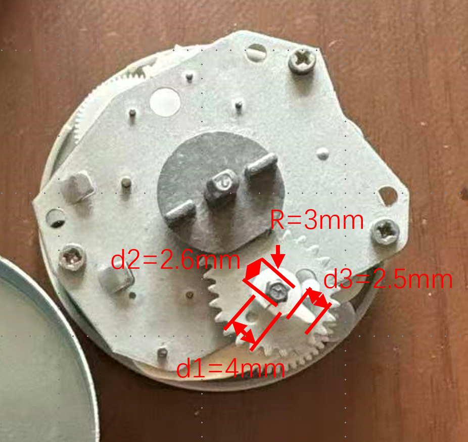
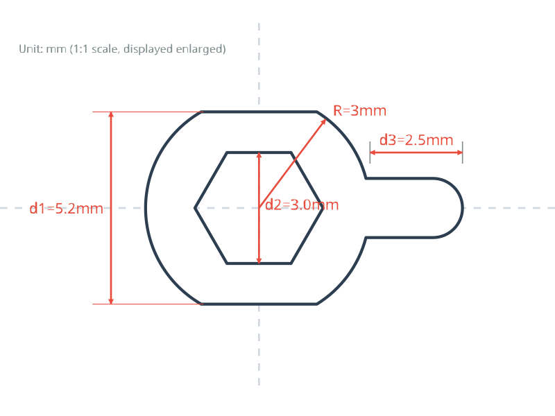
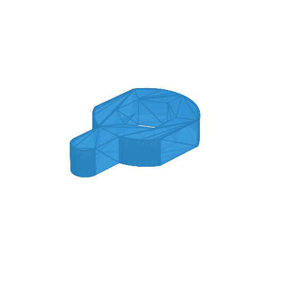

# 图像转 3D 零件 STL 生成器

[English](README.md) | [简体中文](README_zh.md)

该技能可将用户提供的带有尺寸标注的 2D 图像转换为高精度的 2D SVG 平面图和 3D STL 打印模型。与基于Gaussian Splatting的图像到3D建模不同，这个Skill适用于一张照片进行工程制图的精确场景。

## 1. 输入图像与尺寸分析
用户提供零件的参考图片，以及其核心几何特征和关键尺寸信息（如半径、直径、对边宽度、长度等）。可以是标注在图上，也可以是放一把尺子在图上，也可以是口述关键部分尺寸。

## 2. 生成高精度 2D SVG
通过精确的数学计算，推导出每个顶点和圆弧的几何坐标，以绘制零件轮廓。生成标准 SVG 文件，并用红色尺寸线标记关键约束。用户在继续操作前需审查并确认此 SVG 草图。

## 3. 生成 3D STL 模型
基于确认的尺寸和 SVG 逻辑，我们修改模板脚本（`src/generate.py`）以生成具有正确拉伸厚度的 3D 模型。随后将模型导出为可用于 3D 打印的 STL 文件。

- **STL 文件:** [part.stl](assets/part.stl)

以下是生成的 STL 文件的 3D 渲染图：

## 工作流程摘要
1. **分析 (Analyze)**: 从图像中识别特征和尺寸。
2. **绘制 (Draw)**: 生成精确的 2D SVG 轮廓。
3. **验证 (Verify)**: 要求用户确认 SVG 轮廓。
4. **拉伸 (Extrude)**: 执行 `generate.py` 创建 STL 文件。
5. **迭代 (Iterate)**: 根据实际打印/加工反馈调整参数。
