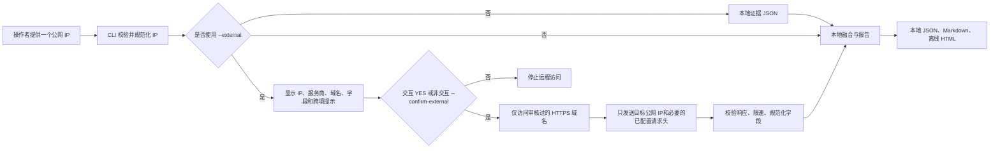

# 合规与数据处理说明

本文档描述 v2.0 的技术边界和发布责任，不能替代律师意见、个人信息保护影响评估、数据出境
评估或服务商合同审查。代码可以减少误操作，但不能证明操作者拥有目标 IP 的授权，也不能保证
某次使用符合中国法律、其他法域法律或第三方条款。

## 数据流



默认路径是 `local-only`，不会调用 `urllib.request.urlopen` 或其他远程请求。`--self` 的地址
发现也属于外部查询，必须在确认之后访问 `api64.ipify.org`。

## 服务商、域名和字段

下表描述代码允许的请求接收方和规范化数据。实际服务商的处理地点、分包商、留存期限、跨境
传输方式和条款应在发布前逐项核实。

| 服务商 | 允许的 HTTPS 域名 | 发送字段/凭据 | 报告保留的主要字段 |
|---|---|---|---|
| GeoJS | `get.geojs.io` | `public_ip` | 国家/地区/城市、ASN、组织、ISP、网络类型 |
| RDAP | `rdap.org`、`rdap-bootstrap.arin.net` | `public_ip` | 注册组织、分配前缀、注册国家 |
| RIPEstat | `stat.ripe.net` | `public_ip` | 路由前缀、起源 ASN、可见性和路由时间字段 |
| ipapi.is | `api.ipapi.is` | `public_ip` | ASN、组织/ISP、粗粒度网络和风险布尔信号 |
| proxycheck.io | `proxycheck.io` | `public_ip` | 国家/地区、ASN、网络类型、代理/VPN 和风险字段 |
| Ping0.cc | `ping0.cc`、`www.ping0.cc`、`ip.ping0.cc` | `public_ip` | 实验性的风险、ASN、网络类型和明确网络信号 |
| IPinfo API | `api.ipinfo.io` | `public_ip`；`IPINFO_TOKEN` 请求头 | 国家/地区/城市、ASN/组织、路由、匿名化字段 |
| AbuseIPDB | `api.abuseipdb.com` | `public_ip`；`ABUSEIPDB_API_KEY` 请求头 | 国家、组织、风险/滥用评分和有限统计字段 |
| IPQualityScore 页面 | `ipqualityscore.com`、`www.ipqualityscore.com` | 使用者通过官方页面读取；CLI 只读本地证据 | 明确展示的风险、位置、ASN 和网络布尔字段 |
| Scamalytics 页面 | `scamalytics.com`、`www.scamalytics.com` | 使用者通过官方页面读取；CLI 只读本地证据 | 明确展示的风险、位置、ASN 和网络布尔字段 |
| ipdata 页面 | `ipdata.co`、`www.ipdata.co` | 使用者通过官方页面读取；CLI 只读本地证据 | 信任分、国家、ASN、网络类型和明确威胁字段 |
| `--self` 地址发现 | `api64.ipify.org` | 无；只在确认后访问 | 解析得到的目标公网 IP |

IP-API 明文适配器已删除。IPQualityScore、Scamalytics 和 ipdata 的旧 API 适配器永久禁用；不支持
任意 `SCAMALYTICS_API_URL` 或其他环境变量端点。所有凭据必须通过请求头传输，不能写入 URL、
`source_url`、错误、日志或报告。

报告还会明确写出：

```json
{
  "policy": {
    "network_mode": "local-only",
    "confirmation_mode": null,
    "provider_domains": [],
    "sent_fields": [],
    "policy_version": "2.0"
  },
  "data_policy": {
    "accepted_input": "single public IP",
    "personal_data_mode": "not intended for customer or account logs",
    "raw_payloads": false,
    "contact_data": false
  }
}
```

外部模式会记录 `external-confirmed`，以及实际开始请求的允许域名。`sent_fields` 表示发送给
服务商的目标字段，不包括本地生成时间、融合结果或报告内容。

## 外部查询确认流程

运行外部查询前，操作者应确认：

1. 目标是自有、公开或明确授权的单个公网 IP；
2. 选中的服务商和域名确实是必要的接收方；
3. 发送的字段是必要且最小的，服务商不会接收客户日志、账号信息、Cookie 或设备数据；
4. 可能存在跨境传输，并已核查处理地点、合同、留存和组织内部审批；
5. 报告将保存在受控位置，不会进入公开 Issue、演示站点或公共日志。

交互终端必须在提示中输入 `YES`。非交互环境必须同时使用 `--confirm-external`。命令行确认
只是操作审计，不等于授权证明、告知证明或法律合规证明。

## 禁止用途

不得使用本项目进行：

- 未授权调查、画像或追踪个人、客户、员工、账号或登录行为；
- 批量收集个人 IP，或把 IP 与身份、客户、员工、账号、Cookie、设备指纹关联；
- 伪造地理位置、账号养号、批量注册、平台审核规避或绕过服务商风控；
- 绕过 CAPTCHA、登录限制、访问控制、付费限制或速率限制；
- 端口扫描、漏洞利用、攻击、恶意探测或代理转发。

公开页面只能以只读方式访问。遇到登录、表单、CAPTCHA 或访问控制时应停止，不得绕过。

## 中国个人信息和数据出境提示

以下是发布者和部署者应与专业顾问核实的事项，而不是代码作出的法律结论：

- 单独的 IP 是否构成个人信息，需要结合可识别性、关联数据、处理目的和具体场景判断；一旦
  与个人、账号、客户、员工或登录记录关联，应按可能的个人信息处理，不能只按“技术数据”对待；
- 处理前应核对处理目的、必要性、最小化、告知、合法处理依据、安全措施、访问权限和个人信息
  主体权利响应安排；
- 把 IP 发送给境外或境外处理的服务商，可能涉及个人信息出境或其他数据出境要求，应根据适用
  的数据分类、规模、重要性、接收方和组织身份核查安全评估、认证、标准合同、申报或其他要求；
- 应核实服务商真实处理地、分包商、跨境路径、保留和删除机制，不能仅凭域名或 HTTPS 推断合规；
- 对客户日志、员工日志或账号环境重新启用支持前，应另行完成个人信息保护影响评估、数据分类
  和数据出境设计，不能直接在 v2.0 上增加输入接口。

## 报告留存和删除

报告包含完整 IP，可能包含地理区域、组织/ISP、分配或路由前缀、代理/VPN/Tor/托管和滥用风险
标签。建议：

- 输出目录只授予必要的操作账号访问权限；
- 不把 JSON、HTML、Markdown、终端输出或调试日志上传到公共位置；
- 通过组织的留存策略设置到期删除，并清理备份、缓存和临时文件；
- 发现误写密钥、联系人、原始响应或真实客户数据时，立即隔离、删除并按组织事件流程处理；
- 发布仓库只包含审计过的源码、文档、测试和许可证，不包含 ZIP、打包副本、报告、缓存或密钥。

## 服务商条款责任

发布者必须逐项阅读并记录各服务商的可接受用途、自动化访问规则、地域和出口要求、速率限制、
数据留存、删除、再分发和 API 密钥使用条款。代码中的域名白名单只限制技术接收方，不替代这些
合同和政策审查。任何服务商变更域名、接口、字段或处理地，都应重新审计后再进入发布版本。
